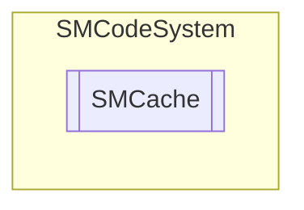

# SMCache `Public class`

## Description
SMCode db cache management class.

## Diagram


## Members
### Properties
#### Public  properties
| Type | Name | Methods |
| --- | --- | --- |
| `string` | [`Alias`](#alias)<br>Get or set cache db alias. | `get, set` |
| `int` | [`Count`](#count)<br>Get items count. | `get` |
| `int` | [`IdUser`](#iduser)<br>Return current id user or 0 if public. | `get` |
| [`SMDictionaryItem`](./smcodesystem-SMDictionaryItem) | [`Item`](#item) | `get` |
| [`SMDictionary`](./smcodesystem-SMDictionary) | [`Items`](#items)<br>Get cache dictionary. | `get` |
| `bool` | [`Public`](#public)<br>Get or set public cache property. | `get, set` |
| `string` | [`TableName`](#tablename)<br>Get or set cache db table name. | `get, set` |

### Methods
#### Public  methods
| Returns | Name |
| --- | --- |
| `void` | [`Assign`](#assign)([`SMCache`](smcodesystem-SMCache) _Cache)<br>Assign instance properties from another. |
| `void` | [`Clear`](#clear)()<br>Clear item. |
| `string` | [`Get`](#get)(`string` _Key)<br>Get cache value by key. |
| `bool` | [`Read`](#read)(`bool` _Append)<br>Read database cache. |
| `bool` | [`Set`](#set)(`string` _Key, `string` _Value, `Nullable`&lt;`DateTime`&gt; _Expiration) |

## Details
### Summary
SMCode db cache management class.

### Constructors
#### SMCache [1/2]
```csharp
public SMCache(SMCode _SM)
```
##### Arguments
| Type | Name | Description |
| --- | --- | --- |
| [`SMCode`](./smcodesystem-SMCode) | _SM |   |

##### Summary
Class constructor.

#### SMCache [2/2]
```csharp
public SMCache(SMCache _Cache, SMCode _SM)
```
##### Arguments
| Type | Name | Description |
| --- | --- | --- |
| [`SMCache`](smcodesystem-SMCache) | _Cache |   |
| [`SMCode`](./smcodesystem-SMCode) | _SM |   |

##### Summary
Class constructor.

### Methods
#### Assign
```csharp
public void Assign(SMCache _Cache)
```
##### Arguments
| Type | Name | Description |
| --- | --- | --- |
| [`SMCache`](smcodesystem-SMCache) | _Cache |   |

##### Summary
Assign instance properties from another.

#### Clear
```csharp
public void Clear()
```
##### Summary
Clear item.

#### Get
```csharp
public string Get(string _Key)
```
##### Arguments
| Type | Name | Description |
| --- | --- | --- |
| `string` | _Key |   |

##### Summary
Get cache value by key.

#### Read
```csharp
public bool Read(bool _Append)
```
##### Arguments
| Type | Name | Description |
| --- | --- | --- |
| `bool` | _Append |   |

##### Summary
Read database cache.

#### Set
```csharp
public bool Set(string _Key, string _Value, Nullable<DateTime> _Expiration)
```
##### Arguments
| Type | Name | Description |
| --- | --- | --- |
| `string` | _Key |   |
| `string` | _Value |   |
| `Nullable`&lt;`DateTime`&gt; | _Expiration |   |

### Properties
#### Item
```csharp
public SMDictionaryItem Item { get; }
```

#### Alias
```csharp
public string Alias { get; set; }
```
##### Summary
Get or set cache db alias.

#### Count
```csharp
public int Count { get; }
```
##### Summary
Get items count.

#### IdUser
```csharp
public int IdUser { get; }
```
##### Summary
Return current id user or 0 if public.

#### Items
```csharp
public SMDictionary Items { get; }
```
##### Summary
Get cache dictionary.

#### Public
```csharp
public bool Public { get; set; }
```
##### Summary
Get or set public cache property.

#### TableName
```csharp
public string TableName { get; set; }
```
##### Summary
Get or set cache db table name.

*Generated with* [*ModularDoc*](https://github.com/hailstorm75/ModularDoc)
