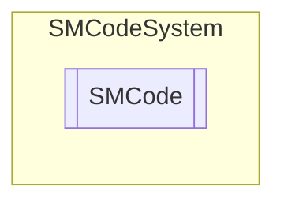

# SMCode `Public class`

## Diagram


## Members
### Properties
#### Public  properties
| Type | Name | Methods |
| --- | --- | --- |
| `string` | [`ApplicationPath`](#applicationpath)<br>Get or set application path. | `get, set` |
| `string``[]` | [`Arguments`](#arguments)<br>Get or set application passed arguments array (parameters). | `get, set` |
| `int` | [`ArgumentsCount`](#argumentscount)<br>Get application passed arguments array (parameters) count. | `get` |
| `bool` | [`AutoCreatePath`](#autocreatepath)<br>Get or set system paths auto creation flag. | `get, set` |
| `string` | [`CR`](#cr)<br>Default carriage return. | `get, set` |
| `char` | [`CSVDelimiter`](#csvdelimiter)<br>Get or set CSV delimiter char. | `get, set` |
| `char` | [`CSVSeparator`](#csvseparator)<br>Get or set CSV separator char. | `get, set` |
| `bool` | [`ClientMode`](#clientmode)<br>Get or set client mode. | `get, set` |
| `string` | [`CommonPath`](#commonpath)<br>Get or set common path. | `get, set` |
| `string` | [`CurrencyFormat`](#currencyformat)<br>Currency format. | `get, set` |
| `string` | [`CurrencyPrecisionFormat`](#currencyprecisionformat)<br>Currency more accurate format. | `get, set` |
| `string` | [`DataPath`](#datapath)<br>Get or set data path. | `get, set` |
| [`SMDatabases`](./smcodesystem-SMDatabases) | [`Databases`](#databases)<br>Database connections collection. | `get, private set` |
| [`SMDateFormat`](./smcodesystem-SMDateFormat) | [`DateFormat`](#dateformat)<br>Get or set default date format. | `get, set` |
| `char` | [`DateSeparator`](#dateseparator)<br>Get or set date default separator char. | `get, set` |
| `string``[]` | [`DaysNames`](#daysnames)<br>Get days names string array. | `get, private set` |
| `string``[]` | [`DaysShortNames`](#daysshortnames)<br>Get days short names string array. | `get, private set` |
| `char` | [`DecimalSeparator`](#decimalseparator)<br>Get or set decimal separator. | `get, set` |
| `string` | [`DefaultLogFilePath`](#defaultlogfilepath)<br>Get or set default log file path. | `get, set` |
| `bool` | [`Demo`](#demo)<br>Get or set demonstration mode flag. | `get, set` |
| `string` | [`DesktopPath`](#desktoppath)<br>Get or set desktop path. | `get, set` |
| `DateTime` | [`DoEventsLast`](#doeventslast)<br>Get or set last do events datetime. | `get, set` |
| `double` | [`DoEventsTiming`](#doeventstiming)<br>Get or set default delay timing (in seconds) for DoEvents() function. | `get, set` |
| `string` | [`DocumentsPath`](#documentspath)<br>Get or set documents path. | `get, set` |
| [`SMEnvironment`](./smcodesystem-SMEnvironment) | [`Environment`](#environment)<br>.NET environment. | `get, private set` |
| `bool` | [`ErrorLog`](#errorlog)<br>Get or set error verbose flag. | `get, set` |
| `string` | [`ErrorMessage`](#errormessage)<br>Get or set last error message. | `get, set` |
| `Exception` | [`Exception`](#exception)<br>Get or set last exception. | `get, set` |
| `string` | [`ExceptionMessage`](#exceptionmessage)<br>Get or set last exception message as string. | `get` |
| `DateTime` | [`ExecutableDate`](#executabledate)<br>Get or set executable datetime. | `get, set` |
| `string` | [`ExecutableName`](#executablename)<br>Get or set executable name without extension. | `get, set` |
| `string` | [`ExecutablePath`](#executablepath)<br>Get or set executable path. | `get, set` |
| `int` | [`FileRetries`](#fileretries)<br>Get or set file operations retries time (default 10). | `get, set` |
| `double` | [`FileRetriesDelay`](#fileretriesdelay)<br>Get or set file operations retries delay (default 1.0d). | `get, set` |
| `bool` | [`ForceExit`](#forceexit)<br>Get or set application force exit system flag. | `get, set` |
| `bool` | [`Initialized`](#initialized)<br>SMCode core class initialized flag. | `get, private set` |
| `bool` | [`Initializing`](#initializing)<br>SMCode core class initializing flag. | `get, private set` |
| `string` | [`InternalPassword`](#internalpassword)<br>Generic internal password. | `get, set` |
| `bool` | [`IsError`](#iserror)<br>Return true if last error instance contains error. | `get` |
| `string` | [`Language`](#language)<br>Get or set application selected language. | `get, set` |
| [`SMLogItem`](./smcodesystem-SMLogItem) | [`LastLog`](#lastlog)<br>Last log. | `get, private set` |
| `string` | [`LogAlias`](#logalias)<br>Get or set log database alias. | `get, set` |
| `bool` | [`LogBusy`](#logbusy)<br>Get or set log busy flag. | `get, set` |
| `int` | [`LogFileMaxHistory`](#logfilemaxhistory)<br>Get or set log max history files. | `get, set` |
| `long` | [`LogFileMaxSize`](#logfilemaxsize)<br>Get or set log max file size. | `get, set` |
| `string` | [`LogLine`](#logline)<br>Get or set log line. | `get, set` |
| `string` | [`LogSeparator`](#logseparator)<br>Get or set log separator. | `get, set` |
| `bool` | [`LogToConsole`](#logtoconsole)<br>Get or set log to console flag. | `get, set` |
| `bool` | [`LogToDatabase`](#logtodatabase)<br>Get or set log to database flag. | `get, set` |
| `bool` | [`LogToFile`](#logtofile)<br>Get or set log to file flag. | `get, set` |
| `string` | [`MacroPrefix`](#macroprefix)<br>Get or set macro prefix (default %%). | `get, set` |
| `string` | [`MacroSuffix`](#macrosuffix)<br>Get or set macro suffix (default %%). | `get, set` |
| `string` | [`MainAlias`](#mainalias)<br>Main database alias (default: MAIN). | `get, set` |
| `int` | [`MaxInteger32`](#maxinteger32)<br>Get max signed integer 32 value. | `get, private set` |
| `int` | [`MaxLoadFileSize`](#maxloadfilesize)<br>Get or set max load file size in bytes (default 32MB). | `get, set` |
| `char``[]` | [`MemoTrimChars`](#memotrimchars)<br>Get or set memo trim char array. | `get, set` |
| `double` | [`MemoryReleaseDelay`](#memoryreleasedelay)<br>Get or set memory release delay in seconds. | `get, set` |
| `DateTime` | [`MemoryReleaseNext`](#memoryreleasenext)<br>Get or set next memory release time. | `get, set` |
| `string``[]` | [`MonthsNames`](#monthsnames)<br>Get months names string array. | `get, private set` |
| `string``[]` | [`MonthsShortNames`](#monthsshortnames)<br>Get months short names string array. | `get, private set` |
| `string` | [`OEM`](#oem)<br>OEM id. | `get, set` |
| [`SMDictionary`](./smcodesystem-SMDictionary) | [`Parameters`](#parameters)<br>Application configuration parameters. | `get, private set` |
| `string` | [`QuantityFormat`](#quantityformat)<br>Quantity format. | `get, set` |
| `string` | [`QuantityPrecisionFormat`](#quantityprecisionformat)<br>Quantity more accurate format. | `get, set` |
| `Random` | [`Random`](#random)<br>Random generator instance. | `get, private set` |
| [`SMResources`](./smcodesystem-SMResources) | [`Resources`](#resources)<br>Application resources manager. | `get, private set` |
| `int` | [`RotorCount`](#rotorcount)<br>Get or set rotor counter. | `get, set` |
| `string` | [`RotorKey`](#rotorkey)<br>Get or set rotor last key. | `get, set` |
| `string` | [`SessionUID`](#sessionuid)<br>Session UID. | `get, private set` |
| `bool` | [`StopNow`](#stopnow)<br>Get or set stop now system flag. | `get, set` |
| `string` | [`TableName`](#tablename)<br>Get or set cache db table name. | `get, set` |
| `string` | [`TempPath`](#temppath)<br>Get or set temporary path. | `get, set` |
| `bool` | [`Test`](#test)<br>Get or set test mode flag. | `get, set` |
| `Encoding` | [`TextEncoding`](#textencoding)<br>Get or set text string encoding mode. | `get, set` |
| `char` | [`ThousandSeparator`](#thousandseparator)<br>Get or set thousand separator. | `get, set` |
| `char` | [`TimeSeparator`](#timeseparator)<br>Get or set time separator char. | `get, set` |
| `char` | [`TrailingChar`](#trailingchar)<br>Get or set trailing char. | `get, set` |
| `int` | [`UniqueIdBaseYear`](#uniqueidbaseyear)<br>Get unique id base year. | `get, private set` |
| `int` | [`UniqueIdLength`](#uniqueidlength)<br>Get unique id length. | `get, private set` |
| [`SMUser`](./smcodesystem-SMUser) | [`User`](#user)<br>Current user. | `get, private set` |
| `string` | [`UserDocumentsPath`](#userdocumentspath)<br>Get or set user documents path. | `get, set` |
| `string` | [`Version`](#version)<br>Get or set application version. | `get, set` |
| `int` | [`Year2DigitCentury`](#year2digitcentury)<br>2 digit year century. | `get, set` |
| `int` | [`Year2DigitLeap`](#year2digitleap)<br>2 digit year leap. | `get, set` |

#### Public Static properties
| Type | Name | Methods |
| --- | --- | --- |
| `string` | [`RootPath`](#rootpath)<br>Get or set static root path. | `get, set` |
| [`SMCode`](smcodesystem-SMCode) | [`SM`](#sm)<br>Get or set last application instance created. | `get, set` |

### Methods
#### Public  methods
| Returns | Name |
| --- | --- |
| `string` | [`About`](#about)()<br>Return executable about string with version and date. |
| `int` | [`Abs`](#abs-13)(`...`)<br>Returns absolute value of integer. |
| `string` | [`AddCSV`](#addcsv-15)(`...`)<br>Return CSV string adding value. |
| `DateTime` | [`AddMonths`](#addmonths)(`DateTime` _DateTime, `int` _Months)<br>Return date adding months. |
| `string` | [`After`](#after)(`string` _String, `string` _SubString)<br>Returns part of string after first recourrence of sub string. <br>            If sub string is not present returns empty string. |
| `bool` | [`AppendString`](#appendstring)(`string` _FileName, `string` _Text, `Encoding` _Encoding, `int` _FileRetries)<br>Append text string content to text file specified by file name.<br>            Returns true if succeed. |
| `string` | [`Argument`](#argument)(`int` _ArgumentIndex)<br>Return argument by index or empty string if not found. |
| `byte` | [`Asc`](#asc-12)(`...`)<br>Returns ASCII code of char. |
| `int` | [`AscU`](#ascu-12)(`...`)<br>Returns Unicode code of char. |
| `string` | [`AutoPath`](#autopath)(`string` _Path, `int` _FileRetries)<br>Return path and try to create if autocreatepath property setted and not exists. Return always passed path. |
| `string` | [`Base64Decode`](#base64decode)(`string` _String)<br>Returns string decoded base64. |
| `byte``[]` | [`Base64DecodeBytes`](#base64decodebytes)(`string` _String)<br>Returns string decoded base64. |
| `string` | [`Base64Encode`](#base64encode)(`string` _String)<br>Returns string encoded base64. |
| `string` | [`Base64EncodeBytes`](#base64encodebytes)(`byte``[]` _Bytes)<br>Returns string encoded base64. |
| `long` | [`BaseToInt`](#basetoint)(`string` _Value, `string` _BaseChars)<br>Returns long integer corresponding the value represented by string with digit of base chars. |
| `string` | [`Before`](#before)(`string` _String, `string` _Substring)<br>Returns part of string before first recurrence of substring. <br>            If subString is not present returns empty string. |
| `int` | [`BinToInt`](#bintoint-12)(`...`)<br>Returns integer value of binary string. |
| `object` | [`Blank`](#blank)(`DataColumn` _DataColumn)<br>Return correct blank value for data column type. |
| `bool` | [`Browse`](#browse)(`string` _URL)<br>Call OS shell to browse url. |
| `string` | [`Btw`](#btw)(`string` _String, `string` _BeginSubstring, `string` _EndSubstring)<br>Returns part of string between begin substring and ending substring.<br>            If one of two substrings are not present returns empty string. |
| `string` | [`BtwU`](#btwu)(`string` _String, `string` _BeginSubstring, `string` _EndSubstring)<br>Returns part of string between begin substring and <br>            ending substring without uppercase/lowercase matching. <br>            If one of two substrings are not present returns empty string. |
| `string` | [`CacheRead`](#cacheread)(`string` _Section, `string` _ParameterId, `int` _ExpirationDays)<br>Return cached value of parameter with id in to section. <br>            If expire is greater than zero function will return empty string<br>            if value is older than these days. |
| `bool` | [`CacheWrite`](#cachewrite)(`string` _Section, `string` _ParameterId, `string` _Value)<br>Write cached value of parameter with id in to section. |
| `string` | [`CalculateCIN`](#calculatecin)(`string` _ABI, `string` _CAB, `string` _CC)<br>Returns true if the CIN code passed is valid in relation to the ABI, CAB <br>            and current account number parameters passed. If the passed string is empty, <br>            it returns the passed value. |
| `string` | [`Cat`](#cat-13)(`...`)<br>Returns string passed adding new string divided by separator. |
| `bool` | [`ChangeDir`](#changedir)(`string` _Path)<br>Set current directory to dir path. |
| `string` | [`ChangeExtension`](#changeextension)(`string` _FilePath, `string` _NewExtension)<br>Returns the full file path changing extension in new extension. |
| `int` | [`CheckSum`](#checksum)(`string` _String)<br>Returns integer string checksum (0-9999). |
| `char` | [`Chr`](#chr)(`int` _AsciiCode)<br>Returns ASCII char with code. |
| `int` | [`ChrCount`](#chrcount)(`string` _String, `char` _Char)<br>Returns how many char founded in string. |
| `char` | [`ChrLoop`](#chrloop)(`string` _String, `int` _Index)<br>Returns char in string s with circular position index. |
| `bool` | [`ChrRepeated`](#chrrepeated)(`string` _String)<br>Return true if string has repeated chars. |
| `string` | [`ChrReplace`](#chrreplace-12)(`...`)<br>Returns string with all occurrences of old char replaced by new char. |
| `int` | [`ChrToInt`](#chrtoint)(`char` _Char)<br>Returns integer value of number represented in char. |
| `char` | [`ChrU`](#chru)(`int` _Unicode)<br>Returns Unicode char with code. |
| `string``[]` | [`Clone`](#clone)(`string``[]` _Array)<br>Return a new array with same elements of passed. |
| `string` | [`Coalesce`](#coalesce)(`string` _String0, `string` _String1, `string` _String2, `string` _String3, `string` _String4, `string` _String5, `string` _String6, `string` _String7, `string` _String8, `string` _String9, `string` _String10, `string` _String11, `string` _String12, `string` _String13, `string` _String14, `string` _String15)<br>Return first string not null or empty string if not found. |
| `string` | [`CodiceFiscale`](#codicefiscale)(`string` _Cognome, `string` _Nome, `string` _Sesso, `DateTime` _DataNascita, `string` _CodiceComune)<br>Returns the tax code calculated with the parameters passed or an empty string if invalid. |
| `string` | [`CodiceFiscaleCheck`](#codicefiscalecheck)(`string` _CodiceFiscale)<br>Returns the part of the tax code relating to the control code or an empty string if invalid. |
| `string` | [`CodiceFiscaleCognome`](#codicefiscalecognome)(`string` _Cognome)<br>Returns the part of the tax code relating to the surname or an empty string if invalid. |
| `string` | [`CodiceFiscaleDate`](#codicefiscaledate)(`DateTime` _DataNascita, `string` _Sesso)<br>Returns the part of the tax code relating to the date of birth and gender or an empty string if invalid. |
| `string` | [`CodiceFiscaleNome`](#codicefiscalenome)(`string` _Nome)<br>Returns the part of the tax code relating to the name or an empty string if invalid. |
| `string` | [`CodiceFiscaleSex`](#codicefiscalesex)(`string` _CodiceFiscale)<br>Returns the sex of the subject represented by tax code. |
| `string` | [`Combine`](#combine-12)(`...`)<br>Returns a string containing full path of file name, in file path directory and with file extension. |
| `long` | [`Compare`](#compare-12)(`...`)<br>Compare date including time (up to seconds) if specified and return more than zero if date A is greater than date B,<br>            less than zero if date B is greater than date A, zero if date A and date B are the same value. |
| `int` | [`Count`](#count-13)(`...`)<br>Count how many items in string array can be converted in boolean value passed. |
| `string` | [`CurrentDir`](#currentdir)()<br>Returns full path of actual current directory. |
| `DateTime` | [`Date`](#date-12)(`...`)<br>Returns current date value without time. |
| `int` | [`DayOfTheWeek`](#dayoftheweek)(`DateTime` _DateTime)<br>Returns day ordinal number of the week (monday=1, sunday=7, ISO 8601). |
| `int` | [`Days`](#days)(`DateTime` _FromDate, `DateTime` _ToDate)<br>Returns days count between dates. |
| `string` | [`DecodeHtml`](#decodehtml)(`string` _String)<br>Decode string containing HTML entities in actual characters. |
| `string` | [`Dinky`](#dinky)(`string` _Value)<br>Return string replacing some letters with numbers (not biunivocal). |
| `bool` | [`DivMod`](#divmod)(`int` _Dividend, `int` _Divisor, ref `int` _Result, ref `int` _Remainder) |
| `string` | [`DnsIP`](#dnsip)(`string` _Host, `int` _ExpirationDays)<br>Returns IP of host name resolved calling DNS.<br>            If expiration days is greater than 0 function will return cached<br>            result if not elapses these days. |
| `bool` | [`DoEvents`](#doevents)(`double` _DoEventsDelay)<br>Process application events if since last time are passed at least <br>            passed seconds or with default timing if omitted. |
| `bool` | [`Download`](#download-12)(`...`)<br>Download URL from web and save it in to localFile file.<br>            Returns true if succeed. |
| `bool` | [`DownloadAsync`](#downloadasync-12)(`...`)<br>Asyncronous download of URL from web in to localFile file.<br>            Returns true if succeed. Using domain name DNS will be used blocking main thread<br>            for a while. Using direct IP reference function will be truly asyncronous. |
| `string` | [`DownloadString`](#downloadstring)(`string` _URL)<br>Download URL from web and return it as string.<br>            If function fails return empty string. |
| `DriveInfo` | [`DriveInfo`](#driveinfo)(`char` _Drive)<br>Return drive info. |
| `string` | [`DriveLabel`](#drivelabel)(`char` _Drive)<br>Return drive label. |
| `long` | [`DriveSize`](#drivesize)(`char` _Drive)<br>Return drive size or -1 if error. |
| `long` | [`DriveSpace`](#drivespace)(`char` _Drive)<br>Return drive free space or -1 if error. |
| `string` | [`EAN13CheckSum`](#ean13checksum)(`string` _EanCode)<br>Return checksum for EAN code. |
| `string` | [`EAN13Fix`](#ean13fix)(`string` _EanCode)<br>Return EAN code with right checksum. |
| `DateTime` | [`Easter`](#easter)(`int` _Year)<br>Returns easter date of year. |
| `bool` | [`Empty`](#empty-15)(`...`)<br>Return true if date is null or empty (minimum value). |
| `string` | [`EncodeHtml`](#encodehtml)(`string` _Value, `char` _ReplaceSpecialCharsWith)<br>Esegue la codifica forte in HTML rimpiazzando i singoli apici con "<br>            e i doppi con ". |
| `string` | [`Ending`](#ending-13)(`...`)<br>Returns value description ending based on quantity. |
| `void` | [`Error`](#error-13)(`...`)<br>Clear last error. |
| `string` | [`ErrorStr`](#errorstr)(`string` _Prefix, `bool` _IncludeException)<br>Return error message after prefix and including exception if specified. |
| `string` | [`Escape`](#escape)(`string` _String)<br>Return string escaping limited special chars. |
| `string` | [`Extract`](#extract-12)(`...`) |
| `string` | [`ExtractArgument`](#extractargument)(ref `string` _String, `string` _Separators, `bool` _IncludeSeparator) |
| `string` | [`ExtractCSV`](#extractcsv)(ref `string` _CSV) |
| `string` | [`ExtractDigits`](#extractdigits)(ref `string` _String, `int` _DigitsCount, `bool` _Hexadecimal) |
| `string` | [`ExtractLine`](#extractline-12)(`...`) |
| `string` | [`ExtractVersion`](#extractversion-12)(`...`)<br>Returns the version string entire version up to version level. <br>            Version numbers will be unaffected. |
| `bool` | [`FileCopy`](#filecopy)(`string` _SourceFile, `string` _TargetFile, `int` _FileRetries)<br>Copy file retrying if fail which path is specified in source file <br>            to path target file eventually overwriting existing file with same name. <br>            If not succeed, retry for specified times. Returns true if succeed. |
| `DateTime` | [`FileCreated`](#filecreated)(`string` _FileName, `int` _FileRetries)<br>Returns the datetime of file creation data. |
| `DateTime` | [`FileDate`](#filedate-12)(`...`)<br>Returns the datetime of last changes about file located in file name path. |
| `bool` | [`FileDelete`](#filedelete)(`string` _FileName, `int` _FileRetries)<br>Delete file specified retrying for settings planned times. Return true if succeed. |
| `Encoding` | [`FileEncoding`](#fileencoding-12)(`...`)<br>Determines a text file's encoding by analyzing its byte order mark (BOM).<br>            Defaults to ASCII when detection of the text file's endianness fails. |
| `bool` | [`FileExists`](#fileexists)(`string` _FileName, `int` _FileRetries)<br>Return true if file specified exists. |
| `string` | [`FileExtension`](#fileextension)(`string` _FilePath)<br>Returns the extension of file path file without starting comma. |
| `string` | [`FileHistory`](#filehistory-12)(`...`)<br>Find simple history backup file name with - Copy (#) suffix. |
| `void` | [`FileHistoryWipe`](#filehistorywipe)(`string` _FileName, `int` _MaximumFiles)<br>Wipe history backup of file specified mantaining a maximum-1 of files. |
| `FileInfo``[]` | [`FileList`](#filelist-12)(`...`)<br>Returns FileInfo array of all file matches file path or null if function fails. |
| `bool` | [`FileMove`](#filemove)(`string` _OldFile, `string` _NewFile, `int` _FileRetries)<br>Try to move the file located in to old file path in to new file path <br>            retrying for passed times. Returns true if succeed. |
| `string` | [`FileName`](#filename)(`string` _FullPath)<br>Returns the name of file specified in file path, with extension. |
| `string` | [`FileNameWithoutExt`](#filenamewithoutext)(`string` _FullPath)<br>Returns the name of file specified in file path, without extension. |
| `string` | [`FilePath`](#filepath)(`string` _FullPath)<br>Returns directory path of file specified in full file path. |
| `long` | [`FileSize`](#filesize)(`string` _FileName, `int` _FileRetries)<br>Returns the size of file specified or -1 if does not exists. |
| `string` | [`FileTimeStamp`](#filetimestamp-13)(`...`)<br>Return a string containing a timestamp with format <br>            "yyyy-MM-dd_hhmmss_fff" suitable for file naming usage. |
| `List`&lt;`string`&gt; | [`FileTimeStampList`](#filetimestamplist)(`string` _FileName)<br>Return a list of history files (with timestamp) with same file name. |
| `bool` | [`FilesDelete`](#filesdelete)(`string` _Path)<br>Delete files that matches the file path.<br>            Returns true if succeed. |
| `int` | [`Find`](#find-13)(`...`) |
| `string` | [`First`](#first-12)(`...`)<br>Return first string of array or empty string if null or empty array. |
| `string` | [`FirstExists`](#firstexists)(`string``[]` _FileNames, `string` _DefaultFileName)<br>Return first existing file name of specified in array or default if none exists. |
| `DateTime` | [`FirstOfMonth`](#firstofmonth)(`DateTime` _DataTime)<br>Returns first day of date month. |
| `DateTime` | [`FirstOfWeek`](#firstofweek)(`DateTime` _DateTime)<br>Returns first day of date week. |
| `DateTime` | [`FirstOfYear`](#firstofyear)(`DateTime` _DateTime)<br>Returns first day of date year. |
| `string` | [`FixDate`](#fixdate-12)(`...`)<br>Returns string fixed to properly represent date value with <br>            format and including time as specified, or empty string if is empty <br>            or represent an invalid date. |
| `string` | [`FixList`](#fixlist)(`string` _ValuesList, `string` _Separators, `bool` _TrimSpaces, `bool` _RemoveDouble)<br>Return fixed list of values corresponding to parameters. |
| `string` | [`FixPath`](#fixpath)(`string` _Path, `char` _TrailingChar)<br>Return fixed path without ending trailing char or default trailing char if omitted. |
| `string` | [`FixTime`](#fixtime)(`string` _String)<br>Returns string fixed to properly represent time value,<br>            or empty string if is empty or represent an invalid datetime. |
| `string` | [`Flat`](#flat)(`string` _String)<br>Return string replacing carriage-returns and tabs with spaces. |
| `bool` | [`FolderExists`](#folderexists)(`string` _Path, `int` _FileRetries)<br>Returns true if folder path exists. |
| `DirectoryInfo``[]` | [`FolderList`](#folderlist)(`string` _Path, `int` _FileRetries)<br>Returns DirectoryInfo array of all folders <br>            matches path or null if function fails. |
| `bool` | [`ForceFolders`](#forcefolders)(`string` _Path, `int` _FileRetries)<br>Create folders included in file path if does not exists.<br>            Returns true if succeed. |
| `string` | [`ForcePath`](#forcepath)(`string` _Path, `int` _FileRetries)<br>Return path and try to create if not exists. Return always passed path. |
| `string` | [`Format`](#format)(`string` _String, `string` _Format)<br>Returns string formatted by format parameter which can assume special values as:<br>            if start by 0 or # will be formatted as common double value number format string; <br>            &D, &DATE for date format;<br>            $,&CUR for currency format;<br>            &CURNZ for currency format, empty if zero;<br>            !,&UPPER for uppercase format; <br>            &HM for HH:MM time format; <br>            &T, &HMS, &TIME for HH:MM:SS time format; <br>            &DT, &DATETIME for datetime format;<br>            &DU, &DURATION for duration format HHHHHH:MM:SS:ZZZ;<br>            &DUS, &DURATIONSEC for duration format HHHHHH:MM:SS;<br>            &DUM, &DURATIONMIN for duration format HHHHHH:MM;<br>            &DUMNZ for duration format HHHHHH:MM or string empty if zero;<br>            &DUC, &DURATIONCENT for duration format HHHHHH.CC;<br>            &DUD, &DURATIONDAY for duration format DDDD.CC;<br>            &LOWER for lowercase format;<br>            &CUR+ for currency more accurate format;<br>            &CUR+NZ for currency more accurate format, empty if zero;<br>            &QTY for quantity format;<br>            &QTYNZ for quantity format, empty if zero;<br>            &QTY+ for quantity more accurate format;<br>            &QTY+NZ for quantity more accurate format, empty if zero;<br>            &EU, &EUR, &EURO for euro money format; <br>            &EUNZ, &EURNZ, &EURONZ for euro money format with empty string if zero; <br>            &USD, &DOLLAR for US dollar money format; <br>            &USDNZ, &DOLLARNZ for US dollar money format with empty string if zero. |
| `double` | [`Frac`](#frac)(`double` _Value)<br>Returns fractional part of double precision value. |
| `byte``[]` | [`FromHexBytes`](#fromhexbytes)(`string` _Value)<br>Return an array of byte corresponding to hex couple of string. |
| `string` | [`FromHexDump`](#fromhexdump)(`string` _HexDump, `string` _Password)<br>Returns string from hexdump decoded with password. |
| `string` | [`FromHexMask`](#fromhexmask)(`string` _HexMask, `string` _Password)<br>Return string from hex mask and decrypted with password. |
| `string` | [`GUID`](#guid)()<br>Return string containing new GUID. |
| `string` | [`Gender`](#gender)(`string` _Sex, `string` _IfMale, `string` _IfFemale, `string` _IfNeutral)<br>Returns a string based on the user's gender. |
| `string` | [`GetConsonants`](#getconsonants)(`string` _String)<br>Return only consonants of passed string. |
| `string` | [`GetDigits`](#getdigits)(`string` _String, `bool` _Decimals)<br>Returns a string containing only numeric valid characters of string <br>            considering decimal if specified. |
| `string` | [`GetValidChars`](#getvalidchars)(`string` _String, `string` _ValidChars)<br>Returns string containing only characters included in valid chars. |
| `string` | [`GetVocals`](#getvocals)(`string` _String)<br>Return only vocals of passed string. |
| `void` | [`GoogleMaps`](#googlemaps-12)(`...`)<br>Open Google Maps url with request query. |
| `string` | [`HashMD5`](#hashmd5-13)(`...`)<br>Return MD5 hash about bytes array. |
| `string` | [`HashMD5File`](#hashmd5file)(`string` _FileName, `int` _FileRetries)<br>Return MD5 hash about file. |
| `string` | [`HashSHA256`](#hashsha256-13)(`...`)<br>Return SHA256 hash about bytes array. |
| `string` | [`HashSHA256File`](#hashsha256file)(`string` _FileName, `int` _FileRetries)<br>Return SHA256 hash about file. |
| `string` | [`HexSum`](#hexsum)(`string` _String)<br>Returns one digits hex check sum of string. |
| `string` | [`HttpPrefix`](#httpprefix)(`string` _URL)<br>Return URL adding http:// at start if not present any prefix. |
| `int` | [`Iif`](#iif-14)(`...`)<br>Returns one of integer specified for test if true or false. |
| `double` | [`InchToMm`](#inchtomm)(`double` _Inches)<br>Returns millimeters corresponding inches. |
| `string` | [`Indent`](#indent)(`string` _String, `string` _Indent, `int` _Shift)<br>Indent lines included in string. |
| `void` | [`InitializeCSV`](#initializecsv)()<br>Initialize SMSharp CSV management functions. |
| `void` | [`InitializeCustom`](#initializecustom)()<br>Virtual method to initialize custom values. |
| `void` | [`InitializeDate`](#initializedate)()<br>Initialize date and time class environment. |
| `void` | [`InitializeErrors`](#initializeerrors)()<br>Initialize error management class environment. |
| `void` | [`InitializeMath`](#initializemath)()<br>Initialize settings class environment. |
| `void` | [`InitializePath`](#initializepath)()<br>Initialize path class environment. |
| `void` | [`InitializeStrings`](#initializestrings)()<br>Initialize string class environment. |
| `void` | [`InitializeSystem`](#initializesystem)()<br>Initialize static system class environment. |
| `void` | [`InitializeUniqueId`](#initializeuniqueid)()<br>Initialize 12 chars unique id static class environment. |
| `void` | [`Initialize_Zip`](#initializezip)()<br>Initialize zip environment (no dependencies). |
| `string` | [`InsBtw`](#insbtw)(`string` _String, `string` _NewString, `string` _Substring1, `string` _Substring2)<br>Returns string with the part between substring1 and substring2 replaced by new string.<br>            If substring1 are not present returns string with sequence substring1+new string+substring2 added. |
| `string` | [`InsBtwU`](#insbtwu)(`string` _String, `string` _NewString, `string` _Substring1, `string` _Substring2)<br>Returns string with the part between substring1 and substring2 replaced by new string.<br>            If substring1 are not present returns string with sequence substring1+new string+substring2 added.<br>            Substring1 and substring2 case match is ignored. |
| `double` | [`Int`](#int-12)(`...`)<br>Returns integer part of double precision value. |
| `string` | [`IntToBase`](#inttobase)(`long` _Value, `string` _BaseChars)<br>Returns string value representing the value with base chars digits. |
| `void` | [`IntToBinArray`](#inttobinarray)(`int` _Value, `bool``[]` _Array)<br>Setting elements of boolean array matching integer (max 16 bit). <br>            First element is less significant. |
| `uint` | [`IntToUInt`](#inttouint)(`int` _Value)<br>Convert integer value in to unsigned integer. |
| `string` | [`Invert`](#invert)(`string` _String)<br>Returns inverted string. |
| `bool` | [`IsAlpha`](#isalpha)(`string` _String)<br>Returns true if all characters included in string are alphabet characters. |
| `bool` | [`IsAlphaNum`](#isalphanum)(`string` _String)<br>Returns true if all characters included in string are alphabet characters or digits. |
| `bool` | [`IsCharSet`](#ischarset)(`string` _String, `string` _CharSet)<br>Returns true if all characters included in string are included in passed char set. |
| `bool` | [`IsDebugger`](#isdebugger)()<br>Return true if debugger attached. |
| `bool` | [`IsDigits`](#isdigits)(`string` _String)<br>Returns true if all characters included in string are digits. |
| `bool` | [`IsEmail`](#isemail)(`string` _EmailAddress, `bool` _AllowEmpty)<br>Return true if string contains a valid e-mail address. |
| `bool` | [`IsHex`](#ishex)(`string` _String)<br>Returns true if all characters included in string are hex digits. |
| `bool` | [`IsHexMask`](#ishexmask)(`string` _String)<br>Return true if string is hex masked string with format: {h1h2h3...hnk} where h# is 2 cipher hex code<br>            and k is h1..hn 1 hex digit checksum. |
| `DateTime` | [`LastOfMonth`](#lastofmonth)(`DateTime` _DateValue)<br>Returns the date of last day of date month. |
| `DateTime` | [`LastOfWeek`](#lastofweek)(`DateTime` _DateValue)<br>Returns the last day of date week. |
| `DateTime` | [`LastOfYear`](#lastofyear)(`DateTime` _DateValue)<br>Returns the last day of date year. |
| `bool` | [`LeapYear`](#leapyear)(`int` _Year)<br>Returns true if year is a leap year. |
| `string` | [`Left`](#left)(`string` _String, `int` _Length)<br>Returns first length characters of string from left. |
| `void` | [`LoadCSVSettings`](#loadcsvsettings)()<br>Load CSV settings from default application INI file. |
| `byte``[]` | [`LoadFile`](#loadfile)(`string` _FileName, `int` _FileRetries)<br>Returns array of bytes with file content (see MaxLoadFileSize). |
| `string` | [`LoadString`](#loadstring-12)(`...`)<br>Returns a string containing all chars of text file with encoding. |
| `string` | [`LocalIP`](#localip-12)(`...`)<br>Return a string with local IP. |
| `bool` | [`Log`](#log-13)(`...`)<br>Write log on log file, log file path is empty write log on default application log file. |
| [`SMLogType`](./smcodesystem-SMLogType) | [`LogType`](#logtype-12)(`...`)<br>Return 3 chars length string representing log type. |
| `int` | [`Login`](#login)(`string` _UserId, `string` _Password)<br>Perform user login with user-id and password. Log details can be specified as parameters.<br>            Return 1 if success, 0 if fail or -1 if error. |
| `int` | [`LoginById`](#loginbyid)(`int` _Id, `string` _Details)<br>Perform user login with id. Log details can be specified as parameters.<br>            Return 1 if success, 0 if fail or -1 if error. |
| `int` | [`LoginByTaxCode`](#loginbytaxcode)(`string` _TaxCode, `string` _Details)<br>Perform user login by tax code. Log details can be specified as parameters.<br>            Return 1 if success, 0 if fail or -1 if error. |
| `int` | [`LoginByUid`](#loginbyuid)(`string` _Uid, `string` _Details)<br>Perform user login with uid. Log details can be specified as parameters.<br>            Return 1 if success, 0 if fail or -1 if error. |
| `bool` | [`LoginEvent`](#loginevent)([`SMLogItem`](./smcodesystem-SMLogItem) _LogItem, [`SMUser`](./smcodesystem-SMUser) _User)<br>Perform login event if defined. |
| `string` | [`Lower`](#lower)(`string` _String)<br>Returns string converted in lowercase. |
| `string` | [`Machine`](#machine)()<br>Returns the name of local computer where runs application. |
| `string` | [`Macros`](#macros-12)(`...`)<br>Replace value macros with current values. |
| `string` | [`MacrosDatabase`](#macrosdatabase)(`string` _Value, [`SMDatabase`](./smcodesystem-SMDatabase) _Database)<br>Replace database macros.<br>            DBHOST     = database host<br>            DATABASE   = database name<br>            DBPATH     = data path<br>            DBUSER     = database user name<br>            DBPASSWORD = database user password<br>            MDBPATH    = access mdb database path<br>            DBTIMEOUT  = database connection timeout<br>            DBCMDTOUT  = database command timeout |
| `string` | [`MacrosSystem`](#macrossystem)(`string` _Value)<br>Replace system macros.<br>            APPLPATH   = application path<br>            COMMPATH   = common path<br>            DATAPATH   = data path<br>            DESKPATH   = user desktop path<br>            DOCSPATH   = common documents path<br>            EXECNAME   = executable name without extension<br>            EXECPATH   = executable path<br>            MACHINE    = current PC name<br>            MYDOCSPATH = user documents path<br>            TEMPPATH   = application temporary files path<br>            USER       = application logged user id<br>            SYSUSER    = system logged user id<br>            VERSION    = application version |
| `bool` | [`MailTo`](#mailto)(`string` _Address, `string` _BCC)<br>Call OS shell to send an email to address. |
| `int` | [`Match`](#match)(`string``[]` _Search, `string``[]` _Target, `bool` _IgnoreCase, `bool` _Trim)<br>Return index of first target element matching one of seach items, or -1 if not found. |
| `byte` | [`Max`](#max-15)(`...`)<br>Return greater value between a and b. |
| `bool` | [`MaxDate`](#maxdate)(`DateTime` _DateTime)<br>Returns true if date is equal or greater than maximum value. |
| `bool` | [`MemoryRelease`](#memoryrelease)(`bool` _ForceRelease)<br>Call Garbage Collector memory collect if elapsed <br>            MemoryReleaseDelay seconds from last. |
| `string` | [`Merge`](#merge-13)(`...`)<br>Returns a string with path 1 and path 2 merged considering trailing char. <br>            Paths will be normalized to trailing char replacing all \ and / chars with it. |
| `string` | [`Mid`](#mid)(`string` _String, `int` _Index, `Nullable`&lt;`int`&gt; _Length) |
| `string` | [`MimeType`](#mimetype)(`string` _FileName)<br>Return MIME type of file passed. |
| `byte` | [`Min`](#min-15)(`...`)<br>Return lesser value between a and b. |
| `bool` | [`MinDate`](#mindate)(`DateTime` _DateTime)<br>Returns true if date is null or minimum value. |
| `double` | [`MmToInch`](#mmtoinch)(`double` _Millimeters)<br>Returns inches value corresponding millimeters. |
| `int` | [`MmToTwips`](#mmtotwips)(`int` _Millimeters)<br>Returns twips value correspondig millimeters. |
| `int` | [`Months`](#months)(`DateTime` _StartDate, `DateTime` _EndDate)<br>Returns months between start date and end date. |
| `bool` | [`MoveFolder`](#movefolder)(`string` _FolderPath, `string` _NewPath, `int` _FileRetries)<br>Move directory indicate by dir path and all subdirs to a new path (no retries). <br>            Returns true if succeed. |
| `bool` | [`NetworkAvailable`](#networkavailable)()<br>Return true if any network connection interface is available. |
| [`SMParser`](./smcodesystem-SMParser) | [`NewParser`](#newparser)()<br>Restituisce una nuova istanza di parser. |
| `DateTime` | [`Now`](#now)()<br>Returns current date and time value. |
| `double` | [`NumExp`](#numexp)(`double` _Value, `double` _Power)<br>Returns value raised by power. |
| `string` | [`OS`](#os)()<br>Returns a string with current OS version description as: 95, 98, 98SE<br>            ME, NT, 2000, XP, VISTA, WINDOWS7, WINDOWS8, WINDOWS10 or empty string if fails.<br>            To let function work properly add application manifest file and remove <br>            remarks on windows 8 and windows 10 compatibility items. |
| `string` | [`OnApplicationPath`](#onapplicationpath-12)(`...`)<br>Return full path of file name, on application folder. |
| `string` | [`OnDataPath`](#ondatapath-12)(`...`)<br>Return full path of file name, on data folder. |
| `string` | [`OnLibraryPath`](#onlibrarypath-12)(`...`)<br>Return full path of file name, on library folder. |
| `string` | [`OnRootPath`](#onrootpath-12)(`...`)<br>Return full path of file name, on root folder. |
| `void` | [`Output`](#output)(`string` _Message)<br>Se si è in modalità di debug scrive il messaggio passato<br>            sulla finestra di output. |
| `string` | [`PadL`](#padl)(`string` _String, `int` _Length, `char` _FillChar)<br>Returns a string long length characters aligned to right and eventually filled with chars on the left. |
| `string` | [`PadR`](#padr)(`string` _String, `int` _Length, `char` _FillChar)<br>Returns a string long length characters aligned to left and eventually filled with chars on the right. |
| `double` | [`Parse`](#parse)(`string` _Formula)<br>Restituisce il risultato del parser con la formula passata. |
| `int` | [`Percent`](#percent-17)(`...`)<br>Returns percent value related to max. |
| `bool` | [`Ping`](#ping)(`string` _HostAddress, `int` _TimeOut)<br>Exec a ping forward hostAddress with timeOut seconds for max waiting.<br>            Returns true if succeed. |
| `int` | [`Pos`](#pos-13)(`...`)<br>Returns position of first char in to string seeking from left to right. <br>            The function returns -1 if char is not found. |
| `int` | [`PosR`](#posr-13)(`...`)<br>Returns position of first char in to string seeking from right to left. <br>            The function returns -1 if char is not found. |
| `int` | [`PosU`](#posu)(`string` _String, `string` _Substring)<br>Return position of first occurrence of substring in string ignoring uppercase and lowercase. |
| `bool` | [`Post`](#post)(`string` _URL, `string``[]` _Values, ref `string` _Reply) |
| `bool` | [`PostAsync`](#postasync)(`string` _URL, `string``[]` _Values, `UploadValuesCompletedEventHandler` _UploadValuesCompletedEventHandler)<br>Send web request to url with POST method and perform callback event when completed. <br>            Values array of parameters must have the form [parameter1],[value1]..[parameterN],[valueN] |
| `void` | [`QuickSort`](#quicksort)(`List`&lt;`object`&gt; _Objects, [`SMOnCompare`](./smcodesystem-SMOnCompare) _CompareMethod, `int` _LeftIndex, `int` _RightIndex) |
| `string` | [`Quote`](#quote-15)(`...`)<br>Returns string included by single quote '...'. |
| `string` | [`Quote2`](#quote2)(`string` _String, `string` _DoubleQuoteTrail)<br>Returns string included by double quote "...". |
| `string` | [`QuoteIdentifier`](#quoteidentifier-12)(`...`)<br>Return database identifier name with type database SQL syntax delimiters. |
| `void` | [`Raise`](#raise-12)(`...`)<br>Set last error and throw exception if specified. |
| `string` | [`ReadIni`](#readini)(`string` _FileName, `string` _Section, `string` _Key, `string` _Default)<br>Return string value of key at section of file INI specified. Return default value if not found. |
| `string` | [`Remove`](#remove)(`string` _String, `char` _CharToRemove)<br>Returns string without specified character. |
| `string` | [`RemoveBase`](#removebase)(`string` _FilePath, `string` _BasePath)<br>Remove from file path, initial base path if found. |
| `bool` | [`RemoveFolder`](#removefolder)(`string` _FolderPath, `int` _FileRetries)<br>Remove directory indicate by dir path and all subdirs (no retries). <br>            Returns true if succeed. |
| `void` | [`Repath`](#repath)()<br>Rebuild application related paths. |
| `string` | [`Replace`](#replace)(`string` _String, `string` _OldString, `string` _NewString, `bool` _IgnoreCase)<br>Returns string replacing all old string occurrences with new string. |
| `string` | [`Replicate`](#replicate)(`string` _String, `int` _Count)<br>Returns a string containing count times given string. |
| `string` | [`RequestId`](#requestid)()<br>Returns a string to use as an identifier in HTTP requests. <br>            The id value changes every 30 seconds. |
| `string` | [`Right`](#right)(`string` _String, `int` _Length)<br>Returns last length characters (from right) of string. |
| `int` | [`Rnd`](#rnd-13)(`...`)<br>Return a random integer greater or equal to 0 and lower or equal to _Value. |
| `int` | [`Rnd100`](#rnd100)(`string` _Key)<br>Returns pseudo random number between 0 and 100 depend on key. |
| `string` | [`RndName`](#rndname)(`int` _Length)<br>Returns a string representing a random name with length chars. |
| `string` | [`RndPassword`](#rndpassword)(`int` _Length)<br>Returns random password of length specified (default=10). |
| `string` | [`RndQuery`](#rndquery)(`long` _TimingSeconds)<br>Return argument for http random query that changes every specified seconds (default 30). |
| `int` | [`Rotor`](#rotor)(`int` _Max, `string` _Key)<br>Return a value between 0 and max depending on key. |
| `double` | [`RoundDouble`](#rounddouble)(`double` _Value, `int` _DecimalsCount)<br>Returns value rounded with decimals count digits. |
| `bool` | [`RunShell`](#runshell)(`string` _FileName, `string` _ArgumentList, `bool` _RunAndWait, `bool` _AsAdministrator)<br>Execute application located in the path fileName, passing argumentList parameters.<br>            If runAndWait is setted to true the program wait the launched application termination.<br>            The function returns true if succeed. |
| `bool` | [`RunShellVerb`](#runshellverb)(`string` _FileName, `string` _ShellVerb, `bool` _RunAndWait, `bool` _AsAdministrator)<br>Open via shell the file specified in fileName path with shellVerb operation.<br>            If runAndWait is setted to true the program wait the launched application termination.<br>            The function returns true if succeed. |
| `bool` | [`SaveCSVSettings`](#savecsvsettings)()<br>Save CSV settings to default application INI file. |
| `bool` | [`SaveFile`](#savefile)(`string` _FileName, `byte``[]` _Bytes, `int` _FileRetries)<br>Save array of bytes content in the file specified retrying for specified times.<br>            Returns true if succeed. |
| `bool` | [`SaveString`](#savestring-12)(`...`)<br>Save text string content in the text file specified retrying for specified times.<br>            Returns true if succeed. |
| `int` | [`Scale`](#scale-12)(`...`)<br>Return value converted from range scale to new range scale. |
| `int` | [`Sign`](#sign-12)(`...`)<br>Returns integer -1 if value is negative, 1 if positive, 0 if zero. |
| `void` | [`Sort`](#sort-12)(`...`) |
| `string` | [`Space`](#space)(`int` _Length)<br>Returns a string containing length spaces. |
| `List`&lt;`string`&gt; | [`Split`](#split-12)(`...`)<br>Return collection of strings splitted from original string <br>            considering separator chars. |
| `List`&lt;`int`&gt; | [`SplitInt`](#splitint)(`string` _String, `string` _Separators)<br>Return collection of integer from string splitted<br>            considering separator chars. |
| `List`&lt;`string`&gt; | [`SplitLines`](#splitlines-12)(`...`)<br>Return collection of strings splitted from original string <br>            considering carriage return. |
| `string` | [`SqlCommandDelete`](#sqlcommanddelete)([`SMDataset`](./smcodesystem-SMDataset) _Dataset)<br>Return string containing SQL parameterized syntax for dataset DS delete command.<br>            Require use of unique IDs. |
| `string` | [`SqlCommandInsert`](#sqlcommandinsert)([`SMDataset`](./smcodesystem-SMDataset) _Dataset)<br>Return string containing SQL parameterized syntax for dataset insert command.<br>            Require use of unique IDs. |
| `string` | [`SqlCommandUpdate`](#sqlcommandupdate)([`SMDataset`](./smcodesystem-SMDataset) _Dataset)<br>Return string containing SQL parameterized syntax for dataset update command.<br>            Require use of unique IDs. |
| `int` | [`SqlExec`](#sqlexec)(`string` _Alias, `string` _SqlStatement, `bool` _ErrorManagement, `bool` _ExecuteScalar)<br>Executes SQL statement passed on database with alias. Is statement start by SELECT<br>            function will return integer value of result of first column of first row <br>            else will return the number of records affected or -1 if not succeed. |
| `string` | [`SqlFields`](#sqlfields)(`string` _FieldList)<br>Return optimized SQL field list, if one of field is * return *. |
| `string` | [`SqlInsert`](#sqlinsert)(`string` _TableName, `string``[]` _FieldValueArray)<br>Return INSERT INTO statement with table and fields and values (with delimiters) passed. |
| `string` | [`SqlInstr`](#sqlinstr)(`string` _SQLExpression, [`SMDatabaseType`](./smcodesystem-SMDatabaseType) _DatabaseType)<br>Return string with SQL expression for INSTR of expr, below database type. |
| `string` | [`SqlIsNull`](#sqlisnull)(`string` _SQLExpression, [`SMDatabaseType`](./smcodesystem-SMDatabaseType) _DatabaseType)<br>Return string with SQL expression for ISNULL, below database type. |
| `string` | [`SqlLower`](#sqllower)(`string` _SQLExpression, [`SMDatabaseType`](./smcodesystem-SMDatabaseType) _DatabaseType)<br>Return string with SQL expression for LOWERCASE, below database type. |
| `string` | [`SqlMacros`](#sqlmacros)(`string` _SQLStatement, [`SMDatabaseType`](./smcodesystem-SMDatabaseType) _DatabaseType)<br>Return string replacing SM SQL Macros with corresponding database SQL statement.<br>            Macros: SM_ISNULL(expr), SM_UPPER(expr), SM_LOWER(expr), SM_TRIM(expr), SM_INSTR(expr,substring),<br>            SM_DATETIME(date), SM_USER(), SM_NOW(). |
| `string` | [`SqlNext`](#sqlnext)([`SMCode`](smcodesystem-SMCode) _SM, `string` _Alias, `string` _TableName, `string` _OrderColumn, `string` _Value, `string` _ResultColumn, `string` _IdColumn, `bool` _ExclusiveDatabase)<br>Return result field value of table first record with field greather than value related to database alias. |
| `string` | [`SqlNotDeleted`](#sqlnotdeleted)(`string` _DeletedColumn, `string` _TableName, `string` _NotDeletedExpr)<br>Return not delete expression by deleted column name. |
| `string` | [`SqlPrior`](#sqlprior)([`SMCode`](smcodesystem-SMCode) _SM, `string` _Alias, `string` _TableName, `string` _OrderColumn, `string` _Value, `string` _ResultColumn, `string` _IdColumn, `bool` _ExclusiveDatabase)<br>Return result field value of table first record with field less than value related to database alias. |
| `string` | [`SqlStoredProcedure`](#sqlstoredprocedure)(`string` _Alias, `string` _StoredProcedure, `object``[]` _Parameters, `bool` _ErrorManagement)<br>Executes SQL stored procedure passed with parameters on database with alias. |
| `string` | [`SqlTable`](#sqltable)(`string` _SqlSelectStatement)<br>Return table name from SQL selection statement. |
| `string` | [`SqlTrim`](#sqltrim)(`string` _SQLExpression, [`SMDatabaseType`](./smcodesystem-SMDatabaseType) _DatabaseType)<br>Return string with SQL expression for TRIM, below database type. |
| `string` | [`SqlUpper`](#sqlupper)(`string` _SQLExpression, [`SMDatabaseType`](./smcodesystem-SMDatabaseType) _DatabaseType)<br>Return string with SQL expression for UPPERCASE, below database type. |
| `string` | [`StackTrace`](#stacktrace)()<br>Get stack trace. |
| `string` | [`SystemUser`](#systemuser)()<br>Returns the name of user currently logged to system. |
| `string` | [`T`](#t)(`string``[]` _Texts, `string``[]` _Values)<br>Return text string with start by current language with format ln:text, replacing<br>            if specified values with format %%i%% where i is value index. If language not found will<br>            be returned first instance. |
| `string` | [`TempFile`](#tempfile)(`string` _Extension)<br>Returns a random temporary file full path with extension. |
| `string` | [`TempIniFile`](#tempinifile)(`string` _FileNameWithoutExtension)<br>Returns a temporary ini file with full path with extension. |
| `string` | [`TestDemo`](#testdemo)(`string` _Prefix, `string` _Suffix)<br>Return test/demo indicator. It is possibile specify prefix and suffix. |
| `int` | [`Threshold`](#threshold)(`int` _Value, `int` _Threshold, `int` _Increment)<br>Returns value applying threshold and increment. |
| `string` | [`Title`](#title)(`string` _Title, `string` _Argument, `string` _Separator, `string` _Prefix, `string` _Suffix)<br>Return application title with argument and test/demo indicator.<br>            It is possibile specify argument separator and test/demo prefix and suffix. |
| `string` | [`ToAddress`](#toaddress)(`string` _Address, `string` _Number, `string` _Zip, `string` _City, `string` _Province)<br>Return parameters combined as address. |
| `bool` | [`ToBool`](#tobool-17)(`...`)<br>Returns true if char is one of following chars '1', '+', 'V', 'T', 'S', 'v', 't', 's'. |
| `Nullable`&lt;`bool`&gt; | [`ToBoolNull`](#toboolnull-12)(`...`)<br>Returns true if string has one of true boolean valid chars or null if empty. |
| `byte``[]` | [`ToBytes`](#tobytes)(`object` _Value)<br>Return bytes array from object or null if not defined. |
| `char` | [`ToChar`](#tochar)(`object` _Value, `char` _Default)<br>Return char representing object value or default value if null. |
| `DateTime` | [`ToDate`](#todate-16)(`...`)<br>Returns datetime value with parameters year, month, day or <br>            if specified also hours, minutes, seconds and milliseconds. |
| `Nullable`&lt;`DateTime`&gt; | [`ToDateNull`](#todatenull-12)(`...`)<br>Return date value or null if equal to min date. |
| `int` | [`ToDays`](#todays)(`DateTime` _FromDate, `DateTime` _ToDate)<br>Return days occurred between dates. |
| `decimal` | [`ToDecimal`](#todecimal-12)(`...`) |
| `double` | [`ToDouble`](#todouble-13)(`...`)<br>Returns double value of number represented in string. Return default value if fail. Same as Val(). |
| `string` | [`ToHM`](#tohm)(`int` _Minutes, `char` _Separator)<br>Convert minutes passed in a string with format HH[separator]MM (default = time separator) |
| `string` | [`ToHex`](#tohex)(`int` _Value, `int` _Digits)<br>Returns hexadecimal string representing integer value with digits. |
| `string` | [`ToHexBytes`](#tohexbytes)(`byte``[]` _Bytes)<br>Return hex dump of bytes. |
| `string` | [`ToHexDump`](#tohexdump)(`string` _String, `string` _Password)<br>Returns hexdump of string coded by password if specified. |
| `string` | [`ToHexMask`](#tohexmask)(`string` _String, `string` _Password)<br>Return string as hex masked, encrypted with password and delimited by { }. |
| `int` | [`ToInt`](#toint-14)(`...`)<br>Returns integer value of number represented in string. Return default value if fail. |
| `Nullable`&lt;`int`&gt; | [`ToIntNull`](#tointnull)(`string` _Value)<br>Return integer value or null if not defined. |
| `long` | [`ToLong`](#tolong-12)(`...`)<br>Returns long integer value of number represented in string. Return default value if fail. |
| `int` | [`ToMinutes`](#tominutes)(`string` _HHMM, `int` _Default)<br>Convert passed string with format HH:MM in minutes or default if empty. |
| `string` | [`ToSortable`](#tosortable-16)(`...`)<br>Return sortable string related to format type. |
| `string` | [`ToStr`](#tostr-116)(`...`)<br>Return string representing integer value. |
| `List`&lt;`string`&gt; | [`ToStrList`](#tostrlist-13)(`...`)<br>Return a list containing all lines of passed string and separated by default carriage-return. |
| `DateTime` | [`ToTime`](#totime-12)(`...`)<br>Return today time value represented in string or minimum value if not valid. |
| `string` | [`ToTimeStr`](#totimestr)(`DateTime` _DateTime, `bool` _IncludeSeconds, `bool` _IncludeSeparators)<br>Returns string representing time with default format. |
| `string` | [`ToValidName`](#tovalidname)(`string` _String, `char` _ReplaceWith)<br>Return string with all chars invalid for name replaced by specified char (undescore by default). |
| `string` | [`TrimL`](#triml-12)(`...`)<br>Returns string without leading spaces. |
| `string` | [`TrimR`](#trimr-12)(`...`)<br>Returns string without ending spaces. |
| `int` | [`Trunc`](#trunc-12)(`...`)<br>Returns integer from double precision value. |
| `char` | [`Type`](#type-12)(`...`)<br>Return value type related to format type (C=chars, N=number, D=Date, B=Boolean, O=Binary object). |
| `bool` | [`UnZipBytes`](#unzipbytes)(`string` _ZipFileName, `string` _EntryName, ref `byte``[]` _Data, `string` _Password, [`SMOnProgress`](./smcodesystem-SMOnProgress) _ZipProgressFunction) |
| `bool` | [`UnZipDir`](#unzipdir)(`string` _ZipFileName, `string` _DirPath, `string` _Password, [`SMOnProgress`](./smcodesystem-SMOnProgress) _ZipProgressFunction)<br>Decompress all files included in zip file to directory path. <br>            Password and zip encryption are used for decryption.<br>            Zip progress function for updating progress bar or other information.<br>            Return true if succeed. |
| `bool` | [`UnZipEntry`](#unzipentry)(`ZipEntry` _ZipEntry, `string` _DirPath, `string` _Password)<br>Extract zip entry into directory path with password if specified. Return true if succeed. |
| `bool` | [`UnZipFile`](#unzipfile)(`string` _ZipFileName, `string` _EntryName, `string` _DirPath, `string` _Password, [`SMOnProgress`](./smcodesystem-SMOnProgress) _ZipProgressFunction)<br>Decompress entry specified by entry name contained in zip file <br>            to directory path. Password and zip encryption are used for decryption.<br>            Zip progress function for updating progress bar or other information.<br>            Return true if succeed. |
| `bool` | [`UnZipFiles`](#unzipfiles)(`string` _ZipFileName, `List`&lt;`string`&gt; _EntriesName, `string` _DirPath, `string` _PassWord, [`SMOnProgress`](./smcodesystem-SMOnProgress) _ZipProgressFunction) |
| `MemoryStream` | [`UnZipStream`](#unzipstream)(`Stream` _ZipStream, `string` _EntryName, `string` _Password, [`SMOnProgress`](./smcodesystem-SMOnProgress) _ZipProgressFunction)<br>Decompress entry specified by entry name from zip stream <br>            and store it to memory stream. Password and zip encryption are used for decryption.<br>            Zip progress function for updating progress bar or other information.<br>            Return true if succeed. |
| `string` | [`Unescape`](#unescape)(`string` _String)<br>Return string unescaping limited special chars. |
| `string` | [`UniqueId`](#uniqueid)()<br>Returns a string representing a new high probability of unicity time related 12 chars id. |
| `DateTime` | [`UniqueIdDate`](#uniqueiddate)(`string` _String)<br>Returns date-time represented by unique id. |
| `string` | [`Unquote`](#unquote)(`string` _String)<br>Returns string removing eventually single quote at extremes. |
| `string` | [`Unquote2`](#unquote2)(`string` _String)<br>Returns string removing eventually double quote at extremes. |
| `string` | [`UnquoteIdentifier`](#unquoteidentifier)(`string` _FieldName)<br>Return field name without database SQL syntax delimiters. |
| `bool` | [`Upload`](#upload)(`string` _RemoteURL, `string` _LocalFile, `UploadProgressChangedEventHandler` _UploadProgressChangedEventHandler)<br>Upload local file content to remote URL on web. Returns true if succeed. |
| `bool` | [`UploadAsync`](#uploadasync)(`string` _RemoteURL, `string` _LocalFile, `UploadProgressChangedEventHandler` _UploadProgressChangedEventHandler, `UploadFileCompletedEventHandler` _UploadFileCompletedEventHandler)<br>Upload localFile content to remote URL on web. Returns true if succeed. |
| `string` | [`Upper`](#upper)(`string` _String)<br>Returns string converted in uppercase. |
| `string` | [`UpperFirst`](#upperfirst)(`string` _String)<br>Returns string with first char converted in uppercase. |
| `double` | [`Val`](#val)(`string` _String)<br>Returns double value of number represented in string. Return 0 if fail. Same as ToDouble(). |
| `bool` | [`Valid`](#valid)(`DateTime` _DateTime)<br>Returns true if date is valid (if not null and between min date value and max date value. |
| `bool` | [`ValidateCIN`](#validatecin)(`string` _CIN, `string` _ABI, `string` _CAB, `string` _CC, `bool` _ValidateIfEmpty)<br>Returns true if the CIN code passed is valid in relation to the ABI, CAB <br>            and current account number parameters passed. If the passed string is empty, <br>            it returns the passed value. |
| `bool` | [`ValidateCodiceFiscale`](#validatecodicefiscale)(`string` _CodiceFiscale, `bool` _ValidateIfEmpty)<br>Returns true if the passed tax code is valid. If the passed string is empty, it returns the passed value. |
| `bool` | [`ValidateEAN13`](#validateean13)(`string` _EanCode)<br>Return true if EAN code is valid (with right checksum). |
| `bool` | [`ValidateIBAN`](#validateiban)(`string` _IBAN, `bool` _ValidateIfEmpty)<br>Returns true if the IBAN code passed is valid. If the passed string is empty, <br>            it returns the passed value. |
| `bool` | [`ValidatePartitaIVA`](#validatepartitaiva)(`string` _PartitaIVA, `bool` _ValidateIfEmpty)<br>Returns true if the VAT number passed is valid. If the passed string is empty, it returns the passed value. |
| `bool` | [`ValidateUniqueId`](#validateuniqueid)(`string` _String)<br>Return true if string passed is a valid unique id. |
| `string` | [`WBtw`](#wbtw)(`string` _String, `string` _NewString, `string` _BeginSubstring, `string` _EndSubstring)<br>Returns string with the part between first substring and second substring replaced by new string. |
| `void` | [`Wait`](#wait)(`double` _Seconds, `bool` _DoEvents)<br>Wait for seconds. |
| `bool` | [`WildCardMatch`](#wildcardmatch)(`string` _String, `string` _WildCard, `bool` _CaseSensitive)<br>Returns if string match with wildcard. Last parameter indicate <br>            if matching will be case sensitive. |
| `string` | [`WildCardToRegEx`](#wildcardtoregex)(`string` _WildCard)<br>Returns regular expression related to wildcard. |
| `bool` | [`WipeTemp`](#wipetemp)()<br>Delete on temp path temporary files matches ~*.* |
| `string` | [`Wrap`](#wrap)(`string` _Text, `int` _CharWidth, `bool` _FlatString)<br>Return text wrapped in lines with char width.<br>            If flat string is true, all CR will be removed. |
| `bool` | [`WriteIni`](#writeini)(`string` _FileName, `string` _Section, `string` _Key, `string` _Value)<br>Write and save string value of key at section of file INI specified. Return true if succeed. |
| `int` | [`YearFit`](#yearfit)(`int` _Year)<br>Returns year with 2 digit to 4 fitted to next 30 years or 70 previous year. |
| `string` | [`Zeroes`](#zeroes-12)(`...`)<br>Returns a string with length characters, representing integer value leaded by zeroes. |
| `bool` | [`ZipBytes`](#zipbytes)(`string` _ZipFileName, `string` _EntryName, `byte``[]` _Data, `string` _PassWord, [`SMOnProgress`](./smcodesystem-SMOnProgress) _ZipProgressFunction, [`SMZipEncryption`](./smcodesystem-SMZipEncryption) _ZipEncryption)<br>Compress data in byte array as entry into zip file. <br>            Password and zip encryption are used for encryption.<br>            Zip progress function for updating progress bar or other information.<br>            Return true if succeed. |
| `bool` | [`ZipDir`](#zipdir)(`string` _ZipFileName, `string` _DirPath, `string` _Password, [`SMOnProgress`](./smcodesystem-SMOnProgress) _ZipProgressFunction, [`SMZipEncryption`](./smcodesystem-SMZipEncryption) _ZipEncryption)<br>Compress all files included in directory path to zip file. <br>            Password and zip encryption are used for encryption.<br>            Zip progress function for updating progress bar or other information.<br>            Return true if succeed. |
| `void` | [`ZipErrorClear`](#ziperrorclear)(`ZipFile` _ZipFile)<br>Clear internal zip error variables. |
| `void` | [`ZipErrorHandler`](#ziperrorhandler)(`object` _Sender, `ZipErrorEventArgs` _EventArgs)<br>Internal zip error handler. |
| `bool` | [`ZipFile`](#zipfile)(`string` _ZipFileName, `string` _FilePath, `string` _Password, [`SMOnProgress`](./smcodesystem-SMOnProgress) _ZipProgressFunction, [`SMZipEncryption`](./smcodesystem-SMZipEncryption) _ZipEncryption)<br>Compress file specified by file path to zip file. <br>            Password and zip encryption are used for encryption.<br>            Zip progress function for updating progress bar or other information.<br>            Return true if succeed. |
| `bool` | [`ZipFiles`](#zipfiles)(`string` _ZipFileName, `IEnumerable`&lt;`string`&gt; _FilesPathCollection, `string` _Password, [`SMOnProgress`](./smcodesystem-SMOnProgress) _ZipProgressFunction, [`SMZipEncryption`](./smcodesystem-SMZipEncryption) _ZipEncryption) |

#### Public Static methods
| Returns | Name |
| --- | --- |
| [`SMCode`](smcodesystem-SMCode) | [`CurrentOrNew`](#currentornew)([`SMCode`](smcodesystem-SMCode) _SM, `string``[]` _Arguments, `string` _OEM, `string` _InternalPassword, `string` _ApplicationPath)<br>Return current instance of SMApplication or new if not found. |

## Details
### Constructors
#### SMCode
```csharp
public SMCode(string[] _Arguments, string _OEM, string _InternalPassword, string _ApplicationPath, bool _AutoCreatePath)
```
##### Arguments
| Type | Name | Description |
| --- | --- | --- |
| `string``[]` | _Arguments |   |
| `string` | _OEM |   |
| `string` | _InternalPassword |   |
| `string` | _ApplicationPath |   |
| `bool` | _AutoCreatePath |   |

##### Summary
Initialize instance values with custom OEM identifier.

### Methods
#### CodiceFiscale
```csharp
public string CodiceFiscale(string _Cognome, string _Nome, string _Sesso, DateTime _DataNascita, string _CodiceComune)
```
##### Arguments
| Type | Name | Description |
| --- | --- | --- |
| `string` | _Cognome |   |
| `string` | _Nome |   |
| `string` | _Sesso |   |
| `DateTime` | _DataNascita |   |
| `string` | _CodiceComune |   |

##### Summary
Returns the tax code calculated with the parameters passed or an empty string if invalid.

#### CodiceFiscaleCognome
```csharp
public string CodiceFiscaleCognome(string _Cognome)
```
##### Arguments
| Type | Name | Description |
| --- | --- | --- |
| `string` | _Cognome |   |

##### Summary
Returns the part of the tax code relating to the surname or an empty string if invalid.

#### CodiceFiscaleNome
```csharp
public string CodiceFiscaleNome(string _Nome)
```
##### Arguments
| Type | Name | Description |
| --- | --- | --- |
| `string` | _Nome |   |

##### Summary
Returns the part of the tax code relating to the name or an empty string if invalid.

#### CodiceFiscaleDate
```csharp
public string CodiceFiscaleDate(DateTime _DataNascita, string _Sesso)
```
##### Arguments
| Type | Name | Description |
| --- | --- | --- |
| `DateTime` | _DataNascita |   |
| `string` | _Sesso |   |

##### Summary
Returns the part of the tax code relating to the date of birth and gender or an empty string if invalid.

#### CodiceFiscaleCheck
```csharp
public string CodiceFiscaleCheck(string _CodiceFiscale)
```
##### Arguments
| Type | Name | Description |
| --- | --- | --- |
| `string` | _CodiceFiscale |   |

##### Summary
Returns the part of the tax code relating to the control code or an empty string if invalid.

#### CodiceFiscaleSex
```csharp
public string CodiceFiscaleSex(string _CodiceFiscale)
```
##### Arguments
| Type | Name | Description |
| --- | --- | --- |
| `string` | _CodiceFiscale |   |

##### Summary
Returns the sex of the subject represented by tax code.

#### ValidateCodiceFiscale
```csharp
public bool ValidateCodiceFiscale(string _CodiceFiscale, bool _ValidateIfEmpty)
```
##### Arguments
| Type | Name | Description |
| --- | --- | --- |
| `string` | _CodiceFiscale |   |
| `bool` | _ValidateIfEmpty |   |

##### Summary
Returns true if the passed tax code is valid. If the passed string is empty, it returns the passed value.

#### EAN13CheckSum
```csharp
public string EAN13CheckSum(string _EanCode)
```
##### Arguments
| Type | Name | Description |
| --- | --- | --- |
| `string` | _EanCode |   |

##### Summary
Return checksum for EAN code.

#### EAN13Fix
```csharp
public string EAN13Fix(string _EanCode)
```
##### Arguments
| Type | Name | Description |
| --- | --- | --- |
| `string` | _EanCode |   |

##### Summary
Return EAN code with right checksum.

#### ValidateEAN13
```csharp
public bool ValidateEAN13(string _EanCode)
```
##### Arguments
| Type | Name | Description |
| --- | --- | --- |
| `string` | _EanCode |   |

##### Summary
Return true if EAN code is valid (with right checksum).

#### CalculateCIN
```csharp
public string CalculateCIN(string _ABI, string _CAB, string _CC)
```
##### Arguments
| Type | Name | Description |
| --- | --- | --- |
| `string` | _ABI |   |
| `string` | _CAB |   |
| `string` | _CC |   |

##### Summary
Returns true if the CIN code passed is valid in relation to the ABI, CAB 
            and current account number parameters passed. If the passed string is empty, 
            it returns the passed value.

#### ValidateCIN
```csharp
public bool ValidateCIN(string _CIN, string _ABI, string _CAB, string _CC, bool _ValidateIfEmpty)
```
##### Arguments
| Type | Name | Description |
| --- | --- | --- |
| `string` | _CIN |   |
| `string` | _ABI |   |
| `string` | _CAB |   |
| `string` | _CC |   |
| `bool` | _ValidateIfEmpty |   |

##### Summary
Returns true if the CIN code passed is valid in relation to the ABI, CAB 
            and current account number parameters passed. If the passed string is empty, 
            it returns the passed value.

#### ValidateIBAN
```csharp
public bool ValidateIBAN(string _IBAN, bool _ValidateIfEmpty)
```
##### Arguments
| Type | Name | Description |
| --- | --- | --- |
| `string` | _IBAN |   |
| `bool` | _ValidateIfEmpty |   |

##### Summary
Returns true if the IBAN code passed is valid. If the passed string is empty, 
            it returns the passed value.

#### ValidatePartitaIVA
```csharp
public bool ValidatePartitaIVA(string _PartitaIVA, bool _ValidateIfEmpty)
```
##### Arguments
| Type | Name | Description |
| --- | --- | --- |
| `string` | _PartitaIVA |   |
| `bool` | _ValidateIfEmpty |   |

##### Summary
Returns true if the VAT number passed is valid. If the passed string is empty, it returns the passed value.

#### CacheRead
```csharp
public string CacheRead(string _Section, string _ParameterId, int _ExpirationDays)
```
##### Arguments
| Type | Name | Description |
| --- | --- | --- |
| `string` | _Section | The section where the parameter is stored. |
| `string` | _ParameterId | The ID of the parameter to read. |
| `int` | _ExpirationDays | The number of days after which the cached value expires. |

##### Summary
Return cached value of parameter with id in to section. 
            If expire is greater than zero function will return empty string
            if value is older than these days.

##### Returns
Returns the cached value as a string, or an empty string if the value is expired or not found.

#### CacheWrite
```csharp
public bool CacheWrite(string _Section, string _ParameterId, string _Value)
```
##### Arguments
| Type | Name | Description |
| --- | --- | --- |
| `string` | _Section | The section where the parameter will be stored. |
| `string` | _ParameterId | The ID of the parameter to write. |
| `string` | _Value | The value to be cached. |

##### Summary
Write cached value of parameter with id in to section.

##### Returns
Returns true if the value was successfully written, otherwise false.

#### Base64Decode
```csharp
public string Base64Decode(string _String)
```
##### Arguments
| Type | Name | Description |
| --- | --- | --- |
| `string` | _String |   |

##### Summary
Returns string decoded base64.

#### Base64DecodeBytes
```csharp
public byte Base64DecodeBytes(string _String)
```
##### Arguments
| Type | Name | Description |
| --- | --- | --- |
| `string` | _String |   |

##### Summary
Returns string decoded base64.

#### Base64Encode
```csharp
public string Base64Encode(string _String)
```
##### Arguments
| Type | Name | Description |
| --- | --- | --- |
| `string` | _String |   |

##### Summary
Returns string encoded base64.

#### Base64EncodeBytes
```csharp
public string Base64EncodeBytes(byte[] _Bytes)
```
##### Arguments
| Type | Name | Description |
| --- | --- | --- |
| `byte``[]` | _Bytes |   |

##### Summary
Returns string encoded base64.

#### FromHexDump
```csharp
public string FromHexDump(string _HexDump, string _Password)
```
##### Arguments
| Type | Name | Description |
| --- | --- | --- |
| `string` | _HexDump |   |
| `string` | _Password |   |

##### Summary
Returns string from hexdump decoded with password.

#### FromHexMask
```csharp
public string FromHexMask(string _HexMask, string _Password)
```
##### Arguments
| Type | Name | Description |
| --- | --- | --- |
| `string` | _HexMask |   |
| `string` | _Password |   |

##### Summary
Return string from hex mask and decrypted with password.

#### FromHexBytes
```csharp
public byte FromHexBytes(string _Value)
```
##### Arguments
| Type | Name | Description |
| --- | --- | --- |
| `string` | _Value |   |

##### Summary
Return an array of byte corresponding to hex couple of string.

#### ToAddress
```csharp
public string ToAddress(string _Address, string _Number, string _Zip, string _City, string _Province)
```
##### Arguments
| Type | Name | Description |
| --- | --- | --- |
| `string` | _Address |   |
| `string` | _Number |   |
| `string` | _Zip |   |
| `string` | _City |   |
| `string` | _Province |   |

##### Summary
Return parameters combined as address.

#### ToBool [1/7]
```csharp
public bool ToBool(char _Char)
```
##### Arguments
| Type | Name | Description |
| --- | --- | --- |
| `char` | _Char |   |

##### Summary
Returns true if char is one of following chars '1', '+', 'V', 'T', 'S', 'v', 't', 's'.

#### ToBool [2/7]
```csharp
public bool ToBool(string _String)
```
##### Arguments
| Type | Name | Description |
| --- | --- | --- |
| `string` | _String |   |

##### Summary
Returns true if string has one of true boolean valid chars.

#### ToBool [3/7]
```csharp
public bool ToBool(Nullable<bool> _Value)
```
##### Arguments
| Type | Name | Description |
| --- | --- | --- |
| `Nullable`&lt;`bool`&gt; | _Value |   |

#### ToBool [4/7]
```csharp
public bool ToBool(Nullable<bool> _Value, bool _Default)
```
##### Arguments
| Type | Name | Description |
| --- | --- | --- |
| `Nullable`&lt;`bool`&gt; | _Value |   |
| `bool` | _Default |   |

#### ToBool [5/7]
```csharp
public bool ToBool(object _Value, bool _Default)
```
##### Arguments
| Type | Name | Description |
| --- | --- | --- |
| `object` | _Value |   |
| `bool` | _Default |   |

##### Summary
Return boolean value of object.

#### ToBool [6/7]
```csharp
public bool ToBool(int _Value)
```
##### Arguments
| Type | Name | Description |
| --- | --- | --- |
| `int` | _Value |   |

##### Summary
Return true if value is greater of zero.

#### ToBool [7/7]
```csharp
public string ToBool(bool _BoolValue)
```
##### Arguments
| Type | Name | Description |
| --- | --- | --- |
| `bool` | _BoolValue |   |

##### Summary
Returns "1" if b is true, otherwise returns "0".

#### ToBoolNull [1/2]
```csharp
public Nullable<bool> ToBoolNull(string _Value)
```
##### Arguments
| Type | Name | Description |
| --- | --- | --- |
| `string` | _Value |   |

##### Summary
Returns true if string has one of true boolean valid chars or null if empty.

#### ToBoolNull [2/2]
```csharp
public string ToBoolNull(string _Value, string _NullValue)
```
##### Arguments
| Type | Name | Description |
| --- | --- | --- |
| `string` | _Value |   |
| `string` | _NullValue |   |

##### Summary
Returns true if string has one of true boolean valid chars or null if empty.

#### ToBytes
```csharp
public byte ToBytes(object _Value)
```
##### Arguments
| Type | Name | Description |
| --- | --- | --- |
| `object` | _Value |   |

##### Summary
Return bytes array from object or null if not defined.

#### ToChar
```csharp
public char ToChar(object _Value, char _Default)
```
##### Arguments
| Type | Name | Description |
| --- | --- | --- |
| `object` | _Value |   |
| `char` | _Default |   |

##### Summary
Return char representing object value or default value if null.

#### ToDate [1/6]
```csharp
public DateTime ToDate(DateTime _Value, bool _IncludeTime)
```
##### Arguments
| Type | Name | Description |
| --- | --- | --- |
| `DateTime` | _Value |   |
| `bool` | _IncludeTime |   |

##### Summary
Returns datetime value with parameters year, month, day or 
            if specified also hours, minutes, seconds and milliseconds.

#### ToDate [2/6]
```csharp
public DateTime ToDate(int _Year, int _Month, int _Day, int _Hours, int _Minutes, int _Seconds, int _Milliseconds)
```
##### Arguments
| Type | Name | Description |
| --- | --- | --- |
| `int` | _Year |   |
| `int` | _Month |   |
| `int` | _Day |   |
| `int` | _Hours |   |
| `int` | _Minutes |   |
| `int` | _Seconds |   |
| `int` | _Milliseconds |   |

##### Summary
Returns datetime value with parameters year, month, day, 
            hours, minutes, seconds and milliseconds.

#### ToDate [3/6]
```csharp
public DateTime ToDate(string _Value, SMDateFormat _DateFormat, bool _IncludeTime)
```
##### Arguments
| Type | Name | Description |
| --- | --- | --- |
| `string` | _Value |   |
| [`SMDateFormat`](./smcodesystem-SMDateFormat) | _DateFormat |   |
| `bool` | _IncludeTime |   |

##### Summary
Returns datetime value represented in string with format and including time 
            if specified, or minimum value if is not valid.

#### ToDate [4/6]
```csharp
public DateTime ToDate(string _Value, bool _IncludeTime)
```
##### Arguments
| Type | Name | Description |
| --- | --- | --- |
| `string` | _Value |   |
| `bool` | _IncludeTime |   |

##### Summary
Return Returns datetime value with default format represented 
            in string or minimum value if fail.

#### ToDate [5/6]
```csharp
public DateTime ToDate(object _Value, bool _IncludeTime)
```
##### Arguments
| Type | Name | Description |
| --- | --- | --- |
| `object` | _Value |   |
| `bool` | _IncludeTime |   |

##### Summary
Return Returns datetime value with default format represented 
            in string or minimum value if fail.

#### ToDate [6/6]
```csharp
public DateTime ToDate(Nullable<DateTime> _Value, bool _IncludeTime)
```
##### Arguments
| Type | Name | Description |
| --- | --- | --- |
| `Nullable`&lt;`DateTime`&gt; | _Value |   |
| `bool` | _IncludeTime |   |

#### ToDateNull [1/2]
```csharp
public Nullable<DateTime> ToDateNull(DateTime _Value, bool _IncludeTime)
```
##### Arguments
| Type | Name | Description |
| --- | --- | --- |
| `DateTime` | _Value |   |
| `bool` | _IncludeTime |   |

##### Summary
Return date value or null if equal to min date.

#### ToDateNull [2/2]
```csharp
public Nullable<DateTime> ToDateNull(string _Value, bool _IncludeTime)
```
##### Arguments
| Type | Name | Description |
| --- | --- | --- |
| `string` | _Value |   |
| `bool` | _IncludeTime |   |

##### Summary
Return date value or null if empty.

#### ToDays
```csharp
public int ToDays(DateTime _FromDate, DateTime _ToDate)
```
##### Arguments
| Type | Name | Description |
| --- | --- | --- |
| `DateTime` | _FromDate |   |
| `DateTime` | _ToDate |   |

##### Summary
Return days occurred between dates.

#### ToDecimal [1/2]
```csharp
public decimal ToDecimal(Nullable<decimal> _Value, decimal _Default)
```
##### Arguments
| Type | Name | Description |
| --- | --- | --- |
| `Nullable`&lt;`decimal`&gt; | _Value |   |
| `decimal` | _Default |   |

#### ToDecimal [2/2]
```csharp
public decimal ToDecimal(object _Value, decimal _Default)
```
##### Arguments
| Type | Name | Description |
| --- | --- | --- |
| `object` | _Value |   |
| `decimal` | _Default |   |

##### Summary
Return decimal value or 0 if not defined.

#### ToDouble [1/3]
```csharp
public double ToDouble(string _String, double _Default)
```
##### Arguments
| Type | Name | Description |
| --- | --- | --- |
| `string` | _String |   |
| `double` | _Default |   |

##### Summary
Returns double value of number represented in string. Return default value if fail. Same as Val().

#### ToDouble [2/3]
```csharp
public double ToDouble(object _Value, double _Default)
```
##### Arguments
| Type | Name | Description |
| --- | --- | --- |
| `object` | _Value |   |
| `double` | _Default |   |

##### Summary
Returns double value of number represented in object. Return default value if fail.

#### ToDouble [3/3]
```csharp
public double ToDouble(Nullable<decimal> _Value, double _Default)
```
##### Arguments
| Type | Name | Description |
| --- | --- | --- |
| `Nullable`&lt;`decimal`&gt; | _Value |   |
| `double` | _Default |   |

#### ToHex
```csharp
public string ToHex(int _Value, int _Digits)
```
##### Arguments
| Type | Name | Description |
| --- | --- | --- |
| `int` | _Value |   |
| `int` | _Digits |   |

##### Summary
Returns hexadecimal string representing integer value with digits.

#### ToHexBytes
```csharp
public string ToHexBytes(byte[] _Bytes)
```
##### Arguments
| Type | Name | Description |
| --- | --- | --- |
| `byte``[]` | _Bytes |   |

##### Summary
Return hex dump of bytes.

#### ToHexDump
```csharp
public string ToHexDump(string _String, string _Password)
```
##### Arguments
| Type | Name | Description |
| --- | --- | --- |
| `string` | _String |   |
| `string` | _Password |   |

##### Summary
Returns hexdump of string coded by password if specified.

#### ToHexMask
```csharp
public string ToHexMask(string _String, string _Password)
```
##### Arguments
| Type | Name | Description |
| --- | --- | --- |
| `string` | _String |   |
| `string` | _Password |   |

##### Summary
Return string as hex masked, encrypted with password and delimited by { }.

#### ToHM
```csharp
public string ToHM(int _Minutes, char _Separator)
```
##### Arguments
| Type | Name | Description |
| --- | --- | --- |
| `int` | _Minutes |   |
| `char` | _Separator |   |

##### Summary
Convert minutes passed in a string with format HH[separator]MM (default = time separator)

#### ToInt [1/4]
```csharp
public int ToInt(string _Value, int _Default, bool _Hexadecimal)
```
##### Arguments
| Type | Name | Description |
| --- | --- | --- |
| `string` | _Value |   |
| `int` | _Default |   |
| `bool` | _Hexadecimal |   |

##### Summary
Returns integer value of number represented in string. Return default value if fail.

#### ToInt [2/4]
```csharp
public int ToInt(object _Value, int _Default)
```
##### Arguments
| Type | Name | Description |
| --- | --- | --- |
| `object` | _Value |   |
| `int` | _Default |   |

##### Summary
Returns integer value of number represented in object. Return default value if fail.

#### ToInt [3/4]
```csharp
public int ToInt(Nullable<int> _Value, int _Default)
```
##### Arguments
| Type | Name | Description |
| --- | --- | --- |
| `Nullable`&lt;`int`&gt; | _Value |   |
| `int` | _Default |   |

#### ToInt [4/4]
```csharp
public int ToInt(bool _Value)
```
##### Arguments
| Type | Name | Description |
| --- | --- | --- |
| `bool` | _Value |   |

##### Summary
Return integer represented by boolean value.

#### ToIntNull
```csharp
public Nullable<int> ToIntNull(string _Value)
```
##### Arguments
| Type | Name | Description |
| --- | --- | --- |
| `string` | _Value |   |

##### Summary
Return integer value or null if not defined.

#### ToLong [1/2]
```csharp
public long ToLong(string _Value, long _Default)
```
##### Arguments
| Type | Name | Description |
| --- | --- | --- |
| `string` | _Value |   |
| `long` | _Default |   |

##### Summary
Returns long integer value of number represented in string. Return default value if fail.

#### ToLong [2/2]
```csharp
public long ToLong(object _Value, long _Default)
```
##### Arguments
| Type | Name | Description |
| --- | --- | --- |
| `object` | _Value |   |
| `long` | _Default |   |

##### Summary
Returns long integer value of number represented in object. Return default value if fail.

#### ToMinutes
```csharp
public int ToMinutes(string _HHMM, int _Default)
```
##### Arguments
| Type | Name | Description |
| --- | --- | --- |
| `string` | _HHMM |   |
| `int` | _Default |   |

##### Summary
Convert passed string with format HH:MM in minutes or default if empty.

#### ToStr [1/16]
```csharp
public string ToStr(int _Value)
```
##### Arguments
| Type | Name | Description |
| --- | --- | --- |
| `int` | _Value |   |

##### Summary
Return string representing integer value.

#### ToStr [2/16]
```csharp
public string ToStr(long _Value)
```
##### Arguments
| Type | Name | Description |
| --- | --- | --- |
| `long` | _Value |   |

##### Summary
Returns string representing long integer value.

#### ToStr [3/16]
```csharp
public string ToStr(double _Value)
```
##### Arguments
| Type | Name | Description |
| --- | --- | --- |
| `double` | _Value |   |

##### Summary
Return string representing double value.

#### ToStr [4/16]
```csharp
public string ToStr(string _String, string _Default)
```
##### Arguments
| Type | Name | Description |
| --- | --- | --- |
| `string` | _String |   |
| `string` | _Default |   |

##### Summary
Return string or default value if null.

#### ToStr [5/16]
```csharp
public string ToStr(byte[] _BytesArray, Encoding _Encoding)
```
##### Arguments
| Type | Name | Description |
| --- | --- | --- |
| `byte``[]` | _BytesArray |   |
| `Encoding` | _Encoding |   |

##### Summary
Return string from bytes array. If encoding is UTF8 initial BOM sequence will be removed.

#### ToStr [6/16]
```csharp
public string ToStr(string[] _Strings, bool _TrimStrings, string _Separator)
```
##### Arguments
| Type | Name | Description |
| --- | --- | --- |
| `string``[]` | _Strings |   |
| `bool` | _TrimStrings |   |
| `string` | _Separator |   |

##### Summary
Return string with all strings in array separated by specified string or default carriage-return.

#### ToStr [7/16]
```csharp
public string ToStr(List<string> _Strings, bool _TrimStrings, string _Separator)
```
##### Arguments
| Type | Name | Description |
| --- | --- | --- |
| `List`&lt;`string`&gt; | _Strings |   |
| `bool` | _TrimStrings |   |
| `string` | _Separator |   |

#### ToStr [8/16]
```csharp
public string ToStr(bool[] _Array)
```
##### Arguments
| Type | Name | Description |
| --- | --- | --- |
| `bool``[]` | _Array |   |

##### Summary
Returns string representing values in binary array.

#### ToStr [9/16]
```csharp
public string ToStr(DateTime _DateTime, SMDateFormat _DateFormat, bool _IncludeTime)
```
##### Arguments
| Type | Name | Description |
| --- | --- | --- |
| `DateTime` | _DateTime |   |
| [`SMDateFormat`](./smcodesystem-SMDateFormat) | _DateFormat |   |
| `bool` | _IncludeTime |   |

##### Summary
Returns string representing date with specified format.

#### ToStr [10/16]
```csharp
public string ToStr(DateTime _DateTime, bool _IncludeTime)
```
##### Arguments
| Type | Name | Description |
| --- | --- | --- |
| `DateTime` | _DateTime |   |
| `bool` | _IncludeTime |   |

##### Summary
Returns string representing date with default format.

#### ToStr [11/16]
```csharp
public string ToStr(Nullable<DateTime> _Value, bool _IncludeTime)
```
##### Arguments
| Type | Name | Description |
| --- | --- | --- |
| `Nullable`&lt;`DateTime`&gt; | _Value |   |
| `bool` | _IncludeTime |   |

#### ToStr [12/16]
```csharp
public string ToStr(Nullable<DateTime> _Value, string _Format)
```
##### Arguments
| Type | Name | Description |
| --- | --- | --- |
| `Nullable`&lt;`DateTime`&gt; | _Value |   |
| `string` | _Format |   |

#### ToStr [13/16]
```csharp
public string ToStr(DateTime _Value, string _Format)
```
##### Arguments
| Type | Name | Description |
| --- | --- | --- |
| `DateTime` | _Value |   |
| `string` | _Format |   |

##### Summary
Return string representing date value or empty string if min value.

#### ToStr [14/16]
```csharp
public string ToStr(Nullable<char> _Value)
```
##### Arguments
| Type | Name | Description |
| --- | --- | --- |
| `Nullable`&lt;`char`&gt; | _Value |   |

#### ToStr [15/16]
```csharp
public string ToStr(object _Value, string _Default)
```
##### Arguments
| Type | Name | Description |
| --- | --- | --- |
| `object` | _Value |   |
| `string` | _Default |   |

##### Summary
Return string representing object value or default value if null.

#### ToStr [16/16]
```csharp
public string ToStr(XmlDocument _Document)
```
##### Arguments
| Type | Name | Description |
| --- | --- | --- |
| `XmlDocument` | _Document |   |

##### Summary
Return string containing XML document or empty if fail.

#### ToStrList [1/3]
```csharp
public List<string> ToStrList(string _String)
```
##### Arguments
| Type | Name | Description |
| --- | --- | --- |
| `string` | _String |   |

##### Summary
Return a list containing all lines of passed string and separated by default carriage-return.

#### ToStrList [2/3]
```csharp
public void ToStrList(string _String, List<string> _StringList, bool _TrimStrings)
```
##### Arguments
| Type | Name | Description |
| --- | --- | --- |
| `string` | _String |   |
| `List`&lt;`string`&gt; | _StringList |   |
| `bool` | _TrimStrings |   |

#### ToStrList [3/3]
```csharp
public void ToStrList(string _String, List<string> _StringList, string _Separators, bool _TrimStrings, bool _IgnoreEmpty)
```
##### Arguments
| Type | Name | Description |
| --- | --- | --- |
| `string` | _String |   |
| `List`&lt;`string`&gt; | _StringList |   |
| `string` | _Separators |   |
| `bool` | _TrimStrings |   |
| `bool` | _IgnoreEmpty |   |

#### ToTime [1/2]
```csharp
public DateTime ToTime(string _String)
```
##### Arguments
| Type | Name | Description |
| --- | --- | --- |
| `string` | _String |   |

##### Summary
Return today time value represented in string or minimum value if not valid.

#### ToTime [2/2]
```csharp
public DateTime ToTime(int _Hours, int _Minutes, int _Seconds, int _Milliseconds)
```
##### Arguments
| Type | Name | Description |
| --- | --- | --- |
| `int` | _Hours |   |
| `int` | _Minutes |   |
| `int` | _Seconds |   |
| `int` | _Milliseconds |   |

##### Summary
Returns DateTime value with today date and hours, minutes, seconds and milliseconds.

#### ToTimeStr
```csharp
public string ToTimeStr(DateTime _DateTime, bool _IncludeSeconds, bool _IncludeSeparators)
```
##### Arguments
| Type | Name | Description |
| --- | --- | --- |
| `DateTime` | _DateTime |   |
| `bool` | _IncludeSeconds |   |
| `bool` | _IncludeSeparators |   |

##### Summary
Returns string representing time with default format.

#### ToValidName
```csharp
public string ToValidName(string _String, char _ReplaceWith)
```
##### Arguments
| Type | Name | Description |
| --- | --- | --- |
| `string` | _String |   |
| `char` | _ReplaceWith |   |

##### Summary
Return string with all chars invalid for name replaced by specified char (undescore by default).

#### InitializeCSV
```csharp
public void InitializeCSV()
```
##### Summary
Initialize SMSharp CSV management functions.

#### AddCSV [1/5]
```csharp
public string AddCSV(string _CSV, string _Value)
```
##### Arguments
| Type | Name | Description |
| --- | --- | --- |
| `string` | _CSV | The existing CSV string. |
| `string` | _Value | The value to add to the CSV string. |

##### Summary
Return CSV string adding value.

##### Returns
The updated CSV string with the new value added.

#### AddCSV [2/5]
```csharp
public string AddCSV(string _CSV, string _Value, bool _Delimiter)
```
##### Arguments
| Type | Name | Description |
| --- | --- | --- |
| `string` | _CSV | The existing CSV string. |
| `string` | _Value | The value to add to the CSV string. |
| `bool` | _Delimiter | Whether to add delimiters around the value. |

##### Summary
Return CSV string adding value with delimiter if specified.

##### Returns
The updated CSV string with the new value added.

#### AddCSV [3/5]
```csharp
public string AddCSV(string _CSV, int _Value)
```
##### Arguments
| Type | Name | Description |
| --- | --- | --- |
| `string` | _CSV | The existing CSV string. |
| `int` | _Value | The integer value to add to the CSV string. |

##### Summary
Return CSV string adding integer value.

##### Returns
The updated CSV string with the new integer value added.

#### AddCSV [4/5]
```csharp
public string AddCSV(string _CSV, double _Value)
```
##### Arguments
| Type | Name | Description |
| --- | --- | --- |
| `string` | _CSV | The existing CSV string. |
| `double` | _Value | The double value to add to the CSV string. |

##### Summary
Return CSV string adding double value.

##### Returns
The updated CSV string with the new double value added.

#### AddCSV [5/5]
```csharp
public string AddCSV(string _CSV, DateTime _Value)
```
##### Arguments
| Type | Name | Description |
| --- | --- | --- |
| `string` | _CSV | The existing CSV string. |
| `DateTime` | _Value | The DateTime value to add to the CSV string. |

##### Summary
Return CSV string adding DateTime value.

##### Returns
The updated CSV string with the new DateTime value added.

#### ExtractCSV
```csharp
public string ExtractCSV(ref string _CSV)
```
##### Arguments
| Type | Name | Description |
| --- | --- | --- |
| `ref` `string` | _CSV |   |

#### LoadCSVSettings
```csharp
public void LoadCSVSettings()
```
##### Summary
Load CSV settings from default application INI file.

#### SaveCSVSettings
```csharp
public bool SaveCSVSettings()
```
##### Summary
Save CSV settings to default application INI file.

##### Returns
True if the settings were saved successfully, otherwise false.

#### InitializeDate
```csharp
public void InitializeDate()
```
##### Summary
Initialize date and time class environment.

#### AddMonths
```csharp
public DateTime AddMonths(DateTime _DateTime, int _Months)
```
##### Arguments
| Type | Name | Description |
| --- | --- | --- |
| `DateTime` | _DateTime | The initial date. |
| `int` | _Months | The number of months to add. |

##### Summary
Return date adding months.

##### Returns
The resulting date after adding the specified number of months.

#### Compare [1/2]
```csharp
public long Compare(DateTime _DateTimeA, DateTime _DateTimeB, bool _IncludeTime)
```
##### Arguments
| Type | Name | Description |
| --- | --- | --- |
| `DateTime` | _DateTimeA | The first date to compare. |
| `DateTime` | _DateTimeB | The second date to compare. |
| `bool` | _IncludeTime | Whether to include time in the comparison. |

##### Summary
Compare date including time (up to seconds) if specified and return more than zero if date A is greater than date B,
            less than zero if date B is greater than date A, zero if date A and date B are the same value.

##### Returns
A long value indicating the comparison result.

#### Date [1/2]
```csharp
public DateTime Date()
```
##### Summary
Returns current date value without time.

##### Returns
The current date with time set to 00:00:00.

#### Date [2/2]
```csharp
public DateTime Date(DateTime _Date)
```
##### Arguments
| Type | Name | Description |
| --- | --- | --- |
| `DateTime` | _Date | The date value to process. |

##### Summary
Returns date without time of passed value.

##### Returns
The date with time set to 00:00:00.

#### DayOfTheWeek
```csharp
public int DayOfTheWeek(DateTime _DateTime)
```
##### Arguments
| Type | Name | Description |
| --- | --- | --- |
| `DateTime` | _DateTime | The date to process. |

##### Summary
Returns day ordinal number of the week (monday=1, sunday=7, ISO 8601).

##### Returns
The ordinal number of the day in the week.

#### Days
```csharp
public int Days(DateTime _FromDate, DateTime _ToDate)
```
##### Arguments
| Type | Name | Description |
| --- | --- | --- |
| `DateTime` | _FromDate | The start date. |
| `DateTime` | _ToDate | The end date. |

##### Summary
Returns days count between dates.

##### Returns
The number of days between the two dates.

#### Easter
```csharp
public DateTime Easter(int _Year)
```
##### Arguments
| Type | Name | Description |
| --- | --- | --- |
| `int` | _Year | The year to calculate Easter for. |

##### Summary
Returns easter date of year.

##### Returns
The date of Easter for the specified year.

#### FirstOfMonth
```csharp
public DateTime FirstOfMonth(DateTime _DataTime)
```
##### Arguments
| Type | Name | Description |
| --- | --- | --- |
| `DateTime` | _DataTime | The date to process. |

##### Summary
Returns first day of date month.

##### Returns
The first day of the month for the specified date.

#### FirstOfWeek
```csharp
public DateTime FirstOfWeek(DateTime _DateTime)
```
##### Arguments
| Type | Name | Description |
| --- | --- | --- |
| `DateTime` | _DateTime | The date to process. |

##### Summary
Returns first day of date week.

##### Returns
The first day of the week for the specified date.

#### FirstOfYear
```csharp
public DateTime FirstOfYear(DateTime _DateTime)
```
##### Arguments
| Type | Name | Description |
| --- | --- | --- |
| `DateTime` | _DateTime | The date to process. |

##### Summary
Returns first day of date year.

##### Returns
The first day of the year for the specified date.

#### FixDate [1/2]
```csharp
public string FixDate(string _String, SMDateFormat _Format, bool _IncludeTime)
```
##### Arguments
| Type | Name | Description |
| --- | --- | --- |
| `string` | _String | The date string to process. |
| [`SMDateFormat`](./smcodesystem-SMDateFormat) | _Format | The date format to use. |
| `bool` | _IncludeTime | Whether to include time in the output. |

##### Summary
Returns string fixed to properly represent date value with 
            format and including time as specified, or empty string if is empty 
            or represent an invalid date.

##### Returns
The formatted date string.

#### FixDate [2/2]
```csharp
public string FixDate(string _String)
```
##### Arguments
| Type | Name | Description |
| --- | --- | --- |
| `string` | _String | The date string to process. |

##### Summary
Returns string fixed to properly represent date value without time, 
            or empty string if is empty or represent an invalid date.

##### Returns
The formatted date string without time.

#### FixTime
```csharp
public string FixTime(string _String)
```
##### Arguments
| Type | Name | Description |
| --- | --- | --- |
| `string` | _String | The time string to process. |

##### Summary
Returns string fixed to properly represent time value,
            or empty string if is empty or represent an invalid datetime.

##### Returns
The formatted time string.

#### LastOfMonth
```csharp
public DateTime LastOfMonth(DateTime _DateValue)
```
##### Arguments
| Type | Name | Description |
| --- | --- | --- |
| `DateTime` | _DateValue | The date to process. |

##### Summary
Returns the date of last day of date month.

##### Returns
The last day of the month for the specified date.

#### LastOfWeek
```csharp
public DateTime LastOfWeek(DateTime _DateValue)
```
##### Arguments
| Type | Name | Description |
| --- | --- | --- |
| `DateTime` | _DateValue | The date to process. |

##### Summary
Returns the last day of date week.

##### Returns
The last day of the week for the specified date.

#### LastOfYear
```csharp
public DateTime LastOfYear(DateTime _DateValue)
```
##### Arguments
| Type | Name | Description |
| --- | --- | --- |
| `DateTime` | _DateValue | The date to process. |

##### Summary
Returns the last day of date year.

##### Returns
The last day of the year for the specified date.

#### LeapYear
```csharp
public bool LeapYear(int _Year)
```
##### Arguments
| Type | Name | Description |
| --- | --- | --- |
| `int` | _Year | The year to check. |

##### Summary
Returns true if year is a leap year.

##### Returns
True if the year is a leap year, otherwise false.

#### MaxDate
```csharp
public bool MaxDate(DateTime _DateTime)
```
##### Arguments
| Type | Name | Description |
| --- | --- | --- |
| `DateTime` | _DateTime | The date to check. |

##### Summary
Returns true if date is equal or greater than maximum value.

##### Returns
True if the date is equal or greater than the maximum value, otherwise false.

#### MinDate
```csharp
public bool MinDate(DateTime _DateTime)
```
##### Arguments
| Type | Name | Description |
| --- | --- | --- |
| `DateTime` | _DateTime | The date to check. |

##### Summary
Returns true if date is null or minimum value.

##### Returns
True if the date is null or the minimum value, otherwise false.

#### Months
```csharp
public int Months(DateTime _StartDate, DateTime _EndDate)
```
##### Arguments
| Type | Name | Description |
| --- | --- | --- |
| `DateTime` | _StartDate | The start date. |
| `DateTime` | _EndDate | The end date. |

##### Summary
Returns months between start date and end date.

##### Returns
The number of months between the two dates.

#### Now
```csharp
public DateTime Now()
```
##### Summary
Returns current date and time value.

##### Returns
The current date and time.

#### Valid
```csharp
public bool Valid(DateTime _DateTime)
```
##### Arguments
| Type | Name | Description |
| --- | --- | --- |
| `DateTime` | _DateTime | The date to check. |

##### Summary
Returns true if date is valid (if not null and between min date value and max date value.

##### Returns
True if the date is valid, otherwise false.

#### YearFit
```csharp
public int YearFit(int _Year)
```
##### Arguments
| Type | Name | Description |
| --- | --- | --- |
| `int` | _Year | The year to fit. |

##### Summary
Returns year with 2 digit to 4 fitted to next 30 years or 70 previous year.

##### Returns
The fitted year.

#### Empty [1/5]
```csharp
public bool Empty(DateTime _Value)
```
##### Arguments
| Type | Name | Description |
| --- | --- | --- |
| `DateTime` | _Value | The date value to check. |

##### Summary
Return true if date is null or empty (minimum value).

##### Returns
True if the date is null or the minimum value, otherwise false.

#### Empty [2/5]
```csharp
public bool Empty(Nullable<DateTime> _Value)
```
##### Arguments
| Type | Name | Description |
| --- | --- | --- |
| `Nullable`&lt;`DateTime`&gt; | _Value |   |

#### Empty [3/5]
```csharp
public bool Empty(object _Value, bool _TestIfStringIsEmpty)
```
##### Arguments
| Type | Name | Description |
| --- | --- | --- |
| `object` | _Value | The object to check. |
| `bool` | _TestIfStringIsEmpty | Whether to test if the string is empty. |

##### Summary
Returns true if object is null.

##### Returns
True if the object is null, otherwise false.

#### Empty [4/5]
```csharp
public bool Empty(string _Value)
```
##### Arguments
| Type | Name | Description |
| --- | --- | --- |
| `string` | _Value | The string to check. |

##### Summary
Returns true if string is null, empty or contains only spaces.

##### Returns
True if the string is null, empty or contains only spaces, otherwise false.

#### Empty [5/5]
```csharp
public bool Empty(string[] _Value)
```
##### Arguments
| Type | Name | Description |
| --- | --- | --- |
| `string``[]` | _Value | The string array to check. |

##### Summary
Returns true if string array is null or with no items.

##### Returns
True if the string array is null or has no items, otherwise false.

#### InitializeErrors
```csharp
public void InitializeErrors()
```
##### Summary
Initialize error management class environment.

#### Error [1/3]
```csharp
public void Error()
```
##### Summary
Clear last error.

#### Error [2/3]
```csharp
public void Error(string _Error, Exception _Exception)
```
##### Arguments
| Type | Name | Description |
| --- | --- | --- |
| `string` | _Error | The error message to set. |
| `Exception` | _Exception | The exception associated with the error. |

##### Summary
Set last error.

#### Error [3/3]
```csharp
public void Error(Exception _Exception, string _Message)
```
##### Arguments
| Type | Name | Description |
| --- | --- | --- |
| `Exception` | _Exception | The exception to set. |
| `string` | _Message | The error message to set (optional). |

##### Summary
Set last error exception.

#### ErrorStr
```csharp
public string ErrorStr(string _Prefix, bool _IncludeException)
```
##### Arguments
| Type | Name | Description |
| --- | --- | --- |
| `string` | _Prefix | The prefix to add to the error message. |
| `bool` | _IncludeException | Whether to include the exception message. |

##### Summary
Return error message after prefix and including exception if specified.

##### Returns
The formatted error message.

#### Raise [1/2]
```csharp
public void Raise(string _ErrorMessage, bool _RaiseException)
```
##### Arguments
| Type | Name | Description |
| --- | --- | --- |
| `string` | _ErrorMessage | The error message to set. |
| `bool` | _RaiseException | Whether to throw the exception. |

##### Summary
Set last error and throw exception if specified.

#### Raise [2/2]
```csharp
public void Raise(Exception _Exception, bool _RaiseException)
```
##### Arguments
| Type | Name | Description |
| --- | --- | --- |
| `Exception` | _Exception | The exception to set. |
| `bool` | _RaiseException | Whether to throw the exception. |

##### Summary
Set last error and throw exception if specified.

#### StackTrace
```csharp
public string StackTrace()
```
##### Summary
Get stack trace.

##### Returns
The current stack trace.

#### Find [1/3]
```csharp
public int Find(object _Value, List<object> _Objects, SMOnCompare _CompareMethod, bool _BinarySearch)
```
##### Arguments
| Type | Name | Description |
| --- | --- | --- |
| `object` | _Value |   |
| `List`&lt;`object`&gt; | _Objects |   |
| [`SMOnCompare`](./smcodesystem-SMOnCompare) | _CompareMethod |   |
| `bool` | _BinarySearch |   |

#### Find [2/3]
```csharp
public int Find(object _Value, List<object> _Objects, List<int> _Index, SMOnCompare _CompareMethod)
```
##### Arguments
| Type | Name | Description |
| --- | --- | --- |
| `object` | _Value |   |
| `List`&lt;`object`&gt; | _Objects |   |
| `List`&lt;`int`&gt; | _Index |   |
| [`SMOnCompare`](./smcodesystem-SMOnCompare) | _CompareMethod |   |

#### Format
```csharp
public string Format(string _String, string _Format)
```
##### Arguments
| Type | Name | Description |
| --- | --- | --- |
| `string` | _String | The string to format. |
| `string` | _Format | The format to apply. |

##### Summary
Returns string formatted by format parameter which can assume special values as:
            if start by 0 or # will be formatted as common double value number format string; 
            &D, &DATE for date format;
            $,&CUR for currency format;
            &CURNZ for currency format, empty if zero;
            !,&UPPER for uppercase format; 
            &HM for HH:MM time format; 
            &T, &HMS, &TIME for HH:MM:SS time format; 
            &DT, &DATETIME for datetime format;
            &DU, &DURATION for duration format HHHHHH:MM:SS:ZZZ;
            &DUS, &DURATIONSEC for duration format HHHHHH:MM:SS;
            &DUM, &DURATIONMIN for duration format HHHHHH:MM;
            &DUMNZ for duration format HHHHHH:MM or string empty if zero;
            &DUC, &DURATIONCENT for duration format HHHHHH.CC;
            &DUD, &DURATIONDAY for duration format DDDD.CC;
            &LOWER for lowercase format;
            &CUR+ for currency more accurate format;
            &CUR+NZ for currency more accurate format, empty if zero;
            &QTY for quantity format;
            &QTYNZ for quantity format, empty if zero;
            &QTY+ for quantity more accurate format;
            &QTY+NZ for quantity more accurate format, empty if zero;
            &EU, &EUR, &EURO for euro money format; 
            &EUNZ, &EURNZ, &EURONZ for euro money format with empty string if zero; 
            &USD, &DOLLAR for US dollar money format; 
            &USDNZ, &DOLLARNZ for US dollar money format with empty string if zero.

##### Returns
The formatted string.

#### HashMD5 [1/3]
```csharp
public string HashMD5(byte[] _Bytes)
```
##### Arguments
| Type | Name | Description |
| --- | --- | --- |
| `byte``[]` | _Bytes | The byte array to hash. |

##### Summary
Return MD5 hash about bytes array.

##### Returns
The MD5 hash as a hexadecimal string.

#### HashMD5 [2/3]
```csharp
public string HashMD5(string _Value)
```
##### Arguments
| Type | Name | Description |
| --- | --- | --- |
| `string` | _Value | The string to hash. |

##### Summary
Return MD5 hash about string.

##### Returns
The MD5 hash as a hexadecimal string.

#### HashMD5 [3/3]
```csharp
public string HashMD5(Stream _Stream)
```
##### Arguments
| Type | Name | Description |
| --- | --- | --- |
| `Stream` | _Stream | The stream to hash. |

##### Summary
Return MD5 hash about stream.

##### Returns
The MD5 hash as a hexadecimal string.

#### HashMD5File
```csharp
public string HashMD5File(string _FileName, int _FileRetries)
```
##### Arguments
| Type | Name | Description |
| --- | --- | --- |
| `string` | _FileName | The file to hash. |
| `int` | _FileRetries | The number of retries if the file read fails (default is -1). |

##### Summary
Return MD5 hash about file.

##### Returns
The MD5 hash as a hexadecimal string.

#### HashSHA256 [1/3]
```csharp
public string HashSHA256(byte[] _Bytes)
```
##### Arguments
| Type | Name | Description |
| --- | --- | --- |
| `byte``[]` | _Bytes | The byte array to hash. |

##### Summary
Return SHA256 hash about bytes array.

##### Returns
The SHA256 hash as a hexadecimal string.

#### HashSHA256 [2/3]
```csharp
public string HashSHA256(string _Value)
```
##### Arguments
| Type | Name | Description |
| --- | --- | --- |
| `string` | _Value | The string to hash. |

##### Summary
Return SHA256 hash about string.

##### Returns
The SHA256 hash as a hexadecimal string.

#### HashSHA256 [3/3]
```csharp
public string HashSHA256(Stream _Stream)
```
##### Arguments
| Type | Name | Description |
| --- | --- | --- |
| `Stream` | _Stream | The stream to hash. |

##### Summary
Return SHA256 hash about stream.

##### Returns
The SHA256 hash as a hexadecimal string.

#### HashSHA256File
```csharp
public string HashSHA256File(string _FileName, int _FileRetries)
```
##### Arguments
| Type | Name | Description |
| --- | --- | --- |
| `string` | _FileName | The file to hash. |
| `int` | _FileRetries | The number of retries if the file read fails (default is -1). |

##### Summary
Return SHA256 hash about file.

##### Returns
The SHA256 hash as a hexadecimal string.

#### DecodeHtml
```csharp
public string DecodeHtml(string _String)
```
##### Arguments
| Type | Name | Description |
| --- | --- | --- |
| `string` | _String |   |

##### Summary
Decode string containing HTML entities in actual characters.

#### EncodeHtml
```csharp
public string EncodeHtml(string _Value, char _ReplaceSpecialCharsWith)
```
##### Arguments
| Type | Name | Description |
| --- | --- | --- |
| `string` | _Value |   |
| `char` | _ReplaceSpecialCharsWith |   |

##### Summary
Esegue la codifica forte in HTML rimpiazzando i singoli apici con "
            e i doppi con ".

#### ReadIni
```csharp
public string ReadIni(string _FileName, string _Section, string _Key, string _Default)
```
##### Arguments
| Type | Name | Description |
| --- | --- | --- |
| `string` | _FileName |   |
| `string` | _Section |   |
| `string` | _Key |   |
| `string` | _Default |   |

##### Summary
Return string value of key at section of file INI specified. Return default value if not found.

#### WriteIni
```csharp
public bool WriteIni(string _FileName, string _Section, string _Key, string _Value)
```
##### Arguments
| Type | Name | Description |
| --- | --- | --- |
| `string` | _FileName |   |
| `string` | _Section |   |
| `string` | _Key |   |
| `string` | _Value |   |

##### Summary
Write and save string value of key at section of file INI specified. Return true if succeed.

#### About
```csharp
public string About()
```
##### Summary
Return executable about string with version and date.

#### Argument
```csharp
public string Argument(int _ArgumentIndex)
```
##### Arguments
| Type | Name | Description |
| --- | --- | --- |
| `int` | _ArgumentIndex |   |

##### Summary
Return argument by index or empty string if not found.

#### InitializeCustom
```csharp
public virtual void InitializeCustom()
```
##### Summary
Virtual method to initialize custom values.

#### IsDebugger
```csharp
public bool IsDebugger()
```
##### Summary
Return true if debugger attached.

#### Login
```csharp
public int Login(string _UserId, string _Password)
```
##### Arguments
| Type | Name | Description |
| --- | --- | --- |
| `string` | _UserId |   |
| `string` | _Password |   |

##### Summary
Perform user login with user-id and password. Log details can be specified as parameters.
            Return 1 if success, 0 if fail or -1 if error.

#### LoginById
```csharp
public int LoginById(int _Id, string _Details)
```
##### Arguments
| Type | Name | Description |
| --- | --- | --- |
| `int` | _Id |   |
| `string` | _Details |   |

##### Summary
Perform user login with id. Log details can be specified as parameters.
            Return 1 if success, 0 if fail or -1 if error.

#### LoginByTaxCode
```csharp
public int LoginByTaxCode(string _TaxCode, string _Details)
```
##### Arguments
| Type | Name | Description |
| --- | --- | --- |
| `string` | _TaxCode |   |
| `string` | _Details |   |

##### Summary
Perform user login by tax code. Log details can be specified as parameters.
            Return 1 if success, 0 if fail or -1 if error.

#### LoginByUid
```csharp
public int LoginByUid(string _Uid, string _Details)
```
##### Arguments
| Type | Name | Description |
| --- | --- | --- |
| `string` | _Uid |   |
| `string` | _Details |   |

##### Summary
Perform user login with uid. Log details can be specified as parameters.
            Return 1 if success, 0 if fail or -1 if error.

#### LoginEvent
```csharp
public bool LoginEvent(SMLogItem _LogItem, SMUser _User)
```
##### Arguments
| Type | Name | Description |
| --- | --- | --- |
| [`SMLogItem`](./smcodesystem-SMLogItem) | _LogItem |   |
| [`SMUser`](./smcodesystem-SMUser) | _User |   |

##### Summary
Perform login event if defined.

#### T
```csharp
public string T(string[] _Texts, string[] _Values)
```
##### Arguments
| Type | Name | Description |
| --- | --- | --- |
| `string``[]` | _Texts |   |
| `string``[]` | _Values |   |

##### Summary
Return text string with start by current language with format ln:text, replacing
            if specified values with format %%i%% where i is value index. If language not found will
            be returned first instance.

#### Title
```csharp
public string Title(string _Title, string _Argument, string _Separator, string _Prefix, string _Suffix)
```
##### Arguments
| Type | Name | Description |
| --- | --- | --- |
| `string` | _Title |   |
| `string` | _Argument |   |
| `string` | _Separator |   |
| `string` | _Prefix |   |
| `string` | _Suffix |   |

##### Summary
Return application title with argument and test/demo indicator.
            It is possibile specify argument separator and test/demo prefix and suffix.

#### TestDemo
```csharp
public string TestDemo(string _Prefix, string _Suffix)
```
##### Arguments
| Type | Name | Description |
| --- | --- | --- |
| `string` | _Prefix |   |
| `string` | _Suffix |   |

##### Summary
Return test/demo indicator. It is possibile specify prefix and suffix.

#### CurrentOrNew
```csharp
public static SMCode CurrentOrNew(SMCode _SM, string[] _Arguments, string _OEM, string _InternalPassword, string _ApplicationPath)
```
##### Arguments
| Type | Name | Description |
| --- | --- | --- |
| [`SMCode`](smcodesystem-SMCode) | _SM |   |
| `string``[]` | _Arguments |   |
| `string` | _OEM |   |
| `string` | _InternalPassword |   |
| `string` | _ApplicationPath |   |

##### Summary
Return current instance of SMApplication or new if not found.

#### AppendString
```csharp
public bool AppendString(string _FileName, string _Text, Encoding _Encoding, int _FileRetries)
```
##### Arguments
| Type | Name | Description |
| --- | --- | --- |
| `string` | _FileName |   |
| `string` | _Text |   |
| `Encoding` | _Encoding |   |
| `int` | _FileRetries |   |

##### Summary
Append text string content to text file specified by file name.
            Returns true if succeed.

#### AutoPath
```csharp
public string AutoPath(string _Path, int _FileRetries)
```
##### Arguments
| Type | Name | Description |
| --- | --- | --- |
| `string` | _Path |   |
| `int` | _FileRetries |   |

##### Summary
Return path and try to create if autocreatepath property setted and not exists. Return always passed path.

#### FileCopy
```csharp
public bool FileCopy(string _SourceFile, string _TargetFile, int _FileRetries)
```
##### Arguments
| Type | Name | Description |
| --- | --- | --- |
| `string` | _SourceFile |   |
| `string` | _TargetFile |   |
| `int` | _FileRetries |   |

##### Summary
Copy file retrying if fail which path is specified in source file 
            to path target file eventually overwriting existing file with same name. 
            If not succeed, retry for specified times. Returns true if succeed.

#### FileCreated
```csharp
public DateTime FileCreated(string _FileName, int _FileRetries)
```
##### Arguments
| Type | Name | Description |
| --- | --- | --- |
| `string` | _FileName |   |
| `int` | _FileRetries |   |

##### Summary
Returns the datetime of file creation data.

#### FileDate [1/2]
```csharp
public DateTime FileDate(string _FileName, int _FileRetries)
```
##### Arguments
| Type | Name | Description |
| --- | --- | --- |
| `string` | _FileName |   |
| `int` | _FileRetries |   |

##### Summary
Returns the datetime of last changes about file located in file name path.

#### FileDate [2/2]
```csharp
public bool FileDate(string _FileName, DateTime _DateTime, int _FileRetries)
```
##### Arguments
| Type | Name | Description |
| --- | --- | --- |
| `string` | _FileName |   |
| `DateTime` | _DateTime |   |
| `int` | _FileRetries |   |

##### Summary
Set the datetime of last changes about file located in file name path. 
            Return true if succeed.

#### FileDelete
```csharp
public bool FileDelete(string _FileName, int _FileRetries)
```
##### Arguments
| Type | Name | Description |
| --- | --- | --- |
| `string` | _FileName |   |
| `int` | _FileRetries |   |

##### Summary
Delete file specified retrying for settings planned times. Return true if succeed.

#### FileExtension
```csharp
public string FileExtension(string _FilePath)
```
##### Arguments
| Type | Name | Description |
| --- | --- | --- |
| `string` | _FilePath |   |

##### Summary
Returns the extension of file path file without starting comma.

#### FileEncoding [1/2]
```csharp
public Encoding FileEncoding(string _FileName, int _FileRetries)
```
##### Arguments
| Type | Name | Description |
| --- | --- | --- |
| `string` | _FileName |   |
| `int` | _FileRetries |   |

##### Summary
Determines a text file's encoding by analyzing its byte order mark (BOM).
            Defaults to ASCII when detection of the text file's endianness fails.

#### FileEncoding [2/2]
```csharp
public Encoding FileEncoding(Stream _TextStream)
```
##### Arguments
| Type | Name | Description |
| --- | --- | --- |
| `Stream` | _TextStream |   |

##### Summary
Determines a text stream encoding by analyzing its byte order mark (BOM).
            Defaults to ASCII when detection of the text file's endianness fails.

#### FileExists
```csharp
public bool FileExists(string _FileName, int _FileRetries)
```
##### Arguments
| Type | Name | Description |
| --- | --- | --- |
| `string` | _FileName |   |
| `int` | _FileRetries |   |

##### Summary
Return true if file specified exists.

#### FileHistory [1/2]
```csharp
public string FileHistory(string _FileName)
```
##### Arguments
| Type | Name | Description |
| --- | --- | --- |
| `string` | _FileName |   |

##### Summary
Find simple history backup file name with - Copy (#) suffix.

#### FileHistory [2/2]
```csharp
public bool FileHistory(string _FileName, int _MaximumFiles)
```
##### Arguments
| Type | Name | Description |
| --- | --- | --- |
| `string` | _FileName |   |
| `int` | _MaximumFiles |   |

##### Summary
Create history backup of file specified, mantaining a maximum of files.

#### FileHistoryWipe
```csharp
public void FileHistoryWipe(string _FileName, int _MaximumFiles)
```
##### Arguments
| Type | Name | Description |
| --- | --- | --- |
| `string` | _FileName |   |
| `int` | _MaximumFiles |   |

##### Summary
Wipe history backup of file specified mantaining a maximum-1 of files.

#### FileList [1/2]
```csharp
public FileInfo FileList(string _Path, bool _Recursive)
```
##### Arguments
| Type | Name | Description |
| --- | --- | --- |
| `string` | _Path |   |
| `bool` | _Recursive |   |

##### Summary
Returns FileInfo array of all file matches file path or null if function fails.

#### FileList [2/2]
```csharp
public List<string> FileList(string _Path, bool _StoreFullPath, bool _Recursive)
```
##### Arguments
| Type | Name | Description |
| --- | --- | --- |
| `string` | _Path |   |
| `bool` | _StoreFullPath |   |
| `bool` | _Recursive |   |

##### Summary
Returns string list of all file names (or full path if specified) 
            matching file path or null if function fails.

#### FileMove
```csharp
public bool FileMove(string _OldFile, string _NewFile, int _FileRetries)
```
##### Arguments
| Type | Name | Description |
| --- | --- | --- |
| `string` | _OldFile |   |
| `string` | _NewFile |   |
| `int` | _FileRetries |   |

##### Summary
Try to move the file located in to old file path in to new file path 
            retrying for passed times. Returns true if succeed.

#### FileName
```csharp
public string FileName(string _FullPath)
```
##### Arguments
| Type | Name | Description |
| --- | --- | --- |
| `string` | _FullPath |   |

##### Summary
Returns the name of file specified in file path, with extension.

#### FileNameWithoutExt
```csharp
public string FileNameWithoutExt(string _FullPath)
```
##### Arguments
| Type | Name | Description |
| --- | --- | --- |
| `string` | _FullPath |   |

##### Summary
Returns the name of file specified in file path, without extension.

#### FilePath
```csharp
public string FilePath(string _FullPath)
```
##### Arguments
| Type | Name | Description |
| --- | --- | --- |
| `string` | _FullPath |   |

##### Summary
Returns directory path of file specified in full file path.

#### FilesDelete
```csharp
public bool FilesDelete(string _Path)
```
##### Arguments
| Type | Name | Description |
| --- | --- | --- |
| `string` | _Path |   |

##### Summary
Delete files that matches the file path.
            Returns true if succeed.

#### FileSize
```csharp
public long FileSize(string _FileName, int _FileRetries)
```
##### Arguments
| Type | Name | Description |
| --- | --- | --- |
| `string` | _FileName |   |
| `int` | _FileRetries |   |

##### Summary
Returns the size of file specified or -1 if does not exists.

#### FileTimeStamp [1/3]
```csharp
public string FileTimeStamp(DateTime _DateTime)
```
##### Arguments
| Type | Name | Description |
| --- | --- | --- |
| `DateTime` | _DateTime |   |

##### Summary
Return a string containing a timestamp with format 
            "yyyy-MM-dd_hhmmss_fff" suitable for file naming usage.

#### FileTimeStamp [2/3]
```csharp
public string FileTimeStamp(string _FileName, DateTime _DateTime)
```
##### Arguments
| Type | Name | Description |
| --- | --- | --- |
| `string` | _FileName |   |
| `DateTime` | _DateTime |   |

##### Summary
Return a string containing file name full path with timestamp of datetime passed.

#### FileTimeStamp [3/3]
```csharp
public string FileTimeStamp(string _FileName)
```
##### Arguments
| Type | Name | Description |
| --- | --- | --- |
| `string` | _FileName |   |

##### Summary
Return a string containing file name full path with timestamp of last modified datetime.

#### FileTimeStampList
```csharp
public List<string> FileTimeStampList(string _FileName)
```
##### Arguments
| Type | Name | Description |
| --- | --- | --- |
| `string` | _FileName |   |

##### Summary
Return a list of history files (with timestamp) with same file name.

#### FirstExists
```csharp
public string FirstExists(string[] _FileNames, string _DefaultFileName)
```
##### Arguments
| Type | Name | Description |
| --- | --- | --- |
| `string``[]` | _FileNames |   |
| `string` | _DefaultFileName |   |

##### Summary
Return first existing file name of specified in array or default if none exists.

#### FolderExists
```csharp
public bool FolderExists(string _Path, int _FileRetries)
```
##### Arguments
| Type | Name | Description |
| --- | --- | --- |
| `string` | _Path |   |
| `int` | _FileRetries |   |

##### Summary
Returns true if folder path exists.

#### FolderList
```csharp
public DirectoryInfo FolderList(string _Path, int _FileRetries)
```
##### Arguments
| Type | Name | Description |
| --- | --- | --- |
| `string` | _Path |   |
| `int` | _FileRetries |   |

##### Summary
Returns DirectoryInfo array of all folders 
            matches path or null if function fails.

#### ForceFolders
```csharp
public bool ForceFolders(string _Path, int _FileRetries)
```
##### Arguments
| Type | Name | Description |
| --- | --- | --- |
| `string` | _Path |   |
| `int` | _FileRetries |   |

##### Summary
Create folders included in file path if does not exists.
            Returns true if succeed.

#### ForcePath
```csharp
public string ForcePath(string _Path, int _FileRetries)
```
##### Arguments
| Type | Name | Description |
| --- | --- | --- |
| `string` | _Path |   |
| `int` | _FileRetries |   |

##### Summary
Return path and try to create if not exists. Return always passed path.

#### LoadFile
```csharp
public byte LoadFile(string _FileName, int _FileRetries)
```
##### Arguments
| Type | Name | Description |
| --- | --- | --- |
| `string` | _FileName |   |
| `int` | _FileRetries |   |

##### Summary
Returns array of bytes with file content (see MaxLoadFileSize).

#### LoadString [1/2]
```csharp
public string LoadString(string _FileName, Encoding _TextEncoding, int _FileRetries)
```
##### Arguments
| Type | Name | Description |
| --- | --- | --- |
| `string` | _FileName |   |
| `Encoding` | _TextEncoding |   |
| `int` | _FileRetries |   |

##### Summary
Returns a string containing all chars of text file with encoding.

#### LoadString [2/2]
```csharp
public bool LoadString(string _FileName, List<string> _StringList, bool _Append, Encoding _TextEncoding, int _FileRetries)
```
##### Arguments
| Type | Name | Description |
| --- | --- | --- |
| `string` | _FileName |   |
| `List`&lt;`string`&gt; | _StringList |   |
| `bool` | _Append |   |
| `Encoding` | _TextEncoding |   |
| `int` | _FileRetries |   |

#### MimeType
```csharp
public string MimeType(string _FileName)
```
##### Arguments
| Type | Name | Description |
| --- | --- | --- |
| `string` | _FileName |   |

##### Summary
Return MIME type of file passed.

#### MoveFolder
```csharp
public bool MoveFolder(string _FolderPath, string _NewPath, int _FileRetries)
```
##### Arguments
| Type | Name | Description |
| --- | --- | --- |
| `string` | _FolderPath |   |
| `string` | _NewPath |   |
| `int` | _FileRetries |   |

##### Summary
Move directory indicate by dir path and all subdirs to a new path (no retries). 
            Returns true if succeed.

#### Output
```csharp
public void Output(string _Message)
```
##### Arguments
| Type | Name | Description |
| --- | --- | --- |
| `string` | _Message |   |

##### Summary
Se si è in modalità di debug scrive il messaggio passato
            sulla finestra di output.

#### RemoveFolder
```csharp
public bool RemoveFolder(string _FolderPath, int _FileRetries)
```
##### Arguments
| Type | Name | Description |
| --- | --- | --- |
| `string` | _FolderPath |   |
| `int` | _FileRetries |   |

##### Summary
Remove directory indicate by dir path and all subdirs (no retries). 
            Returns true if succeed.

#### SaveFile
```csharp
public bool SaveFile(string _FileName, byte[] _Bytes, int _FileRetries)
```
##### Arguments
| Type | Name | Description |
| --- | --- | --- |
| `string` | _FileName |   |
| `byte``[]` | _Bytes |   |
| `int` | _FileRetries |   |

##### Summary
Save array of bytes content in the file specified retrying for specified times.
            Returns true if succeed.

#### SaveString [1/2]
```csharp
public bool SaveString(string _FileName, string _Text, Encoding _TextEncoding, int _FileRetries)
```
##### Arguments
| Type | Name | Description |
| --- | --- | --- |
| `string` | _FileName |   |
| `string` | _Text |   |
| `Encoding` | _TextEncoding |   |
| `int` | _FileRetries |   |

##### Summary
Save text string content in the text file specified retrying for specified times.
            Returns true if succeed.

#### SaveString [2/2]
```csharp
public bool SaveString(string _FileName, List<string> _StringList, Encoding _TextEncoding, int _FileRetries)
```
##### Arguments
| Type | Name | Description |
| --- | --- | --- |
| `string` | _FileName |   |
| `List`&lt;`string`&gt; | _StringList |   |
| `Encoding` | _TextEncoding |   |
| `int` | _FileRetries |   |

#### WipeTemp
```csharp
public bool WipeTemp()
```
##### Summary
Delete on temp path temporary files matches ~*.*

#### Macros [1/2]
```csharp
public string Macros(string _Value, SMDictionary _Macros, bool _Defaults, SMDatabase _Database)
```
##### Arguments
| Type | Name | Description |
| --- | --- | --- |
| `string` | _Value |   |
| [`SMDictionary`](./smcodesystem-SMDictionary) | _Macros |   |
| `bool` | _Defaults |   |
| [`SMDatabase`](./smcodesystem-SMDatabase) | _Database |   |

##### Summary
Replace value macros with current values.

#### Macros [2/2]
```csharp
public string Macros(string _Value, string[] _Values)
```
##### Arguments
| Type | Name | Description |
| --- | --- | --- |
| `string` | _Value |   |
| `string``[]` | _Values |   |

##### Summary
Replace value index macros with related values (eg. %%0%%, %%1%%).

#### MacrosSystem
```csharp
public string MacrosSystem(string _Value)
```
##### Arguments
| Type | Name | Description |
| --- | --- | --- |
| `string` | _Value |   |

##### Summary
Replace system macros.
            APPLPATH   = application path
            COMMPATH   = common path
            DATAPATH   = data path
            DESKPATH   = user desktop path
            DOCSPATH   = common documents path
            EXECNAME   = executable name without extension
            EXECPATH   = executable path
            MACHINE    = current PC name
            MYDOCSPATH = user documents path
            TEMPPATH   = application temporary files path
            USER       = application logged user id
            SYSUSER    = system logged user id
            VERSION    = application version

#### MacrosDatabase
```csharp
public string MacrosDatabase(string _Value, SMDatabase _Database)
```
##### Arguments
| Type | Name | Description |
| --- | --- | --- |
| `string` | _Value |   |
| [`SMDatabase`](./smcodesystem-SMDatabase) | _Database |   |

##### Summary
Replace database macros.
            DBHOST     = database host
            DATABASE   = database name
            DBPATH     = data path
            DBUSER     = database user name
            DBPASSWORD = database user password
            MDBPATH    = access mdb database path
            DBTIMEOUT  = database connection timeout
            DBCMDTOUT  = database command timeout

#### InitializeMath
```csharp
public void InitializeMath()
```
##### Summary
Initialize settings class environment.

#### Abs [1/3]
```csharp
public int Abs(int _Value)
```
##### Arguments
| Type | Name | Description |
| --- | --- | --- |
| `int` | _Value |   |

##### Summary
Returns absolute value of integer.

#### Abs [2/3]
```csharp
public long Abs(long _Value)
```
##### Arguments
| Type | Name | Description |
| --- | --- | --- |
| `long` | _Value |   |

##### Summary
Returns absolute value of long integer.

#### Abs [3/3]
```csharp
public double Abs(double _Value)
```
##### Arguments
| Type | Name | Description |
| --- | --- | --- |
| `double` | _Value |   |

##### Summary
Returns absolute value of double.

#### BaseToInt
```csharp
public long BaseToInt(string _Value, string _BaseChars)
```
##### Arguments
| Type | Name | Description |
| --- | --- | --- |
| `string` | _Value |   |
| `string` | _BaseChars |   |

##### Summary
Returns long integer corresponding the value represented by string with digit of base chars.

#### BinToInt [1/2]
```csharp
public int BinToInt(string _String)
```
##### Arguments
| Type | Name | Description |
| --- | --- | --- |
| `string` | _String |   |

##### Summary
Returns integer value of binary string.

#### BinToInt [2/2]
```csharp
public int BinToInt(bool[] _Array)
```
##### Arguments
| Type | Name | Description |
| --- | --- | --- |
| `bool``[]` | _Array |   |

##### Summary
Returns integer value of boolean array (first element less significant).

#### DivMod
```csharp
public bool DivMod(int _Dividend, int _Divisor, ref int _Result, ref int _Remainder)
```
##### Arguments
| Type | Name | Description |
| --- | --- | --- |
| `int` | _Dividend |   |
| `int` | _Divisor |   |
| `ref` `int` | _Result |   |
| `ref` `int` | _Remainder |   |

#### Frac
```csharp
public double Frac(double _Value)
```
##### Arguments
| Type | Name | Description |
| --- | --- | --- |
| `double` | _Value |   |

##### Summary
Returns fractional part of double precision value.

#### Iif [1/4]
```csharp
public int Iif(bool _Test, int _ReturnIfTrue, int _ReturnIfFalse)
```
##### Arguments
| Type | Name | Description |
| --- | --- | --- |
| `bool` | _Test |   |
| `int` | _ReturnIfTrue |   |
| `int` | _ReturnIfFalse |   |

##### Summary
Returns one of integer specified for test if true or false.

#### Iif [2/4]
```csharp
public decimal Iif(bool _Test, decimal _ReturnIfTrue, decimal _ReturnIfFalse)
```
##### Arguments
| Type | Name | Description |
| --- | --- | --- |
| `bool` | _Test |   |
| `decimal` | _ReturnIfTrue |   |
| `decimal` | _ReturnIfFalse |   |

##### Summary
Returns one of decimal specified for test if true or false.

#### Iif [3/4]
```csharp
public double Iif(bool _Test, double _ReturnIfTrue, double _ReturnIfFalse)
```
##### Arguments
| Type | Name | Description |
| --- | --- | --- |
| `bool` | _Test |   |
| `double` | _ReturnIfTrue |   |
| `double` | _ReturnIfFalse |   |

##### Summary
Returns one of double specified for test if true or false.

#### InchToMm
```csharp
public double InchToMm(double _Inches)
```
##### Arguments
| Type | Name | Description |
| --- | --- | --- |
| `double` | _Inches |   |

##### Summary
Returns millimeters corresponding inches.

#### Int [1/2]
```csharp
public double Int(double _Value)
```
##### Arguments
| Type | Name | Description |
| --- | --- | --- |
| `double` | _Value |   |

##### Summary
Returns integer part of double precision value.

#### Int [2/2]
```csharp
public int Int(uint _UnsignedInteger)
```
##### Arguments
| Type | Name | Description |
| --- | --- | --- |
| `uint` | _UnsignedInteger |   |

##### Summary
Convert unsigned integer in to integer.

#### IntToBase
```csharp
public string IntToBase(long _Value, string _BaseChars)
```
##### Arguments
| Type | Name | Description |
| --- | --- | --- |
| `long` | _Value |   |
| `string` | _BaseChars |   |

##### Summary
Returns string value representing the value with base chars digits.

#### IntToBinArray
```csharp
public void IntToBinArray(int _Value, bool[] _Array)
```
##### Arguments
| Type | Name | Description |
| --- | --- | --- |
| `int` | _Value |   |
| `bool``[]` | _Array |   |

##### Summary
Setting elements of boolean array matching integer (max 16 bit). 
            First element is less significant.

#### IntToUInt
```csharp
public uint IntToUInt(int _Value)
```
##### Arguments
| Type | Name | Description |
| --- | --- | --- |
| `int` | _Value |   |

##### Summary
Convert integer value in to unsigned integer.

#### Max [1/5]
```csharp
public byte Max(byte _A, byte _B)
```
##### Arguments
| Type | Name | Description |
| --- | --- | --- |
| `byte` | _A |   |
| `byte` | _B |   |

##### Summary
Return greater value between a and b.

#### Max [2/5]
```csharp
public int Max(int _A, int _B)
```
##### Arguments
| Type | Name | Description |
| --- | --- | --- |
| `int` | _A |   |
| `int` | _B |   |

##### Summary
Return greater value between a and b.

#### Max [3/5]
```csharp
public long Max(long _A, long _B)
```
##### Arguments
| Type | Name | Description |
| --- | --- | --- |
| `long` | _A |   |
| `long` | _B |   |

##### Summary
Return greater value between a and b.

#### Max [4/5]
```csharp
public double Max(double _A, double _B)
```
##### Arguments
| Type | Name | Description |
| --- | --- | --- |
| `double` | _A |   |
| `double` | _B |   |

##### Summary
Return greater value between a and b.

#### Max [5/5]
```csharp
public decimal Max(decimal _A, decimal _B)
```
##### Arguments
| Type | Name | Description |
| --- | --- | --- |
| `decimal` | _A |   |
| `decimal` | _B |   |

##### Summary
Return greater value between a and b.

#### Min [1/5]
```csharp
public byte Min(byte _A, byte _B)
```
##### Arguments
| Type | Name | Description |
| --- | --- | --- |
| `byte` | _A |   |
| `byte` | _B |   |

##### Summary
Return lesser value between a and b.

#### Min [2/5]
```csharp
public int Min(int _A, int _B)
```
##### Arguments
| Type | Name | Description |
| --- | --- | --- |
| `int` | _A |   |
| `int` | _B |   |

##### Summary
Return lesser value between a and b.

#### Min [3/5]
```csharp
public long Min(long _A, long _B)
```
##### Arguments
| Type | Name | Description |
| --- | --- | --- |
| `long` | _A |   |
| `long` | _B |   |

##### Summary
Return lesser value between a and b.

#### Min [4/5]
```csharp
public double Min(double _A, double _B)
```
##### Arguments
| Type | Name | Description |
| --- | --- | --- |
| `double` | _A |   |
| `double` | _B |   |

##### Summary
Return lesser value between a and b.

#### Min [5/5]
```csharp
public decimal Min(decimal _A, decimal _B)
```
##### Arguments
| Type | Name | Description |
| --- | --- | --- |
| `decimal` | _A |   |
| `decimal` | _B |   |

##### Summary
Return lesser value between a and b.

#### MmToInch
```csharp
public double MmToInch(double _Millimeters)
```
##### Arguments
| Type | Name | Description |
| --- | --- | --- |
| `double` | _Millimeters |   |

##### Summary
Returns inches value corresponding millimeters.

#### MmToTwips
```csharp
public int MmToTwips(int _Millimeters)
```
##### Arguments
| Type | Name | Description |
| --- | --- | --- |
| `int` | _Millimeters |   |

##### Summary
Returns twips value correspondig millimeters.

#### NumExp
```csharp
public double NumExp(double _Value, double _Power)
```
##### Arguments
| Type | Name | Description |
| --- | --- | --- |
| `double` | _Value |   |
| `double` | _Power |   |

##### Summary
Returns value raised by power.

#### Percent [1/7]
```csharp
public int Percent(int _Value, int _Max)
```
##### Arguments
| Type | Name | Description |
| --- | --- | --- |
| `int` | _Value |   |
| `int` | _Max |   |

##### Summary
Returns percent value related to max.

#### Percent [2/7]
```csharp
public int Percent(long _Value, long _Max)
```
##### Arguments
| Type | Name | Description |
| --- | --- | --- |
| `long` | _Value |   |
| `long` | _Max |   |

##### Summary
Returns percent value related to max.

#### Percent [3/7]
```csharp
public int Percent(long _Value, long _Max, bool _MaxTo100)
```
##### Arguments
| Type | Name | Description |
| --- | --- | --- |
| `long` | _Value |   |
| `long` | _Max |   |
| `bool` | _MaxTo100 |   |

##### Summary
Returns percent value related to max.

#### Percent [4/7]
```csharp
public double Percent(double _Value, double _Max, bool _MaxTo100)
```
##### Arguments
| Type | Name | Description |
| --- | --- | --- |
| `double` | _Value |   |
| `double` | _Max |   |
| `bool` | _MaxTo100 |   |

##### Summary
Returns percent value related to max.

#### Percent [5/7]
```csharp
public int Percent(int _Value, int _Max, int _RangeStart, int _RangeEnd)
```
##### Arguments
| Type | Name | Description |
| --- | --- | --- |
| `int` | _Value |   |
| `int` | _Max |   |
| `int` | _RangeStart |   |
| `int` | _RangeEnd |   |

##### Summary
Returns percent value related to max standardized from range start to range end.

#### Percent [6/7]
```csharp
public double Percent(int _Value, int _Max, int _DecimalsCount)
```
##### Arguments
| Type | Name | Description |
| --- | --- | --- |
| `int` | _Value |   |
| `int` | _Max |   |
| `int` | _DecimalsCount |   |

##### Summary
Returns percent double value related to max with decimals.

#### Percent [7/7]
```csharp
public double Percent(double _Value, double _Max, int _DecimalsCount)
```
##### Arguments
| Type | Name | Description |
| --- | --- | --- |
| `double` | _Value |   |
| `double` | _Max |   |
| `int` | _DecimalsCount |   |

##### Summary
Returns percent double value related to max with decimals.

#### Rnd [1/3]
```csharp
public int Rnd(int _Value)
```
##### Arguments
| Type | Name | Description |
| --- | --- | --- |
| `int` | _Value |   |

##### Summary
Return a random integer greater or equal to 0 and lower or equal to _Value.

#### Rnd [2/3]
```csharp
public double Rnd(double _Value)
```
##### Arguments
| Type | Name | Description |
| --- | --- | --- |
| `double` | _Value |   |

##### Summary
Return a random value greater or equal to 0 and less than _Value.

#### Rnd [3/3]
```csharp
public int Rnd(int _Value, string _Key)
```
##### Arguments
| Type | Name | Description |
| --- | --- | --- |
| `int` | _Value |   |
| `string` | _Key |   |

##### Summary
Returns pseudo random number between 0 and value depend on key.

#### Rnd100
```csharp
public int Rnd100(string _Key)
```
##### Arguments
| Type | Name | Description |
| --- | --- | --- |
| `string` | _Key |   |

##### Summary
Returns pseudo random number between 0 and 100 depend on key.

#### Rotor
```csharp
public int Rotor(int _Max, string _Key)
```
##### Arguments
| Type | Name | Description |
| --- | --- | --- |
| `int` | _Max |   |
| `string` | _Key |   |

##### Summary
Return a value between 0 and max depending on key.

#### RoundDouble
```csharp
public double RoundDouble(double _Value, int _DecimalsCount)
```
##### Arguments
| Type | Name | Description |
| --- | --- | --- |
| `double` | _Value |   |
| `int` | _DecimalsCount |   |

##### Summary
Returns value rounded with decimals count digits.

#### Scale [1/2]
```csharp
public int Scale(int _Value, int _SourceRangeStart, int _SourceRangeEnd, int _TargetRangeStart, int _TargetRangeEnd)
```
##### Arguments
| Type | Name | Description |
| --- | --- | --- |
| `int` | _Value |   |
| `int` | _SourceRangeStart |   |
| `int` | _SourceRangeEnd |   |
| `int` | _TargetRangeStart |   |
| `int` | _TargetRangeEnd |   |

##### Summary
Return value converted from range scale to new range scale.

#### Scale [2/2]
```csharp
public double Scale(double _Value, double _SourceRangeStart, double _SourceRangeEnd, double _TargetRangeStart, double _TargetRangeEnd)
```
##### Arguments
| Type | Name | Description |
| --- | --- | --- |
| `double` | _Value |   |
| `double` | _SourceRangeStart |   |
| `double` | _SourceRangeEnd |   |
| `double` | _TargetRangeStart |   |
| `double` | _TargetRangeEnd |   |

##### Summary
Return value converted from scale to new scale.

#### Sign [1/2]
```csharp
public int Sign(int _Value)
```
##### Arguments
| Type | Name | Description |
| --- | --- | --- |
| `int` | _Value |   |

##### Summary
Returns integer -1 if value is negative, 1 if positive, 0 if zero.

#### Sign [2/2]
```csharp
public int Sign(double _Value)
```
##### Arguments
| Type | Name | Description |
| --- | --- | --- |
| `double` | _Value |   |

##### Summary
Returns integer -1 if value is negative, 1 if positive, 0 if zero.

#### Threshold
```csharp
public int Threshold(int _Value, int _Threshold, int _Increment)
```
##### Arguments
| Type | Name | Description |
| --- | --- | --- |
| `int` | _Value |   |
| `int` | _Threshold |   |
| `int` | _Increment |   |

##### Summary
Returns value applying threshold and increment.

#### Trunc [1/2]
```csharp
public int Trunc(double _Value)
```
##### Arguments
| Type | Name | Description |
| --- | --- | --- |
| `double` | _Value |   |

##### Summary
Returns integer from double precision value.

#### NewParser
```csharp
public SMParser NewParser()
```
##### Summary
Restituisce una nuova istanza di parser.

#### Parse
```csharp
public double Parse(string _Formula)
```
##### Arguments
| Type | Name | Description |
| --- | --- | --- |
| `string` | _Formula |   |

##### Summary
Restituisce il risultato del parser con la formula passata.

#### InitializePath
```csharp
public void InitializePath()
```
##### Summary
Initialize path class environment.

#### ChangeExtension
```csharp
public string ChangeExtension(string _FilePath, string _NewExtension)
```
##### Arguments
| Type | Name | Description |
| --- | --- | --- |
| `string` | _FilePath |   |
| `string` | _NewExtension |   |

##### Summary
Returns the full file path changing extension in new extension.

#### Combine [1/2]
```csharp
public string Combine(string _FilePath, string _FileName, string _FileExtension)
```
##### Arguments
| Type | Name | Description |
| --- | --- | --- |
| `string` | _FilePath |   |
| `string` | _FileName |   |
| `string` | _FileExtension |   |

##### Summary
Returns a string containing full path of file name, in file path directory and with file extension.

#### Combine [2/2]
```csharp
public string Combine(string _FilePath, string _SubFolder, string _FileName, string _FileExtension)
```
##### Arguments
| Type | Name | Description |
| --- | --- | --- |
| `string` | _FilePath |   |
| `string` | _SubFolder |   |
| `string` | _FileName |   |
| `string` | _FileExtension |   |

##### Summary
Returns a string containing full path of file name, in file path and subfolder directory (created if not exists) and with file extension.

#### FixPath
```csharp
public string FixPath(string _Path, char _TrailingChar)
```
##### Arguments
| Type | Name | Description |
| --- | --- | --- |
| `string` | _Path |   |
| `char` | _TrailingChar |   |

##### Summary
Return fixed path without ending trailing char or default trailing char if omitted.

#### Merge [1/3]
```csharp
public string Merge(string _Path1, string _Path2, char _TrailingChar)
```
##### Arguments
| Type | Name | Description |
| --- | --- | --- |
| `string` | _Path1 |   |
| `string` | _Path2 |   |
| `char` | _TrailingChar |   |

##### Summary
Returns a string with path 1 and path 2 merged considering trailing char. 
            Paths will be normalized to trailing char replacing all \ and / chars with it.

#### Merge [2/3]
```csharp
public string Merge(string _Path1, string _Path2, string _Path3, char _TrailingChar)
```
##### Arguments
| Type | Name | Description |
| --- | --- | --- |
| `string` | _Path1 |   |
| `string` | _Path2 |   |
| `string` | _Path3 |   |
| `char` | _TrailingChar |   |

##### Summary
Returns a string with path 1 and path 2 and path 3 merged considering trailing char. 
            Paths will be normalized to trailing char replacing all \ and / chars with it.

#### Merge [3/3]
```csharp
public string Merge(string _Path1, string _Path2, string _Path3, string _Path4, char _TrailingChar)
```
##### Arguments
| Type | Name | Description |
| --- | --- | --- |
| `string` | _Path1 |   |
| `string` | _Path2 |   |
| `string` | _Path3 |   |
| `string` | _Path4 |   |
| `char` | _TrailingChar |   |

##### Summary
Returns a string with path 1 and path 2 and path 3 and path 4 merged considering trailing char. 
            Paths will be normalized to trailing char replacing all \ and / chars with it.

#### OnApplicationPath [1/2]
```csharp
public string OnApplicationPath(string _FileName)
```
##### Arguments
| Type | Name | Description |
| --- | --- | --- |
| `string` | _FileName |   |

##### Summary
Return full path of file name, on application folder.

#### OnApplicationPath [2/2]
```csharp
public string OnApplicationPath(string _SubFolder, string _FileName)
```
##### Arguments
| Type | Name | Description |
| --- | --- | --- |
| `string` | _SubFolder |   |
| `string` | _FileName |   |

##### Summary
Return full path of file name, on application subfolder.

#### OnDataPath [1/2]
```csharp
public string OnDataPath(string _FileName)
```
##### Arguments
| Type | Name | Description |
| --- | --- | --- |
| `string` | _FileName |   |

##### Summary
Return full path of file name, on data folder.

#### OnDataPath [2/2]
```csharp
public string OnDataPath(string _SubFolder, string _FileName)
```
##### Arguments
| Type | Name | Description |
| --- | --- | --- |
| `string` | _SubFolder |   |
| `string` | _FileName |   |

##### Summary
Return full path of file name, on data subfolder.

#### OnLibraryPath [1/2]
```csharp
public string OnLibraryPath(string _FileName)
```
##### Arguments
| Type | Name | Description |
| --- | --- | --- |
| `string` | _FileName |   |

##### Summary
Return full path of file name, on library folder.

#### OnLibraryPath [2/2]
```csharp
public string OnLibraryPath(string _SubFolder, string _FileName)
```
##### Arguments
| Type | Name | Description |
| --- | --- | --- |
| `string` | _SubFolder |   |
| `string` | _FileName |   |

##### Summary
Return full path of file name, on library subfolder.

#### OnRootPath [1/2]
```csharp
public string OnRootPath(string _FileName)
```
##### Arguments
| Type | Name | Description |
| --- | --- | --- |
| `string` | _FileName |   |

##### Summary
Return full path of file name, on root folder.

#### OnRootPath [2/2]
```csharp
public string OnRootPath(string _SubFolder, string _FileName)
```
##### Arguments
| Type | Name | Description |
| --- | --- | --- |
| `string` | _SubFolder |   |
| `string` | _FileName |   |

##### Summary
Return full path of file name, on root subfolder.

#### RemoveBase
```csharp
public string RemoveBase(string _FilePath, string _BasePath)
```
##### Arguments
| Type | Name | Description |
| --- | --- | --- |
| `string` | _FilePath |   |
| `string` | _BasePath |   |

##### Summary
Remove from file path, initial base path if found.

#### Repath
```csharp
public void Repath()
```
##### Summary
Rebuild application related paths.

#### TempFile
```csharp
public string TempFile(string _Extension)
```
##### Arguments
| Type | Name | Description |
| --- | --- | --- |
| `string` | _Extension |   |

##### Summary
Returns a random temporary file full path with extension.

#### TempIniFile
```csharp
public string TempIniFile(string _FileNameWithoutExtension)
```
##### Arguments
| Type | Name | Description |
| --- | --- | --- |
| `string` | _FileNameWithoutExtension |   |

##### Summary
Returns a temporary ini file with full path with extension.

#### QuickSort
```csharp
public void QuickSort(List<object> _Objects, SMOnCompare _CompareMethod, int _LeftIndex, int _RightIndex)
```
##### Arguments
| Type | Name | Description |
| --- | --- | --- |
| `List`&lt;`object`&gt; | _Objects |   |
| [`SMOnCompare`](./smcodesystem-SMOnCompare) | _CompareMethod |   |
| `int` | _LeftIndex |   |
| `int` | _RightIndex |   |

#### Sort [1/2]
```csharp
public void Sort(List<object> _Objects, SMOnCompare _CompareMethod, bool _SortOnAddToSortedArray)
```
##### Arguments
| Type | Name | Description |
| --- | --- | --- |
| `List`&lt;`object`&gt; | _Objects |   |
| [`SMOnCompare`](./smcodesystem-SMOnCompare) | _CompareMethod |   |
| `bool` | _SortOnAddToSortedArray |   |

#### Sort [2/2]
```csharp
public void Sort(List<int> _Index, List<object> _Objects, SMOnCompare _CompareMethod, bool _SortOnAddToSortedArray)
```
##### Arguments
| Type | Name | Description |
| --- | --- | --- |
| `List`&lt;`int`&gt; | _Index |   |
| `List`&lt;`object`&gt; | _Objects |   |
| [`SMOnCompare`](./smcodesystem-SMOnCompare) | _CompareMethod |   |
| `bool` | _SortOnAddToSortedArray |   |

#### ToSortable [1/6]
```csharp
public string ToSortable(string _String, string _Format)
```
##### Arguments
| Type | Name | Description |
| --- | --- | --- |
| `string` | _String |   |
| `string` | _Format |   |

##### Summary
Return sortable string related to format type.

#### ToSortable [2/6]
```csharp
public string ToSortable(DataColumn _DataColumn, object _Object)
```
##### Arguments
| Type | Name | Description |
| --- | --- | --- |
| `DataColumn` | _DataColumn |   |
| `object` | _Object |   |

##### Summary
Returns sortable string representing object field content according with data column type.

#### ToSortable [3/6]
```csharp
public string ToSortable(double _Value)
```
##### Arguments
| Type | Name | Description |
| --- | --- | --- |
| `double` | _Value |   |

##### Summary
Returns sortable string representing double value.

#### ToSortable [4/6]
```csharp
public string ToSortable(int _Value)
```
##### Arguments
| Type | Name | Description |
| --- | --- | --- |
| `int` | _Value |   |

##### Summary
Returns sortable string representing integer value.

#### ToSortable [5/6]
```csharp
public string ToSortable(string _Value)
```
##### Arguments
| Type | Name | Description |
| --- | --- | --- |
| `string` | _Value |   |

##### Summary
Returns sortable string representing string value.

#### ToSortable [6/6]
```csharp
public string ToSortable(DateTime _Value)
```
##### Arguments
| Type | Name | Description |
| --- | --- | --- |
| `DateTime` | _Value |   |

##### Summary
Returns sortable string representing datetime value.

#### Type [1/2]
```csharp
public char Type(string _Format)
```
##### Arguments
| Type | Name | Description |
| --- | --- | --- |
| `string` | _Format |   |

##### Summary
Return value type related to format type (C=chars, N=number, D=Date, B=Boolean, O=Binary object).

#### Type [2/2]
```csharp
public char Type(DataColumn _DataColumn)
```
##### Arguments
| Type | Name | Description |
| --- | --- | --- |
| `DataColumn` | _DataColumn |   |

##### Summary
Return value type related to data column type (C=chars, N=number, D=Date, B=Boolean, O=Binary object).

#### InitializeStrings
```csharp
public void InitializeStrings()
```
##### Summary
Initialize string class environment.

#### After
```csharp
public string After(string _String, string _SubString)
```
##### Arguments
| Type | Name | Description |
| --- | --- | --- |
| `string` | _String |   |
| `string` | _SubString |   |

##### Summary
Returns part of string after first recourrence of sub string. 
            If sub string is not present returns empty string.

#### Asc [1/2]
```csharp
public byte Asc(char _Char)
```
##### Arguments
| Type | Name | Description |
| --- | --- | --- |
| `char` | _Char |   |

##### Summary
Returns ASCII code of char.

#### Asc [2/2]
```csharp
public byte Asc(string _String)
```
##### Arguments
| Type | Name | Description |
| --- | --- | --- |
| `string` | _String |   |

##### Summary
Returns ASCII code of string first char.

#### AscU [1/2]
```csharp
public int AscU(char _Char)
```
##### Arguments
| Type | Name | Description |
| --- | --- | --- |
| `char` | _Char |   |

##### Summary
Returns Unicode code of char.

#### AscU [2/2]
```csharp
public int AscU(string _String)
```
##### Arguments
| Type | Name | Description |
| --- | --- | --- |
| `string` | _String |   |

##### Summary
Returns Unicode code of string first char.

#### Before
```csharp
public string Before(string _String, string _Substring)
```
##### Arguments
| Type | Name | Description |
| --- | --- | --- |
| `string` | _String |   |
| `string` | _Substring |   |

##### Summary
Returns part of string before first recurrence of substring. 
            If subString is not present returns empty string.

#### Btw
```csharp
public string Btw(string _String, string _BeginSubstring, string _EndSubstring)
```
##### Arguments
| Type | Name | Description |
| --- | --- | --- |
| `string` | _String |   |
| `string` | _BeginSubstring |   |
| `string` | _EndSubstring |   |

##### Summary
Returns part of string between begin substring and ending substring.
            If one of two substrings are not present returns empty string.

#### BtwU
```csharp
public string BtwU(string _String, string _BeginSubstring, string _EndSubstring)
```
##### Arguments
| Type | Name | Description |
| --- | --- | --- |
| `string` | _String |   |
| `string` | _BeginSubstring |   |
| `string` | _EndSubstring |   |

##### Summary
Returns part of string between begin substring and 
            ending substring without uppercase/lowercase matching. 
            If one of two substrings are not present returns empty string.

#### Cat [1/3]
```csharp
public string Cat(string _String, string _NewString, string _Separator)
```
##### Arguments
| Type | Name | Description |
| --- | --- | --- |
| `string` | _String |   |
| `string` | _NewString |   |
| `string` | _Separator |   |

##### Summary
Returns string passed adding new string divided by separator.

#### Cat [2/3]
```csharp
public string Cat(string[] _StringArray, string _Separator, bool _ExcludeEmptyStrings)
```
##### Arguments
| Type | Name | Description |
| --- | --- | --- |
| `string``[]` | _StringArray |   |
| `string` | _Separator |   |
| `bool` | _ExcludeEmptyStrings |   |

##### Summary
Returns a string containing strings in array, joined and divided by separator.
            If specified, empty strings will be no added.

#### Cat [3/3]
```csharp
public string Cat(int[] _IntegerArray, string _Separator, bool _ExcludeZeroValues)
```
##### Arguments
| Type | Name | Description |
| --- | --- | --- |
| `int``[]` | _IntegerArray |   |
| `string` | _Separator |   |
| `bool` | _ExcludeZeroValues |   |

##### Summary
Returns a string containing integers in array, joined and divided by separator.
            If specified, zero values will be no added.

#### CheckSum
```csharp
public int CheckSum(string _String)
```
##### Arguments
| Type | Name | Description |
| --- | --- | --- |
| `string` | _String |   |

##### Summary
Returns integer string checksum (0-9999).

#### Chr
```csharp
public char Chr(int _AsciiCode)
```
##### Arguments
| Type | Name | Description |
| --- | --- | --- |
| `int` | _AsciiCode |   |

##### Summary
Returns ASCII char with code.

#### ChrCount
```csharp
public int ChrCount(string _String, char _Char)
```
##### Arguments
| Type | Name | Description |
| --- | --- | --- |
| `string` | _String |   |
| `char` | _Char |   |

##### Summary
Returns how many char founded in string.

#### ChrLoop
```csharp
public char ChrLoop(string _String, int _Index)
```
##### Arguments
| Type | Name | Description |
| --- | --- | --- |
| `string` | _String |   |
| `int` | _Index |   |

##### Summary
Returns char in string s with circular position index.

#### ChrRepeated
```csharp
public bool ChrRepeated(string _String)
```
##### Arguments
| Type | Name | Description |
| --- | --- | --- |
| `string` | _String |   |

##### Summary
Return true if string has repeated chars.

#### ChrReplace [1/2]
```csharp
public string ChrReplace(string _String, char _OldChar, char _NewChar)
```
##### Arguments
| Type | Name | Description |
| --- | --- | --- |
| `string` | _String |   |
| `char` | _OldChar |   |
| `char` | _NewChar |   |

##### Summary
Returns string with all occurrences of old char replaced by new char.

#### ChrReplace [2/2]
```csharp
public string ChrReplace(string _String, string _Chars, char _NewChar)
```
##### Arguments
| Type | Name | Description |
| --- | --- | --- |
| `string` | _String |   |
| `string` | _Chars |   |
| `char` | _NewChar |   |

##### Summary
Returns string with all occurrences of each chars' char replaced by new char.

#### ChrToInt
```csharp
public int ChrToInt(char _Char)
```
##### Arguments
| Type | Name | Description |
| --- | --- | --- |
| `char` | _Char |   |

##### Summary
Returns integer value of number represented in char.

#### ChrU
```csharp
public char ChrU(int _Unicode)
```
##### Arguments
| Type | Name | Description |
| --- | --- | --- |
| `int` | _Unicode |   |

##### Summary
Returns Unicode char with code.

#### Clone
```csharp
public string Clone(string[] _Array)
```
##### Arguments
| Type | Name | Description |
| --- | --- | --- |
| `string``[]` | _Array |   |

##### Summary
Return a new array with same elements of passed.

#### Coalesce
```csharp
public string Coalesce(string _String0, string _String1, string _String2, string _String3, string _String4, string _String5, string _String6, string _String7, string _String8, string _String9, string _String10, string _String11, string _String12, string _String13, string _String14, string _String15)
```
##### Arguments
| Type | Name | Description |
| --- | --- | --- |
| `string` | _String0 |   |
| `string` | _String1 |   |
| `string` | _String2 |   |
| `string` | _String3 |   |
| `string` | _String4 |   |
| `string` | _String5 |   |
| `string` | _String6 |   |
| `string` | _String7 |   |
| `string` | _String8 |   |
| `string` | _String9 |   |
| `string` | _String10 |   |
| `string` | _String11 |   |
| `string` | _String12 |   |
| `string` | _String13 |   |
| `string` | _String14 |   |
| `string` | _String15 |   |

##### Summary
Return first string not null or empty string if not found.

#### Compare [2/2]
```csharp
public int Compare(string _StringA, string _StringB, bool _IgnoreCase, bool _PartialMode)
```
##### Arguments
| Type | Name | Description |
| --- | --- | --- |
| `string` | _StringA |   |
| `string` | _StringB |   |
| `bool` | _IgnoreCase |   |
| `bool` | _PartialMode |   |

##### Summary
Compare string a and b with ASCII/UNICODE mode and returns 
            &gt;0 if a&gt;b, &lt;0 if a&lt;0 and 0 if a=b. Chars case can be ignored 
            setting related parameter and comparison can be done partially.

#### Count [1/3]
```csharp
public int Count(bool _Test, string[] _Array)
```
##### Arguments
| Type | Name | Description |
| --- | --- | --- |
| `bool` | _Test |   |
| `string``[]` | _Array |   |

##### Summary
Count how many items in string array can be converted in boolean value passed.

#### Count [2/3]
```csharp
public int Count(int _Test, string[] _Array)
```
##### Arguments
| Type | Name | Description |
| --- | --- | --- |
| `int` | _Test |   |
| `string``[]` | _Array |   |

##### Summary
Count how many items in string array can be converted in integer value passed.

#### Count [3/3]
```csharp
public int Count(string _Test, string[] _Array)
```
##### Arguments
| Type | Name | Description |
| --- | --- | --- |
| `string` | _Test |   |
| `string``[]` | _Array |   |

##### Summary
Count how many items in string array are equal to string value passed.

#### Dinky
```csharp
public string Dinky(string _Value)
```
##### Arguments
| Type | Name | Description |
| --- | --- | --- |
| `string` | _Value |   |

##### Summary
Return string replacing some letters with numbers (not biunivocal).

#### Ending [1/3]
```csharp
public string Ending(int _Value, string _IfZero, string _IfOne, string _IfMany)
```
##### Arguments
| Type | Name | Description |
| --- | --- | --- |
| `int` | _Value |   |
| `string` | _IfZero |   |
| `string` | _IfOne |   |
| `string` | _IfMany |   |

##### Summary
Returns value description ending based on quantity.

#### Ending [2/3]
```csharp
public string Ending(long _Value, string _IfZero, string _IfOne, string _IfMany)
```
##### Arguments
| Type | Name | Description |
| --- | --- | --- |
| `long` | _Value |   |
| `string` | _IfZero |   |
| `string` | _IfOne |   |
| `string` | _IfMany |   |

##### Summary
Returns value description ending based on quantity.

#### Ending [3/3]
```csharp
public string Ending(double _Value, string _IfZero, string _IfOne, string _IfMany)
```
##### Arguments
| Type | Name | Description |
| --- | --- | --- |
| `double` | _Value |   |
| `string` | _IfZero |   |
| `string` | _IfOne |   |
| `string` | _IfMany |   |

##### Summary
Returns value description ending based on quantity.

#### Escape
```csharp
public string Escape(string _String)
```
##### Arguments
| Type | Name | Description |
| --- | --- | --- |
| `string` | _String |   |

##### Summary
Return string escaping limited special chars.

#### Extract [1/2]
```csharp
public string Extract(ref string _String, char _Separator)
```
##### Arguments
| Type | Name | Description |
| --- | --- | --- |
| `ref` `string` | _String |   |
| `char` | _Separator |   |

#### Extract [2/2]
```csharp
public string Extract(ref string _String, string _Separators)
```
##### Arguments
| Type | Name | Description |
| --- | --- | --- |
| `ref` `string` | _String |   |
| `string` | _Separators |   |

#### ExtractArgument
```csharp
public string ExtractArgument(ref string _String, string _Separators, bool _IncludeSeparator)
```
##### Arguments
| Type | Name | Description |
| --- | --- | --- |
| `ref` `string` | _String |   |
| `string` | _Separators |   |
| `bool` | _IncludeSeparator |   |

#### ExtractDigits
```csharp
public string ExtractDigits(ref string _String, int _DigitsCount, bool _Hexadecimal)
```
##### Arguments
| Type | Name | Description |
| --- | --- | --- |
| `ref` `string` | _String |   |
| `int` | _DigitsCount |   |
| `bool` | _Hexadecimal |   |

#### ExtractLine [1/2]
```csharp
public string ExtractLine(ref string _String)
```
##### Arguments
| Type | Name | Description |
| --- | --- | --- |
| `ref` `string` | _String |   |

#### ExtractLine [2/2]
```csharp
public string ExtractLine(ref string _String, string _LineSeparator)
```
##### Arguments
| Type | Name | Description |
| --- | --- | --- |
| `ref` `string` | _String |   |
| `string` | _LineSeparator |   |

#### ExtractVersion [1/2]
```csharp
public string ExtractVersion(string _EntireVersion, int _VersionLevel)
```
##### Arguments
| Type | Name | Description |
| --- | --- | --- |
| `string` | _EntireVersion |   |
| `int` | _VersionLevel |   |

##### Summary
Returns the version string entire version up to version level. 
            Version numbers will be unaffected.

#### ExtractVersion [2/2]
```csharp
public string ExtractVersion(string _EntireVersion, int _VersionLevel, int _Zeroes)
```
##### Arguments
| Type | Name | Description |
| --- | --- | --- |
| `string` | _EntireVersion |   |
| `int` | _VersionLevel |   |
| `int` | _Zeroes |   |

##### Summary
Returns the version string entire version up to version level, 
            with numbers filled with zeroes. If zeroes is zero version numebers
            will be unaffected, if less than zero version numbers will be without 
            left padding zeroes.

#### Find [3/3]
```csharp
public int Find(string _String, string[] _StringArray, bool _IgnoreCase)
```
##### Arguments
| Type | Name | Description |
| --- | --- | --- |
| `string` | _String |   |
| `string``[]` | _StringArray |   |
| `bool` | _IgnoreCase |   |

##### Summary
Return index of first occurrence of string passed in array, ignoring case is specified.
            Return -1 if not found.

#### First [1/2]
```csharp
public string First(string[] _StringArray)
```
##### Arguments
| Type | Name | Description |
| --- | --- | --- |
| `string``[]` | _StringArray |   |

##### Summary
Return first string of array or empty string if null or empty array.

#### First [2/2]
```csharp
public string First(List<string> _StringList)
```
##### Arguments
| Type | Name | Description |
| --- | --- | --- |
| `List`&lt;`string`&gt; | _StringList |   |

#### FixList
```csharp
public string FixList(string _ValuesList, string _Separators, bool _TrimSpaces, bool _RemoveDouble)
```
##### Arguments
| Type | Name | Description |
| --- | --- | --- |
| `string` | _ValuesList |   |
| `string` | _Separators |   |
| `bool` | _TrimSpaces |   |
| `bool` | _RemoveDouble |   |

##### Summary
Return fixed list of values corresponding to parameters.

#### Flat
```csharp
public string Flat(string _String)
```
##### Arguments
| Type | Name | Description |
| --- | --- | --- |
| `string` | _String |   |

##### Summary
Return string replacing carriage-returns and tabs with spaces.

#### Gender
```csharp
public string Gender(string _Sex, string _IfMale, string _IfFemale, string _IfNeutral)
```
##### Arguments
| Type | Name | Description |
| --- | --- | --- |
| `string` | _Sex |   |
| `string` | _IfMale |   |
| `string` | _IfFemale |   |
| `string` | _IfNeutral |   |

##### Summary
Returns a string based on the user's gender.

#### GetConsonants
```csharp
public string GetConsonants(string _String)
```
##### Arguments
| Type | Name | Description |
| --- | --- | --- |
| `string` | _String |   |

##### Summary
Return only consonants of passed string.

#### GetDigits
```csharp
public string GetDigits(string _String, bool _Decimals)
```
##### Arguments
| Type | Name | Description |
| --- | --- | --- |
| `string` | _String |   |
| `bool` | _Decimals |   |

##### Summary
Returns a string containing only numeric valid characters of string 
            considering decimal if specified.

#### GetValidChars
```csharp
public string GetValidChars(string _String, string _ValidChars)
```
##### Arguments
| Type | Name | Description |
| --- | --- | --- |
| `string` | _String |   |
| `string` | _ValidChars |   |

##### Summary
Returns string containing only characters included in valid chars.

#### GetVocals
```csharp
public string GetVocals(string _String)
```
##### Arguments
| Type | Name | Description |
| --- | --- | --- |
| `string` | _String |   |

##### Summary
Return only vocals of passed string.

#### HexSum
```csharp
public string HexSum(string _String)
```
##### Arguments
| Type | Name | Description |
| --- | --- | --- |
| `string` | _String |   |

##### Summary
Returns one digits hex check sum of string.

#### Iif [4/4]
```csharp
public string Iif(bool _BoolTest, string _ReturnIfTrue, string _ReturnIfFalse)
```
##### Arguments
| Type | Name | Description |
| --- | --- | --- |
| `bool` | _BoolTest |   |
| `string` | _ReturnIfTrue |   |
| `string` | _ReturnIfFalse |   |

##### Summary
Returns value of string result if true if the expression bool test is true,
            otherwise returns string value of result if false.

#### Indent
```csharp
public string Indent(string _String, string _Indent, int _Shift)
```
##### Arguments
| Type | Name | Description |
| --- | --- | --- |
| `string` | _String |   |
| `string` | _Indent |   |
| `int` | _Shift |   |

##### Summary
Indent lines included in string.

#### InsBtw
```csharp
public string InsBtw(string _String, string _NewString, string _Substring1, string _Substring2)
```
##### Arguments
| Type | Name | Description |
| --- | --- | --- |
| `string` | _String |   |
| `string` | _NewString |   |
| `string` | _Substring1 |   |
| `string` | _Substring2 |   |

##### Summary
Returns string with the part between substring1 and substring2 replaced by new string.
            If substring1 are not present returns string with sequence substring1+new string+substring2 added.

#### InsBtwU
```csharp
public string InsBtwU(string _String, string _NewString, string _Substring1, string _Substring2)
```
##### Arguments
| Type | Name | Description |
| --- | --- | --- |
| `string` | _String |   |
| `string` | _NewString |   |
| `string` | _Substring1 |   |
| `string` | _Substring2 |   |

##### Summary
Returns string with the part between substring1 and substring2 replaced by new string.
            If substring1 are not present returns string with sequence substring1+new string+substring2 added.
            Substring1 and substring2 case match is ignored.

#### Invert
```csharp
public string Invert(string _String)
```
##### Arguments
| Type | Name | Description |
| --- | --- | --- |
| `string` | _String |   |

##### Summary
Returns inverted string.

#### IsAlpha
```csharp
public bool IsAlpha(string _String)
```
##### Arguments
| Type | Name | Description |
| --- | --- | --- |
| `string` | _String |   |

##### Summary
Returns true if all characters included in string are alphabet characters.

#### IsAlphaNum
```csharp
public bool IsAlphaNum(string _String)
```
##### Arguments
| Type | Name | Description |
| --- | --- | --- |
| `string` | _String |   |

##### Summary
Returns true if all characters included in string are alphabet characters or digits.

#### IsCharSet
```csharp
public bool IsCharSet(string _String, string _CharSet)
```
##### Arguments
| Type | Name | Description |
| --- | --- | --- |
| `string` | _String |   |
| `string` | _CharSet |   |

##### Summary
Returns true if all characters included in string are included in passed char set.

#### IsDigits
```csharp
public bool IsDigits(string _String)
```
##### Arguments
| Type | Name | Description |
| --- | --- | --- |
| `string` | _String |   |

##### Summary
Returns true if all characters included in string are digits.

#### IsEmail
```csharp
public bool IsEmail(string _EmailAddress, bool _AllowEmpty)
```
##### Arguments
| Type | Name | Description |
| --- | --- | --- |
| `string` | _EmailAddress |   |
| `bool` | _AllowEmpty |   |

##### Summary
Return true if string contains a valid e-mail address.

#### IsHex
```csharp
public bool IsHex(string _String)
```
##### Arguments
| Type | Name | Description |
| --- | --- | --- |
| `string` | _String |   |

##### Summary
Returns true if all characters included in string are hex digits.

#### IsHexMask
```csharp
public bool IsHexMask(string _String)
```
##### Arguments
| Type | Name | Description |
| --- | --- | --- |
| `string` | _String |   |

##### Summary
Return true if string is hex masked string with format: {h1h2h3...hnk} where h# is 2 cipher hex code
            and k is h1..hn 1 hex digit checksum.

#### Left
```csharp
public string Left(string _String, int _Length)
```
##### Arguments
| Type | Name | Description |
| --- | --- | --- |
| `string` | _String |   |
| `int` | _Length |   |

##### Summary
Returns first length characters of string from left.

#### Lower
```csharp
public string Lower(string _String)
```
##### Arguments
| Type | Name | Description |
| --- | --- | --- |
| `string` | _String |   |

##### Summary
Returns string converted in lowercase.

#### Match
```csharp
public int Match(string[] _Search, string[] _Target, bool _IgnoreCase, bool _Trim)
```
##### Arguments
| Type | Name | Description |
| --- | --- | --- |
| `string``[]` | _Search |   |
| `string``[]` | _Target |   |
| `bool` | _IgnoreCase |   |
| `bool` | _Trim |   |

##### Summary
Return index of first target element matching one of seach items, or -1 if not found.

#### Mid
```csharp
public string Mid(string _String, int _Index, Nullable<int> _Length)
```
##### Arguments
| Type | Name | Description |
| --- | --- | --- |
| `string` | _String |   |
| `int` | _Index |   |
| `Nullable`&lt;`int`&gt; | _Length |   |

#### PadL
```csharp
public string PadL(string _String, int _Length, char _FillChar)
```
##### Arguments
| Type | Name | Description |
| --- | --- | --- |
| `string` | _String |   |
| `int` | _Length |   |
| `char` | _FillChar |   |

##### Summary
Returns a string long length characters aligned to right and eventually filled with chars on the left.

#### PadR
```csharp
public string PadR(string _String, int _Length, char _FillChar)
```
##### Arguments
| Type | Name | Description |
| --- | --- | --- |
| `string` | _String |   |
| `int` | _Length |   |
| `char` | _FillChar |   |

##### Summary
Returns a string long length characters aligned to left and eventually filled with chars on the right.

#### Pos [1/3]
```csharp
public int Pos(char _Char, string _String)
```
##### Arguments
| Type | Name | Description |
| --- | --- | --- |
| `char` | _Char |   |
| `string` | _String |   |

##### Summary
Returns position of first char in to string seeking from left to right. 
            The function returns -1 if char is not found.

#### Pos [2/3]
```csharp
public int Pos(string _Substring, string _String)
```
##### Arguments
| Type | Name | Description |
| --- | --- | --- |
| `string` | _Substring |   |
| `string` | _String |   |

##### Summary
Return position of first occurrence of substring in string.

#### Pos [3/3]
```csharp
public int Pos(string _Chars, string _String, bool _IgnoreCase)
```
##### Arguments
| Type | Name | Description |
| --- | --- | --- |
| `string` | _Chars |   |
| `string` | _String |   |
| `bool` | _IgnoreCase |   |

##### Summary
Returns position of first of one of chars contained in to string seeking from left to right. 
            The function returns -1 if char is not found.

#### PosR [1/3]
```csharp
public int PosR(char _Char, string _String)
```
##### Arguments
| Type | Name | Description |
| --- | --- | --- |
| `char` | _Char |   |
| `string` | _String |   |

##### Summary
Returns position of first char in to string seeking from right to left. 
            The function returns -1 if char is not found.

#### PosR [2/3]
```csharp
public int PosR(string _String, string _Substring)
```
##### Arguments
| Type | Name | Description |
| --- | --- | --- |
| `string` | _String |   |
| `string` | _Substring |   |

##### Summary
Return position of first occurrence of substring in string searching from right to left.

#### PosR [3/3]
```csharp
public int PosR(string _Chars, string _String, bool _IgnoreCase)
```
##### Arguments
| Type | Name | Description |
| --- | --- | --- |
| `string` | _Chars |   |
| `string` | _String |   |
| `bool` | _IgnoreCase |   |

##### Summary
Returns position of first of one of chars contained in to string seeking from right to left. 
            The function returns -1 if char is not found.

#### PosU
```csharp
public int PosU(string _String, string _Substring)
```
##### Arguments
| Type | Name | Description |
| --- | --- | --- |
| `string` | _String |   |
| `string` | _Substring |   |

##### Summary
Return position of first occurrence of substring in string ignoring uppercase and lowercase.

#### Quote [1/5]
```csharp
public string Quote(string _String)
```
##### Arguments
| Type | Name | Description |
| --- | --- | --- |
| `string` | _String |   |

##### Summary
Returns string included by single quote '...'.

#### Quote2
```csharp
public string Quote2(string _String, string _DoubleQuoteTrail)
```
##### Arguments
| Type | Name | Description |
| --- | --- | --- |
| `string` | _String |   |
| `string` | _DoubleQuoteTrail |   |

##### Summary
Returns string included by double quote "...".

#### Remove
```csharp
public string Remove(string _String, char _CharToRemove)
```
##### Arguments
| Type | Name | Description |
| --- | --- | --- |
| `string` | _String |   |
| `char` | _CharToRemove |   |

##### Summary
Returns string without specified character.

#### Replace
```csharp
public string Replace(string _String, string _OldString, string _NewString, bool _IgnoreCase)
```
##### Arguments
| Type | Name | Description |
| --- | --- | --- |
| `string` | _String |   |
| `string` | _OldString |   |
| `string` | _NewString |   |
| `bool` | _IgnoreCase |   |

##### Summary
Returns string replacing all old string occurrences with new string.

#### Replicate
```csharp
public string Replicate(string _String, int _Count)
```
##### Arguments
| Type | Name | Description |
| --- | --- | --- |
| `string` | _String |   |
| `int` | _Count |   |

##### Summary
Returns a string containing count times given string.

#### Right
```csharp
public string Right(string _String, int _Length)
```
##### Arguments
| Type | Name | Description |
| --- | --- | --- |
| `string` | _String |   |
| `int` | _Length |   |

##### Summary
Returns last length characters (from right) of string.

#### RndName
```csharp
public string RndName(int _Length)
```
##### Arguments
| Type | Name | Description |
| --- | --- | --- |
| `int` | _Length |   |

##### Summary
Returns a string representing a random name with length chars.

#### RndPassword
```csharp
public string RndPassword(int _Length)
```
##### Arguments
| Type | Name | Description |
| --- | --- | --- |
| `int` | _Length |   |

##### Summary
Returns random password of length specified (default=10).

#### RndQuery
```csharp
public string RndQuery(long _TimingSeconds)
```
##### Arguments
| Type | Name | Description |
| --- | --- | --- |
| `long` | _TimingSeconds |   |

##### Summary
Return argument for http random query that changes every specified seconds (default 30).

#### Space
```csharp
public string Space(int _Length)
```
##### Arguments
| Type | Name | Description |
| --- | --- | --- |
| `int` | _Length |   |

##### Summary
Returns a string containing length spaces.

#### Split [1/2]
```csharp
public List<string> Split(string _String, string _Separators, bool _TrimSpaces)
```
##### Arguments
| Type | Name | Description |
| --- | --- | --- |
| `string` | _String |   |
| `string` | _Separators |   |
| `bool` | _TrimSpaces |   |

##### Summary
Return collection of strings splitted from original string 
            considering separator chars.

#### Split [2/2]
```csharp
public void Split(List<string> _StringList, string _String, string _Separators, bool _TrimSpaces)
```
##### Arguments
| Type | Name | Description |
| --- | --- | --- |
| `List`&lt;`string`&gt; | _StringList |   |
| `string` | _String |   |
| `string` | _Separators |   |
| `bool` | _TrimSpaces |   |

#### SplitInt
```csharp
public List<int> SplitInt(string _String, string _Separators)
```
##### Arguments
| Type | Name | Description |
| --- | --- | --- |
| `string` | _String |   |
| `string` | _Separators |   |

##### Summary
Return collection of integer from string splitted
            considering separator chars.

#### SplitLines [1/2]
```csharp
public List<string> SplitLines(string _String, bool _TrimSpaces)
```
##### Arguments
| Type | Name | Description |
| --- | --- | --- |
| `string` | _String |   |
| `bool` | _TrimSpaces |   |

##### Summary
Return collection of strings splitted from original string 
            considering carriage return.

#### SplitLines [2/2]
```csharp
public void SplitLines(List<string> _StringList, string _String, bool _TrimSpaces)
```
##### Arguments
| Type | Name | Description |
| --- | --- | --- |
| `List`&lt;`string`&gt; | _StringList |   |
| `string` | _String |   |
| `bool` | _TrimSpaces |   |

#### TrimL [1/2]
```csharp
public string TrimL(string _String)
```
##### Arguments
| Type | Name | Description |
| --- | --- | --- |
| `string` | _String |   |

##### Summary
Returns string without leading spaces.

#### TrimL [2/2]
```csharp
public string TrimL(string _String, string _Recurrence)
```
##### Arguments
| Type | Name | Description |
| --- | --- | --- |
| `string` | _String |   |
| `string` | _Recurrence |   |

##### Summary
Returns string value removing all leading (from left) recurrences.

#### TrimR [1/2]
```csharp
public string TrimR(string _String)
```
##### Arguments
| Type | Name | Description |
| --- | --- | --- |
| `string` | _String |   |

##### Summary
Returns string without ending spaces.

#### TrimR [2/2]
```csharp
public string TrimR(string _String, string _Recurrence)
```
##### Arguments
| Type | Name | Description |
| --- | --- | --- |
| `string` | _String |   |
| `string` | _Recurrence |   |

##### Summary
Returns string value removing all ending (from right) recurrences.

#### Trunc [2/2]
```csharp
public string Trunc(string _String, int _MaxLength, string _Ellipses)
```
##### Arguments
| Type | Name | Description |
| --- | --- | --- |
| `string` | _String |   |
| `int` | _MaxLength |   |
| `string` | _Ellipses |   |

##### Summary
Return truncated string to max length with ellipses.

#### Unescape
```csharp
public string Unescape(string _String)
```
##### Arguments
| Type | Name | Description |
| --- | --- | --- |
| `string` | _String |   |

##### Summary
Return string unescaping limited special chars.

#### Unquote
```csharp
public string Unquote(string _String)
```
##### Arguments
| Type | Name | Description |
| --- | --- | --- |
| `string` | _String |   |

##### Summary
Returns string removing eventually single quote at extremes.

#### Unquote2
```csharp
public string Unquote2(string _String)
```
##### Arguments
| Type | Name | Description |
| --- | --- | --- |
| `string` | _String |   |

##### Summary
Returns string removing eventually double quote at extremes.

#### Upper
```csharp
public string Upper(string _String)
```
##### Arguments
| Type | Name | Description |
| --- | --- | --- |
| `string` | _String |   |

##### Summary
Returns string converted in uppercase.

#### UpperFirst
```csharp
public string UpperFirst(string _String)
```
##### Arguments
| Type | Name | Description |
| --- | --- | --- |
| `string` | _String |   |

##### Summary
Returns string with first char converted in uppercase.

#### Val
```csharp
public double Val(string _String)
```
##### Arguments
| Type | Name | Description |
| --- | --- | --- |
| `string` | _String |   |

##### Summary
Returns double value of number represented in string. Return 0 if fail. Same as ToDouble().

#### WBtw
```csharp
public string WBtw(string _String, string _NewString, string _BeginSubstring, string _EndSubstring)
```
##### Arguments
| Type | Name | Description |
| --- | --- | --- |
| `string` | _String |   |
| `string` | _NewString |   |
| `string` | _BeginSubstring |   |
| `string` | _EndSubstring |   |

##### Summary
Returns string with the part between first substring and second substring replaced by new string.

#### WildCardToRegEx
```csharp
public string WildCardToRegEx(string _WildCard)
```
##### Arguments
| Type | Name | Description |
| --- | --- | --- |
| `string` | _WildCard |   |

##### Summary
Returns regular expression related to wildcard.

#### WildCardMatch
```csharp
public bool WildCardMatch(string _String, string _WildCard, bool _CaseSensitive)
```
##### Arguments
| Type | Name | Description |
| --- | --- | --- |
| `string` | _String |   |
| `string` | _WildCard |   |
| `bool` | _CaseSensitive |   |

##### Summary
Returns if string match with wildcard. Last parameter indicate 
            if matching will be case sensitive.

#### Wrap
```csharp
public string Wrap(string _Text, int _CharWidth, bool _FlatString)
```
##### Arguments
| Type | Name | Description |
| --- | --- | --- |
| `string` | _Text |   |
| `int` | _CharWidth |   |
| `bool` | _FlatString |   |

##### Summary
Return text wrapped in lines with char width.
            If flat string is true, all CR will be removed.

#### Zeroes [1/2]
```csharp
public string Zeroes(double _Value, int _Length)
```
##### Arguments
| Type | Name | Description |
| --- | --- | --- |
| `double` | _Value |   |
| `int` | _Length |   |

##### Summary
Returns a string with length characters, representing integer value leaded by zeroes.

#### Zeroes [2/2]
```csharp
public string Zeroes(int _Value, int _Length)
```
##### Arguments
| Type | Name | Description |
| --- | --- | --- |
| `int` | _Value |   |
| `int` | _Length |   |

##### Summary
Returns a string with length characters, representing integer value leaded by zeroes.

#### InitializeSystem
```csharp
public void InitializeSystem()
```
##### Summary
Initialize static system class environment.

#### ChangeDir
```csharp
public bool ChangeDir(string _Path)
```
##### Arguments
| Type | Name | Description |
| --- | --- | --- |
| `string` | _Path |   |

##### Summary
Set current directory to dir path.

#### CurrentDir
```csharp
public string CurrentDir()
```
##### Summary
Returns full path of actual current directory.

#### DoEvents
```csharp
public bool DoEvents(double _DoEventsDelay)
```
##### Arguments
| Type | Name | Description |
| --- | --- | --- |
| `double` | _DoEventsDelay |   |

##### Summary
Process application events if since last time are passed at least 
            passed seconds or with default timing if omitted.

#### DriveInfo
```csharp
public DriveInfo DriveInfo(char _Drive)
```
##### Arguments
| Type | Name | Description |
| --- | --- | --- |
| `char` | _Drive |   |

##### Summary
Return drive info.

#### DriveLabel
```csharp
public string DriveLabel(char _Drive)
```
##### Arguments
| Type | Name | Description |
| --- | --- | --- |
| `char` | _Drive |   |

##### Summary
Return drive label.

#### DriveSize
```csharp
public long DriveSize(char _Drive)
```
##### Arguments
| Type | Name | Description |
| --- | --- | --- |
| `char` | _Drive |   |

##### Summary
Return drive size or -1 if error.

#### DriveSpace
```csharp
public long DriveSpace(char _Drive)
```
##### Arguments
| Type | Name | Description |
| --- | --- | --- |
| `char` | _Drive |   |

##### Summary
Return drive free space or -1 if error.

#### LocalIP [1/2]
```csharp
public string LocalIP()
```
##### Summary
Return a string with local IP.

#### Machine
```csharp
public string Machine()
```
##### Summary
Returns the name of local computer where runs application.

#### MailTo
```csharp
public bool MailTo(string _Address, string _BCC)
```
##### Arguments
| Type | Name | Description |
| --- | --- | --- |
| `string` | _Address |   |
| `string` | _BCC |   |

##### Summary
Call OS shell to send an email to address.

#### MemoryRelease
```csharp
public bool MemoryRelease(bool _ForceRelease)
```
##### Arguments
| Type | Name | Description |
| --- | --- | --- |
| `bool` | _ForceRelease |   |

##### Summary
Call Garbage Collector memory collect if elapsed 
            MemoryReleaseDelay seconds from last.

#### NetworkAvailable
```csharp
public bool NetworkAvailable()
```
##### Summary
Return true if any network connection interface is available.

#### OS
```csharp
public string OS()
```
##### Summary
Returns a string with current OS version description as: 95, 98, 98SE
            ME, NT, 2000, XP, VISTA, WINDOWS7, WINDOWS8, WINDOWS10 or empty string if fails.
            To let function work properly add application manifest file and remove 
            remarks on windows 8 and windows 10 compatibility items.

#### Ping
```csharp
public bool Ping(string _HostAddress, int _TimeOut)
```
##### Arguments
| Type | Name | Description |
| --- | --- | --- |
| `string` | _HostAddress |   |
| `int` | _TimeOut |   |

##### Summary
Exec a ping forward hostAddress with timeOut seconds for max waiting.
            Returns true if succeed.

#### RunShell
```csharp
public bool RunShell(string _FileName, string _ArgumentList, bool _RunAndWait, bool _AsAdministrator)
```
##### Arguments
| Type | Name | Description |
| --- | --- | --- |
| `string` | _FileName |   |
| `string` | _ArgumentList |   |
| `bool` | _RunAndWait |   |
| `bool` | _AsAdministrator |   |

##### Summary
Execute application located in the path fileName, passing argumentList parameters.
            If runAndWait is setted to true the program wait the launched application termination.
            The function returns true if succeed.

#### RunShellVerb
```csharp
public bool RunShellVerb(string _FileName, string _ShellVerb, bool _RunAndWait, bool _AsAdministrator)
```
##### Arguments
| Type | Name | Description |
| --- | --- | --- |
| `string` | _FileName |   |
| `string` | _ShellVerb |   |
| `bool` | _RunAndWait |   |
| `bool` | _AsAdministrator |   |

##### Summary
Open via shell the file specified in fileName path with shellVerb operation.
            If runAndWait is setted to true the program wait the launched application termination.
            The function returns true if succeed.

#### SystemUser
```csharp
public string SystemUser()
```
##### Summary
Returns the name of user currently logged to system.

#### Wait
```csharp
public void Wait(double _Seconds, bool _DoEvents)
```
##### Arguments
| Type | Name | Description |
| --- | --- | --- |
| `double` | _Seconds |   |
| `bool` | _DoEvents |   |

##### Summary
Wait for seconds.

#### InitializeUniqueId
```csharp
public void InitializeUniqueId()
```
##### Summary
Initialize 12 chars unique id static class environment.

#### GUID
```csharp
public string GUID()
```
##### Summary
Return string containing new GUID.

#### RequestId
```csharp
public string RequestId()
```
##### Summary
Returns a string to use as an identifier in HTTP requests. 
            The id value changes every 30 seconds.

#### UniqueIdDate
```csharp
public DateTime UniqueIdDate(string _String)
```
##### Arguments
| Type | Name | Description |
| --- | --- | --- |
| `string` | _String |   |

##### Summary
Returns date-time represented by unique id.

#### UniqueId
```csharp
public string UniqueId()
```
##### Summary
Returns a string representing a new high probability of unicity time related 12 chars id.

#### ValidateUniqueId
```csharp
public bool ValidateUniqueId(string _String)
```
##### Arguments
| Type | Name | Description |
| --- | --- | --- |
| `string` | _String |   |

##### Summary
Return true if string passed is a valid unique id.

#### Blank
```csharp
public object Blank(DataColumn _DataColumn)
```
##### Arguments
| Type | Name | Description |
| --- | --- | --- |
| `DataColumn` | _DataColumn |   |

##### Summary
Return correct blank value for data column type.

#### Quote [2/5]
```csharp
public string Quote(DateTime _Value, SMDatabaseType _DatabaseType)
```
##### Arguments
| Type | Name | Description |
| --- | --- | --- |
| `DateTime` | _Value |   |
| [`SMDatabaseType`](./smcodesystem-SMDatabaseType) | _DatabaseType |   |

##### Summary
Return date value for SQL database type expressions.

#### Quote [3/5]
```csharp
public string Quote(int _Value)
```
##### Arguments
| Type | Name | Description |
| --- | --- | --- |
| `int` | _Value |   |

##### Summary
Return integer value as constant for SQL expressions.

#### Quote [4/5]
```csharp
public string Quote(double _Value)
```
##### Arguments
| Type | Name | Description |
| --- | --- | --- |
| `double` | _Value |   |

##### Summary
Return double value as constant for SQL expressions.

#### Quote [5/5]
```csharp
public string Quote(decimal _Value)
```
##### Arguments
| Type | Name | Description |
| --- | --- | --- |
| `decimal` | _Value |   |

##### Summary
Return decimal value as constant for SQL expressions.

#### QuoteIdentifier [1/2]
```csharp
public string QuoteIdentifier(string _IdentifierName, SMDatabaseType _DatabaseType)
```
##### Arguments
| Type | Name | Description |
| --- | --- | --- |
| `string` | _IdentifierName |   |
| [`SMDatabaseType`](./smcodesystem-SMDatabaseType) | _DatabaseType |   |

##### Summary
Return database identifier name with type database SQL syntax delimiters.

#### QuoteIdentifier [2/2]
```csharp
public string QuoteIdentifier(string[] _IdentifiersNames, SMDatabaseType _DatabaseType)
```
##### Arguments
| Type | Name | Description |
| --- | --- | --- |
| `string``[]` | _IdentifiersNames |   |
| [`SMDatabaseType`](./smcodesystem-SMDatabaseType) | _DatabaseType |   |

##### Summary
Return database identifier with type database SQL syntax delimiters.

#### SqlCommandDelete
```csharp
public string SqlCommandDelete(SMDataset _Dataset)
```
##### Arguments
| Type | Name | Description |
| --- | --- | --- |
| [`SMDataset`](./smcodesystem-SMDataset) | _Dataset |   |

##### Summary
Return string containing SQL parameterized syntax for dataset DS delete command.
            Require use of unique IDs.

#### SqlCommandInsert
```csharp
public string SqlCommandInsert(SMDataset _Dataset)
```
##### Arguments
| Type | Name | Description |
| --- | --- | --- |
| [`SMDataset`](./smcodesystem-SMDataset) | _Dataset |   |

##### Summary
Return string containing SQL parameterized syntax for dataset insert command.
            Require use of unique IDs.

#### SqlCommandUpdate
```csharp
public string SqlCommandUpdate(SMDataset _Dataset)
```
##### Arguments
| Type | Name | Description |
| --- | --- | --- |
| [`SMDataset`](./smcodesystem-SMDataset) | _Dataset |   |

##### Summary
Return string containing SQL parameterized syntax for dataset update command.
            Require use of unique IDs.

#### SqlExec
```csharp
public int SqlExec(string _Alias, string _SqlStatement, bool _ErrorManagement, bool _ExecuteScalar)
```
##### Arguments
| Type | Name | Description |
| --- | --- | --- |
| `string` | _Alias |   |
| `string` | _SqlStatement |   |
| `bool` | _ErrorManagement |   |
| `bool` | _ExecuteScalar |   |

##### Summary
Executes SQL statement passed on database with alias. Is statement start by SELECT
            function will return integer value of result of first column of first row 
            else will return the number of records affected or -1 if not succeed.

#### SqlFields
```csharp
public string SqlFields(string _FieldList)
```
##### Arguments
| Type | Name | Description |
| --- | --- | --- |
| `string` | _FieldList |   |

##### Summary
Return optimized SQL field list, if one of field is * return *.

#### SqlInsert
```csharp
public string SqlInsert(string _TableName, string[] _FieldValueArray)
```
##### Arguments
| Type | Name | Description |
| --- | --- | --- |
| `string` | _TableName |   |
| `string``[]` | _FieldValueArray |   |

##### Summary
Return INSERT INTO statement with table and fields and values (with delimiters) passed.

#### SqlInstr
```csharp
public string SqlInstr(string _SQLExpression, SMDatabaseType _DatabaseType)
```
##### Arguments
| Type | Name | Description |
| --- | --- | --- |
| `string` | _SQLExpression |   |
| [`SMDatabaseType`](./smcodesystem-SMDatabaseType) | _DatabaseType |   |

##### Summary
Return string with SQL expression for INSTR of expr, below database type.

#### SqlIsNull
```csharp
public string SqlIsNull(string _SQLExpression, SMDatabaseType _DatabaseType)
```
##### Arguments
| Type | Name | Description |
| --- | --- | --- |
| `string` | _SQLExpression |   |
| [`SMDatabaseType`](./smcodesystem-SMDatabaseType) | _DatabaseType |   |

##### Summary
Return string with SQL expression for ISNULL, below database type.

#### SqlLower
```csharp
public string SqlLower(string _SQLExpression, SMDatabaseType _DatabaseType)
```
##### Arguments
| Type | Name | Description |
| --- | --- | --- |
| `string` | _SQLExpression |   |
| [`SMDatabaseType`](./smcodesystem-SMDatabaseType) | _DatabaseType |   |

##### Summary
Return string with SQL expression for LOWERCASE, below database type.

#### SqlMacros
```csharp
public string SqlMacros(string _SQLStatement, SMDatabaseType _DatabaseType)
```
##### Arguments
| Type | Name | Description |
| --- | --- | --- |
| `string` | _SQLStatement |   |
| [`SMDatabaseType`](./smcodesystem-SMDatabaseType) | _DatabaseType |   |

##### Summary
Return string replacing SM SQL Macros with corresponding database SQL statement.
            Macros: SM_ISNULL(expr), SM_UPPER(expr), SM_LOWER(expr), SM_TRIM(expr), SM_INSTR(expr,substring),
            SM_DATETIME(date), SM_USER(), SM_NOW().

#### SqlNext
```csharp
public string SqlNext(SMCode _SM, string _Alias, string _TableName, string _OrderColumn, string _Value, string _ResultColumn, string _IdColumn, bool _ExclusiveDatabase)
```
##### Arguments
| Type | Name | Description |
| --- | --- | --- |
| [`SMCode`](smcodesystem-SMCode) | _SM |   |
| `string` | _Alias |   |
| `string` | _TableName |   |
| `string` | _OrderColumn |   |
| `string` | _Value |   |
| `string` | _ResultColumn |   |
| `string` | _IdColumn |   |
| `bool` | _ExclusiveDatabase |   |

##### Summary
Return result field value of table first record with field greather than value related to database alias.

#### SqlNotDeleted
```csharp
public string SqlNotDeleted(string _DeletedColumn, string _TableName, string _NotDeletedExpr)
```
##### Arguments
| Type | Name | Description |
| --- | --- | --- |
| `string` | _DeletedColumn |   |
| `string` | _TableName |   |
| `string` | _NotDeletedExpr |   |

##### Summary
Return not delete expression by deleted column name.

#### SqlPrior
```csharp
public string SqlPrior(SMCode _SM, string _Alias, string _TableName, string _OrderColumn, string _Value, string _ResultColumn, string _IdColumn, bool _ExclusiveDatabase)
```
##### Arguments
| Type | Name | Description |
| --- | --- | --- |
| [`SMCode`](smcodesystem-SMCode) | _SM |   |
| `string` | _Alias |   |
| `string` | _TableName |   |
| `string` | _OrderColumn |   |
| `string` | _Value |   |
| `string` | _ResultColumn |   |
| `string` | _IdColumn |   |
| `bool` | _ExclusiveDatabase |   |

##### Summary
Return result field value of table first record with field less than value related to database alias.

#### SqlTable
```csharp
public string SqlTable(string _SqlSelectStatement)
```
##### Arguments
| Type | Name | Description |
| --- | --- | --- |
| `string` | _SqlSelectStatement |   |

##### Summary
Return table name from SQL selection statement.

#### SqlTrim
```csharp
public string SqlTrim(string _SQLExpression, SMDatabaseType _DatabaseType)
```
##### Arguments
| Type | Name | Description |
| --- | --- | --- |
| `string` | _SQLExpression |   |
| [`SMDatabaseType`](./smcodesystem-SMDatabaseType) | _DatabaseType |   |

##### Summary
Return string with SQL expression for TRIM, below database type.

#### SqlUpper
```csharp
public string SqlUpper(string _SQLExpression, SMDatabaseType _DatabaseType)
```
##### Arguments
| Type | Name | Description |
| --- | --- | --- |
| `string` | _SQLExpression |   |
| [`SMDatabaseType`](./smcodesystem-SMDatabaseType) | _DatabaseType |   |

##### Summary
Return string with SQL expression for UPPERCASE, below database type.

#### SqlStoredProcedure
```csharp
public string SqlStoredProcedure(string _Alias, string _StoredProcedure, object[] _Parameters, bool _ErrorManagement)
```
##### Arguments
| Type | Name | Description |
| --- | --- | --- |
| `string` | _Alias |   |
| `string` | _StoredProcedure |   |
| `object``[]` | _Parameters |   |
| `bool` | _ErrorManagement |   |

##### Summary
Executes SQL stored procedure passed with parameters on database with alias.

#### UnquoteIdentifier
```csharp
public string UnquoteIdentifier(string _FieldName)
```
##### Arguments
| Type | Name | Description |
| --- | --- | --- |
| `string` | _FieldName |   |

##### Summary
Return field name without database SQL syntax delimiters.

#### GoogleMaps [1/2]
```csharp
public void GoogleMaps(string _RequestQuery)
```
##### Arguments
| Type | Name | Description |
| --- | --- | --- |
| `string` | _RequestQuery |   |

##### Summary
Open Google Maps url with request query.

#### GoogleMaps [2/2]
```csharp
public void GoogleMaps(string _Address, string _Zip, string _City, string _Province, string _Nation)
```
##### Arguments
| Type | Name | Description |
| --- | --- | --- |
| `string` | _Address |   |
| `string` | _Zip |   |
| `string` | _City |   |
| `string` | _Province |   |
| `string` | _Nation |   |

##### Summary
Open Google Maps url with query.

#### Browse
```csharp
public bool Browse(string _URL)
```
##### Arguments
| Type | Name | Description |
| --- | --- | --- |
| `string` | _URL |   |

##### Summary
Call OS shell to browse url.

#### DnsIP
```csharp
public string DnsIP(string _Host, int _ExpirationDays)
```
##### Arguments
| Type | Name | Description |
| --- | --- | --- |
| `string` | _Host |   |
| `int` | _ExpirationDays |   |

##### Summary
Returns IP of host name resolved calling DNS.
            If expiration days is greater than 0 function will return cached
            result if not elapses these days.

#### Download [1/2]
```csharp
public bool Download(string _URL, string _LocalFile)
```
##### Arguments
| Type | Name | Description |
| --- | --- | --- |
| `string` | _URL |   |
| `string` | _LocalFile |   |

##### Summary
Download URL from web and save it in to localFile file.
            Returns true if succeed.

#### Download [2/2]
```csharp
public bool Download(string _URL, ref string _Reply)
```
##### Arguments
| Type | Name | Description |
| --- | --- | --- |
| `string` | _URL |   |
| `ref` `string` | _Reply |   |

#### DownloadAsync [1/2]
```csharp
public bool DownloadAsync(string _URL, string _LocalFile, DownloadProgressChangedEventHandler _DownloadProgressChangedEventHandler, AsyncCompletedEventHandler _AsyncCompletedEventHandler)
```
##### Arguments
| Type | Name | Description |
| --- | --- | --- |
| `string` | _URL |   |
| `string` | _LocalFile |   |
| `DownloadProgressChangedEventHandler` | _DownloadProgressChangedEventHandler |   |
| `AsyncCompletedEventHandler` | _AsyncCompletedEventHandler |   |

##### Summary
Asyncronous download of URL from web in to localFile file.
            Returns true if succeed. Using domain name DNS will be used blocking main thread
            for a while. Using direct IP reference function will be truly asyncronous.

#### DownloadAsync [2/2]
```csharp
public bool DownloadAsync(string _URL, DownloadDataCompletedEventHandler _DownloadDataCompletedEventHandler)
```
##### Arguments
| Type | Name | Description |
| --- | --- | --- |
| `string` | _URL |   |
| `DownloadDataCompletedEventHandler` | _DownloadDataCompletedEventHandler |   |

##### Summary
Send web request to url with GET method and perform callback event when completed.

#### DownloadString
```csharp
public string DownloadString(string _URL)
```
##### Arguments
| Type | Name | Description |
| --- | --- | --- |
| `string` | _URL |   |

##### Summary
Download URL from web and return it as string.
            If function fails return empty string.

#### HttpPrefix
```csharp
public string HttpPrefix(string _URL)
```
##### Arguments
| Type | Name | Description |
| --- | --- | --- |
| `string` | _URL |   |

##### Summary
Return URL adding http:// at start if not present any prefix.

#### LocalIP [2/2]
```csharp
public string LocalIP(bool _GetAllIP)
```
##### Arguments
| Type | Name | Description |
| --- | --- | --- |
| `bool` | _GetAllIP |   |

##### Summary
Returns list of first or all local machine IP separed by ";".

#### Post
```csharp
public bool Post(string _URL, string[] _Values, ref string _Reply)
```
##### Arguments
| Type | Name | Description |
| --- | --- | --- |
| `string` | _URL |   |
| `string``[]` | _Values |   |
| `ref` `string` | _Reply |   |

#### PostAsync
```csharp
public bool PostAsync(string _URL, string[] _Values, UploadValuesCompletedEventHandler _UploadValuesCompletedEventHandler)
```
##### Arguments
| Type | Name | Description |
| --- | --- | --- |
| `string` | _URL |   |
| `string``[]` | _Values |   |
| `UploadValuesCompletedEventHandler` | _UploadValuesCompletedEventHandler |   |

##### Summary
Send web request to url with POST method and perform callback event when completed. 
            Values array of parameters must have the form [parameter1],[value1]..[parameterN],[valueN]

#### Upload
```csharp
public bool Upload(string _RemoteURL, string _LocalFile, UploadProgressChangedEventHandler _UploadProgressChangedEventHandler)
```
##### Arguments
| Type | Name | Description |
| --- | --- | --- |
| `string` | _RemoteURL |   |
| `string` | _LocalFile |   |
| `UploadProgressChangedEventHandler` | _UploadProgressChangedEventHandler |   |

##### Summary
Upload local file content to remote URL on web. Returns true if succeed.

#### UploadAsync
```csharp
public bool UploadAsync(string _RemoteURL, string _LocalFile, UploadProgressChangedEventHandler _UploadProgressChangedEventHandler, UploadFileCompletedEventHandler _UploadFileCompletedEventHandler)
```
##### Arguments
| Type | Name | Description |
| --- | --- | --- |
| `string` | _RemoteURL |   |
| `string` | _LocalFile |   |
| `UploadProgressChangedEventHandler` | _UploadProgressChangedEventHandler |   |
| `UploadFileCompletedEventHandler` | _UploadFileCompletedEventHandler |   |

##### Summary
Upload localFile content to remote URL on web. Returns true if succeed.

#### Log [1/3]
```csharp
public bool Log(DateTime _Date, SMLogType _LogType, string _Message, string _Details, string _Action, string _LogFile)
```
##### Arguments
| Type | Name | Description |
| --- | --- | --- |
| `DateTime` | _Date |   |
| [`SMLogType`](./smcodesystem-SMLogType) | _LogType |   |
| `string` | _Message |   |
| `string` | _Details |   |
| `string` | _Action |   |
| `string` | _LogFile |   |

##### Summary
Write log on log file, log file path is empty write log on default application log file.

#### Log [2/3]
```csharp
public bool Log(SMLogType _LogType, string _Message, string _Details, string _Action, string _LogFile)
```
##### Arguments
| Type | Name | Description |
| --- | --- | --- |
| [`SMLogType`](./smcodesystem-SMLogType) | _LogType |   |
| `string` | _Message |   |
| `string` | _Details |   |
| `string` | _Action |   |
| `string` | _LogFile |   |

##### Summary
Write log on log file, log file path is empty write log on default application log file.

#### Log [3/3]
```csharp
public bool Log(SMLogItem _LogItem, string _LogFile)
```
##### Arguments
| Type | Name | Description |
| --- | --- | --- |
| [`SMLogItem`](./smcodesystem-SMLogItem) | _LogItem |   |
| `string` | _LogFile |   |

##### Summary
Write log on log file, log file path is empty write log on default application log file.

#### LogType [1/2]
```csharp
public SMLogType LogType(string _String)
```
##### Arguments
| Type | Name | Description |
| --- | --- | --- |
| `string` | _String |   |

##### Summary
Return 3 chars length string representing log type.

#### LogType [2/2]
```csharp
public string LogType(SMLogType _LogType)
```
##### Arguments
| Type | Name | Description |
| --- | --- | --- |
| [`SMLogType`](./smcodesystem-SMLogType) | _LogType |   |

##### Summary
Return 3 chars length string representing log type.

#### Initialize_Zip
```csharp
public void Initialize_Zip()
```
##### Summary
Initialize zip environment (no dependencies).

#### ZipErrorClear
```csharp
public void ZipErrorClear(ZipFile _ZipFile)
```
##### Arguments
| Type | Name | Description |
| --- | --- | --- |
| `ZipFile` | _ZipFile | The ZipFile object to clear errors for. |

##### Summary
Clear internal zip error variables.

#### ZipErrorHandler
```csharp
public void ZipErrorHandler(object _Sender, ZipErrorEventArgs _EventArgs)
```
##### Arguments
| Type | Name | Description |
| --- | --- | --- |
| `object` | _Sender | The source of the event. |
| `ZipErrorEventArgs` | _EventArgs | The event data. |

##### Summary
Internal zip error handler.

#### ZipBytes
```csharp
public bool ZipBytes(string _ZipFileName, string _EntryName, byte[] _Data, string _PassWord, SMOnProgress _ZipProgressFunction, SMZipEncryption _ZipEncryption)
```
##### Arguments
| Type | Name | Description |
| --- | --- | --- |
| `string` | _ZipFileName | The name of the zip file to create. |
| `string` | _EntryName | The name of the entry to add to the zip file. |
| `byte``[]` | _Data | The data to compress. |
| `string` | _PassWord | The password for encryption. |
| [`SMOnProgress`](./smcodesystem-SMOnProgress) | _ZipProgressFunction | The progress function for zip operations. |
| [`SMZipEncryption`](./smcodesystem-SMZipEncryption) | _ZipEncryption | The encryption method to use. |

##### Summary
Compress data in byte array as entry into zip file. 
            Password and zip encryption are used for encryption.
            Zip progress function for updating progress bar or other information.
            Return true if succeed.

##### Returns
True if the operation succeeds, otherwise false.

#### ZipDir
```csharp
public bool ZipDir(string _ZipFileName, string _DirPath, string _Password, SMOnProgress _ZipProgressFunction, SMZipEncryption _ZipEncryption)
```
##### Arguments
| Type | Name | Description |
| --- | --- | --- |
| `string` | _ZipFileName | The name of the zip file to create. |
| `string` | _DirPath | The directory path containing files to compress. |
| `string` | _Password | The password for encryption. |
| [`SMOnProgress`](./smcodesystem-SMOnProgress) | _ZipProgressFunction | The progress function for zip operations. |
| [`SMZipEncryption`](./smcodesystem-SMZipEncryption) | _ZipEncryption | The encryption method to use. |

##### Summary
Compress all files included in directory path to zip file. 
            Password and zip encryption are used for encryption.
            Zip progress function for updating progress bar or other information.
            Return true if succeed.

##### Returns
True if the operation succeeds, otherwise false.

#### ZipFile
```csharp
public bool ZipFile(string _ZipFileName, string _FilePath, string _Password, SMOnProgress _ZipProgressFunction, SMZipEncryption _ZipEncryption)
```
##### Arguments
| Type | Name | Description |
| --- | --- | --- |
| `string` | _ZipFileName | The name of the zip file to create. |
| `string` | _FilePath | The file path of the file to compress. |
| `string` | _Password | The password for encryption. |
| [`SMOnProgress`](./smcodesystem-SMOnProgress) | _ZipProgressFunction | The progress function for zip operations. |
| [`SMZipEncryption`](./smcodesystem-SMZipEncryption) | _ZipEncryption | The encryption method to use. |

##### Summary
Compress file specified by file path to zip file. 
            Password and zip encryption are used for encryption.
            Zip progress function for updating progress bar or other information.
            Return true if succeed.

##### Returns
True if the operation succeeds, otherwise false.

#### ZipFiles
```csharp
public bool ZipFiles(string _ZipFileName, IEnumerable<string> _FilesPathCollection, string _Password, SMOnProgress _ZipProgressFunction, SMZipEncryption _ZipEncryption)
```
##### Arguments
| Type | Name | Description |
| --- | --- | --- |
| `string` | _ZipFileName |   |
| `IEnumerable`&lt;`string`&gt; | _FilesPathCollection |   |
| `string` | _Password |   |
| [`SMOnProgress`](./smcodesystem-SMOnProgress) | _ZipProgressFunction |   |
| [`SMZipEncryption`](./smcodesystem-SMZipEncryption) | _ZipEncryption |   |

#### UnZipEntry
```csharp
public bool UnZipEntry(ZipEntry _ZipEntry, string _DirPath, string _Password)
```
##### Arguments
| Type | Name | Description |
| --- | --- | --- |
| `ZipEntry` | _ZipEntry | The zip entry to extract. |
| `string` | _DirPath | The directory path to extract to. |
| `string` | _Password | The password for decryption. |

##### Summary
Extract zip entry into directory path with password if specified. Return true if succeed.

##### Returns
True if the operation succeeds, otherwise false.

#### UnZipBytes
```csharp
public bool UnZipBytes(string _ZipFileName, string _EntryName, ref byte[] _Data, string _Password, SMOnProgress _ZipProgressFunction)
```
##### Arguments
| Type | Name | Description |
| --- | --- | --- |
| `string` | _ZipFileName |   |
| `string` | _EntryName |   |
| `ref` `byte``[]` | _Data |   |
| `string` | _Password |   |
| [`SMOnProgress`](./smcodesystem-SMOnProgress) | _ZipProgressFunction |   |

#### UnZipDir
```csharp
public bool UnZipDir(string _ZipFileName, string _DirPath, string _Password, SMOnProgress _ZipProgressFunction)
```
##### Arguments
| Type | Name | Description |
| --- | --- | --- |
| `string` | _ZipFileName | The name of the zip file to read from. |
| `string` | _DirPath | The directory path to extract to. |
| `string` | _Password | The password for decryption. |
| [`SMOnProgress`](./smcodesystem-SMOnProgress) | _ZipProgressFunction | The progress function for zip operations. |

##### Summary
Decompress all files included in zip file to directory path. 
            Password and zip encryption are used for decryption.
            Zip progress function for updating progress bar or other information.
            Return true if succeed.

##### Returns
True if the operation succeeds, otherwise false.

#### UnZipFile
```csharp
public bool UnZipFile(string _ZipFileName, string _EntryName, string _DirPath, string _Password, SMOnProgress _ZipProgressFunction)
```
##### Arguments
| Type | Name | Description |
| --- | --- | --- |
| `string` | _ZipFileName | The name of the zip file to read from. |
| `string` | _EntryName | The name of the entry to extract. |
| `string` | _DirPath | The directory path to extract to. |
| `string` | _Password | The password for decryption. |
| [`SMOnProgress`](./smcodesystem-SMOnProgress) | _ZipProgressFunction | The progress function for zip operations. |

##### Summary
Decompress entry specified by entry name contained in zip file 
            to directory path. Password and zip encryption are used for decryption.
            Zip progress function for updating progress bar or other information.
            Return true if succeed.

##### Returns
True if the operation succeeds, otherwise false.

#### UnZipFiles
```csharp
public bool UnZipFiles(string _ZipFileName, List<string> _EntriesName, string _DirPath, string _PassWord, SMOnProgress _ZipProgressFunction)
```
##### Arguments
| Type | Name | Description |
| --- | --- | --- |
| `string` | _ZipFileName |   |
| `List`&lt;`string`&gt; | _EntriesName |   |
| `string` | _DirPath |   |
| `string` | _PassWord |   |
| [`SMOnProgress`](./smcodesystem-SMOnProgress) | _ZipProgressFunction |   |

#### UnZipStream
```csharp
public MemoryStream UnZipStream(Stream _ZipStream, string _EntryName, string _Password, SMOnProgress _ZipProgressFunction)
```
##### Arguments
| Type | Name | Description |
| --- | --- | --- |
| `Stream` | _ZipStream | The stream containing the zip file. |
| `string` | _EntryName | The name of the entry to extract. |
| `string` | _Password | The password for decryption. |
| [`SMOnProgress`](./smcodesystem-SMOnProgress) | _ZipProgressFunction | The progress function for zip operations. |

##### Summary
Decompress entry specified by entry name from zip stream 
            and store it to memory stream. Password and zip encryption are used for decryption.
            Zip progress function for updating progress bar or other information.
            Return true if succeed.

##### Returns
A MemoryStream containing the decompressed data if the operation succeeds, otherwise null.

### Properties
#### CSVDelimiter
```csharp
public char CSVDelimiter { get; set; }
```
##### Summary
Get or set CSV delimiter char.

#### CSVSeparator
```csharp
public char CSVSeparator { get; set; }
```
##### Summary
Get or set CSV separator char.

#### DateFormat
```csharp
public SMDateFormat DateFormat { get; set; }
```
##### Summary
Get or set default date format.

#### DateSeparator
```csharp
public char DateSeparator { get; set; }
```
##### Summary
Get or set date default separator char.

#### DaysNames
```csharp
public string DaysNames { get; private set; }
```
##### Summary
Get days names string array.

#### DaysShortNames
```csharp
public string DaysShortNames { get; private set; }
```
##### Summary
Get days short names string array.

#### MonthsNames
```csharp
public string MonthsNames { get; private set; }
```
##### Summary
Get months names string array.

#### MonthsShortNames
```csharp
public string MonthsShortNames { get; private set; }
```
##### Summary
Get months short names string array.

#### TimeSeparator
```csharp
public char TimeSeparator { get; set; }
```
##### Summary
Get or set time separator char.

#### Year2DigitCentury
```csharp
public int Year2DigitCentury { get; set; }
```
##### Summary
2 digit year century.

#### Year2DigitLeap
```csharp
public int Year2DigitLeap { get; set; }
```
##### Summary
2 digit year leap.

#### ErrorLog
```csharp
public bool ErrorLog { get; set; }
```
##### Summary
Get or set error verbose flag.

#### ErrorMessage
```csharp
public string ErrorMessage { get; set; }
```
##### Summary
Get or set last error message.

#### Exception
```csharp
public Exception Exception { get; set; }
```
##### Summary
Get or set last exception.

#### ExceptionMessage
```csharp
public string ExceptionMessage { get; }
```
##### Summary
Get or set last exception message as string.

#### IsError
```csharp
public bool IsError { get; }
```
##### Summary
Return true if last error instance contains error.

#### SM
```csharp
public static SMCode SM { get; set; }
```
##### Summary
Get or set last application instance created.

#### Arguments
```csharp
public string Arguments { get; set; }
```
##### Summary
Get or set application passed arguments array (parameters).

#### ArgumentsCount
```csharp
public int ArgumentsCount { get; }
```
##### Summary
Get application passed arguments array (parameters) count.

#### ClientMode
```csharp
public virtual bool ClientMode { get; set; }
```
##### Summary
Get or set client mode.

#### Databases
```csharp
public SMDatabases Databases { get; private set; }
```
##### Summary
Database connections collection.

#### Demo
```csharp
public virtual bool Demo { get; set; }
```
##### Summary
Get or set demonstration mode flag.

#### Initialized
```csharp
public bool Initialized { get; private set; }
```
##### Summary
SMCode core class initialized flag.

#### Initializing
```csharp
public bool Initializing { get; private set; }
```
##### Summary
SMCode core class initializing flag.

#### InternalPassword
```csharp
public virtual string InternalPassword { get; set; }
```
##### Summary
Generic internal password.

#### Language
```csharp
public string Language { get; set; }
```
##### Summary
Get or set application selected language.

#### MainAlias
```csharp
public virtual string MainAlias { get; set; }
```
##### Summary
Main database alias (default: MAIN).

#### Parameters
```csharp
public SMDictionary Parameters { get; private set; }
```
##### Summary
Application configuration parameters.

#### Resources
```csharp
public SMResources Resources { get; private set; }
```
##### Summary
Application resources manager.

#### OEM
```csharp
public virtual string OEM { get; set; }
```
##### Summary
OEM id.

#### Environment
```csharp
public SMEnvironment Environment { get; private set; }
```
##### Summary
.NET environment.

#### SessionUID
```csharp
public virtual string SessionUID { get; private set; }
```
##### Summary
Session UID.

#### Test
```csharp
public virtual bool Test { get; set; }
```
##### Summary
Get or set test mode flag.

#### User
```csharp
public SMUser User { get; private set; }
```
##### Summary
Current user.

#### FileRetries
```csharp
public virtual int FileRetries { get; set; }
```
##### Summary
Get or set file operations retries time (default 10).

#### FileRetriesDelay
```csharp
public virtual double FileRetriesDelay { get; set; }
```
##### Summary
Get or set file operations retries delay (default 1.0d).

#### MaxLoadFileSize
```csharp
public virtual int MaxLoadFileSize { get; set; }
```
##### Summary
Get or set max load file size in bytes (default 32MB).

#### MacroPrefix
```csharp
public string MacroPrefix { get; set; }
```
##### Summary
Get or set macro prefix (default %%).

#### MacroSuffix
```csharp
public string MacroSuffix { get; set; }
```
##### Summary
Get or set macro suffix (default %%).

#### CurrencyFormat
```csharp
public string CurrencyFormat { get; set; }
```
##### Summary
Currency format.

#### CurrencyPrecisionFormat
```csharp
public string CurrencyPrecisionFormat { get; set; }
```
##### Summary
Currency more accurate format.

#### MaxInteger32
```csharp
public int MaxInteger32 { get; private set; }
```
##### Summary
Get max signed integer 32 value.

#### QuantityFormat
```csharp
public string QuantityFormat { get; set; }
```
##### Summary
Quantity format.

#### QuantityPrecisionFormat
```csharp
public string QuantityPrecisionFormat { get; set; }
```
##### Summary
Quantity more accurate format.

#### Random
```csharp
public Random Random { get; private set; }
```
##### Summary
Random generator instance.

#### RotorCount
```csharp
public int RotorCount { get; set; }
```
##### Summary
Get or set rotor counter.

#### RotorKey
```csharp
public string RotorKey { get; set; }
```
##### Summary
Get or set rotor last key.

#### ApplicationPath
```csharp
public string ApplicationPath { get; set; }
```
##### Summary
Get or set application path.

#### AutoCreatePath
```csharp
public virtual bool AutoCreatePath { get; set; }
```
##### Summary
Get or set system paths auto creation flag.

#### CommonPath
```csharp
public string CommonPath { get; set; }
```
##### Summary
Get or set common path.

#### DataPath
```csharp
public string DataPath { get; set; }
```
##### Summary
Get or set data path.

#### DesktopPath
```csharp
public string DesktopPath { get; set; }
```
##### Summary
Get or set desktop path.

#### DocumentsPath
```csharp
public string DocumentsPath { get; set; }
```
##### Summary
Get or set documents path.

#### ExecutableDate
```csharp
public DateTime ExecutableDate { get; set; }
```
##### Summary
Get or set executable datetime.

#### ExecutableName
```csharp
public string ExecutableName { get; set; }
```
##### Summary
Get or set executable name without extension.

#### ExecutablePath
```csharp
public string ExecutablePath { get; set; }
```
##### Summary
Get or set executable path.

#### RootPath
```csharp
public static string RootPath { get; set; }
```
##### Summary
Get or set static root path.

#### TempPath
```csharp
public string TempPath { get; set; }
```
##### Summary
Get or set temporary path.

#### UserDocumentsPath
```csharp
public string UserDocumentsPath { get; set; }
```
##### Summary
Get or set user documents path.

#### Version
```csharp
public string Version { get; set; }
```
##### Summary
Get or set application version.

#### CR
```csharp
public string CR { get; set; }
```
##### Summary
Default carriage return.

#### DecimalSeparator
```csharp
public char DecimalSeparator { get; set; }
```
##### Summary
Get or set decimal separator.

#### MemoTrimChars
```csharp
public char MemoTrimChars { get; set; }
```
##### Summary
Get or set memo trim char array.

#### TextEncoding
```csharp
public Encoding TextEncoding { get; set; }
```
##### Summary
Get or set text string encoding mode.

#### ThousandSeparator
```csharp
public char ThousandSeparator { get; set; }
```
##### Summary
Get or set thousand separator.

#### TrailingChar
```csharp
public char TrailingChar { get; set; }
```
##### Summary
Get or set trailing char.

#### DoEventsLast
```csharp
public DateTime DoEventsLast { get; set; }
```
##### Summary
Get or set last do events datetime.

#### DoEventsTiming
```csharp
public double DoEventsTiming { get; set; }
```
##### Summary
Get or set default delay timing (in seconds) for DoEvents() function.

#### ForceExit
```csharp
public bool ForceExit { get; set; }
```
##### Summary
Get or set application force exit system flag.

#### MemoryReleaseDelay
```csharp
public double MemoryReleaseDelay { get; set; }
```
##### Summary
Get or set memory release delay in seconds.

#### MemoryReleaseNext
```csharp
public DateTime MemoryReleaseNext { get; set; }
```
##### Summary
Get or set next memory release time.

#### StopNow
```csharp
public bool StopNow { get; set; }
```
##### Summary
Get or set stop now system flag.

#### UniqueIdBaseYear
```csharp
public int UniqueIdBaseYear { get; private set; }
```
##### Summary
Get unique id base year.

#### UniqueIdLength
```csharp
public int UniqueIdLength { get; private set; }
```
##### Summary
Get unique id length.

#### DefaultLogFilePath
```csharp
public virtual string DefaultLogFilePath { get; set; }
```
##### Summary
Get or set default log file path.

#### LastLog
```csharp
public SMLogItem LastLog { get; private set; }
```
##### Summary
Last log.

#### LogAlias
```csharp
public virtual string LogAlias { get; set; }
```
##### Summary
Get or set log database alias.

#### LogBusy
```csharp
public virtual bool LogBusy { get; set; }
```
##### Summary
Get or set log busy flag.

#### LogFileMaxHistory
```csharp
public virtual int LogFileMaxHistory { get; set; }
```
##### Summary
Get or set log max history files.

#### LogFileMaxSize
```csharp
public virtual long LogFileMaxSize { get; set; }
```
##### Summary
Get or set log max file size.

#### LogLine
```csharp
public virtual string LogLine { get; set; }
```
##### Summary
Get or set log line.

#### LogSeparator
```csharp
public virtual string LogSeparator { get; set; }
```
##### Summary
Get or set log separator.

#### LogToConsole
```csharp
public virtual bool LogToConsole { get; set; }
```
##### Summary
Get or set log to console flag.

#### LogToDatabase
```csharp
public virtual bool LogToDatabase { get; set; }
```
##### Summary
Get or set log to database flag.

#### LogToFile
```csharp
public virtual bool LogToFile { get; set; }
```
##### Summary
Get or set log to file flag.

#### TableName
```csharp
public virtual string TableName { get; set; }
```
##### Summary
Get or set cache db table name.

### Events
#### OnLogEvent
```csharp
public event SMOnLog OnLogEvent
```
##### Summary
Occurs when log event succeed.

#### OnLoginEvent
```csharp
public event SMOnLogin OnLoginEvent
```
##### Summary
Occurs when login event succeed.

*Generated with* [*ModularDoc*](https://github.com/hailstorm75/ModularDoc)
