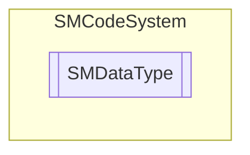

# SMDataType `Public class`

## Description
SMCode data type class.

## Diagram


## Members
### Methods
#### Public Static methods
| Returns | Name |
| --- | --- |
| `bool` | [`IsBlob`](#isblob)(`Type` _Type)<br>Return true if data type is blob. |
| `bool` | [`IsBoolean`](#isboolean)(`Type` _Type)<br>Return true if data type is boolean. |
| `bool` | [`IsDate`](#isdate)(`Type` _Type)<br>Return true if data type is date. |
| `bool` | [`IsGuid`](#isguid)(`Type` _Type)<br>Return true if data type is GUID. |
| `bool` | [`IsNumeric`](#isnumeric)(`Type` _Type)<br>Return true if column field data type is numeric. |
| `bool` | [`IsText`](#istext)(`Type` _Type)<br>Return true if data type is text. |

## Details
### Summary
SMCode data type class.

### Constructors
#### SMDataType
```csharp
public SMDataType()
```

### Methods
#### IsBlob
```csharp
public static bool IsBlob(Type _Type)
```
##### Arguments
| Type | Name | Description |
| --- | --- | --- |
| `Type` | _Type |   |

##### Summary
Return true if data type is blob.

#### IsBoolean
```csharp
public static bool IsBoolean(Type _Type)
```
##### Arguments
| Type | Name | Description |
| --- | --- | --- |
| `Type` | _Type |   |

##### Summary
Return true if data type is boolean.

#### IsDate
```csharp
public static bool IsDate(Type _Type)
```
##### Arguments
| Type | Name | Description |
| --- | --- | --- |
| `Type` | _Type |   |

##### Summary
Return true if data type is date.

#### IsGuid
```csharp
public static bool IsGuid(Type _Type)
```
##### Arguments
| Type | Name | Description |
| --- | --- | --- |
| `Type` | _Type |   |

##### Summary
Return true if data type is GUID.

#### IsNumeric
```csharp
public static bool IsNumeric(Type _Type)
```
##### Arguments
| Type | Name | Description |
| --- | --- | --- |
| `Type` | _Type |   |

##### Summary
Return true if column field data type is numeric.

#### IsText
```csharp
public static bool IsText(Type _Type)
```
##### Arguments
| Type | Name | Description |
| --- | --- | --- |
| `Type` | _Type |   |

##### Summary
Return true if data type is text.

*Generated with* [*ModularDoc*](https://github.com/hailstorm75/ModularDoc)
