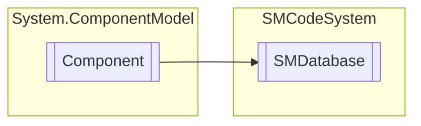

# SMDatabase `Public class`

## Diagram


## Members
### Properties
#### Public  properties
| Type | Name | Methods |
| --- | --- | --- |
| `bool` | [`Active`](#active)<br>Specifies whether or not database is open. | `get, set` |
| `string` | [`Alias`](#alias)<br>Specifies database alias name to use. | `get, set` |
| `int` | [`CommandTimeout`](#commandtimeout)<br>Specifies database command timeout. | `get, set` |
| `MySqlConnection` | [`ConnectionMySql`](#connectionmysql)<br>Indicated used connection form MySql database type. | `get, set` |
| `OleDbConnection` | [`ConnectionOleDB`](#connectionoledb)<br>Indicated used connection form OleDB database type. | `get, set` |
| `SqlConnection` | [`ConnectionSql`](#connectionsql)<br>Indicated used connection form Sql database type. | `get, set` |
| `string` | [`ConnectionString`](#connectionstring)<br>Get or set database connection string. | `get, set` |
| `int` | [`ConnectionTimeout`](#connectiontimeout)<br>Specifies database connection timeout in seconds. | `get, set` |
| `string` | [`Database`](#database)<br>Specifies default database name. | `get, set` |
| `string` | [`Host`](#host)<br>Specifies database host name or address. | `get, set` |
| `string` | [`Password`](#password)<br>Specifies database password. | `get, set` |
| `string` | [`Path`](#path)<br>Specifies database path. | `get, set` |
| `string` | [`Template`](#template)<br>Specifies database template file full path. | `get, set` |
| [`SMDatabaseType`](./smcodesystem-SMDatabaseType) | [`Type`](#type)<br>Specifies database type. | `get, set` |
| `int` | [`UsageCounter`](#usagecounter)<br>Get database usage counter. | `get, set` |
| `string` | [`User`](#user)<br>Specifies database user name. | `get, set` |

#### Public Static properties
| Type | Name | Methods |
| --- | --- | --- |
| `string` | [`MySqlPrefix`](#mysqlprefix)<br>Specifies database alias name to use. | `get, set` |
| `string` | [`MySqlSuffix`](#mysqlsuffix)<br>Specifies database alias name to use. | `get, set` |
| `string` | [`SqlPrefix`](#sqlprefix)<br>Specifies database alias name to use. | `get, set` |
| `string` | [`SqlSuffix`](#sqlsuffix)<br>Specifies database alias name to use. | `get, set` |

### Methods
#### Public  methods
| Returns | Name |
| --- | --- |
| `void` | [`Clear`](#clear)()<br>Reset database variables. |
| `bool` | [`Close`](#close)()<br>Close database connection. Returns true if succeed. |
| `bool` | [`Copy`](#copy-12)(`...`)<br>Copy database parameters from another instance. |
| `int` | [`Exec`](#exec)(`string` _SqlStatement, `bool` _ErrorManagement, `bool` _ExecuteScalar)<br>Executes SQL statement passed as parameter. <br>            Return the number of records affected or -1 if not succeed. |
| `string` | [`GetConnectionString`](#getconnectionstring)()<br>Return connection string replacing all macros with database properties. |
| `bool` | [`Keep`](#keep)()<br>Test if database connection is active otherwise try to open it. Returns true if succeed. |
| `bool` | [`Load`](#load)(`string` _Alias, `string` _FileName)<br>Load database parameters related to alias from fileName INI file. Returns true if succeed. |
| `bool` | [`Open`](#open-12)(`...`)<br>Close and reopen database connection with alias, .mdb or .dbf file specified. Returns true if succeed. |
| `bool` | [`Save`](#save)(`string` _Alias, `string` _FileName)<br>Save database parameters related to alias to fileName INI file. Returns true if succeed. |
| `string` | [`StoredProcedure`](#storedprocedure)(`string` _StoredProcedure, `object``[]` _Parameters, `bool` _ErrorManagement)<br>Perform stored procedure with parameters and return @Result parameter. |

#### Protected  methods
| Returns | Name |
| --- | --- |
| `void` | [`Dispose`](#dispose)(`bool` disposing)<br>Liberare le risorse in uso. |

#### Public Static methods
| Returns | Name |
| --- | --- |
| `bool` | [`CompactMdb`](#compactmdb)(`string` _FileName, `string` _Password)<br>Compact MDB database file specified in file name parameter. Password must be setted <br>            to security password to access database file or "" if not necessary. Return true if succeed. |
| `string` | [`Delimiters`](#delimiters)(`string` _SQLStatement, [`SMDatabaseType`](./smcodesystem-SMDatabaseType) _DatabaseType)<br>Return string containing sql statement with [ ] delimiters <br>            turned in to ty type database delimiters. |
| `bool` | [`Lock`](#lock)()<br>Try to create lock database file. |
| `string` | [`LockPath`](#lockpath)()<br>Return database lock file full path. |
| `bool` | [`Locked`](#locked)()<br>Return true if database lock file exists. |
| `void` | [`ParametersByName`](#parametersbyname-13)(`...`)<br>Set OleDb command names with char @ followed by field name wich related parameter (SourceColumn). |
| [`SMDatabaseType`](./smcodesystem-SMDatabaseType) | [`TypeFromString`](#typefromstring)(`string` _DatabaseType)<br>Return database type from string value. |
| `string` | [`TypeToString`](#typetostring)([`SMDatabaseType`](./smcodesystem-SMDatabaseType) _DatabaseType)<br>Return string corresponding to database type. |
| `bool` | [`Unlock`](#unlock)()<br>Try to delete database lock file. |

## Details
### Inheritance
 - `Component`

### Constructors
#### SMDatabase [1/2]
```csharp
public SMDatabase(SMCode _SM)
```
##### Arguments
| Type | Name | Description |
| --- | --- | --- |
| [`SMCode`](./smcodesystem-SMCode) | _SM |   |

##### Summary
Database instance constructor.

#### SMDatabase [2/2]
```csharp
public SMDatabase(IContainer _Container)
```
##### Arguments
| Type | Name | Description |
| --- | --- | --- |
| `IContainer` | _Container |   |

##### Summary
Database instance constructor with container.

### Methods
#### Clear
```csharp
public void Clear()
```
##### Summary
Reset database variables.

#### Close
```csharp
public bool Close()
```
##### Summary
Close database connection. Returns true if succeed.

#### Copy [1/2]
```csharp
public bool Copy(SMDatabase _Database)
```
##### Arguments
| Type | Name | Description |
| --- | --- | --- |
| [`SMDatabase`](smcodesystem-SMDatabase) | _Database |   |

##### Summary
Copy database parameters from another instance.

#### Copy [2/2]
```csharp
public bool Copy(string _Alias)
```
##### Arguments
| Type | Name | Description |
| --- | --- | --- |
| `string` | _Alias |   |

##### Summary
Copy database parameters from another instance on the databases list with same alias otherwise load it from INI file.

#### Exec
```csharp
public int Exec(string _SqlStatement, bool _ErrorManagement, bool _ExecuteScalar)
```
##### Arguments
| Type | Name | Description |
| --- | --- | --- |
| `string` | _SqlStatement |   |
| `bool` | _ErrorManagement |   |
| `bool` | _ExecuteScalar |   |

##### Summary
Executes SQL statement passed as parameter. 
            Return the number of records affected or -1 if not succeed.

#### StoredProcedure
```csharp
public string StoredProcedure(string _StoredProcedure, object[] _Parameters, bool _ErrorManagement)
```
##### Arguments
| Type | Name | Description |
| --- | --- | --- |
| `string` | _StoredProcedure |   |
| `object``[]` | _Parameters |   |
| `bool` | _ErrorManagement |   |

##### Summary
Perform stored procedure with parameters and return @Result parameter.

#### GetConnectionString
```csharp
public string GetConnectionString()
```
##### Summary
Return connection string replacing all macros with database properties.

#### Keep
```csharp
public bool Keep()
```
##### Summary
Test if database connection is active otherwise try to open it. Returns true if succeed.

#### Load
```csharp
public bool Load(string _Alias, string _FileName)
```
##### Arguments
| Type | Name | Description |
| --- | --- | --- |
| `string` | _Alias |   |
| `string` | _FileName |   |

##### Summary
Load database parameters related to alias from fileName INI file. Returns true if succeed.

#### Open [1/2]
```csharp
public bool Open(string _Alias, string _Password)
```
##### Arguments
| Type | Name | Description |
| --- | --- | --- |
| `string` | _Alias |   |
| `string` | _Password |   |

##### Summary
Close and reopen database connection with alias, .mdb or .dbf file specified. Returns true if succeed.

#### Open [2/2]
```csharp
public bool Open(SMDatabaseType _Type, string _Host, string _Database, string _ConnectionString, string _Path, string _User, string _Password)
```
##### Arguments
| Type | Name | Description |
| --- | --- | --- |
| [`SMDatabaseType`](./smcodesystem-SMDatabaseType) | _Type |   |
| `string` | _Host |   |
| `string` | _Database |   |
| `string` | _ConnectionString |   |
| `string` | _Path |   |
| `string` | _User |   |
| `string` | _Password |   |

##### Summary
Open database connection with database type, host name, database name, user name and password parameters.
            Returns true if succeed.

#### Save
```csharp
public bool Save(string _Alias, string _FileName)
```
##### Arguments
| Type | Name | Description |
| --- | --- | --- |
| `string` | _Alias |   |
| `string` | _FileName |   |

##### Summary
Save database parameters related to alias to fileName INI file. Returns true if succeed.

#### CompactMdb
```csharp
public static bool CompactMdb(string _FileName, string _Password)
```
##### Arguments
| Type | Name | Description |
| --- | --- | --- |
| `string` | _FileName |   |
| `string` | _Password |   |

##### Summary
Compact MDB database file specified in file name parameter. Password must be setted 
            to security password to access database file or "" if not necessary. Return true if succeed.

#### Delimiters
```csharp
public static string Delimiters(string _SQLStatement, SMDatabaseType _DatabaseType)
```
##### Arguments
| Type | Name | Description |
| --- | --- | --- |
| `string` | _SQLStatement |   |
| [`SMDatabaseType`](./smcodesystem-SMDatabaseType) | _DatabaseType |   |

##### Summary
Return string containing sql statement with [ ] delimiters 
            turned in to ty type database delimiters.

#### Lock
```csharp
public static bool Lock()
```
##### Summary
Try to create lock database file.

#### Locked
```csharp
public static bool Locked()
```
##### Summary
Return true if database lock file exists.

#### LockPath
```csharp
public static string LockPath()
```
##### Summary
Return database lock file full path.

#### ParametersByName [1/3]
```csharp
public static void ParametersByName(OleDbCommand _OleDbCommand)
```
##### Arguments
| Type | Name | Description |
| --- | --- | --- |
| `OleDbCommand` | _OleDbCommand |   |

##### Summary
Set OleDb command names with char @ followed by field name wich related parameter (SourceColumn).

#### ParametersByName [2/3]
```csharp
public static void ParametersByName(SqlCommand _SqlCommand)
```
##### Arguments
| Type | Name | Description |
| --- | --- | --- |
| `SqlCommand` | _SqlCommand |   |

##### Summary
Set SQL command names with char @ followed by field name wich related parameter (SourceColumn).

#### ParametersByName [3/3]
```csharp
public static void ParametersByName(MySqlCommand _MySqlCommand)
```
##### Arguments
| Type | Name | Description |
| --- | --- | --- |
| `MySqlCommand` | _MySqlCommand |   |

##### Summary
Set MySQL command names with char @ followed by field name wich related parameter (SourceColumn).

#### TypeFromString
```csharp
public static SMDatabaseType TypeFromString(string _DatabaseType)
```
##### Arguments
| Type | Name | Description |
| --- | --- | --- |
| `string` | _DatabaseType |   |

##### Summary
Return database type from string value.

#### TypeToString
```csharp
public static string TypeToString(SMDatabaseType _DatabaseType)
```
##### Arguments
| Type | Name | Description |
| --- | --- | --- |
| [`SMDatabaseType`](./smcodesystem-SMDatabaseType) | _DatabaseType |   |

##### Summary
Return string corresponding to database type.

#### Unlock
```csharp
public static bool Unlock()
```
##### Summary
Try to delete database lock file.

#### Dispose
```csharp
protected override void Dispose(bool disposing)
```
##### Arguments
| Type | Name | Description |
| --- | --- | --- |
| `bool` | disposing | ha valore true se le risorse gestite devono essere eliminate, false in caso contrario. |

##### Summary
Liberare le risorse in uso.

### Properties
#### Active
```csharp
public bool Active { get; set; }
```
##### Summary
Specifies whether or not database is open.

#### Alias
```csharp
public string Alias { get; set; }
```
##### Summary
Specifies database alias name to use.

#### CommandTimeout
```csharp
public int CommandTimeout { get; set; }
```
##### Summary
Specifies database command timeout.

#### ConnectionMySql
```csharp
public MySqlConnection ConnectionMySql { get; set; }
```
##### Summary
Indicated used connection form MySql database type.

#### ConnectionOleDB
```csharp
public OleDbConnection ConnectionOleDB { get; set; }
```
##### Summary
Indicated used connection form OleDB database type.

#### ConnectionSql
```csharp
public SqlConnection ConnectionSql { get; set; }
```
##### Summary
Indicated used connection form Sql database type.

#### ConnectionString
```csharp
public string ConnectionString { get; set; }
```
##### Summary
Get or set database connection string.

#### ConnectionTimeout
```csharp
public int ConnectionTimeout { get; set; }
```
##### Summary
Specifies database connection timeout in seconds.

#### Database
```csharp
public string Database { get; set; }
```
##### Summary
Specifies default database name.

#### Host
```csharp
public string Host { get; set; }
```
##### Summary
Specifies database host name or address.

#### Password
```csharp
public string Password { get; set; }
```
##### Summary
Specifies database password.

#### Path
```csharp
public string Path { get; set; }
```
##### Summary
Specifies database path.

#### Type
```csharp
public SMDatabaseType Type { get; set; }
```
##### Summary
Specifies database type.

#### Template
```csharp
public string Template { get; set; }
```
##### Summary
Specifies database template file full path.

#### UsageCounter
```csharp
public int UsageCounter { get; set; }
```
##### Summary
Get database usage counter.

#### User
```csharp
public string User { get; set; }
```
##### Summary
Specifies database user name.

#### MySqlPrefix
```csharp
public static string MySqlPrefix { get; set; }
```
##### Summary
Specifies database alias name to use.

#### MySqlSuffix
```csharp
public static string MySqlSuffix { get; set; }
```
##### Summary
Specifies database alias name to use.

#### SqlPrefix
```csharp
public static string SqlPrefix { get; set; }
```
##### Summary
Specifies database alias name to use.

#### SqlSuffix
```csharp
public static string SqlSuffix { get; set; }
```
##### Summary
Specifies database alias name to use.

*Generated with* [*ModularDoc*](https://github.com/hailstorm75/ModularDoc)
