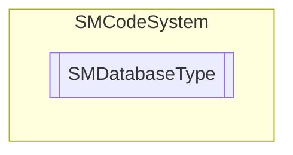

# SMDatabaseType `Public enum`

## Description
SMCode database type enumeration.

## Diagram

## Details
### Summary
SMCode database type enumeration.

### Fields
#### None
##### Summary
None.

#### Mdb
##### Summary
Microsoft Access (MDB).

#### Sql
##### Summary
Microsoft SQL Server.

#### MySql
##### Summary
MySQL Server.

#### Dbf
##### Summary
DBase IV (DBF).

#### PostgreSQL
##### Summary
PostgreSQL.

*Generated with* [*ModularDoc*](https://github.com/hailstorm75/ModularDoc)
