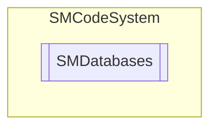

# SMDatabases `Public class`

## Description
SMCode database collection class.

## Diagram


## Members
### Properties
#### Public  properties
| Type | Name | Methods |
| --- | --- | --- |
| `int` | [`Count`](#count)<br>Get databases items count. | `get` |
| `int` | [`DefaultCommandTimeout`](#defaultcommandtimeout)<br>Get or set default database command timeout. | `get, set` |
| `int` | [`DefaultConnectionTimeout`](#defaultconnectiontimeout)<br>Get or set default database connection timeout. | `get, set` |
| [`SMDatabase`](./smcodesystem-SMDatabase) | [`Item`](#item) | `get, set` |
| [`SMDatabase`](./smcodesystem-SMDatabase) | [`Item`](#item) | `get, set` |
| `bool` | [`NewDatabaseOnKeep`](#newdatabaseonkeep)<br>If true enable creation of new database connection every keep function call. | `get, set` |

### Methods
#### Public  methods
| Returns | Name |
| --- | --- |
| `bool` | [`Add`](#add-12)(`...`)<br>Add new database to collection. |
| `bool` | [`Close`](#close)(`string` _Alias)<br>Close all databases with alias or all if not specified. |
| `int` | [`Find`](#find)(`string` _Alias)<br>Return index of database collection item with alias. |
| [`SMDatabase`](./smcodesystem-SMDatabase) | [`Keep`](#keep)(`string` _Alias)<br>Return database with alias and open it if not active. |

## Details
### Summary
SMCode database collection class.

### Constructors
#### SMDatabases
```csharp
public SMDatabases(SMCode _SM)
```
##### Arguments
| Type | Name | Description |
| --- | --- | --- |
| [`SMCode`](./smcodesystem-SMCode) | _SM |   |

##### Summary
Class constructor.

### Methods
#### Add [1/2]
```csharp
public bool Add(string _Alias, SMDatabaseType _Type, string _Host, string _Database, string _ConnectionString, string _Path, string _User, string _Password, bool _Save)
```
##### Arguments
| Type | Name | Description |
| --- | --- | --- |
| `string` | _Alias |   |
| [`SMDatabaseType`](./smcodesystem-SMDatabaseType) | _Type |   |
| `string` | _Host |   |
| `string` | _Database |   |
| `string` | _ConnectionString |   |
| `string` | _Path |   |
| `string` | _User |   |
| `string` | _Password |   |
| `bool` | _Save |   |

##### Summary
Add new database to collection.

#### Add [2/2]
```csharp
public bool Add(string _Alias)
```
##### Arguments
| Type | Name | Description |
| --- | --- | --- |
| `string` | _Alias |   |

##### Summary
Add new database to collection, loading parameter from configuration INI file.

#### Close
```csharp
public bool Close(string _Alias)
```
##### Arguments
| Type | Name | Description |
| --- | --- | --- |
| `string` | _Alias |   |

##### Summary
Close all databases with alias or all if not specified.

#### Find
```csharp
public int Find(string _Alias)
```
##### Arguments
| Type | Name | Description |
| --- | --- | --- |
| `string` | _Alias |   |

##### Summary
Return index of database collection item with alias.

#### Keep
```csharp
public SMDatabase Keep(string _Alias)
```
##### Arguments
| Type | Name | Description |
| --- | --- | --- |
| `string` | _Alias |   |

##### Summary
Return database with alias and open it if not active.

### Properties
#### Item
```csharp
public SMDatabase Item { get; set; }
```

#### Item
```csharp
public SMDatabase Item { get; set; }
```

#### Count
```csharp
public int Count { get; }
```
##### Summary
Get databases items count.

#### DefaultCommandTimeout
```csharp
public int DefaultCommandTimeout { get; set; }
```
##### Summary
Get or set default database command timeout.

#### DefaultConnectionTimeout
```csharp
public int DefaultConnectionTimeout { get; set; }
```
##### Summary
Get or set default database connection timeout.

#### NewDatabaseOnKeep
```csharp
public bool NewDatabaseOnKeep { get; set; }
```
##### Summary
If true enable creation of new database connection every keep function call.

*Generated with* [*ModularDoc*](https://github.com/hailstorm75/ModularDoc)
