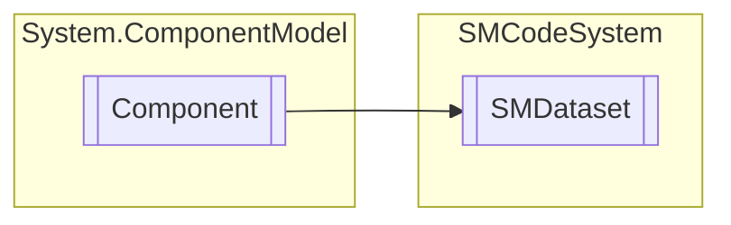

# SMDataset `Public class`

## Diagram


## Members
### Properties
#### Public  properties
| Type | Name | Methods |
| --- | --- | --- |
| `bool` | [`Active`](#active)<br>Specifies whether or not dataset is open. | `get, set` |
| `string` | [`Alias`](#alias)<br>Specifies database alias name to use with dataset. | `get, set` |
| `bool` | [`Appending`](#appending)<br>Specifies whether or not dataset is in insert state. | `get` |
| `bool` | [`Bof`](#bof)<br>Indicates whether the first record in the dataset is active. | `get, private set` |
| `bool` | [`Browsing`](#browsing)<br>Specifies whether or not dataset is in browse state. | `get` |
| `int` | [`ChangesBufferSize`](#changesbuffersize)<br>Indicates how many changes can buffered before writes them to the database. | `get, set` |
| `bool` | [`Closed`](#closed)<br>Specifies whether or not dataset is closed. | `get` |
| `DataColumnCollection` | [`Columns`](#columns)<br>Return table columns collection or null. | `get` |
| [`SMDatabase`](./smcodesystem-SMDatabase) | [`Database`](#database)<br>Specifies the database connection component to use. | `get, set` |
| `DataSet` | [`Dataset`](#dataset)<br>Get dataset instance. | `get, private set` |
| `bool` | [`Disposing`](#disposing)<br>Component disposing flag. | `get, private set` |
| `bool` | [`Editing`](#editing)<br>Specifies whether or not dataset is in edit state. | `get` |
| `bool` | [`Empty`](#empty)<br>Specifies whether dataset contains no records. | `get` |
| `bool` | [`Eof`](#eof)<br>Indicates whether a dataset is positioned at the last record. | `get, private set` |
| `bool` | [`ExclusiveConnection`](#exclusiveconnection)<br>Indicates if dataset has an exclusive database connection (not managed in databases collection). | `get, private set` |
| [`SMDataset`](smcodesystem-SMDataset) | [`ExtendedDataset`](#extendeddataset)<br>Get or set extended dataset. | `get, set` |
| `string` | [`GuidColumn`](#guidcolumn)<br>Get or set GUID column name. | `get, set` |
| `object` | [`Item`](#item) | `get, set` |
| `string` | [`Query`](#query)<br>Contains the text of the SQL statement to execute for the dataset. | `get, set` |
| `bool` | [`ReadOnly`](#readonly)<br>Indicates if dataset is read-only. | `get, private set` |
| `bool` | [`RecordAvailable`](#recordavailable)<br>Specifies if dataset position is on an available record. | `get` |
| `int` | [`RecordIndex`](#recordindex)<br>Indicates the index of the current record in the dataset. | `get, set` |
| `bool` | [`RecordInformationColumn`](#recordinformationcolumn)<br>Get or set record modification information columns presence flag. | `get, set` |
| `DataRow` | [`Row`](#row)<br>Indicates the current active row of the dataset. | `get, private set` |
| `DataRowCollection` | [`Rows`](#rows)<br>Return table rows collection or null. | `get` |
| [`SMDatasetState`](./smcodesystem-SMDatasetState) | [`State`](#state)<br>Indicates the current operating mode of the dataset. | `get, private set` |
| `DataTable` | [`Table`](#table)<br>Indicates the current table object open in dataset. | `get, private set` |
| `string` | [`TableName`](#tablename)<br>Indicates the current table name open in dataset. | `get, private set` |
| `bool` | [`UniqueIdentifierColumn`](#uniqueidentifiercolumn)<br>Get or set SM unique identifier column name if present. | `get, set` |

### Methods
#### Public  methods
| Returns | Name |
| --- | --- |
| `bool` | [`Append`](#append)()<br>Adds a new, empty record to the dataset. Return true if succeed. |
| `bool` | [`Assign`](#assign-14)(`...`)<br>Assign value content to field named column. |
| `bool` | [`Buffer`](#buffer)()<br>If dataset updates buffers is full, writes changes to database. Return true if succeed. |
| `bool` | [`Cancel`](#cancel)()<br>Cancels not yet posted modifications to the active record. Return true if succeed. |
| `void` | [`ChangeState`](#changestate)([`SMDatasetState`](./smcodesystem-SMDatasetState) _State)<br>Set current dataset state to newState. |
| `void` | [`Clear`](#clear)()<br>Initialize and reset dataset variables. |
| `bool` | [`Close`](#close)()<br>Close dataset. Return true if succeed. |
| `bool` | [`Commit`](#commit)()<br>Writes a dataset buffered updates to the database. Return true if succeed. |
| `bool` | [`CopyRow`](#copyrow)([`SMDataset`](smcodesystem-SMDataset) _SourceDataSet, `string``[]` _ExcludeFields)<br>Copy the values of corresponding fields from source dataset current row <br>            to this dataset current row. Returns true if succeed. |
| `bool` | [`DataReady`](#dataready)()<br>Return true if current record is deleted or detached. |
| `bool` | [`Delete`](#delete)()<br>Deletes the active record in the dataset. Return true if succeed. |
| `bool` | [`Deleted`](#deleted)()<br>Return true if current record is deleted or detached. |
| `int` | [`Each`](#each)([`SMOnEachRow`](./smcodesystem-SMOnEachRow) _OnEachRow, `bool` _StopNow)<br>Perform event for each row in dataset. Return number of rows processed. |
| `bool` | [`Edit`](#edit)()<br>Enables data editing of dataset. Return true if succeed. |
| `int` | [`Exec`](#exec)(`string` _SqlStatement, `bool` _ErrorManagement, `bool` _ExecuteScalar)<br>Executes SQL statement passed as parameter. <br>            Return the number of records affected or -1 if not succeed. |
| `object` | [`Field`](#field)(`string` _FieldName)<br>Return object related to field of current active record. |
| `byte``[]` | [`FieldBlob`](#fieldblob)(`string` _FieldName)<br>Return byte array with blob content of field of current active record. |
| `bool` | [`FieldBool`](#fieldbool)(`string` _FieldName)<br>Return bool related to field value of current active record. |
| `char` | [`FieldChar`](#fieldchar)(`string` _FieldName)<br>Return char related to field value of current active record. |
| `DateTime` | [`FieldDate`](#fielddate)(`string` _FieldName, `bool` _IncludeTime)<br>Return date related to field value of current active record. |
| `DateTime` | [`FieldDateTime`](#fielddatetime)(`string` _FieldName)<br>Return datetime related to field value of current active record. |
| `double` | [`FieldDouble`](#fielddouble)(`string` _FieldName)<br>Return double related to field value of current active record. |
| `int` | [`FieldIndex`](#fieldindex)(`string` _FieldName)<br>Return index of field name in table open columns. |
| `int` | [`FieldInt`](#fieldint)(`string` _FieldName)<br>Return integer related to field value of current active record. |
| `int` | [`FieldLoad`](#fieldload)(`string` _FieldName, `string` _FileName)<br>Load blob content of field from file. Return blob size or -1 if fail. |
| `long` | [`FieldLong`](#fieldlong)(`string` _FieldName)<br>Return long integer related to field value of current active record. |
| `int` | [`FieldMaxLength`](#fieldmaxlength)(`string` _FieldName)<br>Return max length of column specified or -1 if fail (only for data tables). |
| `int` | [`FieldSave`](#fieldsave)(`string` _FieldName, `string` _FileName)<br>Save blob content of field which name is fieldName of current active record <br>            in to file fileName. Return blob size or -1 if fail. |
| `string` | [`FieldStr`](#fieldstr-12)(`...`)<br>Return string related to field value of current active record. |
| `DateTime` | [`FieldTime`](#fieldtime)(`string` _FieldName)<br>Return time related to field value of current active record. |
| `int` | [`Find`](#find-12)(`...`)<br>Return index of row with keys field equal to values, that must <br>            be FieldSort() formatted, or -1 if not found. Binary if true enable <br>            binary search for keys sequence ordered recordset. |
| `bool` | [`First`](#first)()<br>Moves to the first record in the dataset. Return true if succeed. |
| `bool` | [`Goto`](#goto)(`int` _RecordIndex)<br>Moves to the record with recordIndex position in the dataset. Return true if succeed. |
| `bool` | [`IsField`](#isfield)(`string` _FieldName)<br>Return true if field name is the name of one of any table open column. |
| `bool` | [`Last`](#last)()<br>Moves to the last record in the dataset. Return true if succeed. |
| `bool` | [`Load`](#load)()<br>Load the recordset. Return true if succeed. |
| `bool` | [`Modified`](#modified)()<br>Return true if exists record changes in the buffer. |
| `bool` | [`Modifying`](#modifying)(`bool` _ForceEdit)<br>Return true if dataset state is in insert or edit mode. If force is true, <br>            dataset AutoEdit property is setted to true and the dataset is not in edit or insert mode<br>            the function try to set the edit mode. Returns true if succeesd. |
| `bool` | [`Next`](#next)()<br>Moves to the next record in the dataset. Return true if succeed. |
| `bool` | [`Open`](#open)(`string` _SQLSelectionQuery, `bool` _ReadOnly)<br>Open dataset with query specified in sqlQuery parameter. <br>            If readOnly is true dataset will be opened in read-only mode. <br>            Return true if succeed. |
| `bool` | [`OpenAtLeast`](#openatleast)(`string` _SQLSelectionQuery)<br>Open dataset with query specified in sqlQuery parameter. Return true if succeed<br>            and if the table contains at least one record. |
| `bool` | [`OpenDatabase`](#opendatabase)()<br>Keep dataset database connection with database Alias property <br>            or Database property. Return true if succeed. |
| `bool` | [`Post`](#post)()<br>Write a modified record to the buffer. Return true if succeed. |
| `bool` | [`Previous`](#previous)()<br>Moves to the previous record in the dataset. Return true if succeed. |
| `bool` | [`Read`](#read-12)(`...`)<br>Start a readonly session with sqlQuery reading first record <br>            on current database connection. Returns true if succeed. |
| `int` | [`RecordCount`](#recordcount)()<br>Indicates the total number of records associated with the dataset. |
| `bool` | [`RecordFromJSON`](#recordfromjson)(`string` _JSONValue, `string``[]` _ExcludeFields)<br>Store in the current record fields values contained on s. <br>            If blobs is true, blob fields will be stored in temporary directory and<br>            its names will be included on strings. |
| [`SMDictionary`](./smcodesystem-SMDictionary) | [`RecordToDictionary`](#recordtodictionary)([`SMDictionary`](./smcodesystem-SMDictionary) _Dictionary, `bool` _IncludeBlobs)<br>Returns dictionary representing values of current record fields, if null is passed<br>            as dictionary a new dictionary will be created. If blobs is true, blob fields will be stored <br>            with base 64 encoding. |
| `string` | [`RecordToJSON`](#recordtojson-12)(`...`)<br>Returns a JSON string representing values of current record fields. <br>            If blobs is true, blob fields will be stored with base 64 encoding. |
| `int` | [`Seek`](#seek-12)(`...`)<br>Seek and go to row index with keys field equal to values, that must <br>            be FieldSort() formatted, or -1 if not found or cannot go to row index. Binary if true enable <br>            binary search for keys sequence ordered recordset. |
| `bool` | [`SkipDeletedBackward`](#skipdeletedbackward)()<br>Skip backward all deleted or detached records from the current index. Return true if not BOF. |
| `bool` | [`SkipDeletedForward`](#skipdeletedforward)()<br>Skip forward all deleted or detached records from the current index. Return true if not EOF. |
| `string` | [`StoredProcedure`](#storedprocedure)(`string` _StoredProcedure, `object``[]` _Parameters, `bool` _ErrorManagement)<br>Perform stored procedure with parameters and return @Result parameter. |

#### Protected  methods
| Returns | Name |
| --- | --- |
| `void` | [`Dispose`](#dispose)(`bool` disposing)<br>Liberare le risorse in uso. |

## Details
### Inheritance
 - `Component`

### Constructors
#### SMDataset [1/5]
```csharp
public SMDataset(SMCode _SM)
```
##### Arguments
| Type | Name | Description |
| --- | --- | --- |
| [`SMCode`](./smcodesystem-SMCode) | _SM |   |

##### Summary
Dataset instance constructor.

#### SMDataset [2/5]
```csharp
public SMDataset(SMDatabase _Database, SMCode _SM)
```
##### Arguments
| Type | Name | Description |
| --- | --- | --- |
| [`SMDatabase`](./smcodesystem-SMDatabase) | _Database |   |
| [`SMCode`](./smcodesystem-SMCode) | _SM |   |

##### Summary
Dataset instance constructor with db database connection.

#### SMDataset [3/5]
```csharp
public SMDataset(string _Alias, SMCode _SM, bool _ExclusiveConnection)
```
##### Arguments
| Type | Name | Description |
| --- | --- | --- |
| `string` | _Alias |   |
| [`SMCode`](./smcodesystem-SMCode) | _SM |   |
| `bool` | _ExclusiveConnection |   |

##### Summary
Dataset instance constructor with alias connection.

#### SMDataset [4/5]
```csharp
public SMDataset(SMDataset _DataSet, SMCode _SM)
```
##### Arguments
| Type | Name | Description |
| --- | --- | --- |
| [`SMDataset`](smcodesystem-SMDataset) | _DataSet |   |
| [`SMCode`](./smcodesystem-SMCode) | _SM |   |

##### Summary
Dataset instance constructor with ds dataset connection.

#### SMDataset [5/5]
```csharp
public SMDataset(IContainer _Container)
```
##### Arguments
| Type | Name | Description |
| --- | --- | --- |
| `IContainer` | _Container |   |

##### Summary
Dataset instance constructor with container

### Methods
#### ChangeState
```csharp
public void ChangeState(SMDatasetState _State)
```
##### Arguments
| Type | Name | Description |
| --- | --- | --- |
| [`SMDatasetState`](./smcodesystem-SMDatasetState) | _State |   |

##### Summary
Set current dataset state to newState.

#### Clear
```csharp
public void Clear()
```
##### Summary
Initialize and reset dataset variables.

#### Close
```csharp
public bool Close()
```
##### Summary
Close dataset. Return true if succeed.

#### IsField
```csharp
public bool IsField(string _FieldName)
```
##### Arguments
| Type | Name | Description |
| --- | --- | --- |
| `string` | _FieldName |   |

##### Summary
Return true if field name is the name of one of any table open column.

#### FieldIndex
```csharp
public int FieldIndex(string _FieldName)
```
##### Arguments
| Type | Name | Description |
| --- | --- | --- |
| `string` | _FieldName |   |

##### Summary
Return index of field name in table open columns.

#### FieldMaxLength
```csharp
public int FieldMaxLength(string _FieldName)
```
##### Arguments
| Type | Name | Description |
| --- | --- | --- |
| `string` | _FieldName |   |

##### Summary
Return max length of column specified or -1 if fail (only for data tables).

#### Load
```csharp
public bool Load()
```
##### Summary
Load the recordset. Return true if succeed.

#### Open
```csharp
public bool Open(string _SQLSelectionQuery, bool _ReadOnly)
```
##### Arguments
| Type | Name | Description |
| --- | --- | --- |
| `string` | _SQLSelectionQuery |   |
| `bool` | _ReadOnly |   |

##### Summary
Open dataset with query specified in sqlQuery parameter. 
            If readOnly is true dataset will be opened in read-only mode. 
            Return true if succeed.

#### OpenAtLeast
```csharp
public bool OpenAtLeast(string _SQLSelectionQuery)
```
##### Arguments
| Type | Name | Description |
| --- | --- | --- |
| `string` | _SQLSelectionQuery |   |

##### Summary
Open dataset with query specified in sqlQuery parameter. Return true if succeed
            and if the table contains at least one record.

#### OpenDatabase
```csharp
public bool OpenDatabase()
```
##### Summary
Keep dataset database connection with database Alias property 
            or Database property. Return true if succeed.

#### Field
```csharp
public object Field(string _FieldName)
```
##### Arguments
| Type | Name | Description |
| --- | --- | --- |
| `string` | _FieldName |   |

##### Summary
Return object related to field of current active record.

#### FieldChar
```csharp
public char FieldChar(string _FieldName)
```
##### Arguments
| Type | Name | Description |
| --- | --- | --- |
| `string` | _FieldName |   |

##### Summary
Return char related to field value of current active record.

#### FieldStr [1/2]
```csharp
public string FieldStr(string _FieldName)
```
##### Arguments
| Type | Name | Description |
| --- | --- | --- |
| `string` | _FieldName |   |

##### Summary
Return string related to field value of current active record.

#### FieldStr [2/2]
```csharp
public string FieldStr(string _FieldName, string _FormatString)
```
##### Arguments
| Type | Name | Description |
| --- | --- | --- |
| `string` | _FieldName |   |
| `string` | _FormatString |   |

##### Summary
Return string related to field value of current active record
            and formatted with format specifications.

#### FieldInt
```csharp
public int FieldInt(string _FieldName)
```
##### Arguments
| Type | Name | Description |
| --- | --- | --- |
| `string` | _FieldName |   |

##### Summary
Return integer related to field value of current active record.

#### FieldLong
```csharp
public long FieldLong(string _FieldName)
```
##### Arguments
| Type | Name | Description |
| --- | --- | --- |
| `string` | _FieldName |   |

##### Summary
Return long integer related to field value of current active record.

#### FieldDouble
```csharp
public double FieldDouble(string _FieldName)
```
##### Arguments
| Type | Name | Description |
| --- | --- | --- |
| `string` | _FieldName |   |

##### Summary
Return double related to field value of current active record.

#### FieldDate
```csharp
public DateTime FieldDate(string _FieldName, bool _IncludeTime)
```
##### Arguments
| Type | Name | Description |
| --- | --- | --- |
| `string` | _FieldName |   |
| `bool` | _IncludeTime |   |

##### Summary
Return date related to field value of current active record.

#### FieldDateTime
```csharp
public DateTime FieldDateTime(string _FieldName)
```
##### Arguments
| Type | Name | Description |
| --- | --- | --- |
| `string` | _FieldName |   |

##### Summary
Return datetime related to field value of current active record.

#### FieldTime
```csharp
public DateTime FieldTime(string _FieldName)
```
##### Arguments
| Type | Name | Description |
| --- | --- | --- |
| `string` | _FieldName |   |

##### Summary
Return time related to field value of current active record.

#### FieldBool
```csharp
public bool FieldBool(string _FieldName)
```
##### Arguments
| Type | Name | Description |
| --- | --- | --- |
| `string` | _FieldName |   |

##### Summary
Return bool related to field value of current active record.

#### FieldBlob
```csharp
public byte FieldBlob(string _FieldName)
```
##### Arguments
| Type | Name | Description |
| --- | --- | --- |
| `string` | _FieldName |   |

##### Summary
Return byte array with blob content of field of current active record.

#### FieldLoad
```csharp
public int FieldLoad(string _FieldName, string _FileName)
```
##### Arguments
| Type | Name | Description |
| --- | --- | --- |
| `string` | _FieldName |   |
| `string` | _FileName |   |

##### Summary
Load blob content of field from file. Return blob size or -1 if fail.

#### FieldSave
```csharp
public int FieldSave(string _FieldName, string _FileName)
```
##### Arguments
| Type | Name | Description |
| --- | --- | --- |
| `string` | _FieldName |   |
| `string` | _FileName |   |

##### Summary
Save blob content of field which name is fieldName of current active record 
            in to file fileName. Return blob size or -1 if fail.

#### DataReady
```csharp
public bool DataReady()
```
##### Summary
Return true if current record is deleted or detached.

#### Deleted
```csharp
public bool Deleted()
```
##### Summary
Return true if current record is deleted or detached.

#### Each
```csharp
public int Each(SMOnEachRow _OnEachRow, bool _StopNow)
```
##### Arguments
| Type | Name | Description |
| --- | --- | --- |
| [`SMOnEachRow`](./smcodesystem-SMOnEachRow) | _OnEachRow |   |
| `bool` | _StopNow |   |

##### Summary
Perform event for each row in dataset. Return number of rows processed.

#### First
```csharp
public bool First()
```
##### Summary
Moves to the first record in the dataset. Return true if succeed.

#### Goto
```csharp
public bool Goto(int _RecordIndex)
```
##### Arguments
| Type | Name | Description |
| --- | --- | --- |
| `int` | _RecordIndex |   |

##### Summary
Moves to the record with recordIndex position in the dataset. Return true if succeed.

#### Last
```csharp
public bool Last()
```
##### Summary
Moves to the last record in the dataset. Return true if succeed.

#### Next
```csharp
public bool Next()
```
##### Summary
Moves to the next record in the dataset. Return true if succeed.

#### Previous
```csharp
public bool Previous()
```
##### Summary
Moves to the previous record in the dataset. Return true if succeed.

#### Read [1/2]
```csharp
public bool Read(string _SqlQuery)
```
##### Arguments
| Type | Name | Description |
| --- | --- | --- |
| `string` | _SqlQuery |   |

##### Summary
Start a readonly session with sqlQuery reading first record 
            on current database connection. Returns true if succeed.

#### Read [2/2]
```csharp
public bool Read()
```
##### Summary
Continue readonly session with sqlQuery reading next record 
            on current database connection. Returns true if succeed.

#### RecordCount
```csharp
public int RecordCount()
```
##### Summary
Indicates the total number of records associated with the dataset.

#### RecordToDictionary
```csharp
public SMDictionary RecordToDictionary(SMDictionary _Dictionary, bool _IncludeBlobs)
```
##### Arguments
| Type | Name | Description |
| --- | --- | --- |
| [`SMDictionary`](./smcodesystem-SMDictionary) | _Dictionary |   |
| `bool` | _IncludeBlobs |   |

##### Summary
Returns dictionary representing values of current record fields, if null is passed
            as dictionary a new dictionary will be created. If blobs is true, blob fields will be stored 
            with base 64 encoding.

#### RecordToJSON [1/2]
```csharp
public string RecordToJSON(bool _IncludeBlobs)
```
##### Arguments
| Type | Name | Description |
| --- | --- | --- |
| `bool` | _IncludeBlobs |   |

##### Summary
Returns a JSON string representing values of current record fields. 
            If blobs is true, blob fields will be stored with base 64 encoding.

#### RecordToJSON [2/2]
```csharp
public string RecordToJSON(string[] _FieldNames)
```
##### Arguments
| Type | Name | Description |
| --- | --- | --- |
| `string``[]` | _FieldNames |   |

##### Summary
Returns a JSON string representing values of current record fields
            specified in array. Blob fields will be stored with base 64 encoding.

#### SkipDeletedBackward
```csharp
public bool SkipDeletedBackward()
```
##### Summary
Skip backward all deleted or detached records from the current index. Return true if not BOF.

#### SkipDeletedForward
```csharp
public bool SkipDeletedForward()
```
##### Summary
Skip forward all deleted or detached records from the current index. Return true if not EOF.

#### Assign [1/4]
```csharp
public bool Assign(string _FieldName, string _Value)
```
##### Arguments
| Type | Name | Description |
| --- | --- | --- |
| `string` | _FieldName |   |
| `string` | _Value |   |

##### Summary
Assign value content to field named column.

#### Assign [2/4]
```csharp
public bool Assign(string _FieldName, object _Value)
```
##### Arguments
| Type | Name | Description |
| --- | --- | --- |
| `string` | _FieldName |   |
| `object` | _Value |   |

##### Summary
Assign value content to field named column.

#### Assign [3/4]
```csharp
public bool Assign(int _ColumnIndex, object _Value)
```
##### Arguments
| Type | Name | Description |
| --- | --- | --- |
| `int` | _ColumnIndex |   |
| `object` | _Value |   |

##### Summary
Assign value content to field with column index.

#### Assign [4/4]
```csharp
public bool Assign(string _FieldName)
```
##### Arguments
| Type | Name | Description |
| --- | --- | --- |
| `string` | _FieldName |   |

##### Summary
Assign blank content to field named column.

#### Find [1/2]
```csharp
public int Find(string[] _KeyFields, string[] _Values, bool _BinarySearch)
```
##### Arguments
| Type | Name | Description |
| --- | --- | --- |
| `string``[]` | _KeyFields |   |
| `string``[]` | _Values |   |
| `bool` | _BinarySearch |   |

##### Summary
Return index of row with keys field equal to values, that must 
            be FieldSort() formatted, or -1 if not found. Binary if true enable 
            binary search for keys sequence ordered recordset.

#### Find [2/2]
```csharp
public int Find(int[] _KeyFieldsIndexes, string[] _Values, bool _BinarySearch)
```
##### Arguments
| Type | Name | Description |
| --- | --- | --- |
| `int``[]` | _KeyFieldsIndexes |   |
| `string``[]` | _Values |   |
| `bool` | _BinarySearch |   |

##### Summary
Return index of row with key fields corresponding to map indexes field 
            equal to values, that must be FieldSort() formatted, or -1 if not found. 
            Binary if true enable binary search for keys sequence ordered recordset.

#### Seek [1/2]
```csharp
public int Seek(string[] _KeyFields, string[] _Values, bool _BinarySearch)
```
##### Arguments
| Type | Name | Description |
| --- | --- | --- |
| `string``[]` | _KeyFields |   |
| `string``[]` | _Values |   |
| `bool` | _BinarySearch |   |

##### Summary
Seek and go to row index with keys field equal to values, that must 
            be FieldSort() formatted, or -1 if not found or cannot go to row index. Binary if true enable 
            binary search for keys sequence ordered recordset.

#### Seek [2/2]
```csharp
public int Seek(int[] _KeyFieldsIndexes, string[] _Values, bool _BinarySearch)
```
##### Arguments
| Type | Name | Description |
| --- | --- | --- |
| `int``[]` | _KeyFieldsIndexes |   |
| `string``[]` | _Values |   |
| `bool` | _BinarySearch |   |

##### Summary
Seek and go to row index with key fields corresponding to map indexes field 
            equal to values, that must be FieldSort() formatted, or -1 if not found or cannot go 
            to row index. Binary if true enable binary search for keys sequence ordered recordset.

#### Append
```csharp
public bool Append()
```
##### Summary
Adds a new, empty record to the dataset. Return true if succeed.

#### Cancel
```csharp
public bool Cancel()
```
##### Summary
Cancels not yet posted modifications to the active record. Return true if succeed.

#### Commit
```csharp
public bool Commit()
```
##### Summary
Writes a dataset buffered updates to the database. Return true if succeed.

#### Buffer
```csharp
public bool Buffer()
```
##### Summary
If dataset updates buffers is full, writes changes to database. Return true if succeed.

#### CopyRow
```csharp
public bool CopyRow(SMDataset _SourceDataSet, string[] _ExcludeFields)
```
##### Arguments
| Type | Name | Description |
| --- | --- | --- |
| [`SMDataset`](smcodesystem-SMDataset) | _SourceDataSet |   |
| `string``[]` | _ExcludeFields |   |

##### Summary
Copy the values of corresponding fields from source dataset current row 
            to this dataset current row. Returns true if succeed.

#### Delete
```csharp
public bool Delete()
```
##### Summary
Deletes the active record in the dataset. Return true if succeed.

#### Edit
```csharp
public bool Edit()
```
##### Summary
Enables data editing of dataset. Return true if succeed.

#### Exec
```csharp
public int Exec(string _SqlStatement, bool _ErrorManagement, bool _ExecuteScalar)
```
##### Arguments
| Type | Name | Description |
| --- | --- | --- |
| `string` | _SqlStatement |   |
| `bool` | _ErrorManagement |   |
| `bool` | _ExecuteScalar |   |

##### Summary
Executes SQL statement passed as parameter. 
            Return the number of records affected or -1 if not succeed.

#### StoredProcedure
```csharp
public string StoredProcedure(string _StoredProcedure, object[] _Parameters, bool _ErrorManagement)
```
##### Arguments
| Type | Name | Description |
| --- | --- | --- |
| `string` | _StoredProcedure |   |
| `object``[]` | _Parameters |   |
| `bool` | _ErrorManagement |   |

##### Summary
Perform stored procedure with parameters and return @Result parameter.

#### Modified
```csharp
public bool Modified()
```
##### Summary
Return true if exists record changes in the buffer.

#### Modifying
```csharp
public bool Modifying(bool _ForceEdit)
```
##### Arguments
| Type | Name | Description |
| --- | --- | --- |
| `bool` | _ForceEdit |   |

##### Summary
Return true if dataset state is in insert or edit mode. If force is true, 
            dataset AutoEdit property is setted to true and the dataset is not in edit or insert mode
            the function try to set the edit mode. Returns true if succeesd.

#### Post
```csharp
public bool Post()
```
##### Summary
Write a modified record to the buffer. Return true if succeed.

#### RecordFromJSON
```csharp
public bool RecordFromJSON(string _JSONValue, string[] _ExcludeFields)
```
##### Arguments
| Type | Name | Description |
| --- | --- | --- |
| `string` | _JSONValue |   |
| `string``[]` | _ExcludeFields |   |

##### Summary
Store in the current record fields values contained on s. 
            If blobs is true, blob fields will be stored in temporary directory and
            its names will be included on strings.

#### Dispose
```csharp
protected override void Dispose(bool disposing)
```
##### Arguments
| Type | Name | Description |
| --- | --- | --- |
| `bool` | disposing | ha valore true se le risorse gestite devono essere eliminate, false in caso contrario. |

##### Summary
Liberare le risorse in uso.

### Properties
#### Item
```csharp
public object Item { get; set; }
```

#### Active
```csharp
public bool Active { get; set; }
```
##### Summary
Specifies whether or not dataset is open.

#### Alias
```csharp
public string Alias { get; set; }
```
##### Summary
Specifies database alias name to use with dataset.

#### Appending
```csharp
public bool Appending { get; }
```
##### Summary
Specifies whether or not dataset is in insert state.

#### Bof
```csharp
public bool Bof { get; private set; }
```
##### Summary
Indicates whether the first record in the dataset is active.

#### Browsing
```csharp
public bool Browsing { get; }
```
##### Summary
Specifies whether or not dataset is in browse state.

#### ChangesBufferSize
```csharp
public int ChangesBufferSize { get; set; }
```
##### Summary
Indicates how many changes can buffered before writes them to the database.

#### Closed
```csharp
public bool Closed { get; }
```
##### Summary
Specifies whether or not dataset is closed.

#### Columns
```csharp
public DataColumnCollection Columns { get; }
```
##### Summary
Return table columns collection or null.

#### Database
```csharp
public SMDatabase Database { get; set; }
```
##### Summary
Specifies the database connection component to use.

#### Editing
```csharp
public bool Editing { get; }
```
##### Summary
Specifies whether or not dataset is in edit state.

#### Dataset
```csharp
public DataSet Dataset { get; private set; }
```
##### Summary
Get dataset instance.

#### Disposing
```csharp
public bool Disposing { get; private set; }
```
##### Summary
Component disposing flag.

#### Empty
```csharp
public bool Empty { get; }
```
##### Summary
Specifies whether dataset contains no records.

#### Eof
```csharp
public bool Eof { get; private set; }
```
##### Summary
Indicates whether a dataset is positioned at the last record.

#### ExclusiveConnection
```csharp
public bool ExclusiveConnection { get; private set; }
```
##### Summary
Indicates if dataset has an exclusive database connection (not managed in databases collection).

#### ExtendedDataset
```csharp
public SMDataset ExtendedDataset { get; set; }
```
##### Summary
Get or set extended dataset.

#### GuidColumn
```csharp
public string GuidColumn { get; set; }
```
##### Summary
Get or set GUID column name.

#### Query
```csharp
public string Query { get; set; }
```
##### Summary
Contains the text of the SQL statement to execute for the dataset.

#### ReadOnly
```csharp
public bool ReadOnly { get; private set; }
```
##### Summary
Indicates if dataset is read-only.

#### RecordAvailable
```csharp
public bool RecordAvailable { get; }
```
##### Summary
Specifies if dataset position is on an available record.

#### RecordIndex
```csharp
public int RecordIndex { get; set; }
```
##### Summary
Indicates the index of the current record in the dataset.

#### RecordInformationColumn
```csharp
public bool RecordInformationColumn { get; set; }
```
##### Summary
Get or set record modification information columns presence flag.

#### Row
```csharp
public DataRow Row { get; private set; }
```
##### Summary
Indicates the current active row of the dataset.

#### Rows
```csharp
public DataRowCollection Rows { get; }
```
##### Summary
Return table rows collection or null.

#### State
```csharp
public SMDatasetState State { get; private set; }
```
##### Summary
Indicates the current operating mode of the dataset.

#### Table
```csharp
public DataTable Table { get; private set; }
```
##### Summary
Indicates the current table object open in dataset.

#### TableName
```csharp
public string TableName { get; private set; }
```
##### Summary
Indicates the current table name open in dataset.

#### UniqueIdentifierColumn
```csharp
public bool UniqueIdentifierColumn { get; set; }
```
##### Summary
Get or set SM unique identifier column name if present.

### Events
#### AfterCancel
```csharp
public event OnAfterCancel AfterCancel
```
##### Summary
Occurs after dataset completes a request to cancel modifications to the active record.

#### AfterClose
```csharp
public event OnAfterClose AfterClose
```
##### Summary
Occurs after dataset close query.

#### AfterDelete
```csharp
public event OnAfterDelete AfterDelete
```
##### Summary
Occurs after dataset deletes a record.

#### AfterEdit
```csharp
public event OnAfterEdit AfterEdit
```
##### Summary
Occurs after dataset starts editing a record.

#### AfterInsert
```csharp
public event OnAfterInsert AfterInsert
```
##### Summary
Occurs after dataset inserts a new record.

#### AfterOpen
```csharp
public event OnAfterOpen AfterOpen
```
##### Summary
Occurs after dataset completes opening.

#### AfterPost
```csharp
public event OnAfterPost AfterPost
```
##### Summary
Occurs after dataset posts modifications to the active record.

#### BeforeCancel
```csharp
public event OnBeforeCancel BeforeCancel
```
##### Summary
Occurs before dataset executes a request to cancel changes to the active record.

#### BeforeClose
```csharp
public event OnBeforeClose BeforeClose
```
##### Summary
Occurs before dataset close query.

#### BeforeDelete
```csharp
public event OnBeforeDelete BeforeDelete
```
##### Summary
Occurs before dataset attempts to delete the active record.

#### BeforeEdit
```csharp
public event OnBeforeEdit BeforeEdit
```
##### Summary
Occurs before dataset enters edit mode for the active record.

#### BeforeInsert
```csharp
public event OnBeforeInsert BeforeInsert
```
##### Summary
Occurs before dataset enters insert mode.

#### BeforeOpen
```csharp
public event OnBeforeOpen BeforeOpen
```
##### Summary
Occurs before dataset executes a request to open query.

#### BeforePost
```csharp
public event OnBeforePost BeforePost
```
##### Summary
Occurs before dataset posts modifications to the active record.

#### ColumnChange
```csharp
public event OnColumnChange ColumnChange
```
##### Summary
Occurs when the column value changes by assignment.

#### RecordChange
```csharp
public event OnRecordChange RecordChange
```
##### Summary
Occurs when the record index changes.

#### StateChange
```csharp
public event OnStateChange StateChange
```
##### Summary
Occurs when the state of dataset changes.

### Delegates
#### OnAfterCancel
```csharp
public delegate void OnAfterCancel(object _Sender)
```
##### Arguments
| Type | Name | Description |
| --- | --- | --- |
| `object` | _Sender |   |

#### OnAfterClose
```csharp
public delegate void OnAfterClose(object _Sender)
```
##### Arguments
| Type | Name | Description |
| --- | --- | --- |
| `object` | _Sender |   |

#### OnAfterDelete
```csharp
public delegate void OnAfterDelete(object _Sender)
```
##### Arguments
| Type | Name | Description |
| --- | --- | --- |
| `object` | _Sender |   |

#### OnAfterEdit
```csharp
public delegate void OnAfterEdit(object _Sender)
```
##### Arguments
| Type | Name | Description |
| --- | --- | --- |
| `object` | _Sender |   |

#### OnAfterInsert
```csharp
public delegate void OnAfterInsert(object _Sender)
```
##### Arguments
| Type | Name | Description |
| --- | --- | --- |
| `object` | _Sender |   |

#### OnAfterOpen
```csharp
public delegate void OnAfterOpen(object _Sender)
```
##### Arguments
| Type | Name | Description |
| --- | --- | --- |
| `object` | _Sender |   |

#### OnAfterPost
```csharp
public delegate void OnAfterPost(object _Sender)
```
##### Arguments
| Type | Name | Description |
| --- | --- | --- |
| `object` | _Sender |   |

#### OnBeforeCancel
```csharp
public delegate void OnBeforeCancel(object _Sender, ref bool _AbortOperation)
```
##### Arguments
| Type | Name | Description |
| --- | --- | --- |
| `object` | _Sender |   |
| `ref` `bool` | _AbortOperation |   |

#### OnBeforeClose
```csharp
public delegate void OnBeforeClose(object _Sender, ref bool _AbortOperation)
```
##### Arguments
| Type | Name | Description |
| --- | --- | --- |
| `object` | _Sender |   |
| `ref` `bool` | _AbortOperation |   |

#### OnBeforeDelete
```csharp
public delegate void OnBeforeDelete(object _Sender, ref bool _AbortOperation)
```
##### Arguments
| Type | Name | Description |
| --- | --- | --- |
| `object` | _Sender |   |
| `ref` `bool` | _AbortOperation |   |

#### OnBeforeEdit
```csharp
public delegate void OnBeforeEdit(object _Sender, ref bool _AbortOperation)
```
##### Arguments
| Type | Name | Description |
| --- | --- | --- |
| `object` | _Sender |   |
| `ref` `bool` | _AbortOperation |   |

#### OnBeforeInsert
```csharp
public delegate void OnBeforeInsert(object _Sender, ref bool _AbortOperation)
```
##### Arguments
| Type | Name | Description |
| --- | --- | --- |
| `object` | _Sender |   |
| `ref` `bool` | _AbortOperation |   |

#### OnBeforeOpen
```csharp
public delegate void OnBeforeOpen(object _Sender, ref bool _AbortOperation)
```
##### Arguments
| Type | Name | Description |
| --- | --- | --- |
| `object` | _Sender |   |
| `ref` `bool` | _AbortOperation |   |

#### OnBeforePost
```csharp
public delegate void OnBeforePost(object _Sender, ref bool _AbortOperation)
```
##### Arguments
| Type | Name | Description |
| --- | --- | --- |
| `object` | _Sender |   |
| `ref` `bool` | _AbortOperation |   |

#### OnColumnChange
```csharp
public delegate void OnColumnChange(object _Sender, DataColumn _DataColumn)
```
##### Arguments
| Type | Name | Description |
| --- | --- | --- |
| `object` | _Sender |   |
| `DataColumn` | _DataColumn |   |

#### OnRecordChange
```csharp
public delegate void OnRecordChange(object _Sender)
```
##### Arguments
| Type | Name | Description |
| --- | --- | --- |
| `object` | _Sender |   |

#### OnStateChange
```csharp
public delegate void OnStateChange(object _Sender)
```
##### Arguments
| Type | Name | Description |
| --- | --- | --- |
| `object` | _Sender |   |

*Generated with* [*ModularDoc*](https://github.com/hailstorm75/ModularDoc)
