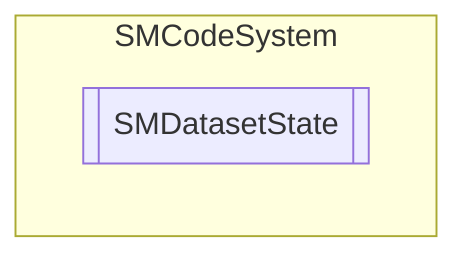

# SMDatasetState `Public enum`

## Description
SMCode dataset states enumeration.

## Diagram

## Details
### Summary
SMCode dataset states enumeration.

### Fields
#### Closed
##### Summary
Closed.

#### Browse
##### Summary
Browse.

#### Insert
##### Summary
Insert.

#### Edit
##### Summary
Edit.

#### Delete
##### Summary
Delete.

#### Read
##### Summary
Read.

*Generated with* [*ModularDoc*](https://github.com/hailstorm75/ModularDoc)
