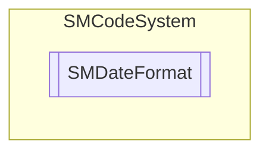

# SMDateFormat `Public enum`

## Description
SMCode date format enumeration.

## Diagram

## Details
### Summary
SMCode date format enumeration.

### Fields
#### auto
##### Summary
automatic (system) data format detection.

#### ddmmyyyy
##### Summary
dd-mm-yyyy date format (day and month 2 digits, year 4 digits).

#### mmddyyyy
##### Summary
mm-dd-yyyy date format (month and day 2 digits, year 4 digits).

#### yyyymmdd
##### Summary
yyyy-mm-dd date format (year 4 digits, month and day 2 digits).

#### ddmmyy
##### Summary
dd-mm-yy date format (day, month and year 2 digits).

#### mmddyy
##### Summary
mm-dd-yy date format (month, day and year 2 digits).

#### yymmdd
##### Summary
yy-mm-dd date format (year, month and day 2 digits).

#### dmy
##### Summary
d-m-y date format (day, month and year with all digits).

#### mdy
##### Summary
m-d-y date format (month, day and year with all digits).

#### ymd
##### Summary
y-m-d date format (year, month and day with all digits).

#### iso8601
##### Summary
yyyy-mm-dd date ISO 8601 format (year 4 digits, month and day 2 digits).

#### compact
##### Summary
yyyymmdd date format (year 4 digits, month and day 2 digits) with no separator.

*Generated with* [*ModularDoc*](https://github.com/hailstorm75/ModularDoc)
