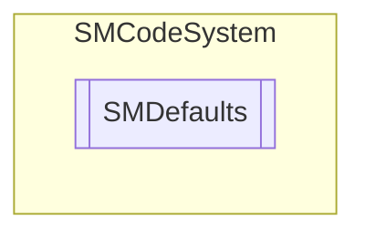

# SMDefaults `Public class`

## Description
SMCode defaults configuration static class.

## Diagram

## Details
### Summary
SMCode defaults configuration static class.

*Generated with* [*ModularDoc*](https://github.com/hailstorm75/ModularDoc)
