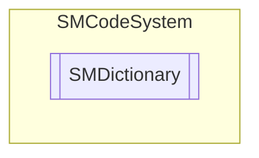

# SMDictionary `Public class`

## Description
SMCode dictionary class.

## Diagram


## Members
### Properties
#### Public  properties
| Type | Name | Methods |
| --- | --- | --- |
| `int` | [`Count`](#count)<br>Get items count. | `get` |
| `bool` | [`IgnoreCase`](#ignorecase)<br>Get or set ignore case flag. | `get, set` |
| [`SMDictionaryItem`](./smcodesystem-SMDictionaryItem) | [`Item`](#item) | `get, set` |
| `string` | [`Parameters`](#parameters)<br>Get last parameters setted. | `get, private set` |
| `bool` | [`Sorted`](#sorted)<br>Get or set sorted list. | `get, set` |

### Methods
#### Public  methods
| Returns | Name |
| --- | --- |
| `int` | [`Add`](#add-12)(`...`)<br>Add dictionary item and sort collection. |
| `void` | [`Assign`](#assign)([`SMDictionary`](smcodesystem-SMDictionary) _Dictionary)<br>Assign instance properties from another. |
| `bool` | [`BoolOf`](#boolof)(`string` _Key, `bool` _Default)<br>Return boolean value of first items with passed key.<br>            Return default value if not found. |
| `void` | [`Clear`](#clear)()<br>Clear item. |
| `DateTime` | [`DateOf`](#dateof)(`string` _Key, `Nullable`&lt;`DateTime`&gt; _Default) |
| `int` | [`Find`](#find)(`string` _Key)<br>Find first item with passed key. It possible to indicate <br>            if search must be binary otherwise sequential. <br>            Return item index or -1 if not found. |
| `bool` | [`FromCSV`](#fromcsv)(`string` _Value)<br>Load dictionary from CSV string. |
| `bool` | [`FromJSON`](#fromjson)(`string` _Value)<br>Load dictionary from JSON string. |
| `bool` | [`FromJSON64`](#fromjson64)(`string` _Value)<br>Load dictionary from base 64 JSON string. |
| `bool` | [`FromParameters`](#fromparameters)(`string` _Value)<br>Load dictionary from parameters string "key1=value1; ... keyN=valueN;". |
| `string` | [`Get`](#get)(`string` _Key, `string` _Default)<br>Return value of first items with passed key.<br>            Return default string if not found. |
| [`SMDictionaryItem`](./smcodesystem-SMDictionaryItem) | [`GetItem`](#getitem)(`string` _Key, `bool` _NewIfNotFound)<br>Return item by key or null if not found. |
| `int` | [`IntOf`](#intof)(`string` _Key, `int` _Default)<br>Return integer value of first items with passed key.<br>            Return default value if not found. |
| `string` | [`Keys`](#keys)(`string` _Quote, `string` _Separator)<br>Return keys list as a string with separator and quote specified. |
| `void` | [`Merge`](#merge)([`SMDictionary`](smcodesystem-SMDictionary) _Dictionary)<br>Merge to current dictionary items from another. |
| `int` | [`Set`](#set-15)(`...`)<br>Set key item to string value, and tag. |
| `int` | [`Sort`](#sort)(`bool` _AppendOnSortedList)<br>Sort list. |
| `object` | [`TagOf`](#tagof)(`string` _Key)<br>Return tag of first items with passed key.<br>            Return null if not found. |
| `string` | [`ToCSV`](#tocsv)()<br>Return item to CSV string. |
| `string` | [`ToJSON`](#tojson)()<br>Return item to JSON string. |
| `string` | [`ToJSON64`](#tojson64)()<br>Return item to base 64 JSON string. |
| `string` | [`ToParameters`](#toparameters)()<br>Return parameters prompt string. |
| `string` | [`ValueOf`](#valueof)(`string` _Key, `string` _Default)<br>Return value of first items with passed key.<br>            Return default string if not found. |

## Details
### Summary
SMCode dictionary class.

### Constructors
#### SMDictionary [1/4]
```csharp
public SMDictionary(SMCode _SM)
```
##### Arguments
| Type | Name | Description |
| --- | --- | --- |
| [`SMCode`](./smcodesystem-SMCode) | _SM |   |

##### Summary
Class constructor.

#### SMDictionary [2/4]
```csharp
public SMDictionary(SMDictionary _Dictionary, SMCode _SM)
```
##### Arguments
| Type | Name | Description |
| --- | --- | --- |
| [`SMDictionary`](smcodesystem-SMDictionary) | _Dictionary |   |
| [`SMCode`](./smcodesystem-SMCode) | _SM |   |

##### Summary
Class constructor.

#### SMDictionary [3/4]
```csharp
public SMDictionary(string _JSON, SMCode _SM)
```
##### Arguments
| Type | Name | Description |
| --- | --- | --- |
| `string` | _JSON |   |
| [`SMCode`](./smcodesystem-SMCode) | _SM |   |

##### Summary
Class constructor.

#### SMDictionary [4/4]
```csharp
public SMDictionary(string[] _KeyValueArray, SMCode _SM)
```
##### Arguments
| Type | Name | Description |
| --- | --- | --- |
| `string``[]` | _KeyValueArray |   |
| [`SMCode`](./smcodesystem-SMCode) | _SM |   |

##### Summary
Class constructor.

### Methods
#### Add [1/2]
```csharp
public int Add(SMDictionaryItem _DictionaryItem)
```
##### Arguments
| Type | Name | Description |
| --- | --- | --- |
| [`SMDictionaryItem`](./smcodesystem-SMDictionaryItem) | _DictionaryItem |   |

##### Summary
Add dictionary item and sort collection.

#### Add [2/2]
```csharp
public int Add(string _Key, string _Value, object _Tag)
```
##### Arguments
| Type | Name | Description |
| --- | --- | --- |
| `string` | _Key |   |
| `string` | _Value |   |
| `object` | _Tag |   |

##### Summary
Add dictionary item and sort collection.

#### Assign
```csharp
public void Assign(SMDictionary _Dictionary)
```
##### Arguments
| Type | Name | Description |
| --- | --- | --- |
| [`SMDictionary`](smcodesystem-SMDictionary) | _Dictionary |   |

##### Summary
Assign instance properties from another.

#### BoolOf
```csharp
public bool BoolOf(string _Key, bool _Default)
```
##### Arguments
| Type | Name | Description |
| --- | --- | --- |
| `string` | _Key |   |
| `bool` | _Default |   |

##### Summary
Return boolean value of first items with passed key.
            Return default value if not found.

#### Clear
```csharp
public void Clear()
```
##### Summary
Clear item.

#### DateOf
```csharp
public DateTime DateOf(string _Key, Nullable<DateTime> _Default)
```
##### Arguments
| Type | Name | Description |
| --- | --- | --- |
| `string` | _Key |   |
| `Nullable`&lt;`DateTime`&gt; | _Default |   |

#### Find
```csharp
public int Find(string _Key)
```
##### Arguments
| Type | Name | Description |
| --- | --- | --- |
| `string` | _Key |   |

##### Summary
Find first item with passed key. It possible to indicate 
            if search must be binary otherwise sequential. 
            Return item index or -1 if not found.

#### FromParameters
```csharp
public bool FromParameters(string _Value)
```
##### Arguments
| Type | Name | Description |
| --- | --- | --- |
| `string` | _Value |   |

##### Summary
Load dictionary from parameters string "key1=value1; ... keyN=valueN;".

#### FromCSV
```csharp
public bool FromCSV(string _Value)
```
##### Arguments
| Type | Name | Description |
| --- | --- | --- |
| `string` | _Value |   |

##### Summary
Load dictionary from CSV string.

#### FromJSON
```csharp
public bool FromJSON(string _Value)
```
##### Arguments
| Type | Name | Description |
| --- | --- | --- |
| `string` | _Value |   |

##### Summary
Load dictionary from JSON string.

#### FromJSON64
```csharp
public bool FromJSON64(string _Value)
```
##### Arguments
| Type | Name | Description |
| --- | --- | --- |
| `string` | _Value |   |

##### Summary
Load dictionary from base 64 JSON string.

#### Get
```csharp
public string Get(string _Key, string _Default)
```
##### Arguments
| Type | Name | Description |
| --- | --- | --- |
| `string` | _Key |   |
| `string` | _Default |   |

##### Summary
Return value of first items with passed key.
            Return default string if not found.

#### GetItem
```csharp
public SMDictionaryItem GetItem(string _Key, bool _NewIfNotFound)
```
##### Arguments
| Type | Name | Description |
| --- | --- | --- |
| `string` | _Key |   |
| `bool` | _NewIfNotFound |   |

##### Summary
Return item by key or null if not found.

#### IntOf
```csharp
public int IntOf(string _Key, int _Default)
```
##### Arguments
| Type | Name | Description |
| --- | --- | --- |
| `string` | _Key |   |
| `int` | _Default |   |

##### Summary
Return integer value of first items with passed key.
            Return default value if not found.

#### Keys
```csharp
public string Keys(string _Quote, string _Separator)
```
##### Arguments
| Type | Name | Description |
| --- | --- | --- |
| `string` | _Quote |   |
| `string` | _Separator |   |

##### Summary
Return keys list as a string with separator and quote specified.

#### Merge
```csharp
public void Merge(SMDictionary _Dictionary)
```
##### Arguments
| Type | Name | Description |
| --- | --- | --- |
| [`SMDictionary`](smcodesystem-SMDictionary) | _Dictionary |   |

##### Summary
Merge to current dictionary items from another.

#### Set [1/5]
```csharp
public int Set(string _Key, string _Value, object _Tag)
```
##### Arguments
| Type | Name | Description |
| --- | --- | --- |
| `string` | _Key |   |
| `string` | _Value |   |
| `object` | _Tag |   |

##### Summary
Set key item to string value, and tag.

#### Set [2/5]
```csharp
public int Set(string _Key, bool _Value, object _Tag)
```
##### Arguments
| Type | Name | Description |
| --- | --- | --- |
| `string` | _Key |   |
| `bool` | _Value |   |
| `object` | _Tag |   |

##### Summary
Set key item to boolean value, and tag.

#### Set [3/5]
```csharp
public int Set(string _Key, int _Value, object _Tag)
```
##### Arguments
| Type | Name | Description |
| --- | --- | --- |
| `string` | _Key |   |
| `int` | _Value |   |
| `object` | _Tag |   |

##### Summary
Set key item to integer value, and tag.

#### Set [4/5]
```csharp
public int Set(string _Key, DateTime _Value, object _Tag)
```
##### Arguments
| Type | Name | Description |
| --- | --- | --- |
| `string` | _Key |   |
| `DateTime` | _Value |   |
| `object` | _Tag |   |

##### Summary
Set key item to datetime value, and tag.

#### Set [5/5]
```csharp
public void Set(SMDictionary _Dictionary)
```
##### Arguments
| Type | Name | Description |
| --- | --- | --- |
| [`SMDictionary`](smcodesystem-SMDictionary) | _Dictionary |   |

##### Summary
Set dictionary keys with passed dictionary values.

#### Sort
```csharp
public int Sort(bool _AppendOnSortedList)
```
##### Arguments
| Type | Name | Description |
| --- | --- | --- |
| `bool` | _AppendOnSortedList |   |

##### Summary
Sort list.

#### TagOf
```csharp
public object TagOf(string _Key)
```
##### Arguments
| Type | Name | Description |
| --- | --- | --- |
| `string` | _Key |   |

##### Summary
Return tag of first items with passed key.
            Return null if not found.

#### ToCSV
```csharp
public string ToCSV()
```
##### Summary
Return item to CSV string.

#### ToJSON
```csharp
public string ToJSON()
```
##### Summary
Return item to JSON string.

#### ToJSON64
```csharp
public string ToJSON64()
```
##### Summary
Return item to base 64 JSON string.

#### ToParameters
```csharp
public string ToParameters()
```
##### Summary
Return parameters prompt string.

#### ValueOf
```csharp
public string ValueOf(string _Key, string _Default)
```
##### Arguments
| Type | Name | Description |
| --- | --- | --- |
| `string` | _Key |   |
| `string` | _Default |   |

##### Summary
Return value of first items with passed key.
            Return default string if not found.

### Properties
#### Item
```csharp
public SMDictionaryItem Item { get; set; }
```

#### Parameters
```csharp
public string Parameters { get; private set; }
```
##### Summary
Get last parameters setted.

#### Count
```csharp
public int Count { get; }
```
##### Summary
Get items count.

#### IgnoreCase
```csharp
public bool IgnoreCase { get; set; }
```
##### Summary
Get or set ignore case flag.

#### Sorted
```csharp
public bool Sorted { get; set; }
```
##### Summary
Get or set sorted list.

*Generated with* [*ModularDoc*](https://github.com/hailstorm75/ModularDoc)
