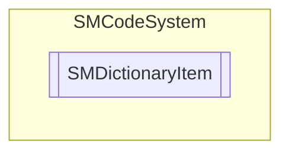

# SMDictionaryItem `Public class`

## Description
SMCode dictionary item class.

## Diagram


## Members
### Properties
#### Public  properties
| Type | Name | Methods |
| --- | --- | --- |
| `string` | [`Key`](#key)<br>Get or set item key. | `get, set` |
| `object` | [`Tag`](#tag)<br>Get or set item tag object. | `get, set` |
| `string` | [`Value`](#value)<br>Get or set item value. | `get, set` |

### Methods
#### Public  methods
| Returns | Name |
| --- | --- |
| `void` | [`Assign`](#assign)([`SMDictionaryItem`](smcodesystem-SMDictionaryItem) _DictionaryItem)<br>Assign instance properties from another. |
| `void` | [`Clear`](#clear)()<br>Clear item. |
| `int` | [`Compare`](#compare)([`SMDictionaryItem`](smcodesystem-SMDictionaryItem) _DictionaryItem)<br>Compare this dictionary item instance with passed. |

## Details
### Summary
SMCode dictionary item class.

### Constructors
#### SMDictionaryItem [1/3]
```csharp
public SMDictionaryItem()
```
##### Summary
Class constructor.

#### SMDictionaryItem [2/3]
```csharp
public SMDictionaryItem(SMDictionaryItem _DictionaryItem)
```
##### Arguments
| Type | Name | Description |
| --- | --- | --- |
| [`SMDictionaryItem`](smcodesystem-SMDictionaryItem) | _DictionaryItem |   |

##### Summary
Class constructor.

#### SMDictionaryItem [3/3]
```csharp
public SMDictionaryItem(string _Key, string _Value, object _Tag)
```
##### Arguments
| Type | Name | Description |
| --- | --- | --- |
| `string` | _Key |   |
| `string` | _Value |   |
| `object` | _Tag |   |

##### Summary
Class constructor.

### Methods
#### Assign
```csharp
public void Assign(SMDictionaryItem _DictionaryItem)
```
##### Arguments
| Type | Name | Description |
| --- | --- | --- |
| [`SMDictionaryItem`](smcodesystem-SMDictionaryItem) | _DictionaryItem |   |

##### Summary
Assign instance properties from another.

#### Clear
```csharp
public void Clear()
```
##### Summary
Clear item.

#### Compare
```csharp
public int Compare(SMDictionaryItem _DictionaryItem)
```
##### Arguments
| Type | Name | Description |
| --- | --- | --- |
| [`SMDictionaryItem`](smcodesystem-SMDictionaryItem) | _DictionaryItem |   |

##### Summary
Compare this dictionary item instance with passed.

### Properties
#### Key
```csharp
public string Key { get; set; }
```
##### Summary
Get or set item key.

#### Value
```csharp
public string Value { get; set; }
```
##### Summary
Get or set item value.

#### Tag
```csharp
public object Tag { get; set; }
```
##### Summary
Get or set item tag object.

*Generated with* [*ModularDoc*](https://github.com/hailstorm75/ModularDoc)
