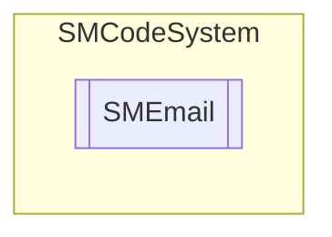

# SMEmail `Public class`

## Description
E-mail management class.

## Diagram


## Members
### Properties
#### Public  properties
| Type | Name | Methods |
| --- | --- | --- |
| [`SMSmtpAccount`](./smcodesystem-SMSmtpAccount) | [`Account`](#account)<br>SMTP account. | `get, private set` |
| `List`&lt;`string`&gt; | [`Bcc`](#bcc)<br>Get or set blind-mail cc addresses. | `get, set` |
| `List`&lt;`string`&gt; | [`Cc`](#cc)<br>Get or set cc addresses. | `get, private set` |
| `string` | [`From`](#from)<br>Get or set email from address. | `get, set` |
| `string` | [`To`](#to)<br>Get or set email to address. | `get, set` |

### Methods
#### Public  methods
| Returns | Name |
| --- | --- |
| `bool` | [`Send`](#send-12)(`...`) |

## Details
### Summary
E-mail management class.

### Constructors
#### SMEmail
```csharp
public SMEmail(SMCode _SM)
```
##### Arguments
| Type | Name | Description |
| --- | --- | --- |
| [`SMCode`](./smcodesystem-SMCode) | _SM |   |

##### Summary
Class constructor.

### Methods
#### Send [1/2]
```csharp
public bool Send(string _Host, string _From, string _To, string _CC, string _BCC, string _Subject, string _Body, Nullable<bool> _Html, string[] _Attachments, string _User, string _Password, int _Port, bool _SSL)
```
##### Arguments
| Type | Name | Description |
| --- | --- | --- |
| `string` | _Host |   |
| `string` | _From |   |
| `string` | _To |   |
| `string` | _CC |   |
| `string` | _BCC |   |
| `string` | _Subject |   |
| `string` | _Body |   |
| `Nullable`&lt;`bool`&gt; | _Html |   |
| `string``[]` | _Attachments |   |
| `string` | _User |   |
| `string` | _Password |   |
| `int` | _Port |   |
| `bool` | _SSL |   |

#### Send [2/2]
```csharp
public bool Send(string _From, string _To, string _CC, string _BCC, string _Subject, string _Body, Nullable<bool> _Html, string[] _Attachments)
```
##### Arguments
| Type | Name | Description |
| --- | --- | --- |
| `string` | _From |   |
| `string` | _To |   |
| `string` | _CC |   |
| `string` | _BCC |   |
| `string` | _Subject |   |
| `string` | _Body |   |
| `Nullable`&lt;`bool`&gt; | _Html |   |
| `string``[]` | _Attachments |   |

### Properties
#### Account
```csharp
public SMSmtpAccount Account { get; private set; }
```
##### Summary
SMTP account.

#### From
```csharp
public string From { get; set; }
```
##### Summary
Get or set email from address.

#### To
```csharp
public string To { get; set; }
```
##### Summary
Get or set email to address.

#### Cc
```csharp
public List<string> Cc { get; private set; }
```
##### Summary
Get or set cc addresses.

#### Bcc
```csharp
public List<string> Bcc { get; set; }
```
##### Summary
Get or set blind-mail cc addresses.

*Generated with* [*ModularDoc*](https://github.com/hailstorm75/ModularDoc)
