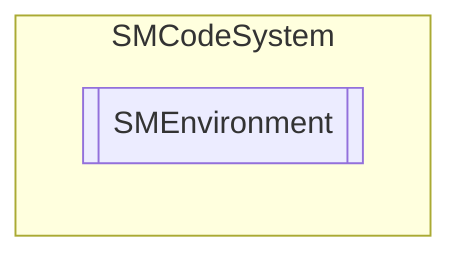

# SMEnvironment `Public enum`

## Description
SMCode .NET environment enumeration.

## Diagram

## Details
### Summary
SMCode .NET environment enumeration.

### Fields
#### Unknown
##### Summary
Unknown.

#### NetFramework45
##### Summary
.Net Framework 4.5.

#### NetFramework46
##### Summary
.Net Framework 4.6.

#### NetFramework47
##### Summary
.Net Framework 4.7.

#### NetFramework48
##### Summary
.Net Framework 4.8.

#### Net6
##### Summary
.Net 6.

#### Net7
##### Summary
.Net 7.

#### Net8
##### Summary
.Net 8.

*Generated with* [*ModularDoc*](https://github.com/hailstorm75/ModularDoc)
