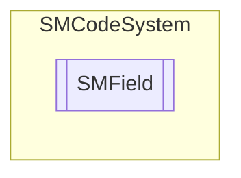

# SMField `Public class`

## Description
SMCode fields management class.

## Diagram


## Members
### Properties
#### Public  properties
| Type | Name | Methods |
| --- | --- | --- |
| `string` | [`Description`](#description)<br>Get or set field description. | `get, set` |
| `string` | [`Field`](#field)<br>Get or set field name. | `get, set` |
| `string` | [`Format`](#format)<br>Get or set field value format. | `get, set` |
| `string` | [`Informations`](#informations)<br>Get or set field informations. | `get, set` |
| `List`&lt;[`SMField`](smcodesystem-SMField)&gt; | [`Items`](#items)<br>Sub items. | `get, set` |
| `Nullable`&lt;`int`&gt; | [`Length`](#length)<br>Field value max length. | `get, set` |
| `string` | [`Options`](#options)<br>Get or set field options. | `get, set` |
| `bool` | [`Required`](#required)<br>Get or set required flag. | `get, set` |
| `string` | [`Type`](#type)<br>Get or set field name. | `get, set` |
| `object` | [`Value`](#value)<br>Get or set field name. | `get, set` |

### Methods
#### Public  methods
| Returns | Name |
| --- | --- |
| `void` | [`Assign`](#assign)([`SMField`](smcodesystem-SMField) _Field)<br>Assign instance properties from another. |
| `void` | [`Clear`](#clear)()<br>Clear item. |
| `bool` | [`FromJSON`](#fromjson)(`string` _JSON)<br>Assign property from JSON serialization. |
| `string` | [`ToJSON`](#tojson)()<br>Return JSON serialization of instance. |

## Details
### Summary
SMCode fields management class.

### Constructors
#### SMField
```csharp
public SMField()
```

### Methods
#### Assign
```csharp
public void Assign(SMField _Field)
```
##### Arguments
| Type | Name | Description |
| --- | --- | --- |
| [`SMField`](smcodesystem-SMField) | _Field |   |

##### Summary
Assign instance properties from another.

#### Clear
```csharp
public void Clear()
```
##### Summary
Clear item.

#### FromJSON
```csharp
public bool FromJSON(string _JSON)
```
##### Arguments
| Type | Name | Description |
| --- | --- | --- |
| `string` | _JSON |   |

##### Summary
Assign property from JSON serialization.

#### ToJSON
```csharp
public string ToJSON()
```
##### Summary
Return JSON serialization of instance.

### Properties
#### Description
```csharp
public string Description { get; set; }
```
##### Summary
Get or set field description.

#### Field
```csharp
public string Field { get; set; }
```
##### Summary
Get or set field name.

#### Format
```csharp
public string Format { get; set; }
```
##### Summary
Get or set field value format.

#### Informations
```csharp
public string Informations { get; set; }
```
##### Summary
Get or set field informations.

#### Items
```csharp
public List<SMField> Items { get; set; }
```
##### Summary
Sub items.

#### Length
```csharp
public Nullable<int> Length { get; set; }
```
##### Summary
Field value max length.

#### Options
```csharp
public string Options { get; set; }
```
##### Summary
Get or set field options.

#### Required
```csharp
public bool Required { get; set; }
```
##### Summary
Get or set required flag.

#### Type
```csharp
public string Type { get; set; }
```
##### Summary
Get or set field name.

#### Value
```csharp
public object Value { get; set; }
```
##### Summary
Get or set field name.

*Generated with* [*ModularDoc*](https://github.com/hailstorm75/ModularDoc)
