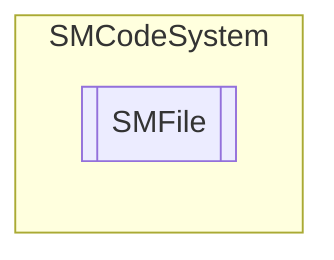

# SMFile `Public class`

## Description
SMCode file management class.

## Diagram


## Members
### Properties
#### Public  properties
| Type | Name | Methods |
| --- | --- | --- |
| `bool` | [`Active`](#active)<br>Get if file is opened. | `get` |
| `byte``[]` | [`Buffer`](#buffer)<br>Get or set bytes buffer. | `get, set` |
| `bool` | [`EOF`](#eof)<br>Get EOF state. | `get` |
| [`SMFileMode`](./smcodesystem-SMFileMode) | [`Mode`](#mode)<br>Get file open mode. | `get, private set` |
| `string` | [`NewLine`](#newline)<br>Get or set new line chars sequence. | `get, set` |
| `long` | [`Offset`](#offset)<br>Get record offset position or -1 if closed. | `get, private set` |
| `string` | [`Path`](#path)<br>Get file full path. | `get, private set` |
| `StreamReader` | [`Reader`](#reader)<br>Get stream reader. | `get, private set` |
| `int` | [`RecordLength`](#recordlength)<br>Get or set record length (for random access file). | `get, set` |
| `FileStream` | [`Stream`](#stream)<br>Get random access stream. | `get, private set` |
| `string` | [`Text`](#text)<br>Get readed file text. | `get, private set` |
| `Encoding` | [`TextEncoding`](#textencoding)<br>Get or set text encoding (defauls is ASCII). | `get, set` |
| `StreamWriter` | [`Writer`](#writer)<br>Get stream writer. | `get, private set` |

### Methods
#### Public  methods
| Returns | Name |
| --- | --- |
| `bool` | [`Close`](#close)()<br>Close file. |
| `bool` | [`Flush`](#flush)()<br>Write all direct access file buffered data and clear buffers. |
| `bool` | [`Get`](#get)(`long` _RecordPosition)<br>Get content of record at position (random access file) and store it in buffer <br>            and text property if encoding property specified. Return true if succeed. |
| `bool` | [`Open`](#open-14)(`...`)<br>Open file with mode, retrying default times. Return true if succeed. |
| `bool` | [`Position`](#position)(`long` _RecordPosition, `int` _RecordLength)<br>Set random access file stream position at begin of record with length in bytes specified. Return true if succeed. |
| `bool` | [`Put`](#put-12)(`...`)<br>Put current buffer content in to record at position of random access file. Return true if succeed. |
| `int` | [`Read`](#read)()<br>Read next char of file. Return text length or -1 if fail. |
| `int` | [`ReadAll`](#readall)()<br>Read all file and store it in text property. Return text length or -1 if fail. |
| `int` | [`ReadLine`](#readline)()<br>Read a line of file and store it in text property. Return text length or -1 if fail. |
| `string` | [`TimeStamp`](#timestamp-13)(`...`)<br>Return timestamp for files. |
| `bool` | [`Write`](#write)(`string` _String)<br>Write string to file. |
| `bool` | [`WriteLine`](#writeline)(`string` _String)<br>Write string terminated with newline sequence on file. |

## Details
### Summary
SMCode file management class.

### Constructors
#### SMFile
```csharp
public SMFile(SMCode _SM)
```
##### Arguments
| Type | Name | Description |
| --- | --- | --- |
| [`SMCode`](./smcodesystem-SMCode) | _SM |   |

##### Summary
Class constructor.

### Methods
#### Close
```csharp
public bool Close()
```
##### Summary
Close file.

#### Flush
```csharp
public bool Flush()
```
##### Summary
Write all direct access file buffered data and clear buffers.

#### Get
```csharp
public bool Get(long _RecordPosition)
```
##### Arguments
| Type | Name | Description |
| --- | --- | --- |
| `long` | _RecordPosition |   |

##### Summary
Get content of record at position (random access file) and store it in buffer 
            and text property if encoding property specified. Return true if succeed.

#### Open [1/4]
```csharp
public bool Open(string _FileName, SMFileMode _Mode)
```
##### Arguments
| Type | Name | Description |
| --- | --- | --- |
| `string` | _FileName |   |
| [`SMFileMode`](./smcodesystem-SMFileMode) | _Mode |   |

##### Summary
Open file with mode, retrying default times. Return true if succeed.

#### Open [2/4]
```csharp
public bool Open(string _FileName, int _RecordLength)
```
##### Arguments
| Type | Name | Description |
| --- | --- | --- |
| `string` | _FileName |   |
| `int` | _RecordLength |   |

##### Summary
Open file with random access and record length specified. Return true if succeed.

#### Open [3/4]
```csharp
public bool Open(string _FileName, SMFileMode _Mode, Encoding _Encoding, int _Retry)
```
##### Arguments
| Type | Name | Description |
| --- | --- | --- |
| `string` | _FileName |   |
| [`SMFileMode`](./smcodesystem-SMFileMode) | _Mode |   |
| `Encoding` | _Encoding |   |
| `int` | _Retry |   |

##### Summary
Open file with mode with retries. Return true if succeed.

#### Open [4/4]
```csharp
public bool Open(string _FileName, SMFileMode _Mode, Encoding _Encoding)
```
##### Arguments
| Type | Name | Description |
| --- | --- | --- |
| `string` | _FileName |   |
| [`SMFileMode`](./smcodesystem-SMFileMode) | _Mode |   |
| `Encoding` | _Encoding |   |

##### Summary
Open file with mode and encoding. Return true if succeed.

#### Position
```csharp
public bool Position(long _RecordPosition, int _RecordLength)
```
##### Arguments
| Type | Name | Description |
| --- | --- | --- |
| `long` | _RecordPosition |   |
| `int` | _RecordLength |   |

##### Summary
Set random access file stream position at begin of record with length in bytes specified. Return true if succeed.

#### Put [1/2]
```csharp
public bool Put(long _RecordPosition)
```
##### Arguments
| Type | Name | Description |
| --- | --- | --- |
| `long` | _RecordPosition |   |

##### Summary
Put current buffer content in to record at position of random access file. Return true if succeed.

#### Put [2/2]
```csharp
public bool Put(long _RecordPosition, string _Text)
```
##### Arguments
| Type | Name | Description |
| --- | --- | --- |
| `long` | _RecordPosition |   |
| `string` | _Text |   |

##### Summary
Put passed text in to record at position of random access file. Return true if succeed.

#### Read
```csharp
public int Read()
```
##### Summary
Read next char of file. Return text length or -1 if fail.

#### ReadAll
```csharp
public int ReadAll()
```
##### Summary
Read all file and store it in text property. Return text length or -1 if fail.

#### ReadLine
```csharp
public int ReadLine()
```
##### Summary
Read a line of file and store it in text property. Return text length or -1 if fail.

#### TimeStamp [1/3]
```csharp
public string TimeStamp(DateTime _DateTime)
```
##### Arguments
| Type | Name | Description |
| --- | --- | --- |
| `DateTime` | _DateTime |   |

##### Summary
Return timestamp for files.

#### TimeStamp [2/3]
```csharp
public string TimeStamp(string _FileName)
```
##### Arguments
| Type | Name | Description |
| --- | --- | --- |
| `string` | _FileName |   |

##### Summary
Return file name with timestamp.

#### TimeStamp [3/3]
```csharp
public string TimeStamp(string _FileName, DateTime _DateTime)
```
##### Arguments
| Type | Name | Description |
| --- | --- | --- |
| `string` | _FileName |   |
| `DateTime` | _DateTime |   |

##### Summary
Return file name with timestamp.

#### Write
```csharp
public bool Write(string _String)
```
##### Arguments
| Type | Name | Description |
| --- | --- | --- |
| `string` | _String |   |

##### Summary
Write string to file.

#### WriteLine
```csharp
public bool WriteLine(string _String)
```
##### Arguments
| Type | Name | Description |
| --- | --- | --- |
| `string` | _String |   |

##### Summary
Write string terminated with newline sequence on file.

### Properties
#### Active
```csharp
public bool Active { get; }
```
##### Summary
Get if file is opened.

#### Buffer
```csharp
public byte Buffer { get; set; }
```
##### Summary
Get or set bytes buffer.

#### TextEncoding
```csharp
public Encoding TextEncoding { get; set; }
```
##### Summary
Get or set text encoding (defauls is ASCII).

#### EOF
```csharp
public bool EOF { get; }
```
##### Summary
Get EOF state.

#### Mode
```csharp
public SMFileMode Mode { get; private set; }
```
##### Summary
Get file open mode.

#### NewLine
```csharp
public string NewLine { get; set; }
```
##### Summary
Get or set new line chars sequence.

#### Offset
```csharp
public long Offset { get; private set; }
```
##### Summary
Get record offset position or -1 if closed.

#### Path
```csharp
public string Path { get; private set; }
```
##### Summary
Get file full path.

#### Reader
```csharp
public StreamReader Reader { get; private set; }
```
##### Summary
Get stream reader.

#### RecordLength
```csharp
public int RecordLength { get; set; }
```
##### Summary
Get or set record length (for random access file).

#### Stream
```csharp
public FileStream Stream { get; private set; }
```
##### Summary
Get random access stream.

#### Text
```csharp
public string Text { get; private set; }
```
##### Summary
Get readed file text.

#### Writer
```csharp
public StreamWriter Writer { get; private set; }
```
##### Summary
Get stream writer.

*Generated with* [*ModularDoc*](https://github.com/hailstorm75/ModularDoc)
