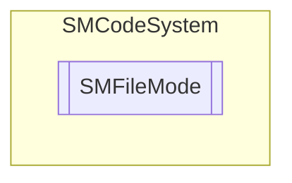

# SMFileMode `Public enum`

## Description
SMCode file mode enumeration.

## Diagram

## Details
### Summary
SMCode file mode enumeration.

### Fields
#### None
##### Summary
None.

#### Read
##### Summary
Open read mode.

#### Write
##### Summary
Open write mode.

#### Append
##### Summary
Open append mode.

#### RandomAccess
##### Summary
Random access (read/write) mode.

*Generated with* [*ModularDoc*](https://github.com/hailstorm75/ModularDoc)
