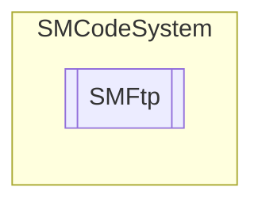

# SMFtp `Public class`

## Description
FTP management functions.

## Diagram


## Members
### Methods
#### Public  methods
| Returns | Name |
| --- | --- |
| `bool` | [`Delete`](#delete-13)(`...`)<br>Delete remote file on default FTP account server. |
| `bool` | [`Download`](#download-13)(`...`)<br>Download remote file from default FTP account and save it in to local file.<br>            Returns true if succeed. |
| `List`&lt;`string`&gt; | [`List`](#list-13)(`...`)<br>Returns a string list filled of file names on default FTP account server and located in full remote path. |
| `bool` | [`Rename`](#rename-13)(`...`)<br>Rename remote file on default FTP account server. |
| `bool` | [`Upload`](#upload-13)(`...`)<br>Upload local file to default FTP account and save it in to full remote path.<br>            Returns true if succeed. |

## Details
### Summary
FTP management functions.

### Constructors
#### SMFtp
```csharp
public SMFtp(SMCode _SM)
```
##### Arguments
| Type | Name | Description |
| --- | --- | --- |
| [`SMCode`](./smcodesystem-SMCode) | _SM |   |

##### Summary
Class constructor.

### Methods
#### Download [1/3]
```csharp
public bool Download(string _FullRemotePath, string _LocalFile, SMOnProgress _ProgressFunction)
```
##### Arguments
| Type | Name | Description |
| --- | --- | --- |
| `string` | _FullRemotePath |   |
| `string` | _LocalFile |   |
| [`SMOnProgress`](./smcodesystem-SMOnProgress) | _ProgressFunction |   |

##### Summary
Download remote file from default FTP account and save it in to local file.
            Returns true if succeed.

#### Download [2/3]
```csharp
public bool Download(string _FullRemotePath, string _LocalFile, SMFtpAccount _Account, SMOnProgress _ProgressFunction)
```
##### Arguments
| Type | Name | Description |
| --- | --- | --- |
| `string` | _FullRemotePath |   |
| `string` | _LocalFile |   |
| [`SMFtpAccount`](./smcodesystem-SMFtpAccount) | _Account |   |
| [`SMOnProgress`](./smcodesystem-SMOnProgress) | _ProgressFunction |   |

##### Summary
Download remote file from FTP account and save it in to local file.
            Returns true if succeed.

#### Download [3/3]
```csharp
public bool Download(string _FullRemotePath, string _LocalFile, string _Host, string _User, string _Password, int _Port, bool _SSL, bool _Passive, bool _Binary, bool _KeepAlive, SMOnProgress _ProgressFunction)
```
##### Arguments
| Type | Name | Description |
| --- | --- | --- |
| `string` | _FullRemotePath |   |
| `string` | _LocalFile |   |
| `string` | _Host |   |
| `string` | _User |   |
| `string` | _Password |   |
| `int` | _Port |   |
| `bool` | _SSL |   |
| `bool` | _Passive |   |
| `bool` | _Binary |   |
| `bool` | _KeepAlive |   |
| [`SMOnProgress`](./smcodesystem-SMOnProgress) | _ProgressFunction |   |

##### Summary
Download remote file from FTP host and save it in to local file.
            Login to FTP is done with user and password. If progress event function specified 
            progress readed bytes count will be passed. Returns true if succeed.

#### Upload [1/3]
```csharp
public bool Upload(string _LocalFile, string _FullRemotePath, SMOnProgress _ProgressFunction)
```
##### Arguments
| Type | Name | Description |
| --- | --- | --- |
| `string` | _LocalFile |   |
| `string` | _FullRemotePath |   |
| [`SMOnProgress`](./smcodesystem-SMOnProgress) | _ProgressFunction |   |

##### Summary
Upload local file to default FTP account and save it in to full remote path.
            Returns true if succeed.

#### Upload [2/3]
```csharp
public bool Upload(string _LocalFile, string _FullRemotePath, SMFtpAccount _Account, SMOnProgress _ProgressFunction)
```
##### Arguments
| Type | Name | Description |
| --- | --- | --- |
| `string` | _LocalFile |   |
| `string` | _FullRemotePath |   |
| [`SMFtpAccount`](./smcodesystem-SMFtpAccount) | _Account |   |
| [`SMOnProgress`](./smcodesystem-SMOnProgress) | _ProgressFunction |   |

##### Summary
Upload local file to FTP account and save it in to full remote path.
            Returns true if succeed.

#### Upload [3/3]
```csharp
public bool Upload(string _LocalFile, string _FullRemotePath, string _Host, string _UserID, string _Password, int _Port, bool _SSL, bool _Passive, bool _Binary, bool _KeepAlive, SMOnProgress _ProgressFunction)
```
##### Arguments
| Type | Name | Description |
| --- | --- | --- |
| `string` | _LocalFile |   |
| `string` | _FullRemotePath |   |
| `string` | _Host |   |
| `string` | _UserID |   |
| `string` | _Password |   |
| `int` | _Port |   |
| `bool` | _SSL |   |
| `bool` | _Passive |   |
| `bool` | _Binary |   |
| `bool` | _KeepAlive |   |
| [`SMOnProgress`](./smcodesystem-SMOnProgress) | _ProgressFunction |   |

##### Summary
Upload local file to FTP host and save it in to full remote path.
            Login to FTP is done with user and password. If progress event function specified 
            progress percentage will be passed. Returns true if succeed.

#### List [1/3]
```csharp
public List<string> List(string _FullRemotePath)
```
##### Arguments
| Type | Name | Description |
| --- | --- | --- |
| `string` | _FullRemotePath |   |

##### Summary
Returns a string list filled of file names on default FTP account server and located in full remote path.

#### List [2/3]
```csharp
public List<string> List(SMFtpAccount _Account, string _FullRemotePath)
```
##### Arguments
| Type | Name | Description |
| --- | --- | --- |
| [`SMFtpAccount`](./smcodesystem-SMFtpAccount) | _Account |   |
| `string` | _FullRemotePath |   |

##### Summary
Returns a string list filled of file names on FTP account server and located in full remote path.

#### List [3/3]
```csharp
public List<string> List(string _FullRemotePath, string _Host, string _User, string _Password, int _Port, bool _SSL, bool _Passive, bool _Binary, bool _KeepAlive)
```
##### Arguments
| Type | Name | Description |
| --- | --- | --- |
| `string` | _FullRemotePath |   |
| `string` | _Host |   |
| `string` | _User |   |
| `string` | _Password |   |
| `int` | _Port |   |
| `bool` | _SSL |   |
| `bool` | _Passive |   |
| `bool` | _Binary |   |
| `bool` | _KeepAlive |   |

##### Summary
Returns a string list filled of file names on ftpServer, with ftpUserID and ftpPassword
            login and located in ftpFullRemotePath. Return null if fails.

#### Delete [1/3]
```csharp
public bool Delete(string _FullRemotePath)
```
##### Arguments
| Type | Name | Description |
| --- | --- | --- |
| `string` | _FullRemotePath |   |

##### Summary
Delete remote file on default FTP account server.

#### Delete [2/3]
```csharp
public bool Delete(string _FullRemotePath, SMFtpAccount _Account)
```
##### Arguments
| Type | Name | Description |
| --- | --- | --- |
| `string` | _FullRemotePath |   |
| [`SMFtpAccount`](./smcodesystem-SMFtpAccount) | _Account |   |

##### Summary
Delete remote file file on account server.

#### Delete [3/3]
```csharp
public bool Delete(string _FullRemotePath, string _Host, string _User, string _Password, int _Port, bool _SSL, bool _Passive, bool _Binary, bool _KeepAlive)
```
##### Arguments
| Type | Name | Description |
| --- | --- | --- |
| `string` | _FullRemotePath |   |
| `string` | _Host |   |
| `string` | _User |   |
| `string` | _Password |   |
| `int` | _Port |   |
| `bool` | _SSL |   |
| `bool` | _Passive |   |
| `bool` | _Binary |   |
| `bool` | _KeepAlive |   |

##### Summary
Delete remote file to server.

#### Rename [1/3]
```csharp
public bool Rename(string _FullRemotePath, string _RenameTo)
```
##### Arguments
| Type | Name | Description |
| --- | --- | --- |
| `string` | _FullRemotePath |   |
| `string` | _RenameTo |   |

##### Summary
Rename remote file on default FTP account server.

#### Rename [2/3]
```csharp
public bool Rename(string _FullRemotePath, string _RenameTo, SMFtpAccount _Account)
```
##### Arguments
| Type | Name | Description |
| --- | --- | --- |
| `string` | _FullRemotePath |   |
| `string` | _RenameTo |   |
| [`SMFtpAccount`](./smcodesystem-SMFtpAccount) | _Account |   |

##### Summary
Delete remote file on FTP account server.

#### Rename [3/3]
```csharp
public bool Rename(string _FullRemotePath, string _RenameTo, string _Host, string _User, string _Password, int _Port, bool _SSL, bool _Passive, bool _Binary, bool _KeepAlive)
```
##### Arguments
| Type | Name | Description |
| --- | --- | --- |
| `string` | _FullRemotePath |   |
| `string` | _RenameTo |   |
| `string` | _Host |   |
| `string` | _User |   |
| `string` | _Password |   |
| `int` | _Port |   |
| `bool` | _SSL |   |
| `bool` | _Passive |   |
| `bool` | _Binary |   |
| `bool` | _KeepAlive |   |

##### Summary
Rename ftpFullRemotePath file to server.

*Generated with* [*ModularDoc*](https://github.com/hailstorm75/ModularDoc)
