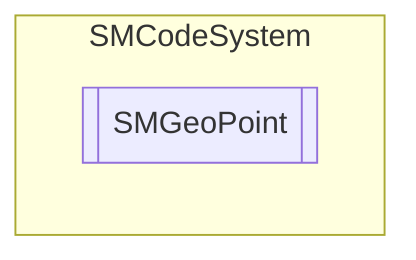

# SMGeoPoint `Public class`

## Description
SMCode maps geographical point.

## Diagram


## Members
### Properties
#### Public  properties
| Type | Name | Methods |
| --- | --- | --- |
| `double` | [`Latitude`](#latitude)<br>Get or set X coordinate. | `get, set` |
| `double` | [`Longitude`](#longitude)<br>Get or set Y coordinate. | `get, set` |

### Methods
#### Public  methods
| Returns | Name |
| --- | --- |
| `void` | [`Assign`](#assign)([`SMGeoPoint`](smcodesystem-SMGeoPoint) _Point)<br>Assign instance properties from another. |
| `void` | [`Clear`](#clear)()<br>Clear item. |
| `double` | [`DistanceTo`](#distanceto)([`SMGeoPoint`](smcodesystem-SMGeoPoint) _GeoPoint, [`SMGeoUnits`](./smcodesystem-SMGeoUnits) _Units)<br>Return distance between points. |
| `bool` | [`FromJSON`](#fromjson)(`string` _JSON)<br>Assign property from JSON serialization. |
| `bool` | [`FromJSON64`](#fromjson64)(`string` _JSON64)<br>Assign property from JSON64 serialization. |
| `string` | [`ToJSON`](#tojson)()<br>Return JSON serialization of instance. |
| `string` | [`ToJSON64`](#tojson64)([`SMCode`](./smcodesystem-SMCode) _SM)<br>Return JSON64 serialization of instance. |
| `string` | [`ToString`](#tostring)()<br>Return point as string. |

## Details
### Summary
SMCode maps geographical point.

### Constructors
#### SMGeoPoint [1/3]
```csharp
public SMGeoPoint(SMCode _SM)
```
##### Arguments
| Type | Name | Description |
| --- | --- | --- |
| [`SMCode`](./smcodesystem-SMCode) | _SM |   |

##### Summary
Class constructor.

#### SMGeoPoint [2/3]
```csharp
public SMGeoPoint(SMGeoPoint _OtherInstance, SMCode _SM)
```
##### Arguments
| Type | Name | Description |
| --- | --- | --- |
| [`SMGeoPoint`](smcodesystem-SMGeoPoint) | _OtherInstance |   |
| [`SMCode`](./smcodesystem-SMCode) | _SM |   |

##### Summary
Class constructor.

#### SMGeoPoint [3/3]
```csharp
public SMGeoPoint(double _Latidude, double _Longitude, SMCode _SM)
```
##### Arguments
| Type | Name | Description |
| --- | --- | --- |
| `double` | _Latidude |   |
| `double` | _Longitude |   |
| [`SMCode`](./smcodesystem-SMCode) | _SM |   |

##### Summary
Class constructor.

### Methods
#### Assign
```csharp
public void Assign(SMGeoPoint _Point)
```
##### Arguments
| Type | Name | Description |
| --- | --- | --- |
| [`SMGeoPoint`](smcodesystem-SMGeoPoint) | _Point |   |

##### Summary
Assign instance properties from another.

#### Clear
```csharp
public void Clear()
```
##### Summary
Clear item.

#### DistanceTo
```csharp
public double DistanceTo(SMGeoPoint _GeoPoint, SMGeoUnits _Units)
```
##### Arguments
| Type | Name | Description |
| --- | --- | --- |
| [`SMGeoPoint`](smcodesystem-SMGeoPoint) | _GeoPoint |   |
| [`SMGeoUnits`](./smcodesystem-SMGeoUnits) | _Units |   |

##### Summary
Return distance between points.

#### FromJSON
```csharp
public bool FromJSON(string _JSON)
```
##### Arguments
| Type | Name | Description |
| --- | --- | --- |
| `string` | _JSON |   |

##### Summary
Assign property from JSON serialization.

#### FromJSON64
```csharp
public bool FromJSON64(string _JSON64)
```
##### Arguments
| Type | Name | Description |
| --- | --- | --- |
| `string` | _JSON64 |   |

##### Summary
Assign property from JSON64 serialization.

#### ToJSON
```csharp
public string ToJSON()
```
##### Summary
Return JSON serialization of instance.

#### ToJSON64
```csharp
public string ToJSON64(SMCode _SM)
```
##### Arguments
| Type | Name | Description |
| --- | --- | --- |
| [`SMCode`](./smcodesystem-SMCode) | _SM |   |

##### Summary
Return JSON64 serialization of instance.

#### ToString
```csharp
public override string ToString()
```
##### Summary
Return point as string.

### Properties
#### Latitude
```csharp
public double Latitude { get; set; }
```
##### Summary
Get or set X coordinate.

#### Longitude
```csharp
public double Longitude { get; set; }
```
##### Summary
Get or set Y coordinate.

*Generated with* [*ModularDoc*](https://github.com/hailstorm75/ModularDoc)
