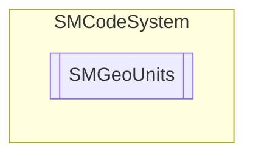

# SMGeoUnits `Public enum`

## Description
SMCode units for maps geocoordinates.

## Diagram

## Details
### Summary
SMCode units for maps geocoordinates.

### Fields
#### Meters
##### Summary
Meters.

#### Kilometers
##### Summary
Kilometers.

#### NauticalMiles
##### Summary
Nautical miles.

#### Miles
##### Summary
Miles.

*Generated with* [*ModularDoc*](https://github.com/hailstorm75/ModularDoc)
