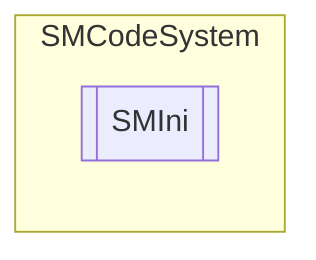

# SMIni `Public class`

## Description
SMCode INI configuration file management class.

## Diagram


## Members
### Properties
#### Public  properties
| Type | Name | Methods |
| --- | --- | --- |
| `bool` | [`Changed`](#changed)<br>Get or set INI file changed flag. | `get, set` |
| `List`&lt;`string`&gt; | [`Lines`](#lines)<br>Get configuration INI file lines collection. | `get, private set` |
| `string` | [`Password`](#password)<br>Get or set INI file encoding password. | `get, set` |
| `string` | [`Path`](#path)<br>Get or set INI file full path. | `get, set` |
| `Encoding` | [`TextEncoding`](#textencoding)<br>Get or set INI text enconding. | `get, set` |
| `bool` | [`WriteDefault`](#writedefault)<br>Get or set write default flag. | `get, set` |

### Methods
#### Public  methods
| Returns | Name |
| --- | --- |
| `void` | [`Clear`](#clear)()<br>Clear item. |
| `int` | [`Find`](#find)(`string` _Section, `string` _Key)<br>Return index of section line with key. Return -1 if not found. |
| `void` | [`FromString`](#fromstring)(`string` _String)<br>Get INI file values and content from string. |
| `bool` | [`Load`](#load)(`string` _FileName, `string` _Password)<br>Load INI file values and content from file. A password for decoding <br>            encrypted INI files can be specified. Return true if succeed. |
| `bool` | [`ReadBool`](#readbool)(`string` _Section, `string` _Key, `bool` _Default)<br>Read boolean value of key at section. Return default value if not found. |
| `DateTime` | [`ReadDateTime`](#readdatetime)(`string` _Section, `string` _Key, `DateTime` _Default)<br>Read date-time value of key at section. Return default value if not found. |
| `double` | [`ReadDouble`](#readdouble)(`string` _Section, `string` _Key, `double` _Default)<br>Read double value of key at section. Return default value if not found. |
| `string` | [`ReadHexMask`](#readhexmask)(`string` _Section, `string` _Key, `string` _Default)<br>Read hex masked value of key at section. Return default value if not found. |
| `int` | [`ReadInteger`](#readinteger)(`string` _Section, `string` _Key, `int` _Default)<br>Read integer value of key at section. Return default value if not found. |
| `string` | [`ReadString`](#readstring)(`string` _Section, `string` _Key, `string` _Default)<br>Read string value of key at section. Return default value if not found. |
| `bool` | [`Save`](#save-12)(`...`)<br>Save INI file values and content to file. |
| `string` | [`ToString`](#tostring)()<br>Return INI file values and content as string. |
| `int` | [`WriteBool`](#writebool)(`string` _Section, `string` _Key, `bool` _Value)<br>Write double value of key at section. Return line index if success otherwise -1. |
| `int` | [`WriteDateTime`](#writedatetime)(`string` _Section, `string` _Key, `DateTime` _Value)<br>Write double value of key at section. Return line index if success otherwise -1. |
| `int` | [`WriteDouble`](#writedouble)(`string` _Section, `string` _Key, `double` _Value)<br>Write double value of key at section. Return line index if success otherwise -1. |
| `int` | [`WriteHexMask`](#writehexmask)(`string` _Section, `string` _Key, `string` _Value)<br>Write hex masked value of key at section. Return line index if success otherwise -1. |
| `int` | [`WriteInteger`](#writeinteger)(`string` _Section, `string` _Key, `int` _Value)<br>Write integer value of key at section. Return line index if success otherwise -1. |
| `int` | [`WriteString`](#writestring)(`string` _Section, `string` _Key, `string` _Value)<br>Write string value of key at section. Return line index if success otherwise -1. |

## Details
### Summary
SMCode INI configuration file management class.

### Constructors
#### SMIni [1/3]
```csharp
public SMIni(SMCode _SM)
```
##### Arguments
| Type | Name | Description |
| --- | --- | --- |
| [`SMCode`](./smcodesystem-SMCode) | _SM |   |

##### Summary
Class constructor.

#### SMIni [2/3]
```csharp
public SMIni(string _FileName, SMCode _SM)
```
##### Arguments
| Type | Name | Description |
| --- | --- | --- |
| `string` | _FileName |   |
| [`SMCode`](./smcodesystem-SMCode) | _SM |   |

##### Summary
Class constructor.

#### SMIni [3/3]
```csharp
public SMIni(string _FileName, string _Password, SMCode _SM)
```
##### Arguments
| Type | Name | Description |
| --- | --- | --- |
| `string` | _FileName |   |
| `string` | _Password |   |
| [`SMCode`](./smcodesystem-SMCode) | _SM |   |

##### Summary
Class constructor.

### Methods
#### Clear
```csharp
public void Clear()
```
##### Summary
Clear item.

#### Find
```csharp
public int Find(string _Section, string _Key)
```
##### Arguments
| Type | Name | Description |
| --- | --- | --- |
| `string` | _Section |   |
| `string` | _Key |   |

##### Summary
Return index of section line with key. Return -1 if not found.

#### FromString
```csharp
public void FromString(string _String)
```
##### Arguments
| Type | Name | Description |
| --- | --- | --- |
| `string` | _String |   |

##### Summary
Get INI file values and content from string.

#### Load
```csharp
public bool Load(string _FileName, string _Password)
```
##### Arguments
| Type | Name | Description |
| --- | --- | --- |
| `string` | _FileName |   |
| `string` | _Password |   |

##### Summary
Load INI file values and content from file. A password for decoding 
            encrypted INI files can be specified. Return true if succeed.

#### ReadString
```csharp
public string ReadString(string _Section, string _Key, string _Default)
```
##### Arguments
| Type | Name | Description |
| --- | --- | --- |
| `string` | _Section |   |
| `string` | _Key |   |
| `string` | _Default |   |

##### Summary
Read string value of key at section. Return default value if not found.

#### ReadBool
```csharp
public bool ReadBool(string _Section, string _Key, bool _Default)
```
##### Arguments
| Type | Name | Description |
| --- | --- | --- |
| `string` | _Section |   |
| `string` | _Key |   |
| `bool` | _Default |   |

##### Summary
Read boolean value of key at section. Return default value if not found.

#### ReadDateTime
```csharp
public DateTime ReadDateTime(string _Section, string _Key, DateTime _Default)
```
##### Arguments
| Type | Name | Description |
| --- | --- | --- |
| `string` | _Section |   |
| `string` | _Key |   |
| `DateTime` | _Default |   |

##### Summary
Read date-time value of key at section. Return default value if not found.

#### ReadDouble
```csharp
public double ReadDouble(string _Section, string _Key, double _Default)
```
##### Arguments
| Type | Name | Description |
| --- | --- | --- |
| `string` | _Section |   |
| `string` | _Key |   |
| `double` | _Default |   |

##### Summary
Read double value of key at section. Return default value if not found.

#### ReadHexMask
```csharp
public string ReadHexMask(string _Section, string _Key, string _Default)
```
##### Arguments
| Type | Name | Description |
| --- | --- | --- |
| `string` | _Section |   |
| `string` | _Key |   |
| `string` | _Default |   |

##### Summary
Read hex masked value of key at section. Return default value if not found.

#### ReadInteger
```csharp
public int ReadInteger(string _Section, string _Key, int _Default)
```
##### Arguments
| Type | Name | Description |
| --- | --- | --- |
| `string` | _Section |   |
| `string` | _Key |   |
| `int` | _Default |   |

##### Summary
Read integer value of key at section. Return default value if not found.

#### Save [1/2]
```csharp
public bool Save(string _FileName)
```
##### Arguments
| Type | Name | Description |
| --- | --- | --- |
| `string` | _FileName |   |

##### Summary
Save INI file values and content to file.

#### Save [2/2]
```csharp
public bool Save()
```
##### Summary
Save INI file values and content to file.

#### ToString
```csharp
public override string ToString()
```
##### Summary
Return INI file values and content as string.

#### WriteString
```csharp
public int WriteString(string _Section, string _Key, string _Value)
```
##### Arguments
| Type | Name | Description |
| --- | --- | --- |
| `string` | _Section |   |
| `string` | _Key |   |
| `string` | _Value |   |

##### Summary
Write string value of key at section. Return line index if success otherwise -1.

#### WriteBool
```csharp
public int WriteBool(string _Section, string _Key, bool _Value)
```
##### Arguments
| Type | Name | Description |
| --- | --- | --- |
| `string` | _Section |   |
| `string` | _Key |   |
| `bool` | _Value |   |

##### Summary
Write double value of key at section. Return line index if success otherwise -1.

#### WriteDateTime
```csharp
public int WriteDateTime(string _Section, string _Key, DateTime _Value)
```
##### Arguments
| Type | Name | Description |
| --- | --- | --- |
| `string` | _Section |   |
| `string` | _Key |   |
| `DateTime` | _Value |   |

##### Summary
Write double value of key at section. Return line index if success otherwise -1.

#### WriteDouble
```csharp
public int WriteDouble(string _Section, string _Key, double _Value)
```
##### Arguments
| Type | Name | Description |
| --- | --- | --- |
| `string` | _Section |   |
| `string` | _Key |   |
| `double` | _Value |   |

##### Summary
Write double value of key at section. Return line index if success otherwise -1.

#### WriteHexMask
```csharp
public int WriteHexMask(string _Section, string _Key, string _Value)
```
##### Arguments
| Type | Name | Description |
| --- | --- | --- |
| `string` | _Section |   |
| `string` | _Key |   |
| `string` | _Value |   |

##### Summary
Write hex masked value of key at section. Return line index if success otherwise -1.

#### WriteInteger
```csharp
public int WriteInteger(string _Section, string _Key, int _Value)
```
##### Arguments
| Type | Name | Description |
| --- | --- | --- |
| `string` | _Section |   |
| `string` | _Key |   |
| `int` | _Value |   |

##### Summary
Write integer value of key at section. Return line index if success otherwise -1.

### Properties
#### Changed
```csharp
public bool Changed { get; set; }
```
##### Summary
Get or set INI file changed flag.

#### TextEncoding
```csharp
public Encoding TextEncoding { get; set; }
```
##### Summary
Get or set INI text enconding.

#### Lines
```csharp
public List<string> Lines { get; private set; }
```
##### Summary
Get configuration INI file lines collection.

#### Password
```csharp
public string Password { get; set; }
```
##### Summary
Get or set INI file encoding password.

#### Path
```csharp
public string Path { get; set; }
```
##### Summary
Get or set INI file full path.

#### WriteDefault
```csharp
public bool WriteDefault { get; set; }
```
##### Summary
Get or set write default flag.

*Generated with* [*ModularDoc*](https://github.com/hailstorm75/ModularDoc)
