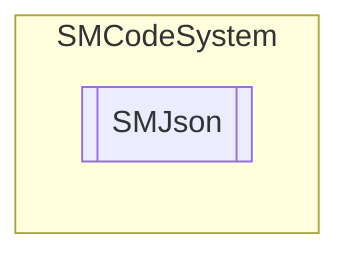

# SMJson `Public class`

## Description
SMCode JSON class.

## Diagram


## Members
### Properties
#### Public  properties
| Type | Name | Methods |
| --- | --- | --- |
| `JsonDocument` | [`Document`](#document)<br>Get JSON document. | `get, private set` |
| `JsonElement` | [`Root`](#root)<br>Get JSON root element. | `get, private set` |

### Methods
#### Public  methods
| Returns | Name |
| --- | --- |
| `void` | [`Assign`](#assign)([`SMJson`](smcodesystem-SMJson) _JSON)<br>Assign instance properties from another. |
| `void` | [`Clear`](#clear)()<br>Clear item. |
| `bool` | [`FromObject`](#fromobject)(`object` _Object)<br>Load JSON from serializing object. |
| `bool` | [`FromString`](#fromstring)(`string` _Json)<br>Load JSON from string. |
| `string` | [`Get`](#get)(`string` _KeyPath, `string` _Default, `bool` _RaiseException)<br>Return JSON document property as string. Properties tree can be specified with : or . or &gt; separator. |
| `bool` | [`GetBool`](#getbool)(`string` _KeyPath, `bool` _Default, `bool` _RaiseException)<br>Return JSON document property as boolean. |
| `DateTime` | [`GetDate`](#getdate)(`string` _KeyPath, `bool` _IncludeTime, `Nullable`&lt;`DateTime`&gt; _Default, `bool` _RaiseException) |
| `double` | [`GetDouble`](#getdouble)(`string` _KeyPath, `double` _Default, `bool` _RaiseException)<br>Return JSON document property as double. |
| `int` | [`GetInt`](#getint)(`string` _KeyPath, `int` _Default, `bool` _RaiseException)<br>Return JSON document property as integer. |
| `long` | [`GetLong`](#getlong)(`string` _KeyPath, `long` _Default, `bool` _RaiseException)<br>Return JSON document property as long. |
| `void` | [`InitializeInstance`](#initializeinstance)()<br>Initialize instance. |
| `bool` | [`Load`](#load)(`string` _FilePath)<br>Load JSON from file. |
| `bool` | [`Save`](#save)(`string` _FilePath, `bool` _Indented)<br>Save JSON to file. |
| `string` | [`ToBase64`](#tobase64)()<br>Return base 64 encoded JSON string. |
| `object` | [`ToObject`](#toobject)(`Type` _ReturnType, `bool` _Indented)<br>Return document as object. |
| `string` | [`ToString`](#tostring-12)(`...`)<br>Return document as JSON string. |

## Details
### Summary
SMCode JSON class.

### Constructors
#### SMJson [1/3]
```csharp
public SMJson(SMCode _SM)
```
##### Arguments
| Type | Name | Description |
| --- | --- | --- |
| [`SMCode`](./smcodesystem-SMCode) | _SM |   |

##### Summary
Class constructor.

#### SMJson [2/3]
```csharp
public SMJson(string _FilePath, SMCode _SM)
```
##### Arguments
| Type | Name | Description |
| --- | --- | --- |
| `string` | _FilePath |   |
| [`SMCode`](./smcodesystem-SMCode) | _SM |   |

##### Summary
Class constructor.

#### SMJson [3/3]
```csharp
public SMJson(SMJson _OtherInstance, SMCode _SM)
```
##### Arguments
| Type | Name | Description |
| --- | --- | --- |
| [`SMJson`](smcodesystem-SMJson) | _OtherInstance |   |
| [`SMCode`](./smcodesystem-SMCode) | _SM |   |

##### Summary
Class constructor.

### Methods
#### InitializeInstance
```csharp
public void InitializeInstance()
```
##### Summary
Initialize instance.

#### Assign
```csharp
public void Assign(SMJson _JSON)
```
##### Arguments
| Type | Name | Description |
| --- | --- | --- |
| [`SMJson`](smcodesystem-SMJson) | _JSON |   |

##### Summary
Assign instance properties from another.

#### Clear
```csharp
public void Clear()
```
##### Summary
Clear item.

#### Get
```csharp
public string Get(string _KeyPath, string _Default, bool _RaiseException)
```
##### Arguments
| Type | Name | Description |
| --- | --- | --- |
| `string` | _KeyPath |   |
| `string` | _Default |   |
| `bool` | _RaiseException |   |

##### Summary
Return JSON document property as string. Properties tree can be specified with : or . or &gt; separator.

#### GetBool
```csharp
public bool GetBool(string _KeyPath, bool _Default, bool _RaiseException)
```
##### Arguments
| Type | Name | Description |
| --- | --- | --- |
| `string` | _KeyPath |   |
| `bool` | _Default |   |
| `bool` | _RaiseException |   |

##### Summary
Return JSON document property as boolean.

#### GetDate
```csharp
public DateTime GetDate(string _KeyPath, bool _IncludeTime, Nullable<DateTime> _Default, bool _RaiseException)
```
##### Arguments
| Type | Name | Description |
| --- | --- | --- |
| `string` | _KeyPath |   |
| `bool` | _IncludeTime |   |
| `Nullable`&lt;`DateTime`&gt; | _Default |   |
| `bool` | _RaiseException |   |

#### GetDouble
```csharp
public double GetDouble(string _KeyPath, double _Default, bool _RaiseException)
```
##### Arguments
| Type | Name | Description |
| --- | --- | --- |
| `string` | _KeyPath |   |
| `double` | _Default |   |
| `bool` | _RaiseException |   |

##### Summary
Return JSON document property as double.

#### GetInt
```csharp
public int GetInt(string _KeyPath, int _Default, bool _RaiseException)
```
##### Arguments
| Type | Name | Description |
| --- | --- | --- |
| `string` | _KeyPath |   |
| `int` | _Default |   |
| `bool` | _RaiseException |   |

##### Summary
Return JSON document property as integer.

#### GetLong
```csharp
public long GetLong(string _KeyPath, long _Default, bool _RaiseException)
```
##### Arguments
| Type | Name | Description |
| --- | --- | --- |
| `string` | _KeyPath |   |
| `long` | _Default |   |
| `bool` | _RaiseException |   |

##### Summary
Return JSON document property as long.

#### FromObject
```csharp
public bool FromObject(object _Object)
```
##### Arguments
| Type | Name | Description |
| --- | --- | --- |
| `object` | _Object |   |

##### Summary
Load JSON from serializing object.

#### FromString
```csharp
public bool FromString(string _Json)
```
##### Arguments
| Type | Name | Description |
| --- | --- | --- |
| `string` | _Json |   |

##### Summary
Load JSON from string.

#### Load
```csharp
public bool Load(string _FilePath)
```
##### Arguments
| Type | Name | Description |
| --- | --- | --- |
| `string` | _FilePath |   |

##### Summary
Load JSON from file.

#### Save
```csharp
public bool Save(string _FilePath, bool _Indented)
```
##### Arguments
| Type | Name | Description |
| --- | --- | --- |
| `string` | _FilePath |   |
| `bool` | _Indented |   |

##### Summary
Save JSON to file.

#### ToBase64
```csharp
public string ToBase64()
```
##### Summary
Return base 64 encoded JSON string.

#### ToObject
```csharp
public object ToObject(Type _ReturnType, bool _Indented)
```
##### Arguments
| Type | Name | Description |
| --- | --- | --- |
| `Type` | _ReturnType |   |
| `bool` | _Indented |   |

##### Summary
Return document as object.

#### ToString [1/2]
```csharp
public override string ToString()
```
##### Summary
Return document as JSON string.

#### ToString [2/2]
```csharp
public string ToString(bool _Indented)
```
##### Arguments
| Type | Name | Description |
| --- | --- | --- |
| `bool` | _Indented |   |

##### Summary
Return document as JSON string.

### Properties
#### Document
```csharp
public JsonDocument Document { get; private set; }
```
##### Summary
Get JSON document.

#### Root
```csharp
public JsonElement Root { get; private set; }
```
##### Summary
Get JSON root element.

*Generated with* [*ModularDoc*](https://github.com/hailstorm75/ModularDoc)
