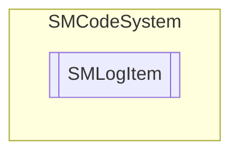

# SMLogItem `Public class`

## Description
SMCode log item class.

## Diagram


## Members
### Properties
#### Public  properties
| Type | Name | Methods |
| --- | --- | --- |
| `string` | [`Action`](#action)<br>Get or set log action value. | `get, set` |
| `string` | [`Application`](#application)<br>Get or set log application name value. | `get, set` |
| `DateTime` | [`DateTime`](#datetime)<br>Get or set log date-time value. | `get, set` |
| `string` | [`Details`](#details)<br>Get or set log details value. | `get, set` |
| `int` | [`IdUser`](#iduser)<br>Get or set user id. | `get, set` |
| [`SMLogType`](./smcodesystem-SMLogType) | [`LogType`](#logtype)<br>Get or set log type value. | `get, set` |
| `string` | [`Message`](#message)<br>Get or set log message value. | `get, set` |
| `object` | [`Tag`](#tag)<br>Get or set object tag. | `get, set` |
| `string` | [`UidUser`](#uiduser)<br>Get or set user Uid. | `get, set` |
| `string` | [`Version`](#version)<br>Get or set log application version value. | `get, set` |

### Methods
#### Public  methods
| Returns | Name |
| --- | --- |
| `void` | [`Assign`](#assign)([`SMLogItem`](smcodesystem-SMLogItem) _LogItem)<br>Assign instance properties from another. |
| `void` | [`Clear`](#clear)()<br>Clear item. |
| `bool` | [`FromJSON`](#fromjson)(`string` _JSON)<br>Assign property from JSON serialization. |
| `bool` | [`FromJSON64`](#fromjson64)(`string` _JSON64)<br>Assign property from JSON64 serialization. |
| `string` | [`ToJSON`](#tojson)()<br>Return JSON serialization of instance. |
| `string` | [`ToJSON64`](#tojson64)()<br>Return JSON64 serialization of instance. |
| `string` | [`ToString`](#tostring-12)(`...`)<br>Return log item as full description string. |

## Details
### Summary
SMCode log item class.

### Constructors
#### SMLogItem [1/3]
```csharp
public SMLogItem(SMCode _SM)
```
##### Arguments
| Type | Name | Description |
| --- | --- | --- |
| [`SMCode`](./smcodesystem-SMCode) | _SM |   |

##### Summary
Class constructor.

#### SMLogItem [2/3]
```csharp
public SMLogItem(SMLogItem _LogItem, SMCode _SM)
```
##### Arguments
| Type | Name | Description |
| --- | --- | --- |
| [`SMLogItem`](smcodesystem-SMLogItem) | _LogItem |   |
| [`SMCode`](./smcodesystem-SMCode) | _SM |   |

##### Summary
Class constructor.

#### SMLogItem [3/3]
```csharp
public SMLogItem(DateTime _Date, SMLogType _Type, string _Message, string _Details, string _Action, SMCode _SM)
```
##### Arguments
| Type | Name | Description |
| --- | --- | --- |
| `DateTime` | _Date |   |
| [`SMLogType`](./smcodesystem-SMLogType) | _Type |   |
| `string` | _Message |   |
| `string` | _Details |   |
| `string` | _Action |   |
| [`SMCode`](./smcodesystem-SMCode) | _SM |   |

##### Summary
Class constructor.

### Methods
#### Assign
```csharp
public void Assign(SMLogItem _LogItem)
```
##### Arguments
| Type | Name | Description |
| --- | --- | --- |
| [`SMLogItem`](smcodesystem-SMLogItem) | _LogItem |   |

##### Summary
Assign instance properties from another.

#### Clear
```csharp
public void Clear()
```
##### Summary
Clear item.

#### FromJSON
```csharp
public bool FromJSON(string _JSON)
```
##### Arguments
| Type | Name | Description |
| --- | --- | --- |
| `string` | _JSON |   |

##### Summary
Assign property from JSON serialization.

#### FromJSON64
```csharp
public bool FromJSON64(string _JSON64)
```
##### Arguments
| Type | Name | Description |
| --- | --- | --- |
| `string` | _JSON64 |   |

##### Summary
Assign property from JSON64 serialization.

#### ToJSON
```csharp
public string ToJSON()
```
##### Summary
Return JSON serialization of instance.

#### ToJSON64
```csharp
public string ToJSON64()
```
##### Summary
Return JSON64 serialization of instance.

#### ToString [1/2]
```csharp
public override string ToString()
```
##### Summary
Return log item as full description string.

#### ToString [2/2]
```csharp
public string ToString(bool _FlatString)
```
##### Arguments
| Type | Name | Description |
| --- | --- | --- |
| `bool` | _FlatString |   |

##### Summary
Return log item as full description string.

### Properties
#### DateTime
```csharp
public DateTime DateTime { get; set; }
```
##### Summary
Get or set log date-time value.

#### Application
```csharp
public string Application { get; set; }
```
##### Summary
Get or set log application name value.

#### Version
```csharp
public string Version { get; set; }
```
##### Summary
Get or set log application version value.

#### IdUser
```csharp
public int IdUser { get; set; }
```
##### Summary
Get or set user id.

#### UidUser
```csharp
public string UidUser { get; set; }
```
##### Summary
Get or set user Uid.

#### LogType
```csharp
public SMLogType LogType { get; set; }
```
##### Summary
Get or set log type value.

#### Action
```csharp
public string Action { get; set; }
```
##### Summary
Get or set log action value.

#### Message
```csharp
public string Message { get; set; }
```
##### Summary
Get or set log message value.

#### Details
```csharp
public string Details { get; set; }
```
##### Summary
Get or set log details value.

#### Tag
```csharp
public object Tag { get; set; }
```
##### Summary
Get or set object tag.

*Generated with* [*ModularDoc*](https://github.com/hailstorm75/ModularDoc)
