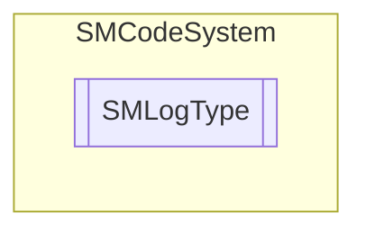

# SMLogType `Public enum`

## Description
SMCode log type enumeration.

## Diagram

## Details
### Summary
SMCode log type enumeration.

### Fields
#### None
##### Summary
None.

#### Information
##### Summary
Information.

#### Warning
##### Summary
Warning.

#### Error
##### Summary
Error.

#### Debug
##### Summary
Debug error.

#### Separator
##### Summary
Separator.

#### Line
##### Summary
Line.

#### Login
##### Summary
Login.

#### Event
##### Summary
Event.

#### Action
##### Summary
Action.

*Generated with* [*ModularDoc*](https://github.com/hailstorm75/ModularDoc)
