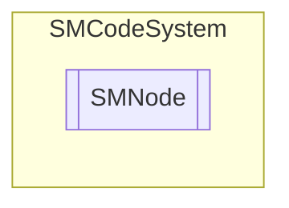

# SMNode `Public class`

## Description
SMCode node item class.

## Diagram


## Members
### Properties
#### Public  properties
| Type | Name | Methods |
| --- | --- | --- |
| `List`&lt;[`SMNode`](smcodesystem-SMNode)&gt; | [`Childs`](#childs)<br>Child nodes collection. | `get, private set` |
| `int` | [`Heuristic`](#heuristic)<br>Get or set heuristic value assigned to node. | `get, set` |
| `string` | [`Key`](#key)<br>Get or set item key. | `get, set` |
| [`SMNode`](smcodesystem-SMNode) | [`Parent`](#parent)<br>Get or set item parent. | `get, set` |
| `object` | [`Tag`](#tag)<br>Get or set item tag object. | `get, set` |
| `string` | [`Value`](#value)<br>Get or set item value. | `get, set` |

### Methods
#### Public  methods
| Returns | Name |
| --- | --- |
| `void` | [`Assign`](#assign)([`SMNode`](smcodesystem-SMNode) _Node)<br>Assign instance properties from another. |
| `void` | [`Clear`](#clear)()<br>Clear item. |
| [`SMNode`](smcodesystem-SMNode) | [`Find`](#find)(`string` _Key, `bool` _Recursive)<br>Return node with key. |
| [`SMNode`](smcodesystem-SMNode) | [`FindHeuristic`](#findheuristic)(`int` _Value, `bool` _Recursive)<br>Return node with heuristic value. |

## Details
### Summary
SMCode node item class.

### Constructors
#### SMNode [1/3]
```csharp
public SMNode()
```
##### Summary
Class constructor.

#### SMNode [2/3]
```csharp
public SMNode(SMNode _Node)
```
##### Arguments
| Type | Name | Description |
| --- | --- | --- |
| [`SMNode`](smcodesystem-SMNode) | _Node |   |

##### Summary
Class constructor.

#### SMNode [3/3]
```csharp
public SMNode(SMNode _Parent, string _Key, string _Value, object _Tag)
```
##### Arguments
| Type | Name | Description |
| --- | --- | --- |
| [`SMNode`](smcodesystem-SMNode) | _Parent |   |
| `string` | _Key |   |
| `string` | _Value |   |
| `object` | _Tag |   |

##### Summary
Class constructor.

### Methods
#### Assign
```csharp
public void Assign(SMNode _Node)
```
##### Arguments
| Type | Name | Description |
| --- | --- | --- |
| [`SMNode`](smcodesystem-SMNode) | _Node |   |

##### Summary
Assign instance properties from another.

#### Clear
```csharp
public void Clear()
```
##### Summary
Clear item.

#### Find
```csharp
public SMNode Find(string _Key, bool _Recursive)
```
##### Arguments
| Type | Name | Description |
| --- | --- | --- |
| `string` | _Key |   |
| `bool` | _Recursive |   |

##### Summary
Return node with key.

#### FindHeuristic
```csharp
public SMNode FindHeuristic(int _Value, bool _Recursive)
```
##### Arguments
| Type | Name | Description |
| --- | --- | --- |
| `int` | _Value |   |
| `bool` | _Recursive |   |

##### Summary
Return node with heuristic value.

### Properties
#### Heuristic
```csharp
public int Heuristic { get; set; }
```
##### Summary
Get or set heuristic value assigned to node.

#### Key
```csharp
public string Key { get; set; }
```
##### Summary
Get or set item key.

#### Childs
```csharp
public List<SMNode> Childs { get; private set; }
```
##### Summary
Child nodes collection.

#### Parent
```csharp
public SMNode Parent { get; set; }
```
##### Summary
Get or set item parent.

#### Tag
```csharp
public object Tag { get; set; }
```
##### Summary
Get or set item tag object.

#### Value
```csharp
public string Value { get; set; }
```
##### Summary
Get or set item value.

*Generated with* [*ModularDoc*](https://github.com/hailstorm75/ModularDoc)
