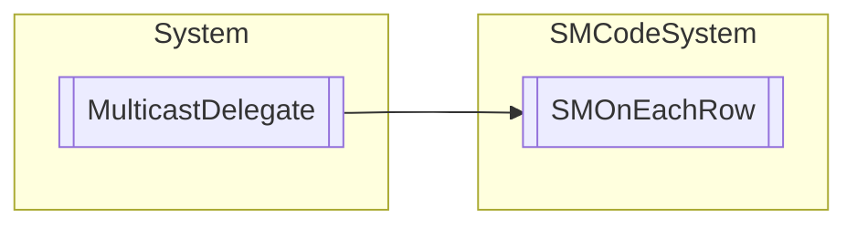

# SMOnEachRow `Public class`

## Description
SMCode delegate method for on each row event.

## Diagram


## Members
### Methods
#### Public  methods
| Returns | Name |
| --- | --- |
| `IAsyncResult` | [`BeginInvoke`](#begininvoke)([`SMDataset`](./smcodesystem-SMDataset) _Dataset, ref `bool` _Stop, `AsyncCallback` callback, `object` object) |
| `void` | [`EndInvoke`](#endinvoke)(ref `bool` _Stop, `IAsyncResult` result) |
| `void` | [`Invoke`](#invoke)([`SMDataset`](./smcodesystem-SMDataset) _Dataset, ref `bool` _Stop) |

## Details
### Summary
SMCode delegate method for on each row event.

### Inheritance
 - `MulticastDelegate`

### Constructors
#### SMOnEachRow
```csharp
public SMOnEachRow(object object, IntPtr method)
```
##### Arguments
| Type | Name | Description |
| --- | --- | --- |
| `object` | object |   |
| `IntPtr` | method |   |

### Methods
#### Invoke
```csharp
public virtual void Invoke(SMDataset _Dataset, ref bool _Stop)
```
##### Arguments
| Type | Name | Description |
| --- | --- | --- |
| [`SMDataset`](./smcodesystem-SMDataset) | _Dataset |   |
| `ref` `bool` | _Stop |   |

#### BeginInvoke
```csharp
public virtual IAsyncResult BeginInvoke(SMDataset _Dataset, ref bool _Stop, AsyncCallback callback, object object)
```
##### Arguments
| Type | Name | Description |
| --- | --- | --- |
| [`SMDataset`](./smcodesystem-SMDataset) | _Dataset |   |
| `ref` `bool` | _Stop |   |
| `AsyncCallback` | callback |   |
| `object` | object |   |

#### EndInvoke
```csharp
public virtual void EndInvoke(ref bool _Stop, IAsyncResult result)
```
##### Arguments
| Type | Name | Description |
| --- | --- | --- |
| `ref` `bool` | _Stop |   |
| `IAsyncResult` | result |   |

*Generated with* [*ModularDoc*](https://github.com/hailstorm75/ModularDoc)
