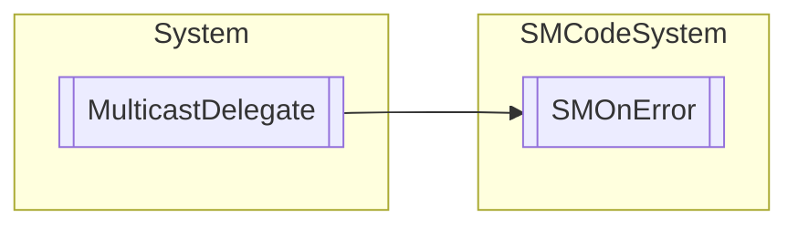

# SMOnError `Public class`

## Description
Delegate method for error event.

## Diagram


## Members
### Methods
#### Public  methods
| Returns | Name |
| --- | --- |
| `IAsyncResult` | [`BeginInvoke`](#begininvoke)(`string` _ErrorMessage, `Exception` _Exception, `AsyncCallback` callback, `object` object) |
| `int` | [`EndInvoke`](#endinvoke)(`IAsyncResult` result) |
| `int` | [`Invoke`](#invoke)(`string` _ErrorMessage, `Exception` _Exception) |

## Details
### Summary
Delegate method for error event.

### Inheritance
 - `MulticastDelegate`

### Constructors
#### SMOnError
```csharp
public SMOnError(object object, IntPtr method)
```
##### Arguments
| Type | Name | Description |
| --- | --- | --- |
| `object` | object |   |
| `IntPtr` | method |   |

### Methods
#### Invoke
```csharp
public virtual int Invoke(string _ErrorMessage, Exception _Exception)
```
##### Arguments
| Type | Name | Description |
| --- | --- | --- |
| `string` | _ErrorMessage |   |
| `Exception` | _Exception |   |

#### BeginInvoke
```csharp
public virtual IAsyncResult BeginInvoke(string _ErrorMessage, Exception _Exception, AsyncCallback callback, object object)
```
##### Arguments
| Type | Name | Description |
| --- | --- | --- |
| `string` | _ErrorMessage |   |
| `Exception` | _Exception |   |
| `AsyncCallback` | callback |   |
| `object` | object |   |

#### EndInvoke
```csharp
public virtual int EndInvoke(IAsyncResult result)
```
##### Arguments
| Type | Name | Description |
| --- | --- | --- |
| `IAsyncResult` | result |   |

*Generated with* [*ModularDoc*](https://github.com/hailstorm75/ModularDoc)
