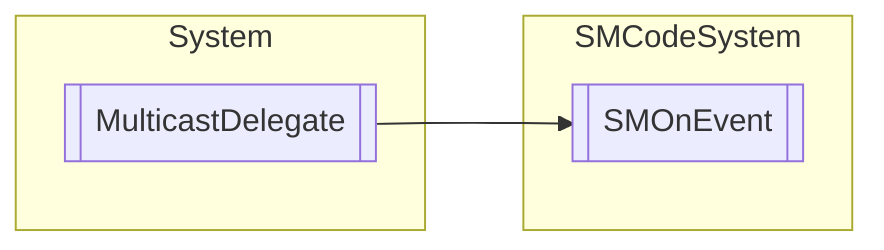

# SMOnEvent `Public class`

## Description
Delegate method for generic event.

## Diagram


## Members
### Methods
#### Public  methods
| Returns | Name |
| --- | --- |
| `IAsyncResult` | [`BeginInvoke`](#begininvoke)(`object` _Sender, `object` _Parameters, `AsyncCallback` callback, `object` object) |
| `void` | [`EndInvoke`](#endinvoke)(`IAsyncResult` result) |
| `void` | [`Invoke`](#invoke)(`object` _Sender, `object` _Parameters) |

## Details
### Summary
Delegate method for generic event.

### Inheritance
 - `MulticastDelegate`

### Constructors
#### SMOnEvent
```csharp
public SMOnEvent(object object, IntPtr method)
```
##### Arguments
| Type | Name | Description |
| --- | --- | --- |
| `object` | object |   |
| `IntPtr` | method |   |

### Methods
#### Invoke
```csharp
public virtual void Invoke(object _Sender, object _Parameters)
```
##### Arguments
| Type | Name | Description |
| --- | --- | --- |
| `object` | _Sender |   |
| `object` | _Parameters |   |

#### BeginInvoke
```csharp
public virtual IAsyncResult BeginInvoke(object _Sender, object _Parameters, AsyncCallback callback, object object)
```
##### Arguments
| Type | Name | Description |
| --- | --- | --- |
| `object` | _Sender |   |
| `object` | _Parameters |   |
| `AsyncCallback` | callback |   |
| `object` | object |   |

#### EndInvoke
```csharp
public virtual void EndInvoke(IAsyncResult result)
```
##### Arguments
| Type | Name | Description |
| --- | --- | --- |
| `IAsyncResult` | result |   |

*Generated with* [*ModularDoc*](https://github.com/hailstorm75/ModularDoc)
