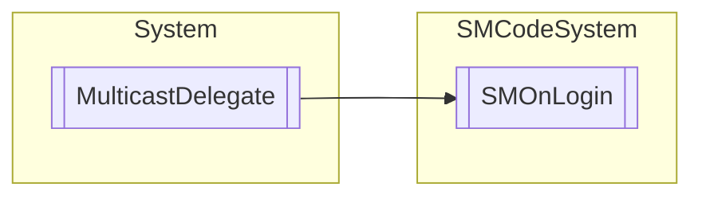

# SMOnLogin `Public class`

## Description
SMCode delegate method for login event.

## Diagram


## Members
### Methods
#### Public  methods
| Returns | Name |
| --- | --- |
| `IAsyncResult` | [`BeginInvoke`](#begininvoke)([`SMLogItem`](./smcodesystem-SMLogItem) _LogItem, [`SMUser`](./smcodesystem-SMUser) _User, ref `bool` _Validate, `AsyncCallback` callback, `object` object) |
| `void` | [`EndInvoke`](#endinvoke)(ref `bool` _Validate, `IAsyncResult` result) |
| `void` | [`Invoke`](#invoke)([`SMLogItem`](./smcodesystem-SMLogItem) _LogItem, [`SMUser`](./smcodesystem-SMUser) _User, ref `bool` _Validate) |

## Details
### Summary
SMCode delegate method for login event.

### Inheritance
 - `MulticastDelegate`

### Constructors
#### SMOnLogin
```csharp
public SMOnLogin(object object, IntPtr method)
```
##### Arguments
| Type | Name | Description |
| --- | --- | --- |
| `object` | object |   |
| `IntPtr` | method |   |

### Methods
#### Invoke
```csharp
public virtual void Invoke(SMLogItem _LogItem, SMUser _User, ref bool _Validate)
```
##### Arguments
| Type | Name | Description |
| --- | --- | --- |
| [`SMLogItem`](./smcodesystem-SMLogItem) | _LogItem |   |
| [`SMUser`](./smcodesystem-SMUser) | _User |   |
| `ref` `bool` | _Validate |   |

#### BeginInvoke
```csharp
public virtual IAsyncResult BeginInvoke(SMLogItem _LogItem, SMUser _User, ref bool _Validate, AsyncCallback callback, object object)
```
##### Arguments
| Type | Name | Description |
| --- | --- | --- |
| [`SMLogItem`](./smcodesystem-SMLogItem) | _LogItem |   |
| [`SMUser`](./smcodesystem-SMUser) | _User |   |
| `ref` `bool` | _Validate |   |
| `AsyncCallback` | callback |   |
| `object` | object |   |

#### EndInvoke
```csharp
public virtual void EndInvoke(ref bool _Validate, IAsyncResult result)
```
##### Arguments
| Type | Name | Description |
| --- | --- | --- |
| `ref` `bool` | _Validate |   |
| `IAsyncResult` | result |   |

*Generated with* [*ModularDoc*](https://github.com/hailstorm75/ModularDoc)
