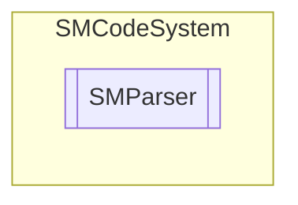

# SMParser `Public class`

## Description
SMCode formula parser class. Provide a class for expression formula evaluation.
            Variables field can store user defined variables (SMParserAtoms).

## Diagram


## Members
### Properties
#### Public  properties
| Type | Name | Methods |
| --- | --- | --- |
| `bool` | [`Error`](#error)<br>Indicates an error parsing formula. | `get, set` |
| `string` | [`ErrorMessage`](#errormessage)<br>Indicates error message parsing formula. | `get, set` |
| [`SMParserAtoms`](./smcodesystem-SMParserAtoms) | [`Variables`](#variables)<br>Collection of preassigned variables. | `get` |

### Methods
#### Public  methods
| Returns | Name |
| --- | --- |
| `double` | [`Result`](#result)(`string` _Formula)<br>Returns result for expression in formula string. |

## Details
### Summary
SMCode formula parser class. Provide a class for expression formula evaluation.
            Variables field can store user defined variables (SMParserAtoms).

### Constructors
#### SMParser
```csharp
public SMParser(SMCode _SM)
```
##### Arguments
| Type | Name | Description |
| --- | --- | --- |
| [`SMCode`](./smcodesystem-SMCode) | _SM |   |

##### Summary
Instance builder.

### Methods
#### Result
```csharp
public double Result(string _Formula)
```
##### Arguments
| Type | Name | Description |
| --- | --- | --- |
| `string` | _Formula |   |

##### Summary
Returns result for expression in formula string.

### Properties
#### Error
```csharp
public bool Error { get; set; }
```
##### Summary
Indicates an error parsing formula.

#### ErrorMessage
```csharp
public string ErrorMessage { get; set; }
```
##### Summary
Indicates error message parsing formula.

#### Variables
```csharp
public SMParserAtoms Variables { get; }
```
##### Summary
Collection of preassigned variables.

*Generated with* [*ModularDoc*](https://github.com/hailstorm75/ModularDoc)
