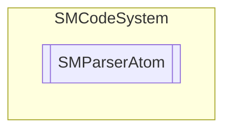

# SMParserAtom `Public class`

## Description
SMCode parser atom class.

## Diagram


## Members
### Properties
#### Public  properties
| Type | Name | Methods |
| --- | --- | --- |
| `string` | [`Name`](#name)<br>Get or set atom name. | `get, set` |
| [`SMParserAtomType`](./smcodesystem-SMParserAtomType) | [`Type`](#type)<br>Get or set atom type. | `get, set` |
| `double` | [`Value`](#value)<br>Get or set atom value. | `get, set` |

### Methods
#### Public  methods
| Returns | Name |
| --- | --- |
| `void` | [`Error`](#error)(`string` _Name)<br>Set atom error. |

## Details
### Summary
SMCode parser atom class.

### Constructors
#### SMParserAtom [1/2]
```csharp
public SMParserAtom()
```
##### Summary
Atom constructor.

#### SMParserAtom [2/2]
```csharp
public SMParserAtom(string _Name, double _Value, SMParserAtomType _Type)
```
##### Arguments
| Type | Name | Description |
| --- | --- | --- |
| `string` | _Name |   |
| `double` | _Value |   |
| [`SMParserAtomType`](./smcodesystem-SMParserAtomType) | _Type |   |

##### Summary
Atom constructor.

### Methods
#### Error
```csharp
public void Error(string _Name)
```
##### Arguments
| Type | Name | Description |
| --- | --- | --- |
| `string` | _Name |   |

##### Summary
Set atom error.

### Properties
#### Name
```csharp
public string Name { get; set; }
```
##### Summary
Get or set atom name.

#### Value
```csharp
public double Value { get; set; }
```
##### Summary
Get or set atom value.

#### Type
```csharp
public SMParserAtomType Type { get; set; }
```
##### Summary
Get or set atom type.

*Generated with* [*ModularDoc*](https://github.com/hailstorm75/ModularDoc)
