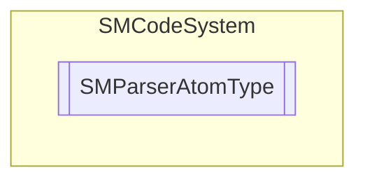

# SMParserAtomType `Public enum`

## Description
SMCode parser atom type enumeration.

## Diagram

## Details
### Summary
SMCode parser atom type enumeration.

### Fields
#### Variable
##### Summary
Variable atom.

#### Value
##### Summary
Value atom.

#### Operator
##### Summary
Operator atom.

#### Function
##### Summary
Function atom.

#### Result
##### Summary
Result atom.

#### Bracket
##### Summary
Bracket atom.

#### Comma
##### Summary
Comma atom.

#### Error
##### Summary
Error atom.

#### None
##### Summary
None atom.

*Generated with* [*ModularDoc*](https://github.com/hailstorm75/ModularDoc)
