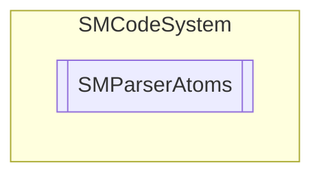

# SMParserAtoms `Public class`

## Description
SMCode parser atoms collection class.

## Diagram


## Members
### Properties
#### Public  properties
| Type | Name | Methods |
| --- | --- | --- |
| `int` | [`Count`](#count)<br>Get or set atoms count. | `get, set` |
| [`SMParserAtom`](./smcodesystem-SMParserAtom)`[]` | [`Items`](#items)<br>Get atoms array. | `get, private set` |

### Methods
#### Public  methods
| Returns | Name |
| --- | --- |
| `void` | [`Add`](#add)(`string` _Name, `double` _Value, [`SMParserAtomType`](./smcodesystem-SMParserAtomType) _Type)<br>Add atom with name, value and type. |
| `void` | [`Clear`](#clear)()<br>Reset atoms. |
| `int` | [`Find`](#find)(`string` _Name)<br>Returns index of atom with name, -1 if not found. |
| `double` | [`Get`](#get)(`string` _Name)<br>Returns value of atom with name, 0 if not found. |
| `void` | [`Set`](#set)(`string` _Name, `double` _Value)<br>Set value of atom with name. |

## Details
### Summary
SMCode parser atoms collection class.

### Constructors
#### SMParserAtoms
```csharp
public SMParserAtoms()
```
##### Summary
Atoms constructor.

### Methods
#### Add
```csharp
public void Add(string _Name, double _Value, SMParserAtomType _Type)
```
##### Arguments
| Type | Name | Description |
| --- | --- | --- |
| `string` | _Name |   |
| `double` | _Value |   |
| [`SMParserAtomType`](./smcodesystem-SMParserAtomType) | _Type |   |

##### Summary
Add atom with name, value and type.

#### Clear
```csharp
public void Clear()
```
##### Summary
Reset atoms.

#### Find
```csharp
public int Find(string _Name)
```
##### Arguments
| Type | Name | Description |
| --- | --- | --- |
| `string` | _Name |   |

##### Summary
Returns index of atom with name, -1 if not found.

#### Get
```csharp
public double Get(string _Name)
```
##### Arguments
| Type | Name | Description |
| --- | --- | --- |
| `string` | _Name |   |

##### Summary
Returns value of atom with name, 0 if not found.

#### Set
```csharp
public void Set(string _Name, double _Value)
```
##### Arguments
| Type | Name | Description |
| --- | --- | --- |
| `string` | _Name |   |
| `double` | _Value |   |

##### Summary
Set value of atom with name.

### Properties
#### Count
```csharp
public int Count { get; set; }
```
##### Summary
Get or set atoms count.

#### Items
```csharp
public SMParserAtom Items { get; private set; }
```
##### Summary
Get atoms array.

*Generated with* [*ModularDoc*](https://github.com/hailstorm75/ModularDoc)
