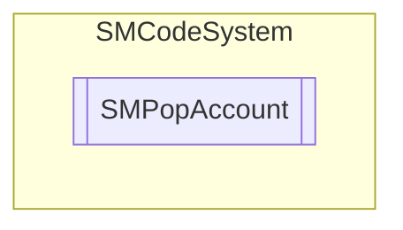

# SMPopAccount `Public class`

## Description
POP account class.

## Diagram


## Members
### Properties
#### Public  properties
| Type | Name | Methods |
| --- | --- | --- |
| `string` | [`Email`](#email)<br>Get or set POP email. | `get, set` |
| `bool` | [`Empty`](#empty)<br>Indicate if POP account is not defined. | `get` |
| `string` | [`Host`](#host)<br>Get or set POP host name. | `get, set` |
| `string` | [`Password`](#password)<br>Get or set POP password. | `get, set` |
| `int` | [`Port`](#port)<br>Get or set POP port number. | `get, set` |
| `bool` | [`SSL`](#ssl)<br>Get or set POP SSL activation flag. | `get, set` |
| `string` | [`User`](#user)<br>Get or set POP user name. | `get, set` |

### Methods
#### Public  methods
| Returns | Name |
| --- | --- |
| `void` | [`Assign`](#assign)([`SMPopAccount`](smcodesystem-SMPopAccount) _PopAccount)<br>Assign item properties from another. |
| `void` | [`Clear`](#clear)()<br>Clear item. |
| `bool` | [`FromJSON`](#fromjson)(`string` _JSON)<br>Assign property from JSON serialization. |
| `bool` | [`FromJSON64`](#fromjson64)(`string` _JSON64)<br>Assign property from JSON64 serialization. |
| `bool` | [`Load`](#load)(`string` _IniFileName)<br>Load item from ini file. Return true if succeed. |
| `bool` | [`Save`](#save)(`string` _IniFileName)<br>Save item to ini file. Return true if succeed. |
| `string` | [`ToJSON`](#tojson)()<br>Return JSON serialization of instance. |
| `string` | [`ToJSON64`](#tojson64)([`SMCode`](./smcodesystem-SMCode) _SM)<br>Return JSON64 serialization of instance. |
| `string` | [`ToString`](#tostring)()<br>Return string containing instance value. |

## Details
### Summary
POP account class.

### Constructors
#### SMPopAccount [1/3]
```csharp
public SMPopAccount(SMCode _SM)
```
##### Arguments
| Type | Name | Description |
| --- | --- | --- |
| [`SMCode`](./smcodesystem-SMCode) | _SM |   |

##### Summary
Class constructor.

#### SMPopAccount [2/3]
```csharp
public SMPopAccount(SMPopAccount _OtherInstance, SMCode _SM)
```
##### Arguments
| Type | Name | Description |
| --- | --- | --- |
| [`SMPopAccount`](smcodesystem-SMPopAccount) | _OtherInstance |   |
| [`SMCode`](./smcodesystem-SMCode) | _SM |   |

##### Summary
Class constructor.

#### SMPopAccount [3/3]
```csharp
public SMPopAccount(string _IniFileName, SMCode _SM)
```
##### Arguments
| Type | Name | Description |
| --- | --- | --- |
| `string` | _IniFileName |   |
| [`SMCode`](./smcodesystem-SMCode) | _SM |   |

##### Summary
Class constructor.

### Methods
#### Assign
```csharp
public void Assign(SMPopAccount _PopAccount)
```
##### Arguments
| Type | Name | Description |
| --- | --- | --- |
| [`SMPopAccount`](smcodesystem-SMPopAccount) | _PopAccount |   |

##### Summary
Assign item properties from another.

#### Clear
```csharp
public void Clear()
```
##### Summary
Clear item.

#### FromJSON
```csharp
public bool FromJSON(string _JSON)
```
##### Arguments
| Type | Name | Description |
| --- | --- | --- |
| `string` | _JSON |   |

##### Summary
Assign property from JSON serialization.

#### FromJSON64
```csharp
public bool FromJSON64(string _JSON64)
```
##### Arguments
| Type | Name | Description |
| --- | --- | --- |
| `string` | _JSON64 |   |

##### Summary
Assign property from JSON64 serialization.

#### Load
```csharp
public bool Load(string _IniFileName)
```
##### Arguments
| Type | Name | Description |
| --- | --- | --- |
| `string` | _IniFileName |   |

##### Summary
Load item from ini file. Return true if succeed.

#### Save
```csharp
public bool Save(string _IniFileName)
```
##### Arguments
| Type | Name | Description |
| --- | --- | --- |
| `string` | _IniFileName |   |

##### Summary
Save item to ini file. Return true if succeed.

#### ToJSON
```csharp
public string ToJSON()
```
##### Summary
Return JSON serialization of instance.

#### ToJSON64
```csharp
public string ToJSON64(SMCode _SM)
```
##### Arguments
| Type | Name | Description |
| --- | --- | --- |
| [`SMCode`](./smcodesystem-SMCode) | _SM |   |

##### Summary
Return JSON64 serialization of instance.

#### ToString
```csharp
public override string ToString()
```
##### Summary
Return string containing instance value.

### Properties
#### Empty
```csharp
public bool Empty { get; }
```
##### Summary
Indicate if POP account is not defined.

#### Host
```csharp
public string Host { get; set; }
```
##### Summary
Get or set POP host name.

#### User
```csharp
public string User { get; set; }
```
##### Summary
Get or set POP user name.

#### Password
```csharp
public string Password { get; set; }
```
##### Summary
Get or set POP password.

#### Email
```csharp
public string Email { get; set; }
```
##### Summary
Get or set POP email.

#### Port
```csharp
public int Port { get; set; }
```
##### Summary
Get or set POP port number.

#### SSL
```csharp
public bool SSL { get; set; }
```
##### Summary
Get or set POP SSL activation flag.

*Generated with* [*ModularDoc*](https://github.com/hailstorm75/ModularDoc)
