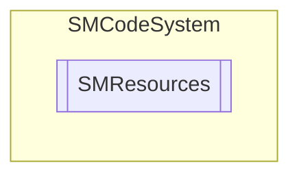

# SMResources `Public class`

## Description
SMCode resource management class.

## Diagram


## Members
### Properties
#### Public  properties
| Type | Name | Methods |
| --- | --- | --- |
| [`SMDictionary`](./smcodesystem-SMDictionary) | [`Resources`](#resources)<br>Instance embedded zip resource dictionary cache collection. | `get, private set` |
| `string` | [`ResourcesPath`](#resourcespath)<br>Internal resources zip file path. | `get, set` |

### Methods
#### Public  methods
| Returns | Name |
| --- | --- |
| `void` | [`Clear`](#clear)()<br>Clear instance. |
| `byte``[]` | [`GetBytes`](#getbytes)(`string` _ResourcePath)<br>Return byte array from cache or embedded zip resource file, corresponding to resource path. |
| `Stream` | [`GetResource`](#getresource)(`string` _ResourcePath)<br>Return object from cache or embedded zip resource file, corresponding to resource path.<br>            If resource path start by @ stream will be loaded from library\resource path. If resource<br>            path included by [] stream will be loaded from current theme resource path. |
| `string` | [`GetText`](#gettext)(`string` _ResourcePath)<br>Return text from cache or embedded zip resource file, corresponding to resource path. |

## Details
### Summary
SMCode resource management class.

### Constructors
#### SMResources [1/2]
```csharp
public SMResources(SMCode _SM)
```
##### Arguments
| Type | Name | Description |
| --- | --- | --- |
| [`SMCode`](./smcodesystem-SMCode) | _SM |   |

##### Summary
Instance constructor.

#### SMResources [2/2]
```csharp
public SMResources(string _ResourcesZipPath, SMCode _SM)
```
##### Arguments
| Type | Name | Description |
| --- | --- | --- |
| `string` | _ResourcesZipPath |   |
| [`SMCode`](./smcodesystem-SMCode) | _SM |   |

##### Summary
Instance constructor.

### Methods
#### Clear
```csharp
public void Clear()
```
##### Summary
Clear instance.

#### GetBytes
```csharp
public byte GetBytes(string _ResourcePath)
```
##### Arguments
| Type | Name | Description |
| --- | --- | --- |
| `string` | _ResourcePath |   |

##### Summary
Return byte array from cache or embedded zip resource file, corresponding to resource path.

#### GetResource
```csharp
public Stream GetResource(string _ResourcePath)
```
##### Arguments
| Type | Name | Description |
| --- | --- | --- |
| `string` | _ResourcePath |   |

##### Summary
Return object from cache or embedded zip resource file, corresponding to resource path.
            If resource path start by @ stream will be loaded from library\resource path. If resource
            path included by [] stream will be loaded from current theme resource path.

#### GetText
```csharp
public string GetText(string _ResourcePath)
```
##### Arguments
| Type | Name | Description |
| --- | --- | --- |
| `string` | _ResourcePath |   |

##### Summary
Return text from cache or embedded zip resource file, corresponding to resource path.

### Properties
#### Resources
```csharp
public SMDictionary Resources { get; private set; }
```
##### Summary
Instance embedded zip resource dictionary cache collection.

#### ResourcesPath
```csharp
public string ResourcesPath { get; set; }
```
##### Summary
Internal resources zip file path.

*Generated with* [*ModularDoc*](https://github.com/hailstorm75/ModularDoc)
