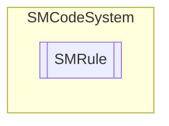

# SMRule `Public class`

## Description
SMCode rule class.

## Diagram


## Members
### Properties
#### Public  properties
| Type | Name | Methods |
| --- | --- | --- |
| `bool` | [`ByDefault`](#bydefault)<br>Get or set by-default rule flag. | `get, set` |
| `bool` | [`Empty`](#empty)<br>Return true if rule is empty. | `get` |
| `string` | [`Icon`](#icon)<br>Get or set rule icon path. | `get, set` |
| `int` | [`IdRule`](#idrule)<br>Get or set rule id. | `get, set` |
| `string` | [`Image`](#image)<br>Get or set rule image path. | `get, set` |
| [`SMDictionary`](./smcodesystem-SMDictionary) | [`Parameters`](#parameters)<br>Get or set rule parameters. | `get, private set` |
| `object` | [`Tag`](#tag)<br>Get or set object tag. | `get, set` |
| `string` | [`Text`](#text)<br>Get or set rule description. | `get, set` |
| `string` | [`UidRule`](#uidrule)<br>Get or set rule UID. | `get, set` |

### Methods
#### Public  methods
| Returns | Name |
| --- | --- |
| `void` | [`Assign`](#assign)([`SMRule`](smcodesystem-SMRule) _OtherInstance)<br>Assign instance properties from another. |
| `void` | [`Clear`](#clear)()<br>Clear item. |
| `bool` | [`FromJSON`](#fromjson)(`string` _JSON)<br>Assign property from JSON serialization. |
| `bool` | [`FromJSON64`](#fromjson64)(`string` _JSON64)<br>Assign property from JSON64 serialization. |
| `int` | [`Load`](#load-12)(`...`)<br>Load rule information by sql query <br>            Return 1 if success, 0 if fail or -1 if error. |
| `int` | [`Read`](#read)([`SMDataset`](./smcodesystem-SMDataset) _Dataset)<br>Read item from current record of dataset. Return 1 if success, 0 if fail or -1 if error. |
| `string` | [`ToJSON`](#tojson)()<br>Return JSON serialization of instance. |
| `string` | [`ToJSON64`](#tojson64)()<br>Return JSON64 serialization of instance. |

## Details
### Summary
SMCode rule class.

### Constructors
#### SMRule [1/2]
```csharp
public SMRule(SMCode _SM)
```
##### Arguments
| Type | Name | Description |
| --- | --- | --- |
| [`SMCode`](./smcodesystem-SMCode) | _SM |   |

##### Summary
Class constructor.

#### SMRule [2/2]
```csharp
public SMRule(SMRule _OtherInstance, SMCode _SM)
```
##### Arguments
| Type | Name | Description |
| --- | --- | --- |
| [`SMRule`](smcodesystem-SMRule) | _OtherInstance |   |
| [`SMCode`](./smcodesystem-SMCode) | _SM |   |

##### Summary
Class constructor.

### Methods
#### Assign
```csharp
public void Assign(SMRule _OtherInstance)
```
##### Arguments
| Type | Name | Description |
| --- | --- | --- |
| [`SMRule`](smcodesystem-SMRule) | _OtherInstance |   |

##### Summary
Assign instance properties from another.

#### Clear
```csharp
public void Clear()
```
##### Summary
Clear item.

#### FromJSON
```csharp
public bool FromJSON(string _JSON)
```
##### Arguments
| Type | Name | Description |
| --- | --- | --- |
| `string` | _JSON |   |

##### Summary
Assign property from JSON serialization.

#### FromJSON64
```csharp
public bool FromJSON64(string _JSON64)
```
##### Arguments
| Type | Name | Description |
| --- | --- | --- |
| `string` | _JSON64 |   |

##### Summary
Assign property from JSON64 serialization.

#### Load [1/2]
```csharp
public int Load(string _Sql)
```
##### Arguments
| Type | Name | Description |
| --- | --- | --- |
| `string` | _Sql |   |

##### Summary
Load rule information by sql query 
            Return 1 if success, 0 if fail or -1 if error.

#### Load [2/2]
```csharp
public int Load(int _IdRule)
```
##### Arguments
| Type | Name | Description |
| --- | --- | --- |
| `int` | _IdRule |   |

##### Summary
Load rule information by id.
            Return 1 if success, 0 if fail or -1 if error.

#### Read
```csharp
public int Read(SMDataset _Dataset)
```
##### Arguments
| Type | Name | Description |
| --- | --- | --- |
| [`SMDataset`](./smcodesystem-SMDataset) | _Dataset |   |

##### Summary
Read item from current record of dataset. Return 1 if success, 0 if fail or -1 if error.

#### ToJSON
```csharp
public string ToJSON()
```
##### Summary
Return JSON serialization of instance.

#### ToJSON64
```csharp
public string ToJSON64()
```
##### Summary
Return JSON64 serialization of instance.

### Properties
#### IdRule
```csharp
public int IdRule { get; set; }
```
##### Summary
Get or set rule id.

#### UidRule
```csharp
public string UidRule { get; set; }
```
##### Summary
Get or set rule UID.

#### Text
```csharp
public string Text { get; set; }
```
##### Summary
Get or set rule description.

#### Icon
```csharp
public string Icon { get; set; }
```
##### Summary
Get or set rule icon path.

#### Image
```csharp
public string Image { get; set; }
```
##### Summary
Get or set rule image path.

#### Parameters
```csharp
public SMDictionary Parameters { get; private set; }
```
##### Summary
Get or set rule parameters.

#### ByDefault
```csharp
public bool ByDefault { get; set; }
```
##### Summary
Get or set by-default rule flag.

#### Empty
```csharp
public bool Empty { get; }
```
##### Summary
Return true if rule is empty.

#### Tag
```csharp
public object Tag { get; set; }
```
##### Summary
Get or set object tag.

*Generated with* [*ModularDoc*](https://github.com/hailstorm75/ModularDoc)
