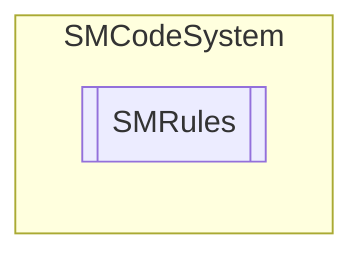

# SMRules `Public class`

## Description
SMCode rules collection class.

## Diagram


## Members
### Properties
#### Public  properties
| Type | Name | Methods |
| --- | --- | --- |
| `int` | [`Count`](#count)<br>Get users count. | `get` |
| [`SMRule`](./smcodesystem-SMRule) | [`Item`](#item) | `get` |

### Methods
#### Public  methods
| Returns | Name |
| --- | --- |
| `int` | [`Add`](#add)([`SMRule`](./smcodesystem-SMRule) _Rule)<br>Add rule item. |
| `void` | [`Assign`](#assign)([`SMRules`](smcodesystem-SMRules) _OtherInstance)<br>Assign instance properties from another. |
| `void` | [`Clear`](#clear)()<br>Clear item. |
| `int` | [`Find`](#find)(`int` _IdRule)<br>Find rule by id. |
| [`SMRule`](./smcodesystem-SMRule) | [`Get`](#get)(`int` _IdRule, `bool` _ReturnNewInstanceIfNotFound)<br>Get rule by id. |
| `bool` | [`Has`](#has-12)(`...`)<br>Return true if user has rule with specified id. |
| `string` | [`Keys`](#keys)(`string` _Quote, `string` _Separator)<br>Return keys list as a string with separator and quote specified. |
| `int` | [`Load`](#load)(`bool` _OnlyByDefault)<br>Load rule collection. Return 1 if success, 0 if fail or -1 if error. |

## Details
### Summary
SMCode rules collection class.

### Constructors
#### SMRules [1/2]
```csharp
public SMRules(SMCode _SM)
```
##### Arguments
| Type | Name | Description |
| --- | --- | --- |
| [`SMCode`](./smcodesystem-SMCode) | _SM |   |

##### Summary
Class constructor.

#### SMRules [2/2]
```csharp
public SMRules(SMRules _OtherInstance, SMCode _SM)
```
##### Arguments
| Type | Name | Description |
| --- | --- | --- |
| [`SMRules`](smcodesystem-SMRules) | _OtherInstance |   |
| [`SMCode`](./smcodesystem-SMCode) | _SM |   |

##### Summary
Class constructor.

### Methods
#### Add
```csharp
public int Add(SMRule _Rule)
```
##### Arguments
| Type | Name | Description |
| --- | --- | --- |
| [`SMRule`](./smcodesystem-SMRule) | _Rule |   |

##### Summary
Add rule item.

#### Assign
```csharp
public void Assign(SMRules _OtherInstance)
```
##### Arguments
| Type | Name | Description |
| --- | --- | --- |
| [`SMRules`](smcodesystem-SMRules) | _OtherInstance |   |

##### Summary
Assign instance properties from another.

#### Clear
```csharp
public void Clear()
```
##### Summary
Clear item.

#### Find
```csharp
public int Find(int _IdRule)
```
##### Arguments
| Type | Name | Description |
| --- | --- | --- |
| `int` | _IdRule |   |

##### Summary
Find rule by id.

#### Get
```csharp
public SMRule Get(int _IdRule, bool _ReturnNewInstanceIfNotFound)
```
##### Arguments
| Type | Name | Description |
| --- | --- | --- |
| `int` | _IdRule |   |
| `bool` | _ReturnNewInstanceIfNotFound |   |

##### Summary
Get rule by id.

#### Has [1/2]
```csharp
public bool Has(int _IdRule)
```
##### Arguments
| Type | Name | Description |
| --- | --- | --- |
| `int` | _IdRule |   |

##### Summary
Return true if user has rule with specified id.

#### Has [2/2]
```csharp
public bool Has(int[] _IdRules)
```
##### Arguments
| Type | Name | Description |
| --- | --- | --- |
| `int``[]` | _IdRules |   |

##### Summary
Return true if user has at least one of rule with specified id.

#### Keys
```csharp
public string Keys(string _Quote, string _Separator)
```
##### Arguments
| Type | Name | Description |
| --- | --- | --- |
| `string` | _Quote |   |
| `string` | _Separator |   |

##### Summary
Return keys list as a string with separator and quote specified.

#### Load
```csharp
public int Load(bool _OnlyByDefault)
```
##### Arguments
| Type | Name | Description |
| --- | --- | --- |
| `bool` | _OnlyByDefault |   |

##### Summary
Load rule collection. Return 1 if success, 0 if fail or -1 if error.

### Properties
#### Item
```csharp
public SMRule Item { get; }
```

#### Count
```csharp
public int Count { get; }
```
##### Summary
Get users count.

*Generated with* [*ModularDoc*](https://github.com/hailstorm75/ModularDoc)
