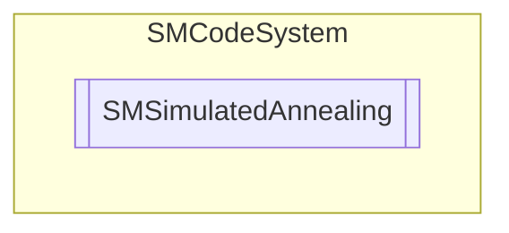

# SMSimulatedAnnealing `Public class`

## Description
SMCode simulated annealing class.

## Diagram


## Members
### Properties
#### Public  properties
| Type | Name | Methods |
| --- | --- | --- |
| `double` | [`Alpha`](#alpha)<br>Get or set cooling factor (default 0.999). | `get, set` |
| `object``[]` | [`Best`](#best)<br>Get or set best solution found. | `get, set` |
| `double` | [`Cost`](#cost)<br>Get or set cost of solution found. | `get, set` |
| `double` | [`Epsilon`](#epsilon)<br>Get or set temperature to reach by cooling (default 0.001). | `get, set` |
| `List`&lt;`object`&gt; | [`Items`](#items)<br>Get or set iterations counter. | `get, private set` |
| `int` | [`Iteration`](#iteration)<br>Get or set iterations counter. | `get, set` |
| `object``[]` | [`Last`](#last)<br>Get or set last solution evaluated. | `get, set` |
| `int` | [`ProgressRate`](#progressrate)<br>Get or set rate of progress event every number of iterations (default 400). | `get, set` |
| `bool` | [`Solving`](#solving)<br>Get or set solving flag. | `get, set` |
| `double` | [`Temperature`](#temperature)<br>Get or set start temperature (default 400.0). | `get, set` |

### Methods
#### Public  methods
| Returns | Name |
| --- | --- |
| `void` | [`Clear`](#clear)()<br>Initialize and reset properties variables. |
| `void` | [`Solve`](#solve)()<br>Solve the problem using the Simulated Annealing algorithm. |

## Details
### Summary
SMCode simulated annealing class.

### Constructors
#### SMSimulatedAnnealing
```csharp
public SMSimulatedAnnealing()
```
##### Summary
Instance constructor.

### Methods
#### Clear
```csharp
public void Clear()
```
##### Summary
Initialize and reset properties variables.

#### Solve
```csharp
public void Solve()
```
##### Summary
Solve the problem using the Simulated Annealing algorithm.

### Properties
#### Alpha
```csharp
public double Alpha { get; set; }
```
##### Summary
Get or set cooling factor (default 0.999).

#### Best
```csharp
public object Best { get; set; }
```
##### Summary
Get or set best solution found.

#### Cost
```csharp
public double Cost { get; set; }
```
##### Summary
Get or set cost of solution found.

#### Epsilon
```csharp
public double Epsilon { get; set; }
```
##### Summary
Get or set temperature to reach by cooling (default 0.001).

#### Items
```csharp
public List<object> Items { get; private set; }
```
##### Summary
Get or set iterations counter.

#### Iteration
```csharp
public int Iteration { get; set; }
```
##### Summary
Get or set iterations counter.

#### Last
```csharp
public object Last { get; set; }
```
##### Summary
Get or set last solution evaluated.

#### ProgressRate
```csharp
public int ProgressRate { get; set; }
```
##### Summary
Get or set rate of progress event every number of iterations (default 400).

#### Solving
```csharp
public bool Solving { get; set; }
```
##### Summary
Get or set solving flag.

#### Temperature
```csharp
public double Temperature { get; set; }
```
##### Summary
Get or set start temperature (default 400.0).

### Events
#### EvaluateSolution
```csharp
public event OnEvaluateSolution EvaluateSolution
```
##### Summary
Occurs when solution cost has to be evaluated.

#### NewSolution
```csharp
public event OnNewSolution NewSolution
```
##### Summary
Occurs when new current solution has changed.

#### Progress
```csharp
public event OnProgress Progress
```
##### Summary
Occurs when new current solution has changed.

### Delegates
#### OnEvaluateSolution
```csharp
public delegate void OnEvaluateSolution(object _Sender, object[] _Solution, out double _Cost)
```
##### Arguments
| Type | Name | Description |
| --- | --- | --- |
| `object` | _Sender |   |
| `object``[]` | _Solution |   |
| `out` `double` | _Cost |   |

#### OnNewSolution
```csharp
public delegate void OnNewSolution(object _Sender, object[] _Solution)
```
##### Arguments
| Type | Name | Description |
| --- | --- | --- |
| `object` | _Sender |   |
| `object``[]` | _Solution |   |

#### OnProgress
```csharp
public delegate void OnProgress(object _Sender)
```
##### Arguments
| Type | Name | Description |
| --- | --- | --- |
| `object` | _Sender |   |

*Generated with* [*ModularDoc*](https://github.com/hailstorm75/ModularDoc)
