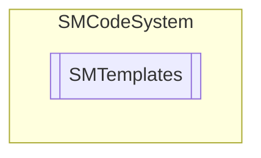

# SMTemplates `Public class`

## Description
SMCode templates management class.

## Diagram


## Members
### Properties
#### Public  properties
| Type | Name | Methods |
| --- | --- | --- |
| [`SMDictionary`](./smcodesystem-SMDictionary) | [`Items`](#items)<br>Get cache items collection. | `get, private set` |
| `string` | [`Path`](#path)<br>Get or set templates path. | `get, set` |

### Methods
#### Public  methods
| Returns | Name |
| --- | --- |
| `void` | [`Assign`](#assign)([`SMTemplates`](smcodesystem-SMTemplates) _Templates)<br>Assign instance properties from another. |
| `void` | [`Clear`](#clear)()<br>Clear item. |
| `string` | [`Get`](#get)(`string` _TemplateFile, [`SMDictionary`](./smcodesystem-SMDictionary) _Macros, `string` _Folder, `bool` _Defaults)<br>Return template by file name from collection and if specified replace all macros <br>            from dictionary. If specified file will be loaded from subfolder or from<br>            absolute path if folder parameter start by @. |
| `string` | [`Load`](#load)(`string` _TemplateFile, `string` _Folder)<br>Load template from file, and return raw template contents.<br>            If specified file will be loaded from subfolder or from absolute <br>            path if folder parameter start by @. If start by ~ indicates <br>            path on root. |

## Details
### Summary
SMCode templates management class.

### Constructors
#### SMTemplates [1/2]
```csharp
public SMTemplates(SMCode _SM)
```
##### Arguments
| Type | Name | Description |
| --- | --- | --- |
| [`SMCode`](./smcodesystem-SMCode) | _SM |   |

##### Summary
Class constructor.

#### SMTemplates [2/2]
```csharp
public SMTemplates(SMTemplates _Cache, SMCode _SM)
```
##### Arguments
| Type | Name | Description |
| --- | --- | --- |
| [`SMTemplates`](smcodesystem-SMTemplates) | _Cache |   |
| [`SMCode`](./smcodesystem-SMCode) | _SM |   |

##### Summary
Class constructor.

### Methods
#### Assign
```csharp
public void Assign(SMTemplates _Templates)
```
##### Arguments
| Type | Name | Description |
| --- | --- | --- |
| [`SMTemplates`](smcodesystem-SMTemplates) | _Templates |   |

##### Summary
Assign instance properties from another.

#### Clear
```csharp
public void Clear()
```
##### Summary
Clear item.

#### Get
```csharp
public string Get(string _TemplateFile, SMDictionary _Macros, string _Folder, bool _Defaults)
```
##### Arguments
| Type | Name | Description |
| --- | --- | --- |
| `string` | _TemplateFile |   |
| [`SMDictionary`](./smcodesystem-SMDictionary) | _Macros |   |
| `string` | _Folder |   |
| `bool` | _Defaults |   |

##### Summary
Return template by file name from collection and if specified replace all macros 
            from dictionary. If specified file will be loaded from subfolder or from
            absolute path if folder parameter start by @.

#### Load
```csharp
public string Load(string _TemplateFile, string _Folder)
```
##### Arguments
| Type | Name | Description |
| --- | --- | --- |
| `string` | _TemplateFile |   |
| `string` | _Folder |   |

##### Summary
Load template from file, and return raw template contents.
            If specified file will be loaded from subfolder or from absolute 
            path if folder parameter start by @. If start by ~ indicates 
            path on root.

### Properties
#### Items
```csharp
public SMDictionary Items { get; private set; }
```
##### Summary
Get cache items collection.

#### Path
```csharp
public string Path { get; set; }
```
##### Summary
Get or set templates path.

*Generated with* [*ModularDoc*](https://github.com/hailstorm75/ModularDoc)
