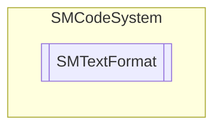

# SMTextFormat `Public enum`

## Description
SMCode text format enumeration.

## Diagram

## Details
### Summary
SMCode text format enumeration.

### Fields
#### None
##### Summary
None.

#### Text
##### Summary
Text.

#### Rtf
##### Summary
RTF.

#### Html
##### Summary
HTML.

*Generated with* [*ModularDoc*](https://github.com/hailstorm75/ModularDoc)
