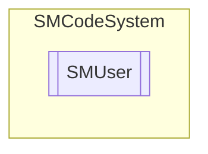

# SMUser `Public class`

## Description
SMCode user class.

## Diagram


## Members
### Properties
#### Public  properties
| Type | Name | Methods |
| --- | --- | --- |
| `DateTime` | [`BirthDate`](#birthdate)<br>Get or set user birth date. | `get, set` |
| `string` | [`Email`](#email)<br>Get or set user email. | `get, set` |
| `bool` | [`Empty`](#empty)<br>Return true if user is empty. | `get` |
| `string` | [`FirstName`](#firstname)<br>Get or set user first name. | `get, set` |
| `string` | [`Icon`](#icon)<br>Get or set user icon path. | `get, set` |
| `int` | [`IdUser`](#iduser)<br>Get or set user id. | `get, set` |
| `string` | [`Image`](#image)<br>Get or set user image path. | `get, set` |
| `string` | [`LastName`](#lastname)<br>Get or set user last name. | `get, set` |
| `string` | [`Note`](#note)<br>Get or set user note. | `get, set` |
| [`SMOrganization`](./smcodesystem-SMOrganization) | [`Organization`](#organization)<br>Get or set user selected organization. | `get, private set` |
| [`SMOrganizations`](./smcodesystem-SMOrganizations) | [`Organizations`](#organizations)<br>Get or set user related organizations. | `get, set` |
| `string` | [`Password`](#password)<br>Get or set user password. | `get, set` |
| `int` | [`Pin`](#pin)<br>Get or set user PIN. | `get, set` |
| [`SMDictionary`](./smcodesystem-SMDictionary) | [`Properties`](#properties)<br>Get or set user properties. | `get, private set` |
| `int` | [`Register`](#register)<br>Get or set user register code. | `get, set` |
| [`SMRules`](./smcodesystem-SMRules) | [`Rules`](#rules)<br>Get user related rules. | `get, private set` |
| `char` | [`Sex`](#sex)<br>Get or set user sex. | `get, set` |
| `object` | [`Tag`](#tag)<br>Get or set object tag. | `get, set` |
| `string` | [`TaxCode`](#taxcode)<br>Get or set user tax code. | `get, set` |
| `string` | [`Text`](#text)<br>Get or set user description. | `get, set` |
| `string` | [`UidUser`](#uiduser)<br>Get or set user UID. | `get, set` |
| `string` | [`UserName`](#username)<br>Get or set user name. | `get, set` |

### Methods
#### Public  methods
| Returns | Name |
| --- | --- |
| `void` | [`Assign`](#assign)([`SMUser`](smcodesystem-SMUser) _OtherInstance)<br>Assign instance properties from another. |
| `void` | [`Clear`](#clear)()<br>Clear item. |
| `bool` | [`FromJSON`](#fromjson)(`string` _JSON)<br>Assign property from JSON serialization. |
| `bool` | [`FromJSON64`](#fromjson64)(`string` _JSON64)<br>Assign property from JSON64 serialization. |
| `string` | [`Gender`](#gender)(`string` _IfMale, `string` _IfFemale, `string` _IfNeutral)<br>Returns a string based on the user's gender. |
| `string` | [`Hash`](#hash)(`string` _User, `string` _Password)<br>Return HASH code of user and password. |
| `int` | [`Load`](#load)(`string` _Sql, `string` _LogDetails)<br>Load user information by sql query. Log details can be specified as parameter. <br>            Return 1 if success, 0 if user cannot be found or -1 if error. |
| `int` | [`LoadByCredentials`](#loadbycredentials)(`string` _UserName, `string` _Password, `string` _LogDetails)<br>Load user information by user-id and password. Log details can be specified as parameter.<br>            Return 1 if success, 0 if fail or -1 if error. |
| `int` | [`LoadById`](#loadbyid)(`int` _IdUser, `string` _LogDetails)<br>Load user information by id. Log details can be specified as parameter.<br>            Return 1 if success, 0 if fail or -1 if error. |
| `int` | [`LoadByUid`](#loadbyuid)(`string` _UidUser, `string` _LogDetails)<br>Load user information by uid. Log details can be specified as parameter.<br>            Return 1 if success, 0 if fail or -1 if error. |
| `int` | [`LoadOrganizations`](#loadorganizations)()<br>Load user related organizations. Return 1 if success, 0 if fail or -1 if error. |
| `int` | [`LoadRules`](#loadrules)()<br>Load user related rules. Return 1 if success, 0 if fail or -1 if error. |
| `int` | [`Read`](#read)([`SMDataset`](./smcodesystem-SMDataset) _Dataset)<br>Read item from current record of dataset. Return 1 or more (plus rules loaded) if success, 0 if fail or -1 if error. |
| `bool` | [`SetOrganization`](#setorganization)(`int` _IdOrganization)<br>Set current organization by id. |
| `string` | [`ToJSON`](#tojson)()<br>Return JSON serialization of instance. |
| `string` | [`ToJSON64`](#tojson64)()<br>Return JSON64 serialization of instance. |

## Details
### Summary
SMCode user class.

### Constructors
#### SMUser [1/2]
```csharp
public SMUser(SMCode _SM)
```
##### Arguments
| Type | Name | Description |
| --- | --- | --- |
| [`SMCode`](./smcodesystem-SMCode) | _SM |   |

##### Summary
Class constructor.

#### SMUser [2/2]
```csharp
public SMUser(SMUser _OtherInstance, SMCode _SM)
```
##### Arguments
| Type | Name | Description |
| --- | --- | --- |
| [`SMUser`](smcodesystem-SMUser) | _OtherInstance |   |
| [`SMCode`](./smcodesystem-SMCode) | _SM |   |

##### Summary
Class constructor.

### Methods
#### Assign
```csharp
public void Assign(SMUser _OtherInstance)
```
##### Arguments
| Type | Name | Description |
| --- | --- | --- |
| [`SMUser`](smcodesystem-SMUser) | _OtherInstance |   |

##### Summary
Assign instance properties from another.

#### Clear
```csharp
public void Clear()
```
##### Summary
Clear item.

#### FromJSON
```csharp
public bool FromJSON(string _JSON)
```
##### Arguments
| Type | Name | Description |
| --- | --- | --- |
| `string` | _JSON |   |

##### Summary
Assign property from JSON serialization.

#### FromJSON64
```csharp
public bool FromJSON64(string _JSON64)
```
##### Arguments
| Type | Name | Description |
| --- | --- | --- |
| `string` | _JSON64 |   |

##### Summary
Assign property from JSON64 serialization.

#### Gender
```csharp
public string Gender(string _IfMale, string _IfFemale, string _IfNeutral)
```
##### Arguments
| Type | Name | Description |
| --- | --- | --- |
| `string` | _IfMale |   |
| `string` | _IfFemale |   |
| `string` | _IfNeutral |   |

##### Summary
Returns a string based on the user's gender.

#### Hash
```csharp
public string Hash(string _User, string _Password)
```
##### Arguments
| Type | Name | Description |
| --- | --- | --- |
| `string` | _User |   |
| `string` | _Password |   |

##### Summary
Return HASH code of user and password.

#### Load
```csharp
public int Load(string _Sql, string _LogDetails)
```
##### Arguments
| Type | Name | Description |
| --- | --- | --- |
| `string` | _Sql |   |
| `string` | _LogDetails |   |

##### Summary
Load user information by sql query. Log details can be specified as parameter. 
            Return 1 if success, 0 if user cannot be found or -1 if error.

#### LoadById
```csharp
public int LoadById(int _IdUser, string _LogDetails)
```
##### Arguments
| Type | Name | Description |
| --- | --- | --- |
| `int` | _IdUser |   |
| `string` | _LogDetails |   |

##### Summary
Load user information by id. Log details can be specified as parameter.
            Return 1 if success, 0 if fail or -1 if error.

#### LoadByUid
```csharp
public int LoadByUid(string _UidUser, string _LogDetails)
```
##### Arguments
| Type | Name | Description |
| --- | --- | --- |
| `string` | _UidUser |   |
| `string` | _LogDetails |   |

##### Summary
Load user information by uid. Log details can be specified as parameter.
            Return 1 if success, 0 if fail or -1 if error.

#### LoadByCredentials
```csharp
public int LoadByCredentials(string _UserName, string _Password, string _LogDetails)
```
##### Arguments
| Type | Name | Description |
| --- | --- | --- |
| `string` | _UserName |   |
| `string` | _Password |   |
| `string` | _LogDetails |   |

##### Summary
Load user information by user-id and password. Log details can be specified as parameter.
            Return 1 if success, 0 if fail or -1 if error.

#### LoadRules
```csharp
public int LoadRules()
```
##### Summary
Load user related rules. Return 1 if success, 0 if fail or -1 if error.

#### LoadOrganizations
```csharp
public int LoadOrganizations()
```
##### Summary
Load user related organizations. Return 1 if success, 0 if fail or -1 if error.

#### Read
```csharp
public int Read(SMDataset _Dataset)
```
##### Arguments
| Type | Name | Description |
| --- | --- | --- |
| [`SMDataset`](./smcodesystem-SMDataset) | _Dataset |   |

##### Summary
Read item from current record of dataset. Return 1 or more (plus rules loaded) if success, 0 if fail or -1 if error.

#### SetOrganization
```csharp
public bool SetOrganization(int _IdOrganization)
```
##### Arguments
| Type | Name | Description |
| --- | --- | --- |
| `int` | _IdOrganization |   |

##### Summary
Set current organization by id.

#### ToJSON
```csharp
public string ToJSON()
```
##### Summary
Return JSON serialization of instance.

#### ToJSON64
```csharp
public string ToJSON64()
```
##### Summary
Return JSON64 serialization of instance.

### Properties
#### IdUser
```csharp
public int IdUser { get; set; }
```
##### Summary
Get or set user id.

#### UidUser
```csharp
public string UidUser { get; set; }
```
##### Summary
Get or set user UID.

#### UserName
```csharp
public string UserName { get; set; }
```
##### Summary
Get or set user name.

#### Text
```csharp
public string Text { get; set; }
```
##### Summary
Get or set user description.

#### FirstName
```csharp
public string FirstName { get; set; }
```
##### Summary
Get or set user first name.

#### LastName
```csharp
public string LastName { get; set; }
```
##### Summary
Get or set user last name.

#### Email
```csharp
public string Email { get; set; }
```
##### Summary
Get or set user email.

#### Empty
```csharp
public bool Empty { get; }
```
##### Summary
Return true if user is empty.

#### Password
```csharp
public string Password { get; set; }
```
##### Summary
Get or set user password.

#### Pin
```csharp
public int Pin { get; set; }
```
##### Summary
Get or set user PIN.

#### Register
```csharp
public int Register { get; set; }
```
##### Summary
Get or set user register code.

#### TaxCode
```csharp
public string TaxCode { get; set; }
```
##### Summary
Get or set user tax code.

#### BirthDate
```csharp
public DateTime BirthDate { get; set; }
```
##### Summary
Get or set user birth date.

#### Sex
```csharp
public char Sex { get; set; }
```
##### Summary
Get or set user sex.

#### Icon
```csharp
public string Icon { get; set; }
```
##### Summary
Get or set user icon path.

#### Image
```csharp
public string Image { get; set; }
```
##### Summary
Get or set user image path.

#### Note
```csharp
public string Note { get; set; }
```
##### Summary
Get or set user note.

#### Organization
```csharp
public SMOrganization Organization { get; private set; }
```
##### Summary
Get or set user selected organization.

#### Organizations
```csharp
public SMOrganizations Organizations { get; set; }
```
##### Summary
Get or set user related organizations.

#### Properties
```csharp
public SMDictionary Properties { get; private set; }
```
##### Summary
Get or set user properties.

#### Rules
```csharp
public SMRules Rules { get; private set; }
```
##### Summary
Get user related rules.

#### Tag
```csharp
public object Tag { get; set; }
```
##### Summary
Get or set object tag.

*Generated with* [*ModularDoc*](https://github.com/hailstorm75/ModularDoc)
