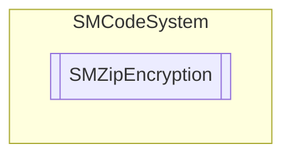

# SMZipEncryption `Public enum`

## Description
SMCode zip encryption mode enumeration.

## Diagram

## Details
### Summary
SMCode zip encryption mode enumeration.

### Fields
#### Default
##### Summary
Default encryption.

#### AES128
##### Summary
AES 128 bit encryption.

#### AES256
##### Summary
AES 256 bit encryption.

*Generated with* [*ModularDoc*](https://github.com/hailstorm75/ModularDoc)
