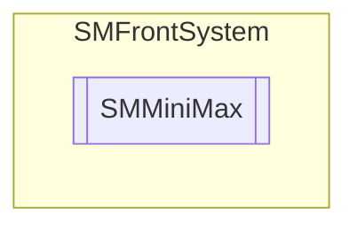

# SMMiniMax `Public class`

## Description
Minimax algorithm class.

## Diagram


## Members
### Properties
#### Public  properties
| Type | Name | Methods |
| --- | --- | --- |
| `int` | [`Iterations`](#iterations)<br>Get or set iterations counter. | `get, set` |
| `int` | [`MaxIterations`](#maxiterations)<br>Get or set iterations max value. | `get, set` |
| [`SMNode`](./smcodesystem-SMNode) | [`Result`](#result)<br>Get or set result node. | `get, set` |

### Methods
#### Public  methods
| Returns | Name |
| --- | --- |
| `int` | [`Minimax`](#minimax)([`SMNode`](./smcodesystem-SMNode) _Node, `int` _Depth, `bool` _Maximizing, `SMOnHeuristicNodeValue` _OnMinimaxNode) |
| `int` | [`Negamax`](#negamax)([`SMNode`](./smcodesystem-SMNode) _Node, `int` _Depth, `int` _Alpha, `int` _Beta, `SMOnHeuristicNodeValue` _OnMinimaxNode) |

## Details
### Summary
Minimax algorithm class.

### Constructors
#### SMMiniMax
```csharp
public SMMiniMax(SMCode _SM)
```
##### Arguments
| Type | Name | Description |
| --- | --- | --- |
| [`SMCode`](./smcodesystem-SMCode) | _SM |   |

##### Summary
Class constructor.

### Methods
#### Minimax
```csharp
public int Minimax(SMNode _Node, int _Depth, bool _Maximizing, SMOnHeuristicNodeValue _OnMinimaxNode)
```
##### Arguments
| Type | Name | Description |
| --- | --- | --- |
| [`SMNode`](./smcodesystem-SMNode) | _Node |   |
| `int` | _Depth |   |
| `bool` | _Maximizing |   |
| `SMOnHeuristicNodeValue` | _OnMinimaxNode |   |

#### Negamax
```csharp
public int Negamax(SMNode _Node, int _Depth, int _Alpha, int _Beta, SMOnHeuristicNodeValue _OnMinimaxNode)
```
##### Arguments
| Type | Name | Description |
| --- | --- | --- |
| [`SMNode`](./smcodesystem-SMNode) | _Node |   |
| `int` | _Depth |   |
| `int` | _Alpha |   |
| `int` | _Beta |   |
| `SMOnHeuristicNodeValue` | _OnMinimaxNode |   |

### Properties
#### Iterations
```csharp
public int Iterations { get; set; }
```
##### Summary
Get or set iterations counter.

#### MaxIterations
```csharp
public int MaxIterations { get; set; }
```
##### Summary
Get or set iterations max value.

#### Result
```csharp
public SMNode Result { get; set; }
```
##### Summary
Get or set result node.

### Events
#### OnHeuristicNodeValue
```csharp
public event SMOnHeuristicNodeValue OnHeuristicNodeValue
```
##### Summary
Occurs when algorithm neet to calculate heuristic value (integer) of node.

### Delegates
#### SMOnHeuristicNodeValue
```csharp
public delegate int SMOnHeuristicNodeValue(SMNode _Node)
```
##### Arguments
| Type | Name | Description |
| --- | --- | --- |
| [`SMNode`](./smcodesystem-SMNode) | _Node |   |

*Generated with* [*ModularDoc*](https://github.com/hailstorm75/ModularDoc)
